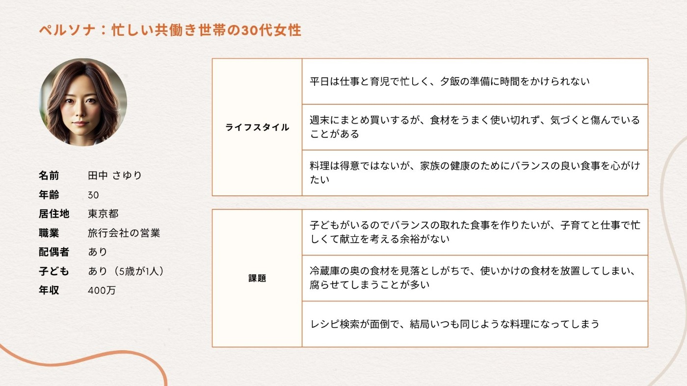
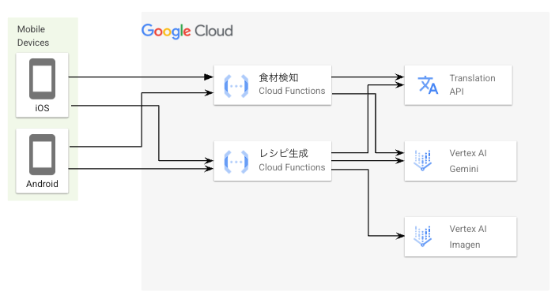
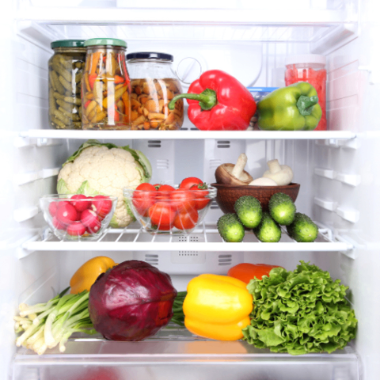
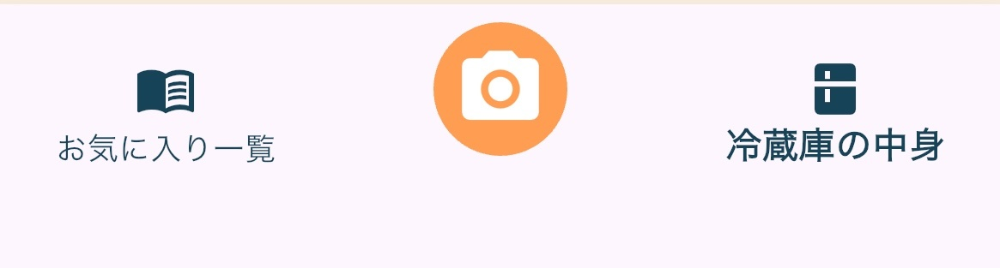
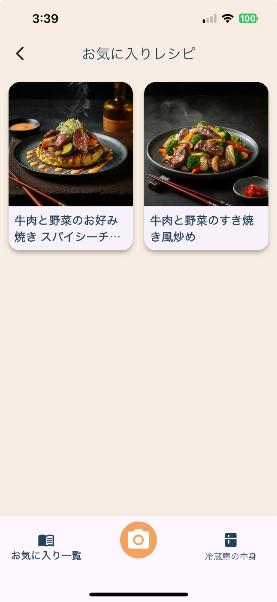
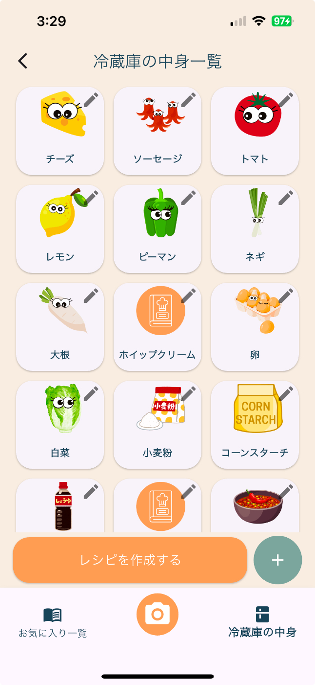

##  はじめに

皆さん、冷蔵庫の中身を確認して **「今日は何を作ろう…」** と悩んだ経験はありませんか？そんな日常の小さな不満を解消するとともに、**食品ロスゼロ** の社会実現を目指すため、食品ロスを減らし、家庭での食材管理を簡単にするための一歩として、**RecipAI** というアプリを作りました。

このアプリは、**冷蔵庫を開けて写真を撮って送るだけ** で、**中にある食材をAIが解析し、残りの食材を無駄なく活用するための最適なレシピを自動生成** します。忙しい現代人にとって、計画的な食材活用は大きな課題です。画像一枚で簡単に残りの食材から最適なレシピが考案されたら嬉しいと思いませんか？

この記事では、そんなアプリが実際にどのように動作するのか、開発に至った背景、そして実装における技術的アプローチを解説していきます。

※ この記事は[AI Agent Hackathon with Google Cloud](https://zenn.dev/hackathons/2024-google-cloud-japan-ai-hackathon)の応募記事です。

##  アプリの動作デモ

まずはデモ動画をご覧ください。

<https://youtu.be/LFDEsYTBu74>

冷蔵庫の画像を撮って、アップロードするだけでAIが自動で食材を解析します。画像にはないけどこれも追加で入れたい、という食材があればもちろん追加可能です。また、解析された食材に関して今は使いたくないというものがあれば削除も可能です。

食材のリストを確認した後は、**レシピを作成する** ボタンを押すと、その日の気分に応じたレシピが作成されます。

##  開発に至った背景

まずアイデアのビジョンとして、**食品が最大限活用され、廃棄される食材がゼロの社会を作る** を掲げることにしました。

そしてペルソナを設定したあと、課題解決フレームワークを活用してあるべき姿、現状、ギャップ、課題の観点で、食品ロス問題を整理し、それを解決するためのソリューションを検討しました。

###  ペルソナ

ペルソナとして以下の女性を設定しました。  

つまり**仕事や育児等で忙しく、料理を考える余裕がないが、バランスの良い食事を作りたい** 層をユーザー像としています。

###  あるべき姿

  * 家庭での食材のムダがなくなり、必要な分だけを適切に消費できる
  * 賞味期限切れや食べ忘れがなくなり、計画的に食材を使い切れる
  * 社会全体で食品流通が最適化され、余剰食材が発生しても有効に活用できる

###  現状

  * 家庭では食材をうまく使いこなせず、賞味期限切れや余り物が捨てられることが多い
  * 冷蔵庫の中に何があるのか把握できていないため、同じものを買いすぎたり、使い忘れたりする
  * スーパーや飲食店でも余剰食材が大量に発生し、それらの多くが廃棄されている

###  ギャップ

  * 個人レベルでの管理不足
  * 計画的な消費ができていない
  * 社会全体で食材流通が最適化されていない

###  課題

  * 何を持っているか、いつまでに食べるべきかが把握できていない
  * 使い切る意識が薄く、食材が無駄になる
  * 余剰食材の共有・再利用の仕組みが弱い

###  ソリューション

**家庭の食材管理を自動化・最適化** にフォーカスし、今回のソリューションを検討しました。家庭での食材管理といえば**冷蔵庫** であることから、**冷蔵庫の中身を使い、その日の気分に合わせて自動でレシピを作成するアプリがあれば、食材を無駄なく活用できる** と考え、このソリューションを決定しました。現状はMVP（Minimum Viable Product）としてアプリを作成しましたが、将来性としては以下を考えています。

  * IoT冷蔵庫と連携し、家庭の食材管理を自動化・最適化
  * AIによる最適化＆パーソナライズを行い、ユーザーごとの好み・栄養バランス・アレルギー対応を学習し、最適なレシピを提案

##  技術的アプローチ

構成図は以下です。  

クライアント側は**Flutter** を用いて、バックエンドは**Cloud Functions** で構築してPythonを実行しています。

上記の構成にするに至った理由を以下に書きます。

###  Flutterを採用した理由

実際の利用シーンを考慮すると、**レシピを必要とするタイミングにすぐに起動でき、かつデータが端末に保持される** 方がユーザーにとって利便性が高いと判断し、**Flutter** を用いてネイティブアプリとして実装しました。

###  Cloud Functionsを採用した理由

Pythonの実行自体は**Cloud Functions** と**Cloud Run** のどちらでも可能なので、以下の星取表を用い、どちらを採用するか決定しました。

項目 | Cloud Functions | Cloud Run  
---|---|---  
開発スピード | 5 | 2  
実装の簡潔さ | 5 | 3  
生成AIの活用度 | 5 | 5  
拡張性 | 2 | 5  
セキュリティ | 1 | 5  
運用のしやすさ | 4 | 5  
  
今回の開発では、**開発スピード** 、**実装の簡潔さ** 、**生成AIの活用度** の観点から、**Cloud Functions** が最適だと判断し、採用しました。つまり、Cloud FunctionsのHTTPトリガーのみを利用してAPIを構築しています。

具体的にメリットを挙げると以下です。

  * シンプルな構成で素早く開発可能 
    * サーバーレス環境のため、インフラ管理が不要で開発に集中できる
    * FlaskやFastAPIを用いたアプリのデプロイよりもセットアップが簡単
  * スケーラビリティとコスト最適化 
    * リクエストに応じて自動でスケールするため、急なアクセス増加にも対応可能
    * 実行時間に応じた従量課金モデルのため、アイドル状態のときはコストがかからない
  * デプロイと管理が容易 
    * コマンド一つもしくはコンソールのボタン一つでデプロイ可能

今回は**生成AIハッカソン** という目的を考え、**スピード優先の開発** を優先し、シンプルな構成で素早く実装を行いましたが、今後もし製品化するのであれば、以下の改善を行う必要があると考えています。

  * セキュリティ面の強化 
    * 直接HTTPトリガーを公開しているので、誰でもリクエストを送信できる状態であり、API GatewayもしくはIAMを利用して認証を強化する必要がある
  * コールドスタートを考慮 
    * Cloud Functionsはコールドスタート時に数秒の遅延が発生することがあるため、Cloud Runへの移行または、プロビジョニングを利用する必要がある
  * 長時間処理の非同期化（要検討） 
    * 画像処理やGemini APIなど、時間がかかる処理をCloud Functionsで同期的に実行するとレスポンスが遅くなる場合があるため、非同期処理を行う構成やアプリ仕様を検討しても良い
    * ただし、Pub/SubやCloud Tasks等を利用すると非同期になるが、アプリのユースケース的にはむしろ同期的な方がよいかもしれないので、ユーザーに待ち時間を退屈させない仕組みを作る方にフォーカスした方がいいかもしれない

###  食材検知に利用したAIサービス

結論から書くと、Geminiの画像入力を利用しました。理由は精度と手軽さのバランスが優れていたからです。

**Vision API** という事前学習済みのモデルが存在するので、最初はそれを使うことを検討しましたが、最終的には利用できませんでした。

その決定に至った理由を説明するために、まずは以下のサンプル画像を使ったレスポンス結果をご覧ください。  

  * [label_detection](https://cloud.google.com/vision/docs/labels?hl=ja)の物体検出の結果

    
    
    {
        "ingredients": [
            "Food",
            "Ingredient",
            "Produce",
            "Vegetable",
            "Major appliance",
            "Kitchen Appliance",
            "Food group",
            "Natural foods",
            "Home appliance",
            "Refrigerator"
        ]
    }
    

一般的なカテゴリが検出されてしまい、具体的な食材名が出てこないということがわかりました。

  * [object_localization](https://cloud.google.com/vision/docs/object-localizer?hl=ja)の物体検出の結果

    
    
    {
        "ingredients": [
            "vegetable",
            "food",
            "bell pepper"
        ]
    }
    

特定できるのは一般的に識別しやすい物体に限られ、検知できる食材カテゴリが少ないということがわかりました。

両モデルとも結果が今回のアプリを作るにあたって望ましいものではなかったので、**Gemini API in Vertex AI** を試すことにしました。

  * [Gemini 1.5 Flash](https://ai.google.dev/gemini-api/docs/models/gemini#gemini-1.5-flash)の物体検出の結果

    
    
    {
        "ingredients": [
            "pickles",
            "pickled peppers",
            "pickled mushrooms",
            "red bell pepper",
            "green bell pepper",
            "cauliflower",
            "radish",
            "tomatoes",
            "mushrooms",
            "cucumber",
            "red cabbage",
            "yellow bell pepper",
            "spring onions",
            "lettuce"
        ]
    }
    

かなりの精度で情報が取得できることがわかったので、**Gemini API in Vertex AI** を使うことにしました。[Gemini 1.5 Pro](https://ai.google.dev/gemini-api/docs/models/gemini#gemini-1.5-pro)とも比較を行い、Proの方が**レスポンスの速度** が速かったのでこちらを使うことにしました。（Geminiは2.0も出てますが、Proがあるのは1.5のみでした。）

!

ただし、精度・コスト・カスタマイズ性・安定性の観点から将来的には**Vertex AI Vision** に乗り換えるべきです。今回は学習データを用意できなかったので、手軽さの観点で**Gemini API in Vertex AI** を採択しました。

###  Vertex AIのImagenを利用している理由

ユーザー体験を考えると、レシピには完成イメージが必要ですが、**Gemini API in Vertex AI** の**Gemini 1.5 Pro** だと画像生成を含むことができなかったので、**Vertex AIのImagen** を利用しました。

###  Transration AIを利用する理由

一般的にLLMは英語入力のほうが精度が良いとされているため、英語で入出力を行うことにしました。実際に日本語での入出力も試みましたが、一部が英語で返却される問題が発生し、精度自体も低下したため、今回は英語で入出力し、その後**Transration AI** で日本語に変換する手段を採りました。

もちろん、**Transration AI** による日本語への変換も完璧ではなく、たまに不自然な出力結果が生じることもありますが、それでも日本語で直接入出力を行うよりは期待するレスポンスが得られやすかったです。

##  UI/UXのこだわりポイント

ペルソナは忙しく時間に追われる方々です。そのため、**初めて触れるユーザーでも説明を読むことなく直感的に操作できる** アプリを目指しました。

その結果、画面数は極力絞り、ユーザーが迷わず操作できるシンプルな構成を実現しています。

ユーザーがアクセスできるページは、**お気に入り一覧ページ** と**冷蔵庫の中身ページ** の2種類のみです。

###  お気に入り一覧ページに関して

  
AIが作成するレシピはその場限りの一期一会の体験となるため、気に入ったレシピを保存できる機能は重要だと考えましたので作成しました。  
保存データは[SharedPreferences](https://pub.dev/packages/shared_preferences)をを利用して端末に保持することで、通信負荷を抑え、アプリの動作を軽快に保っています。

###  冷蔵庫の中身ページに関して

  
冷蔵庫の中身は**1日で大幅に変わるものではない** ため、ユーザーが毎回保存操作を行う必要はありません。そのことを踏まえ、冷蔵庫の中身情報は端末に**自動保存** される仕組みを採用してページを作成しました。  
少量の材料追加や一部食材の消費など、細かな変更があった場合は手動で入力できるようにもしています。

###  冷蔵庫の中身の更新に関して

どのページからでも冷蔵庫の中身を画像一枚で更新できるよう、フッターに写真アイコンを配置しました。タップするとカメラが起動し、画像を撮影して冷蔵庫の中身を再同期する動作を実現しています。  
また、当初は画像から直接レシピを生成することを検討しましたが、ユーザーが不要な食材や、後から購入予定の食材なども考慮できるよう、一度冷蔵庫の中身を保存する仕組みを導入しました。

このように、直感的かつシンプルなUI/UX設計により、忙しいユーザーでもストレスなくアプリを利用できるよう工夫しています。

##  あとがき

今回、食品ロス削減の第一歩として**個人の食材管理を効率化すること** を目的としてこのアプリを作りました。最近ではカメラ内蔵の冷蔵庫も製作されているので、そちらと連携することで、より使い勝手が良くなるはずです。Apple Watch等と連携をすれば、その時の健康状態に応じて適切なレシピを出すということも可能になるかもしれません。

さらに、個人の食材管理が最適化されることで、食品流通全体の効率化にもつながる可能性があります。例えば、冷蔵庫のデータを活用して、スーパーやECサイトがより正確な需要予測を行い、無駄のない供給ができるようになるかもしれないと考えています。

また、**冷蔵庫の中身に合ったおすすめ商品** をアプリ上で提案できれば、それを参考にユーザーが買い物を行い、過剰な買いすぎを防ぎながら、必要なものだけを購入する仕組みも実現できそうです。

このように、個人の食品管理を効率化することが、社会全体の食品ロス削減にもつながるはずだと考え、今回の**RecipAI** を開発しました。
