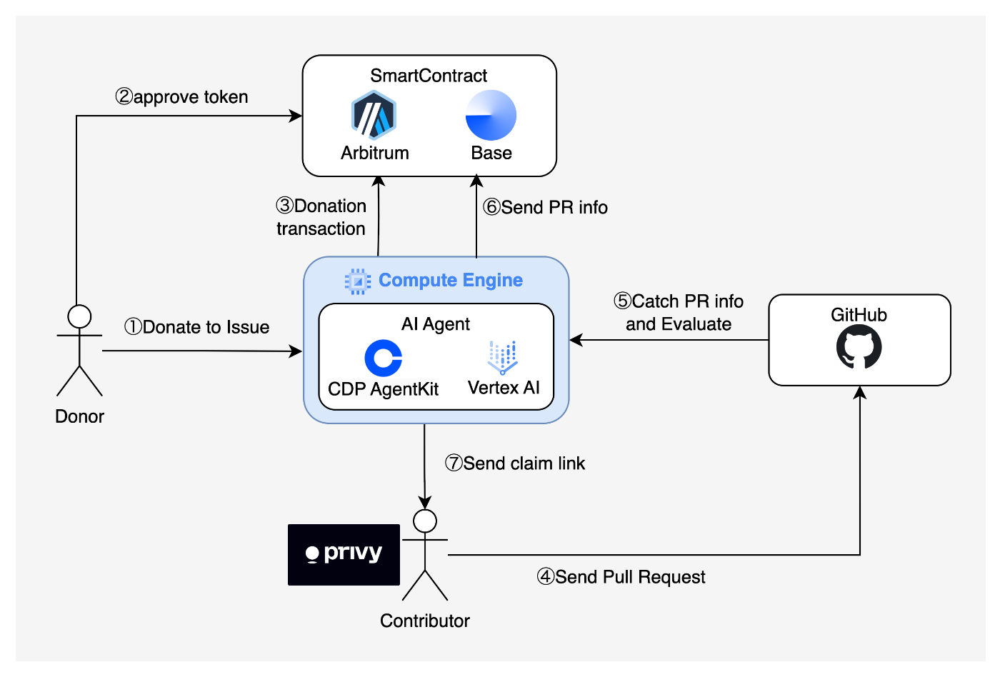
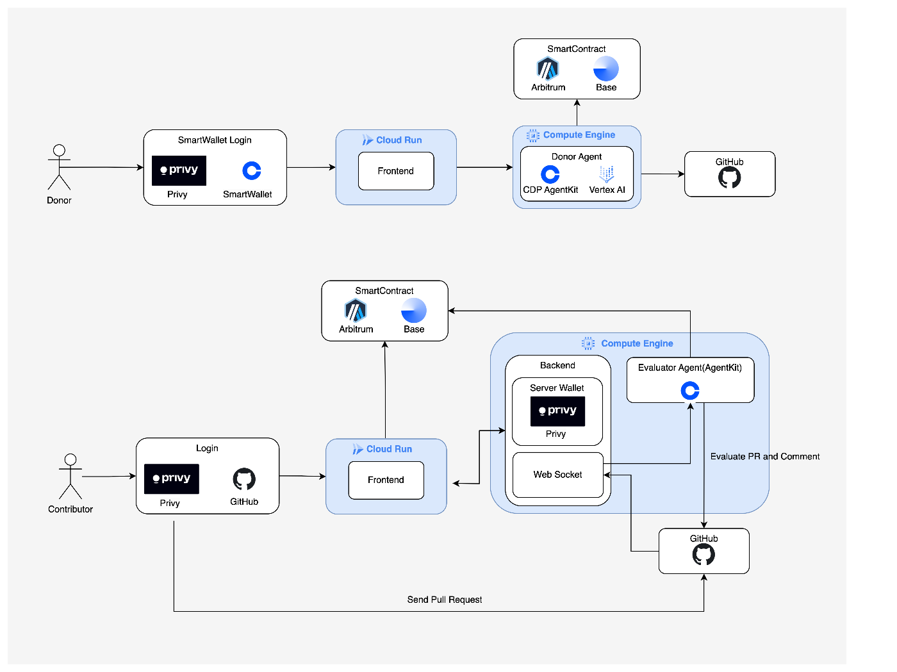

##  はじめに

オープンソースソフトウェア（OSS）の開発は、技術の進歩とデジタル社会の基盤を支える重要な要素です。しかし、多くの OSS プロジェクトは開発リソースが不足し、修正が求められる課題が放置されがちです。そこで私たちは、AI エージェントを活用した革新的な報酬システムを導入し、OSS の開発を促すマッチングプラットフォーム、「OSS-Rewards-Agent」を開発しました。

本プロジェクトでは、OSS 開発に貢献した開発者へ報酬を自動で配布する仕組みを構築し、開発の効率化を実現します。寄付者（ドナー）と開発者（コントリビューター）の橋渡しをし、OSS の発展を加速させる新たなエコシステムを提供します。

##  デモ動画

<https://youtu.be/2KCnZajVIvo>

##  ライブデモ

<https://frontend-991346403603.asia-east2.run.app/>

##  リポジトリ

<https://github.com/naizo01/OSS-Rewards-Agent/tree/google-genai>

##  対象ユーザーと課題

###  企業

企業にとって OSS はイノベーション促進の要となり、どんなソフトウェアを作るにも OSS が関わってきます。一方で課題も存在します。ビジネスに直接関わる機能やセキュリティ上の問題が含まれるバグが放置されると、構築するソフトウェアのサービス品質や信頼性に大きな影響が及びます。実際、OSS のメンテナーと企業が近い関係性でないことがほとんどで、自分たち企業にとっては緊急度の高い修正でもメンテナーにはすぐには対応してもらえない可能性があります。また、自分たちで解決しようにも解決できるスキルレベルを持ったエンジニアが社内にいないことも考えられます。

###  OSS コントリビューター

OSS コントリビューターにとっては、自身の貢献が正当に評価されるかという不安が大きなハードルだと考えます。バグ修正や新機能開発に多くの時間と労力を注いでも、明確な報酬システムが整っていないプロジェクトでは、最終的に個人の学習や実績づくり以上のメリットを得にくいのが現状です。また、同じ Issue に複数人で取り組んでいる場合、誰がどのくらいの成果に貢献したのかをはっきりさせる仕組みがなければ、不公平感が生まれる可能性が高くなります。

###  OSS 管理者

OSS を運営するメンテナーやプロジェクトリーダー、特に個人や小規模チームにおいては、リソース不足が問題になると考えます。新機能の開発はもちろん、バグ修正やユーザーからの問い合わせ対応、ドキュメント整備などが重なると、優先順位の高い Issue であっても着手できず、長期間放置されてしまうケースも出てきてしまいます。また、寄付やスポンサーシップを受けたいと思っていても、その受け皿となる仕組みが整っていなかったり、既存の寄付プラットフォームでは十分な資金が集まらず、開発費や活動費をまかなえない問題も出てきます。さらに、複数人のコントリビューターによるコミットが増えた際に報酬を与えようと考えると、それぞれの貢献度をどう評価し報酬を割り振るかも負担となり、開発や品質向上そのものに集中できなくなるというジレンマも抱えてしまうと思います。こうした負荷が積み重なることで、プロジェクトの進行スピードが遅れたり、メンテナー自身のモチベーション低下につながるリスクが高まります。

##  課題へのソリューション

私たちはユーザーが感じる課題に対して下記のようにアプローチした OSS Rewards Agent を提案します。

  * GitHub 上で public 公開されているリポジトリであれば誰でもどんなリポジトリでも各 Issue に対して報酬を設定できます。報酬を設定することで生活費やお小遣いを稼ぎたいエンジニアが優先的に Issue を対応してくれる可能性が高まります。これまで無償で OSS に貢献していたエンジニアも報酬が得られるため、OSS コントリビューションで生計を立てることができるようになります。結果としてコントリビューション数も増えるため更に OSS 自体も発展することが期待できます。
  * LLM を利用して Issue への各ユーザーの貢献度を自動判定します。レビューコメントやコミットしたコードをもとに Issue 解決時にどのユーザーがどれだけ解決に向けて貢献したかを判定します。貢献度に応じて Issue に対して設定された報酬が自動分配されます。OSS コントリビューターは自分の貢献を AI によって客観的に判断してもらうことができ、OSS 管理者も報酬割り振りのことを考える必要がありません。
  * ステーブルコインによる支払いを導入し、世界中どこにいるエンジニアでも参加できます。例えば報酬が日本円による銀行振込であれば日本で銀行口座を持っているエンジニア以外は参加できなくなりますが、ステーブルコインの導入で世界中誰でも同じ金額で報酬が受け取れます。
  * GitHub アカウントや PC・スマートフォンを所持してさえすれば仮想通貨ウォレットを自分で作る必要はありません。Privy と Coinbase Smart Wallet を活用することでこのプラットフォームに接続した時に GitHub 認証や[キーチェーン](https://support.apple.com/ja-jp/guide/keychain-access/kyca1083/mac)を活用して自分のアカウントに紐づく仮想通貨ウォレットが自動で作られます。ブロックチェーンの知識は必要ありません。

##  ユーザーフロー

大まかなユーザーフローをまとめた図が以下になります。

  1. ドナーが GitHub に挙げられた Issue に対し寄付を行い
  2. コントリビューターが Issue に取り組み、解決されたら寄付金をもらえる  
というイメージで問題ないです。

以下、ドナーとコントリビューターに分けて詳細を説明します。

###  1\. ドナーの役割

OSS の課題改善に資金を提供したい人々は、ドナーとしてこのシステムを利用できます。OSS 開発者でなくとも、特定の機能改善やバグ修正を望む企業や個人が参加可能です。

ドナーは Coinbase の SmartWallet、もしくは GitHub アカウントや metamask を使用して OSS-Rewards- のドナーページにログインし、以下の手順で資金提供を行います。GitHub のアカウントでログインした際は Privy の SDK を通じて GitHub アカウントと紐づいたウォレットアドレスが自動生成されます。

ドナーは、寄付を行うには以下のフローに則って AI エージェントに指示を出していただく必要があります。

  1. 改善を希望する(自分が寄付する)プロジェクトの GitHub のリポジトリリンクを入力
  2. 対象となる Issue の IssueID を入力
  3. 自分が寄付する金額を入力
  4. トークンの approve(初回のみ)とメッセージへの署名
  5. AI エージェントがスマートコントラクトを通じて自動的に報酬のロックを実行。

このプロセスにより、対象の Issue に対して寄付された資金が紐づけられ、サイトのトップページにも報酬が紐づけられた Issue としてリストされます。  
寄付が成立した際、自動的に AI エージェントから GitHub の対象の Issue のスレッドに対して、寄付金額とブロックチェーンでのトランザクションの情報がポストされます。

###  2\. コントリビューターの役割

開発者は、流れは以下となります。

  1. OSS-Rewards-Agent のトップページから自分が取り組みたい Issue を探す
  2. Issue に取り組み、対象の Issue に対してプルリクエストを行う
  3. リポジトリオーナーによってプルリクエストがマージされる
  4. PR 内に複数人によるコミットやレビューコメントがある場合は、AI エージェントがそれぞれのコミットやレビューコメントを評価し、報酬の分配を設定
  5. AI エージェントから報酬を claim するためのリンクが GitHub の Issue スレッド上にポストされる
  6. 自身の GitHub アカウントで認証を行い、報酬を受け取る

報酬を受け取る際の GitHub の認証は Privy の SDK を活用しており、GitHub アカウントと紐づいたウォレットアドレスが自動生成され、そこに報酬金が送金される形になります。開発者全員が Metamask などのウォレットサービスを持っているとは限らないため、GitHub に紐付けてウォレットを自動的に生成できる Privy の SDK を採用しました。

Privy のサーバーウォレット機能を活用して、報酬対象者の GItHub アカウントであることを認証しなければ AI エージェントがトランザクションを走らせない仕組みになっています。

後から MetaMask などの個人ウォレットアドレスに報酬金を移転することも可能です。

##  使用技術

本プロジェクトは、以下の技術を活用して構築されています。

  * **フロントエンド** : Next.js
  * **バックエンド** : Python, Typescript
  * **インフラ** : 
    * フロントエンド: **Cloud Run**
    * バックエンド: **Google Compute Engine**
  * **LLM** : Gemini API in Vertex AI
  * **スマートコントラクト** : Solidity(Ethereum のレイヤー 2 である Base, Arbitrum にデプロイ)
  * **[Coinbase AgentKit](https://github.com/coinbase/agentkit)** : AI によるトランザクション管理を通じて、資金のロックやスマートコントラクトの承認を自動化。
  * **Coinbase AgentKit（報酬配分）** : プルリクエストのマージをリアルタイムで検知し、コミット内容を動的に分析した上で、スマートコントラクトを実行。
  * **[Coinbase Smart Wallet](https://www.smartwallet.dev/why)** : フロントエンドで簡単にウォレットを作成し、ドナーがスムーズに資金管理できる仕組み。
  * **[Coinbase OnchainKit](https://onchainkit.xyz/)** : フロントエンドの UI コンポーネントを提供し、ユーザー体験を向上。
  * **[Privy GitHub 認証](https://www.privy.io/)** : 開発者のウォレットアドレスを安全に GitHub アカウントと連携。
  * **Privy Server Wallet** : GitHub アカウントの真正性を検証し、セキュアな取引を保証。
  * **Privy Policy Engine** : サーバーウォレットのセキュリティポリシーを適用し、不正な取引を防止。

##  スマートコントラクトの詳細

###  1\. lockReward 関数

この関数は、特定の GitHub Issue に対して報酬をロックするために使用されます。ユーザーの署名を検証し、トークンをコントラクトに転送します。

この関数はエージェントが持っているアドレスが実行するので、ユーザーは署名をするだけです。ユーザーはトランザクションを発行しなくても良いように実装されています。
    
    
        /// @notice Locks a reward for a specific issue with user signature verification.
        /// @param repositoryName The name of the repository.
        /// @param issueId The ID of the issue.
        /// @param reward The amount of reward to lock.
        /// @param tokenAddress The address of the token to be used for the reward.
        /// @param userAddress The address of the user.
        /// @param signature The signature from the user to verify the transaction.
        function lockReward(
            string memory repositoryName,
            uint256 issueId,
            uint256 reward,
            address tokenAddress,
            address userAddress,
            bytes memory signature
        ) public {
            // Verify signature with nonce
            bytes32 messageHash = keccak256(
                abi.encodePacked(
                    repositoryName,
                    issueId,
                    reward,
                    tokenAddress,
                    userAddress,
                    nonces[userAddress]
                )
            );
            require(
                recoverSigner(messageHash, signature) == userAddress,
                "Invalid signature"
            );
    
            nonces[userAddress]++;
    
            IERC20 token = IERC20(tokenAddress);
            issues[repositoryName][issueId].reward += reward; // Add reward
            issues[repositoryName][issueId].tokenAddress = tokenAddress;
            require(
                token.transferFrom(userAddress, address(this), reward),
                "Transfer failed"
            );
            emit RewardLocked(
                repositoryName,
                issueId,
                reward,
                tokenAddress,
                userAddress
            );
        }
    

###  2\. registerAndCompleteIssue 関数

この関数は、貢献者を登録し、Issue を完了としてマークします。貢献者の GitHub ID と報酬の割合を設定します。
    
    
        /// @notice Registers contributors and completes an issue.
        /// @param repositoryName The name of the repository.
        /// @param issueId The ID of the issue.
        /// @param githubIds The list of GitHub IDs of contributors.
        /// @param percentages The list of reward percentages for each contributor.
        function registerAndCompleteIssue(
            string memory repositoryName,
            uint256 issueId,
            string[] memory githubIds,
            uint256[] memory percentages
        ) public onlyPrivileged {
            require(
                !issues[repositoryName][issueId].isCompleted,
                "Issue already completed"
            );
            require(githubIds.length == percentages.length, "Mismatched inputs");
    
            uint256 totalPercentage = 0;
            for (uint256 i = 0; i < githubIds.length; i++) {
                issues[repositoryName][issueId].contributors.push(githubIds[i]);
                issues[repositoryName][issueId].contributorPercentages[
                        githubIds[i]
                    ] = percentages[i];
                totalPercentage += percentages[i];
            }
            require(totalPercentage == 100, "Total percentage must be 100");
    
            issues[repositoryName][issueId].isCompleted = true;
            emit IssueCompleted(repositoryName, issueId, githubIds);
        }
    

###  3\. claimReward 関数

この関数は、貢献者が報酬を請求するために使用されます。貢献者の署名を検証し、報酬を計算して転送します。
    
    
        /// @notice Allows a contributor to claim their reward for a completed issue.
        /// @param repositoryName The name of the repository.
        /// @param issueId The ID of the issue.
        /// @param githubId The GitHub ID of the contributor.
        /// @param signature The signature to verify the claim.
        function claimReward(
            string memory repositoryName,
            uint256 issueId,
            string memory githubId,
            bytes memory signature
        ) public {
            // Verify signature with nonce
            bytes32 messageHash = keccak256(
                abi.encodePacked(
                    githubId,
                    msg.sender,
                    nonces[msg.sender]
                )
            );
            require(
                recoverSigner(messageHash, signature) == signerAddress,
                "Invalid signature"
            );
    
            nonces[msg.sender]++;
    
            require(
                issues[repositoryName][issueId].isCompleted,
                "Issue not completed"
            );
            require(
                isContributor(repositoryName, issueId, githubId),
                "Not a contributor"
            );
    
            // Calculate reward based on percentage
            uint256 contributorPercentage = issues[repositoryName][issueId]
                .contributorPercentages[githubId];
            uint256 rewardForContributor = (issues[repositoryName][issueId].reward *
                contributorPercentage) / 100;
    
            IERC20 token = IERC20(issues[repositoryName][issueId].tokenAddress);
            require(
                token.transfer(msg.sender, rewardForContributor),
                "Transfer failed"
            );
            emit RewardClaimed(repositoryName, issueId, githubId, msg.sender);
        }
    

ユーザーが GitHub のアカウントを持っているかどうかは、スマートコントラクトでは検証できません。サーバー側で Privy のユーザートークンを使用して検証を行い、Privy のサーバーウォレットで署名をすることで、GitHub ID とクレームアドレスが正しいことを確認した上で報酬を請求します。
    
    
      const authHeader = req.headers.authorization;
    
      const privy = new PrivyClient(
        process.env.NEXT_PUBLIC_PRIVY_APP_ID || "",
        process.env.PRIVY_SECRET_ID || ""
      );
      try {
        const verifiedClaims = await privy.verifyAuthToken(authHeader);
    
        const user = await privy.getUserById(verifiedClaims.userId);
    
    
        const messageHash = keccak256(
          encodePacked(
            ["string", "address", "uint256"],
            [
              user?.github?.username,
              user?.wallet?.address,
              nance
            ]
          )
        );
        console.log("messageHash", messageHash);
    
        const ethSignedMessageHash = keccak256(
          encodePacked(
            ["string", "bytes32"],
            ["\x19Ethereum Signed Message:\n32", messageHash]
          )
        );
    
        const response = await privy.walletApi.ethereum.signMessage({
          walletId: process.env.PRIVY_WALLET_ID || "",
          message: ethSignedMessageHash,
        });
    
        res.status(200).json({
          message: "Token is valid",
          user: verifiedClaims,
          signature: signature,
          encoding: encoding,
          username: user?.github?.username,
        });
    }
    

##  OSS-Rewards-Agent が解決できること

###  1\. OSS の開発速度の遅さ

OSS プロジェクトでは、ボランティアベースの開発が中心であるため、課題の修正に時間がかかることが多いです。本プロジェクトの AI 報酬システムは、資金提供者と開発者のマッチングを自動化し、迅速な課題解決を可能にします。

###  2\. 報酬の公平な分配

AI エージェントがコミット履歴を分析し、貢献度に応じた公正な報酬配分を行います。これにより、開発者のモチベーション向上と継続的な貢献が期待されます。

###  3\. セキュリティと信頼性

Privy の GitHub 認証と Coinbase のトランザクション管理により、不正な請求や資金の誤送信を防止し、安全な環境を構築します。

##  開発メンバー

  * naizo(<https://twitter.com/naizo_eth>)
  * Ryunoshin(<https://twitter.com/noshin0061>)
  * omatsu(<https://twitter.com/matsuman1225>)
  * yuki(<https://twitter.com/yuki29962>)

##  まとめと今後の展望

本プロジェクトにより、OSS 開発者が適正な報酬を得られるエコシステムが実現します。これにより、開発者のモチベーションが向上し、OSS の課題解決スピードが飛躍的に向上することが期待されます。

今後は、

  * **AI の貢献度評価アルゴリズムの高度化** : 開発者の貢献をより正確に分析し、公正な報酬配分を実現。
  * **より多くの OSS プロジェクトへの対応** : さまざまな OSS プロジェクトがこの仕組みを活用できるように拡張。
  * **ガバナンス機能の導入** : コミュニティが報酬の配分方法を議論・改善できる仕組みを提供。

これらの追加機能を通じて、OSS エコシステム全体の持続可能性を高めていきます。
