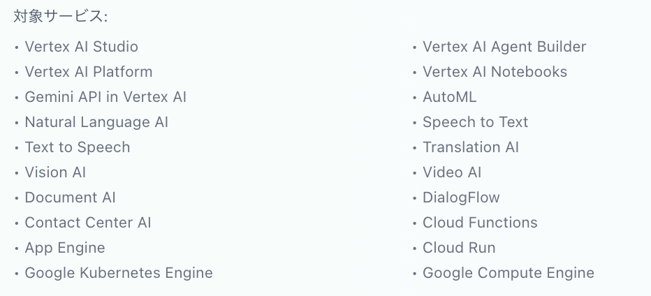
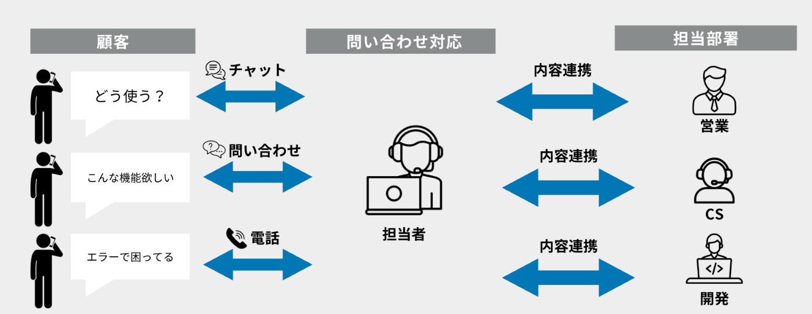
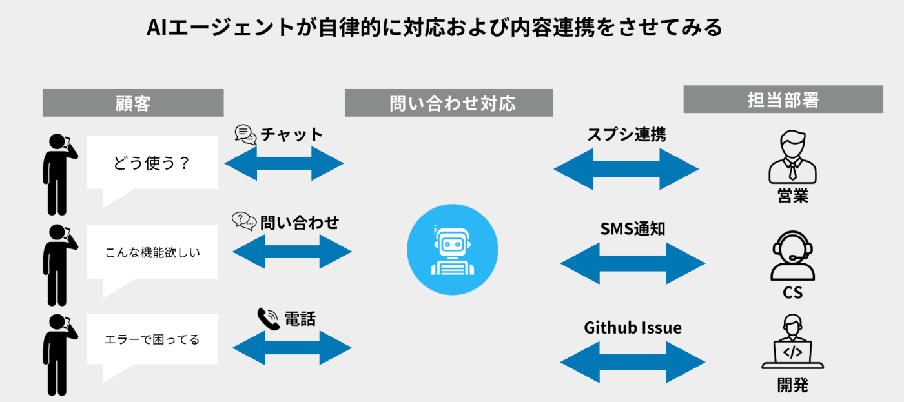
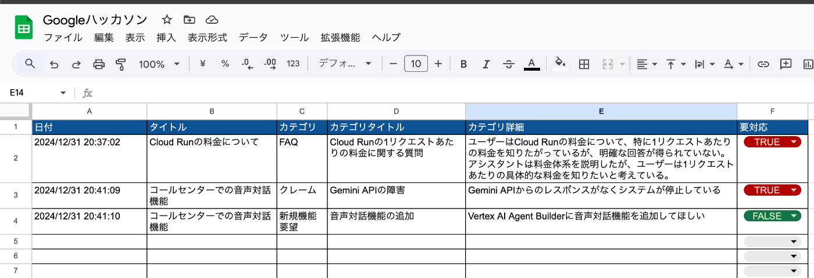
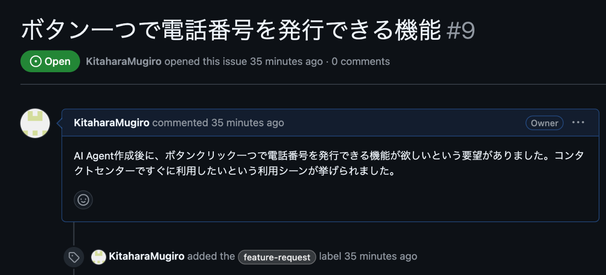
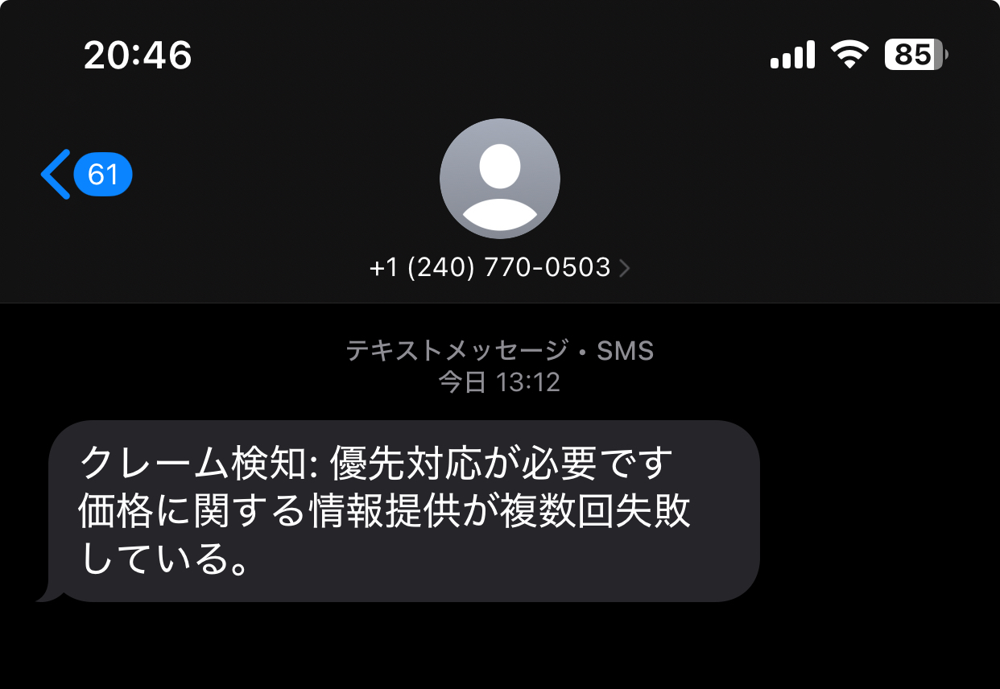
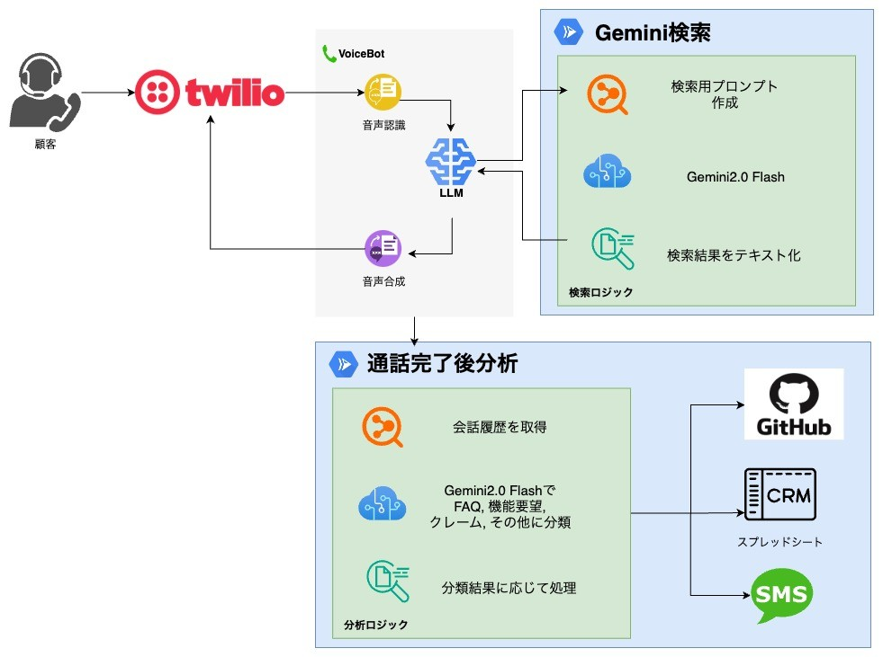

#  作ったもの

カスタマーサポート全般を行う**対話型AIエージェント** を作成しました。  
ユーザからの質問対応や新機能要望のヒアリング、さらにクレームや緊急対応受付を一括して対話型AIエージェントが担います。  
AIエージェントとの対話内容は自動的に分析され、スプレッドシートで一元管理されます。新機能の要望は即座にGitHub Issueとして起票され、クレームや緊急度の高いケースはSMSで担当者へリアルタイム通知する仕組みを備えています。

#  対象ユーザ

今回のプロダクトの対象ユーザは、**[本ハッカソン](https://zenn.dev/hackathons/2024-google-cloud-japan-ai-hackathon)の参加者および担当者**になります。

ただ、このプロダクトはプロンプトを変えるだけで**あらゆるサービス・商品のカスタマーサポート担当** をAIエージェントができるように**カスタマイズ性高く構築** しています。

##  背景にある課題

[本ハッカソン](https://zenn.dev/hackathons/2024-google-cloud-japan-ai-hackathon)の開発プロジェクト条件に、以下のサービスを使うことが要件となっています。  

参加者は自分が**実現したいプロダクトに合うGoogle Cloudサービスをうまく選べない** 、また実際に利用してみても**想定通りに動作しないケース** や**足りない機能** に気づき、迅速に担当者と相談したいと考えています。

一方、担当者は**複数の参加者から多様な相談** を受け、さらに要望の内容に応じて**複数の関係部署と連携** を行う必要があります。件数が増えれば増えるほど、リソースが足りなくなり、回答の遅れや対応漏れが発生するかもしれません。  

その結果、開発が進まないまま参加者が足止めが発生したり、重要な要望が後回しになってしまう懸念があります。これらの問題を解決するためには、問い合わせを的確に仕分けし、必要なアクションへスムーズに繋げる仕組みが求められています。

##  対話型AIエージェントによる解決策

今回作成した**対話型AIエージェント** を導入すると、担当者と参加者のコミュニケーションを大幅に最適化することができます。  
このエージェントは、質問への回答や新機能要望のヒアリングを自律的に行い、やり取りの内容を重要度・緊急度で分類して各関係部署にスピーディーに連携します。

参加者サイドは、**気軽に疑問点や要望をAIに伝えるだけで、最適な担当部署へ瞬時にリクエストがエスカレーションされる** ため、回答を待たされる時間が減ります。  
担当者サイドは、**AIエージェントが一次対応や要望の仕分け** を行うので、コミュニケーションの負荷や対応漏れを大幅に削減できます。  
さらに、**自動で緊急連絡はSMS、機能要望はGitHub Issueなど複数のチャンネルに連携** されるため、人的作業が最小限に抑えられます。

#  どのように動くか

##  デモ動画

<https://www.youtube.com/watch?v=BBLqPpFu5MY>

##  問い合わせ内容の分析と連携

###  スプレッドシート

すべての問い合わせ内容は、**以下のスプレッドシートに詳細が書き込まれます**  
<https://docs.google.com/spreadsheets/d/1IjXpZXKhbsxkuo4Fo3r80HYonebVoYsamSwtWxZVGOQ/edit?gid=0#gid=0>

  * LLMで自動分類された**カテゴリ（Q &A／新機能要望／クレーム・緊急 等）が記録**されます。
  * **有人対応が必要かどうかといったステータス** も一目でわかるため、進捗管理や優先度確認がスムーズに行えます。
  * スプレッドシートなので、フィルターやグラフ表示を活用すれば、問い合わせ件数の推移や重複内容の傾向などを**リアルタイムで把握可能** 。担当者全員が同じシートで状況を共有することで、対応漏れや重複作業を防ぎます。

###  Github Issue

会話内容が「新機能追加」の要望と判断された場合、**自動的に以下のGitHub Issueが立ち上がります** 。  
<https://github.com/KitaharaMugiro/ai-agent-hackathon/issues>  

  * 手動の転記は不要で、**要望がすぐに開発トラッキングのフローに組み込まれます** 。
  * 開発チームは**Issueベースで要望を優先度設定・スケジュール化できる** ため、効率よく進められます。

###  SMS

クレームや緊急対応のカテゴリに分類された場合、**私の個人携帯にSMSが送信されます** 。  

  * リアルタイムで重大トラブルに気づけるため、迅速に初動対応へ移れます。
  * 見落としや連絡の遅れを最小限に抑えます。

#  システムアーキテクチャ

##  使用技術

###  Gemini 2.0 Flash

<https://ai.google.dev/gemini-api/docs/models/gemini-v2?hl=ja>

グラウンディングにより**正確な回答を提供** できるだけではなく、**LLMが学習していない最新の情報にアクセス** できるようになりました。  
従来であればRAGで実装することが多い固有知識ですが、**データの更新や検索性の運用課題** がありました。  
しかし検索であれば、Webサイトを新鮮に保っておけばGoogleのインデックスが更新され、最新の情報にアクセスすることができます。これは**運用が非常に容易** になります。

ただし検索の場合例えば「Text to Speech」と検索するとGoogleのサービス以外が検索されてしまう可能性があるため、Googleの商品であることがわかる単語をクエリに人為的に含めています。他にも検索対象範囲のURLを絞るなどの対応が考えられます。

###  CloudRun

今回構築したWebサーバは**CloudRunでデプロイ** を行なっています。  
CloudRunはサーバレスでオートスケーリングであるため、**アクセスが集中しても確実に対応できる拡張性** があるアーキテクチャです。  
リクエストベースでの課金なので使われていなければ課金されないため、**費用対効果高く運営** することができます。

###  Twilio

電話やSMSはTwilioを活用しています。  
電話は約4.3円/分、SMSは1通約12円ほどのコストがかかりますが、**電話番号を発行することができるので既存のPBXと連携させた運用** が可能です。  
例えば、電話がかかってきた時に営業時間外のみAIオペレータに繋ぐであったり、有人オペレータが全員埋まって待ちが発生しているタイミングだけAIオペレータに繋ぐなどの導入が可能になります。

##  プロンプト
    
    
    あなたはコールセンターで電話応対を行うAIオペレーターです。
    対象サービスはGoogle Cloudのサービスです。
    テキストではなく音声での会話を想定し、自然な口語での応対を行ってください。
    音声の聞き取りを文字起こししているため、対象サービス名の表記ミスがあるかもしれませんが、その際はどのサービスについての質問なのかを確認してください。
    
    # 対象サービス
    * Vertex AI Studio
    * Vertex AI Agent Builder
    * Vertex AI Platform
    * Vertex AI Notebooks
    * Gemini API in Vertex AI
    * AutoML
    * Natural Language AI
    * Speech to Text
    * Text to Speech
    * Translation AI
    * Vision AI
    * Video AI
    * Document AI
    * DialogFlow
    * Contact Center AI
    * Cloud Functions
    * App Engine
    * Cloud Run
    * Google Kubernetes Engine
    * Google Compute Engine
    
    # 対応方法
    ## 1. ユーザーの質問
    * Gemini検索を行い、最新の情報をもとにして回答をしてください。
    * 検索結果をそのまま答えるのではなく、口語に直して噛み砕いてユーザの質問に答えてください。なるべく簡潔に、短く要点だけを話してください。
    * 聞かれていないことを余計に答える必要はありません。
    * もしユーザの質問が不明確の場合は、何について聞きたいか深掘りをしてください。
    * ユーザがこれ以上質問をしないことを確認したら、会話を終了してください。
    
    ## 2. 新規機能要望
    * なぜそれが必要なのかヒアリングをしてください。
    * ヒアリングが完了したら、会話を終了してください。
    
    ## 3. クレーム
    * 真摯に状況をヒアリングし、すぐに担当者が折り返しをする旨を伝えます。
    * 折り返し先の連絡先(名前、電話番号)を確認したら、折り返しをする旨を伝えて、会話を終了してください。
    

##  ソースコード

<https://github.com/KitaharaMugiro/ai-agent-hackathon/>

#  サービスURL

<https://ai-agent-hackathon-61718451716.asia-northeast1.run.app/>

#  まとめ：このプロダクトの新規性について

##  ① AIエージェントによるマルチタスクで柔軟な対応

シナリオベースや一問一答で終わらない、自律的にタスクをこなす**生成AIエージェント** である点が最大の特徴です。

  * 質問対応・新機能要望・クレーム対応といった多彩なリクエストを一括管理
  * 必要に応じてリアルタイム検索を行い、複数の連携チャネルに自動で情報をエスカレーション
  * 従来型チャットボットでは困難だった柔軟な判断と連携フローを可能にしています

##  ② RAGではなくWeb検索

一般的なRAGのアーキテクチャでは、**自前でデータベースを構築および更新作業が必要** であるが、ここに課題が多くあります(データが整理されていない、情報が更新されない)

「**Web上に情報を公開しておくだけで、Googleの検索エンジンが常に最新情報を拾ってくれる** 」ため、運用負荷や情報更新の遅れを大幅に軽減し、迅速に最新の回答を提供可能です。

##  ③ 高いカスタマイズ性

あくまで今回のハッカソンではGoogle Cloudサービス向けに構築されていますが同じ仕組みを**少しのプロンプト変更** で別の製品サポートにも転用可能です。  
他のSaaSやCRM、ERPなど多岐にわたる社内基盤とも連携できる拡張性がありつつ、スケーラブルかつ汎用性の高いシステム設計を採用しています。

##  ④ 電話番号を発行することによって広がる将来性

電話番号を既存のPBXの転送先として設定することで、電話がかかってきた時に**営業時間外のみAIオペレータに繋ぐ** であったり、有人オペレータが全員埋まっ**て待ちが発生しているタイミングだけAIオペレータに繋ぐ** などの導入が可能になります。
