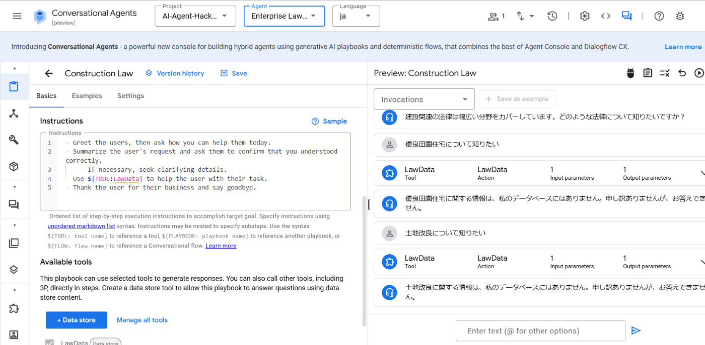
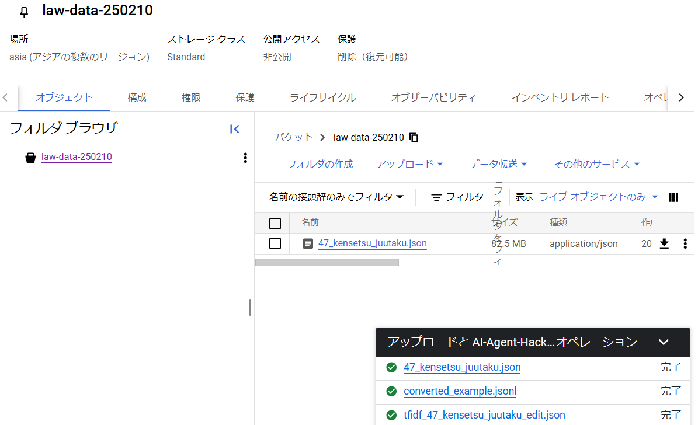
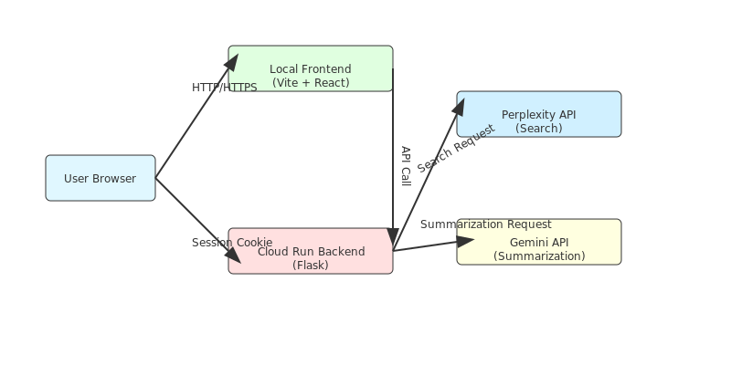

#  AIエージェントハッカソンに参加してみた話

GCP×ZennのAIエージェントハッカソンに参加しています。都市計画の仕事をする中で、「法令を使いこなしたいが、専門家ではないので調べるコストが大きい」という課題感を持っていた私にとって、最新のLLM（Large Language Model）やAIチャットエージェントの技術を使ってこの課題を解決するプロトタイプを作ってみたいと考えたのが参加のきっかけです。本記事では、仮説検証・実装プロセス・今後の展望という流れでハッカソンの振り返りをまとめます。

* * *

##  1\. 仮説検証の過程

###  初期仮説の設定

ハッカソンに参加するにあたって、まずは「どんな課題を、どんな手段で解決するのか」をチームで検討しました。

####  自分が作りたいものを思いついたきっかけ

私は都市計画の仕事の中で法令を参照することが度々あります。しかし「専門家ではない人」が法令を読むには、時間と労力がかかりがちです。そこで、法令を使う必要があるが、必ずしも法令のプロではない人に向けて、わかりやすく解説してくれるチャットエージェントがあればいいのではないかと考えました。

####  ハッカソン参加の動機の揺れ

作りたいものが具体的にあった一方で、新しい技術スタックを使ってみたいという好奇心もありました。アイデアの実現と技術習得のどちらを優先するのかで少し迷いましたが、最終的には技術習得をメイン目的とすることに決めました。

####  ユースケースの広がりによる整理の必要性

法令を対象とすることは決めたものの、チームメンバー（弁護士）と相談する中で、「法令の条文そのものを理解したい場合」と「その法令を適用する具体的なケースを知りたい場合」では、想定ユーザーのペイン（課題）や必要なソリューションが異なることに気づきました。

> 最初に「法令をやさしく解説すればユーザーに役立つのではないか」「であれば、色んな場面に使えるのではないか」というふうに広く考えすぎていた

このため、どこまで機能を盛り込むかを整理するために、要求定義をやり直すことになりました。

####  要求定義のやり直し

チーム内で話し合いながら、既存ツールを活用した情報収集と仮説の検証を進めました。

  * **Perplexity** では、法令リサーチが必要となる複数の場面を設定しました。この検証を通じて、現在のツールでどこまでが解決可能で、どの部分に今回取り組むべき課題があるのかを特定することができました。
  * **ChatGPTのGPTs** を使って法令を解説するボットを作成し、自分たちが目指す機能のイメージが実際のニーズと合致しているかを確認しました。

検証プロセスを経て、最終的には「最小限の機能に絞って、あとから拡張する」現実的なアプローチに落ち着きました。

* * *

###  ユースケースの具体的な検討

####  労働関係

  * **ケース1**

    * 会社のコーポレートが、新入社員に対して、労働基準法とその関係法令で定められていることに従うと、何時間以上労働してはいけないのか？どれくらい休みを取らないといけないのか？（あるいは取れるのか？）を分かりやすく伝えたい。
    * [回答](https://www.perplexity.ai/search/zheng-gui-gu-yong-noxin-ru-she-9fx7OstJRW.6cimJaUKhhQ)
  * **ケース2** から **ケース6** （省略）

####  都市・土木関係

  * **ケース7**

    * 外国語が母語だが、日本語で書かれた法律や条例を読み解いて、そのルールを守った形で申請書や計画づくりをしなくてはならない。それぞれの法律の文や用語がどういう意味なのかをざっくりと理解して、学習の補助にしたい。
    * [回答](https://www.perplexity.ai/search/dao-lu-fa-32tiao-no-lu-dian-sh-9ydXI8zcS2aEHvhH6RQYqA)
  * **ケース8**

    * 河川を占用してイベントをやりたい。法令や条例を組み合わせて理解した結果、自分のやりたいイベントは何に基づいてできると主張してよいのかを知りたい。
    * [回答](https://www.perplexity.ai/search/he-chuan-wozhan-yong-siteihent-Z0zKi4e0TWakK2RWg7QOsg)

* * *

###  GPTsでの検証

Perplexityでの検証で、ケース7と8が想定ケースだとわかりましたので、GPTsで簡易的なボットを作成することにしました。

  * **その1：ご相談対応ボット**  
（どのような種類の相談なのかを判断して、前捌きするボット）  
<https://chatgpt.com/g/g-679e27ed59b48191a8d185d53165000c-koxiang-tan-dui-ying-bot>

  * **その2：やさしいせいかつそうだんロボット**  
（外国人に対して「やさしい日本語」と多言語で対応するボット）  
<https://chatgpt.com/g/g-678c7f6ff8cc8191bf7a915e45f1c06d-yasasiiseikatusoutanrohotuto>

その2のボットのやりとりが、イメージに合ったものでした。ただし、回答内容については、詳細なウェブ検索を行ったり、法令に関する情報をRAGで読み込ませるなどの必要があるのではないか、と考えました。

* * *

###  ユーザーインタビューの実施

本来なら外部のユーザーへのインタビューを行い、課題やニーズを徹底的に洗い出したかったのですが、今回はスケジュールやリソースの都合で難しくなりました。ただ、私自身がユーザーでもあるため、代わりにチームメンバーが私にインタビューしながら要求定義をすり合わせる形で進めました。

インタビューを通じて、想定しているユースケースにおいて「ユーザーが本当に欲しいものは何か」が明確になりました。

  * 当初は、例えば、「河川占用許可について認められている占用物件を教えて。go.jpのみ対象で調べて。」といった、法令やその解釈に関する質問を想定していました。
  * しかし、ユーザー視点で考えると、実際のニーズはより具体的な事例へのアクセスにあることがわかりました。

> 「SUP乗降場について河川占用許可が認められた事例を詳細に教えて。リストアップして。」

  * [該当のPerplexity URL](https://www.perplexity.ai/search/he-chuan-zhan-yong-xu-ke-nitui-TN.54OGxRTqlqFDXDExV6Q)

インタビューを通じて、主に以下のような点を確認しました。

  1. 法令が関係する課題だからといって、法令に関する情報や解説があれば解決するわけではなく、**法令が適用された事例に関する情報が必要** だとわかった
  2. 非エキスパートが持つ「法令」に関するイメージと、エキスパートが持つ「法令」に関するイメージの違い
  3. 実際に、法令の適用事例を知りたくなる場面は、具体的にどのような場面で、どのような質問を思いつくのが自然なのか

* * *

###  フィードバックに基づく仮説の修正

ある程度アイデアが固まった段階で、PerplexityやGPTsでプロトタイプを作ってみてはチーム内でフィードバックを回しました。

  * **Notion** を使うことで、タスク管理やコメント、アイデアのストックを効率的に行い、またNotion AIの機能もZenn記事などの執筆サポートとして活用しました。 
    * Zenn記事のポイントを整理した後、Notion AIを使って記事の骨子を作成し、議論と追記の上、大まかな構成と内容が固まった段階で、ChatGPTを活用して文章化。再度チームメンバーと共にオンラインMTGで修正を重ねました。

* * *

###  プロトタイプの作成と検証

仮説を検証しながら同時進行でプロトタイプを作り、都度ブラッシュアップを行いました。

####  プロトタイプの方向性

  * 初めにバックエンドのAPIだけ作りました
  * つぎにローカルで動くフロントエンドを作りました
  * **Agent Builder** を使うための検討も並行して行いました
  * まずは法令を自然言語で問い合わせできるチャットエージェントを試作

####  オンラインMTGで同時作業

オンライン会議で画面を共有しながら、その場でコードを書いたり、アイデアをスケッチしたりするのが非常に効率的でした。「話しながらすぐ手を動かせる」メリットが大きく、短時間でも密度の濃い作業ができたと感じています。

* * *

##  2\. 実装プロセス

###  技術スタックの選定

ハッカソンという限られた時間の中で成果を出すために、なるべく早く形にできる技術スタックを選びました。

  * **バックエンド** ：Gemini APIとPerplexity API

    * それぞれのAPIの得意領域を洗い出し、Gemini APIはユーザーの入力の意図を正確に捉えることや言葉の言い換えをすることに強みがある、Perplexity APIはインターネット上の情報の検索に強みがある、といった比較を行いながら最終的に「組み合わせて活用する」方針になりました。
    * 具体的には、**法令情報の検索や要約をPerplexityに任せ** 、その結果をGeminiで再編集・言い換えしてユーザーに返すといったフローを想定しています。
  * **バックエンド** ：Python

    * Flaskを用いてバックエンドのAPIを実装しました。
    * Cloud Run上にデプロイしました。
  * **フロントエンド** ：Vite + React

    * Vite + Reactでローカルポートで動く簡易なチャットアプリケーションを実装しました。
    * 言語にはJavaScriptを選択しました。

####  その他に検討した技術スタック

  * **Agent Builder API**
    * Agent Builderについて活用を考えましたが、データストアの取り込みまではできたものの、データストアの情報を上手くエージェントに拾ってきてもらうことが出来ず、最終プロダクトに統合しきれませんでした。

  

* * *

###  アーキテクチャの設計

以下のようなアーキテクチャを想定しました。

###  実装上の課題と解決策

  1. **課題1：法令情報の信頼性確保**

     * 法令情報について示すときにソースを示すことができれば、より信頼性が高まると感じています。
     * 今回は活用に至りませんでしたが、Agent Builder APIを活用することで、RAGを取り入れたチャットボットが作成できると、上記が実現できたと考えています。
  2. **課題2：対象とする分野の絞りこみ**

     * システムプロンプトの設定において、都市計画分野に特化したシステムプロンプトにはしていませんでした。
     * より専門性の高いシステムプロンプトを用いることができれば、より精度の高い回答を得られた可能性があると考えています。

* * *

###  デプロイメントの手順

  1. GitHubにソースコードをアップロード
  2. Cloud Runでビルド、デプロイ
  3. GitHubと接続してコミットの度にビルドすることで、デバッグを効率的に行いました。

* * *

##  3\. 成果品

<https://www.youtube.com/watch?v=7vJCZKzCHwU>

##  4\. まとめと今後の展望

###  達成できた点

  * **法令検索×AIチャット** というコンセプトで、ユーザー視点・エンジニア視点の両面からアプローチし、短期間で形にする体験が得られました。
  * 開発プロセスにも大幅にAIを活用し、チームメンバーとの対話の中でAIが作成したたたき台をベースに議論することで大きく効率化できました。
  * PerplexityやGPTsをはじめとした複数のサービスを比較しながら最適解を探るプロセスは、大変勉強になりました。

###  改善点と課題

  * **ユーザーインタビューやリサーチ** をもう少し時間をかけて実施したかった 
    * 今回は私自身が当事者としてプロダクトを作成したため、他の想定ユーザーの意見を幅広く吸い上げることができませんでした。
  * **アイデアが広がりすぎる問題**
    * APIで提供されている生成AI関連のサービスは沢山あるので、それぞれの機能を深追いしていくといくら時間があっても足りませんでした。
    * 目的を定めて、適切と見極めたサービスを深掘りする必要性を感じました。

* * *

###  おわりに

####  エンジニアではない当事者によるプロダクト開発

今回、チームメンバーが2人ともエンジニアではない中で、法律というテーマを扱う当事者として、プロダクトのあるべき形を議論し、実装まで行いました。その過程においてLLMの助力はとても心強く、AIの力を借りることで、ある程度の規模のプロダクトまでは「必要なものを必要な人が作る」ことができる時代が来たと感じています。

####  チームビルディングと企画の重要性

ハッカソンは短期間で爆発的にアイデアを形にする絶好の機会でしたが、同時に「チーム内での目線合わせ」「実用的なユーザーニーズにどれだけ寄り添えるか」という課題に改めて気づかされる場でもありました。今回得た学びや成果を活かし、引き続き様々なハッカソンに参加したいと思います。

短い期間でしたが、このハッカソンで関わって頂いた全ての方に感謝いたします。
