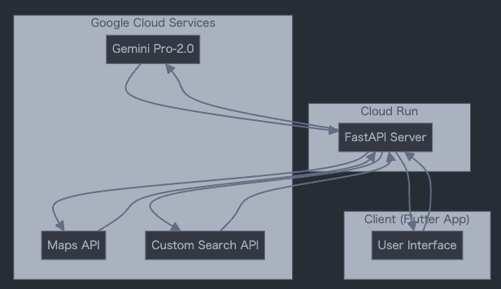

!

この記事はAI Agent Hackathon with Google Cloudの参加記事です。

#  はじめに

「今日のランチどうする？」  
この何気ない一言から始まる場所探しの旅。誰もが経験したことのある、小さくて大きな「めんどくさい」があります。Google Mapを開いて...でもどう検索したらいいんだろう？レビューは信頼できるのかな？メディアでの評判は？  
そんな日々の「めんどくさい」を解決するために、LazySpotFinderは生まれました。

#  プロジェクトの概要と解決する課題

##  ターゲットユーザー

  * 日々の外食や新しい場所探しに「めんどくさい」を感じている人
  * 良い店を見つけたいけど、深い調査をする時間や気力がない人
  * 自分の状況や気分に合った場所を、もっと直感的に探したい人

##  課題

**1\. 情報過多による選択の難しさ** \- 膨大な情報から適切な検索キーワードを設定し、レビューやメディア掲載情報の信頼性を判断する作業は、認知的負荷が高く疲れる作業です。

**2\. コンテキストの表現の難しさ** \- 「同僚とちょっといいランチを」「子連れでゆっくりカフェ」など、人間同士なら暗黙的に理解できる状況や雰囲気を、検索システムに伝えることができません。

**3\. 新しい場所を開拓する機会の減少** \- 情報過多と検索の難しさにより、私たちは「いつものお店」に流れがちです。新しいカフェや地元で愛される名店など、生活を豊かにする出会いの機会を逃しています。

#  ソリューション

LazySpotFinderは、**スポット探しのPerplexity** です。自由テキストによるAIチャット体験を、場所探しに特化させた形で提供します。

##  特徴：

**1\. 自然言語での直感的な検索** \- 「自由が丘で美味しいカフェを」「同僚とお茶の水で中華ランチ」といった自然な言葉での検索が可能。Gemini Pro-2.0がユーザーの意図を理解し、最適な検索クエリに変換します。

**2\. 納得感を高める情報の裏付け** \- スポット選びで人が無意識にやっている「裏どり」をAIが代行します。例えば、評価が高くても口コミが少ないお店は要注意。逆に、口コミが100件を超えて高評価なら間違いない人気店です。さらに、信頼できる雑誌系Webメディアで取り上げられているなら、もう確実でしょう。こうした人間らしい判断の仕方をプロンプトで制御し、納得感の高い情報として提示します。

**3\. 脳みそが喜ぶ、マルチモーダルな情報提示** \- 言葉だけではスポットの魅力は伝わりません。写真や地図といった視覚的な情報をAIの回答の中にシームレスに統合し、スポット選びをもっと楽に、もっと楽しくします。

##  デモ体験：

動画をご覧ください。  
<https://youtu.be/MZ1qFeAUQ5U>

  * 今回は「自由が丘のカフェ、子連れでまったり」「東京で羊が有名なお店」という2つのリクエストをしました。
  * 実は私は自由が丘に縁があり、羊が大好きです。そんな私がAIの回答に納得できるかという視点でこの2つのリクエストにしてみたのですが、選定された候補および魅力のプレゼンテーションは、**自分でもびっくりするくらい満足度が高い** です。
  * これは、多様な情報ソースを参照しているために、**行くべき理由がこれでもかと提案されるから** ではないでしょうか。口コミやWeb記事から、写真や地図から、**Gemini2.0の賢いレコメンド** から、情報量がちょうど良いのです。意思決定に十分な量が提示されているから、楽に＆楽しく選ぶことができるのではないかと、感じました。
  * デモの中では、AIの回答に埋め込まれたWeb記事や、Google Mapへ遷移するシーンもありますが、**これも行きたい気持ちがとても刺激されます。**

#  技術アーキテクチャ

以下が本システムのアーキテクチャ図です：

**本プロジェクトは以下の技術スタックで構築されています：**

  * AI/ML: **Gemini API in Vertex AI**(Gemini pro-2.0)
  * バックエンド: **Cloud Run** (FastAPI)
  * フロントエンド: **Flutter** (Android/iOSアプリ)
  * AIエージェントのワークフロー管理: Langgraph/Langchain

**利用したAPIは以下の通りです：**

  * Gemini API
  * Google Maps API (Text Search, Place Details)
  * Google Custom Search API

**AIエージェントの主要なワークフローは以下の通りです：**

  1. ユーザーの自然言語入力をGemini Pro-2.0で解析し、構造化されたクエリに変換
  2. 構造化クエリを基にGoogle Maps APIで候補地を検索
  3. 各候補地について口コミ情報とメディア掲載情報を収集
  4. 収集した情報をGemini Pro-2.0で分析・サマリー分を作成
  5. ユーザーフレンドリーな形式で結果を提示

##  工夫したポイント

**1\. 必要十分な情報をLLMへ渡す** \- 適切なソースさえ渡せば、AIは人間と同等以上の回答をすることがわかっています。しかし、不必要な情報まで渡してしまったら精度は下がります。試行錯誤の結果、以下のプロンプトをLLMに渡しました。

> GoogleMapのレビュー平均点/レビュー数/関連度の高い口コミ5件/スポット名でニュース検索した際の記事タイトル/掲載メディア

**2\. 裏どりの目的・ポイントをLLMへ伝える** \- どういう手順で、なぜ裏どりするかをLLMに直接プロンプトで伝えました。こちらもプロンプトを何度も書き直し、回答の納得度を高めました。

> あなたは以下のステップを踏んで情報探しをすることにしました。  
>  ・まず、お題をもとにGoogleMapでスポットを検索します。  
>  ・上位のスポットについて、口コミの点数や件数、上位レビュー5件を確認します。  
>  ・また、スポットの名前でニュース記事についても検索します。  
>  ・これらの情報をもとに、候補のスポットをオススメ順に並び替えて、5点満点で評価しながらおすすめの文言を伝えます。

ここはかなり私の主観によっているところもあるので、改善の余地もかなりあります。初めは以下のようにかなり細かく指示していたのですが、私のバイアスが入りすぎるので辞めました。

> レビューは以下のように分析して、ユーザーに伝えてください。  
>  GoogleMap レビューの点数の見方：  
>  ・4.5点以上 ... 素晴らしく良い。件数も多ければなお信憑性が高いが、件数が少なければ様子見もあり。  
>  ・4点以上 ... 良い。件数も多ければ多くの人に親しまれたお店という印象。  
>  ・3.5点以上 ... 悪くはない。件数が多ければ馴染みのあるお店。  
>  ・3.5点未満 ... 微妙だが、掘り出し物の価値はあり。

**3\. Flutter活用でAIエージェントとして高い表現力（リアルタイム、画像、地図、インタラクティブ）** \- 初めはLLMの回答をまとめて表示していましたが、やはりブラウザ版Geminiなどのように、リアルタイムで文字が書き足されていく方が対話的で、不思議と内容に納得感もあります。主に2つのチャレンジを行いました。  
**\- LLMの回答文の中にスポットに関する画像や地図を埋め込む** \- 出力文章の中に<place id=xxxxx></place>や<pmap></pmap>といったタグを吐き出すように設定し、Flutter側で対応するデータクラス、ウィジェットを用意しました。そしてstream結果を受け取るたびにパースを行い、順次配列に格納していきました。  
**\- Cloud Run側でステートは保持せず、シンプルなMVP構成を死守** \- Flutterから期待するAPIレスポンスは、**構造化されたスポット情報** と、**ストリーミングで受け取る回答結果** です。APIを分けるとCloud Runだけでは足りず、メモリ管理などが必要となるため、1本のAPIでまずスポット情報を受け取り、ついでAIテキストを順次chunkで受け取る方法を採用しました。

#  AIエージェントに見た、新しい探索行動の可能性

私の本職はUXデザインですが、スポット探しは非常に古典的なテーマで、ユーザの取る行動は「探究探索」と言われています。その特徴は以下の通りです。

**\- 探究探索をしているユーザーは、自分が本当に探しているものを把握していません。** 自分がカレーを食べたいのか？ラーメンを食べたいのか？食べてみるまでわかりません。その状態で、「効率的な検索」なんてできるでしょうか。  
**\- 探究探索には終わりがありません。** なぜなら、これが正解だというには手がかりが少なすぎるし、全数探索するには候補が多すぎるからです。  
**\- 私たちが本当に求めているのはスポットそれ自体ではなく、決断を下すための知識や、手助けとなる前提情報を手に入れた時かもしれません。** たとえば旅先では、ご当地料理を知るだけで、あとはどのお店でも良い、ということがあり得ます。これはコンテキストさえあればどんなスポットでも正解になる、ということです。

ちょっと考えただけでも、Google検索やマップ検索でこれらを満たすには荷が重すぎます。タクシーの運ちゃんとの会話のようなインタラクションならあるいは...と思いますが、かといってタクシーの運ちゃんの知ってるお店のデータベースだけあっても困ります。再起的に、インタラクションを通じてユーザは納得感を高めたいのです...

というのが、これまでのUXの限界でした。でも、**LLMやAIエージェントの登場によって、人間の情報探索活動も大きくアップデートするのは間違いありません。** 今回のハッカソンを通じて、Geminiを触りながら、プロンプトを触りながら、その可能性を肌で感じることができました。

一方で、こうした情報探索型のエージェント開発では、データを持つ企業こそがKingである、ということも改めて思い知らされました。**LazySpotFinderでは、1回の探索のうち、LLMにかかる費用よりも、Google Map APIにかかる費用の方が5〜10倍ほど高い計算になります。** LLMはどんどん価格破壊が進みますが、人が手をかけて育てたデータベースの価値は、反比例的に増加する未来が予想されます。第3者的にLLMサービスを提供する際は、このハードルをビジネスモデルでどう超えるかが課題になることを感じました。

開発中はこのアプリをリリースしたい思いもあったのですが、ビジネスモデルの問題から、当面は個人ユースとなりそうです。

#  まとめ

LazySpotFinderは、日常的な「めんどくさい」を解決するためのAIエージェントとして、技術の可能性を探求しました。特に以下の点で、今後のAIエージェント開発への示唆を得ることができました：

  * ユーザーの曖昧な要望をAIが適切に解釈し、具体的なアクションに変換する重要性
  * 情報提供におけるソースの選定、そして提示フォーマットの重要性
  * AIエージェントの差別化はコストと、ひょっとしたら探索のUI。コスト最適化とビジネスモデルの検討が必要。

このプロジェクトを通じて、AIエージェントの可能性と課題を深く理解することができました。今後も、**ユーザーの日常をより豊かにするAIエージェントの開発に取り組んでいきたい** と考えています。

ハッカソン、楽しかった！
