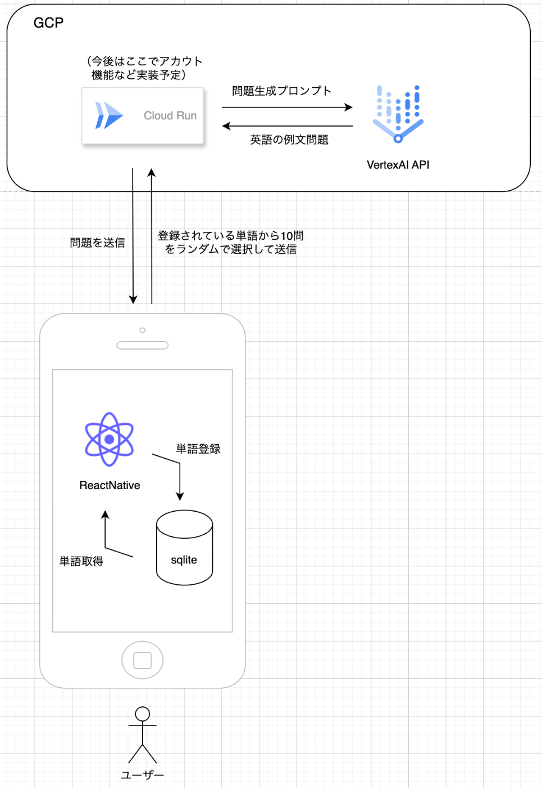
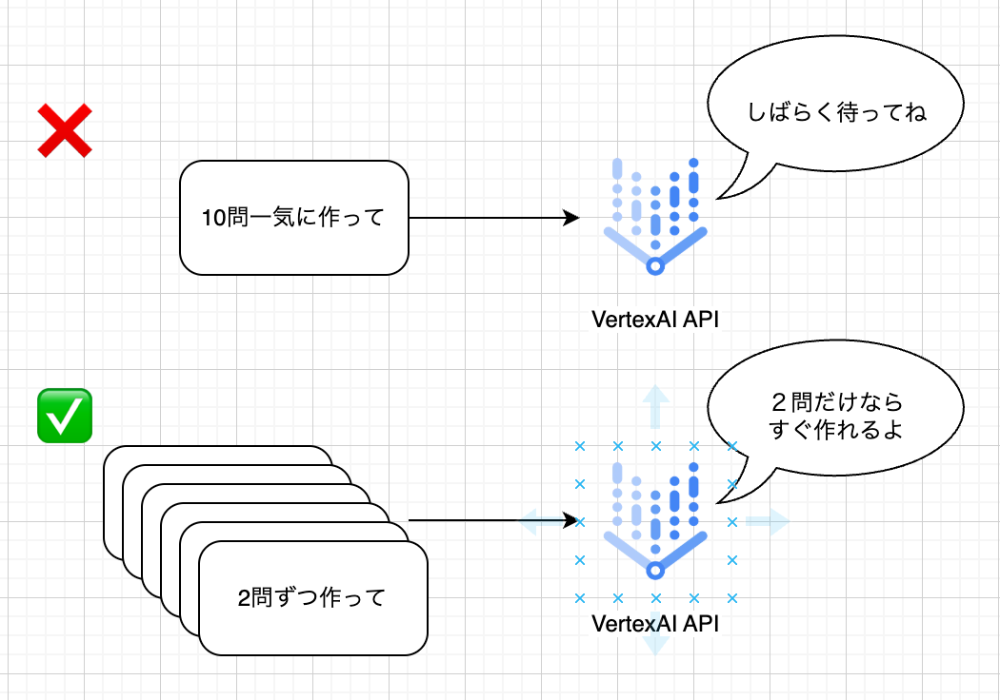

##  はじめに

単語帳で英語勉強をされている方でこんな経験をされたことってありませんか？

  * （洋画などを見ていて）この英単語って実際はこんな使われ方をするの！？
  * 単語の意味はわかるけど、文章になると理解ができない！

僕はめちゃくちゃあります笑

勉強しているうちに、英語の単語学習では、例文を通じて意味を理解し、記憶に定着させることが重要だということに気づきました。  
しかし、適切な例文を手に入れることはなかなか難しく、そのせいで学習が捗らなかったりすることが多いなと感じました。  
そこで開発したのが「AIたんご帳」です。  
簡単に言うと、英語の例文問題を自動で作成してくれるアプリです！  
このアプリがどのように英語学習をサポートし、課題を解決するのかをご紹介します！

<https://youtube.com/shorts/kUdVZv65_-w?si=Exq5MEyLRVsjHH_n>

##  英語学習の課題

英語を学ぶ多くの人々にとって、単語の暗記は避けて通れない重要なステップです。しかし、単語をただ単体で覚えるだけでは、その意味や使い方が曖昧になりがちです。このため、例文を通じて単語を覚える方法が効果的だと考えています。

例文は、単語の具体的な使い方やニュアンスを理解するのに非常に役立ちますが、ここで大きな課題が浮かび上がります。

  * **いい教材に巡り会えない**
    * 学習者が十分な数の適切な例文を見つけるのは意外と難しいものです。世の中には多くの教材がありますが、個々の教材に含まれる例文の数は限られており、そのバリエーションも豊富とは言えません。
  * **教材に出会えても、問題数に上限がある**
    * 一度学んだ教材を使い終わった後は、次の教材を探す手間が必要になります。この繰り返しの作業は、学習者にとって時間的・経済的な負担を大きくし、結果としてモチベーションを失わせることにもつながります。
  * **教材自体も学びたい単語が網羅されているわけではない**
    * 学習者それぞれが異なるレベルや目的を持っている中で、一律の例文を提供する教材では個別の学習ニーズに十分に応えきれないのです。

これらの課題が、単語習得を効率的に進めるための大きな障害となっていると言えます。

「AIたんご帳」は、こうした背景を踏まえて開発されたアプリケーションです。生成AI技術により、個々のニーズに応じた無限の例文を提供することで、英語学習者の悩みを解決し、より快適で効果的な学習環境を整えていきます。このアプリを通じて、英語学習がより身近で充実したものになることを目指しています。

##  「AIたんご帳」の紹介

このアプリでは、生成AIを活用して、登録した単語帳の単語が答えとなるような英例文問題を無制限に生成できます。

###  ユーザー体験の流れ

  1. ユーザーは自分が学びたい単語をアプリに登録
  2. 例文問題作成画面を起動する  
画面を起動するだけで、ランダムに選ばれた単語に基づく例文を得ることができます。  
これにより、常に新しい文脈で単語を学習する機会を提供します。

###  従来の教材学習との違い

従来の教材では、提供される例文の数やバリエーションに限りがありましたが、「AIたんご帳」はこの制約を打ち破ります。ユーザーは自分が覚えたい英単語をアプリに登録するだけで、その単語が答えになるようなオリジナルの例文を次々と手に入れることができます。これにより、常に新しいコンテキストで単語を学ぶことが可能になり、単調な暗記作業から解放されます。

###  アピールポイント

このアプリの最大のアピールポイントは、自分が学びたい単語が答えになる問題を無限に生成することができることです。単語の意味だけでなく、実際の文章における単語の使われ方も同時に学ぶkとができます。

必要なときにすぐに利用することができるため、忙しい日常の中でも学習を進めることができます。これにより、継続的かつ効率的な学習が可能となり、英語力の向上をサポートします。

##  アプリの主な特徴

  * **単語の自由登録** : ユーザーは学びたい単語を自由に登録でき、個々の学習ニーズに合わせたカスタマイズが可能です。
  * **豊富な例文生成** : 生成AIが次々と異なる例文を作り出すため、単調にならず、繰り返し学習する楽しさを提供します。
  * **手軽な操作性** : インターフェースはシンプルで、忙しい方でも手軽に利用できるように設計されています。

##  今回実装した機能

今回は、「自分が解きたい問題を無制限に生成できる」という体験にフォーカスを当てて実装をしました。

  * 単語の登録 & 削除 機能
  * 単語帳に登録した単語の中からランダムで10問問題を生成してくれる機能
  * 出題された問題のうち、答えではない別の選択肢を単語帳に登録できる機能

この「AIたんご帳」を使えば、英語学習がもっと身近で効率的になると嬉しいです！

##  アーキテクチャー図

使用した技術としては、上記の図に示すように

  * クライアント側 
    * ReactNative Expo
    * sqlite
  * バックエンド側 
    * cloud run
    * vertexAI API

を用いています

###  工夫したこと

  * モノレポ & tRPCを用いて、型安全なAPI通信
  * 問題の質  
例えば、１つの問題の選択肢に 単語, 熟語, イディオムが混在していると、答えがすぐにわかってしまうと思います  
そのため、単語が答えの問題は選択肢は全て単語といったように、選択肢を答えと同じ形式になるようにプロンプトを工夫しました
  * 問題作成のレスポンス時間  
10問一気に作成させると、レスポンスが20~30秒ほどかかってしまっていたので、  
2問ずつ小分けにして作成しさせるようにすると、レスポンスを10秒ほどまで抑えることができました  

###  今後追加予定の機能

更なる利便性と学習効率の向上を目指し、以下の機能を追加する予定です。

  * 問題正解率の分析 
    * 単語ごとの正答率を追跡し、ユーザーが自身の弱点を把握し改善できるサポートを行います。
  * 再挑戦機能 
    * 過去に間違えた問題を再度出題することにより、理解が曖昧な単語や表現の強化を促します。
  * 未登録単語対応 
    * 知識を広げるために、登録していない単語を含む例文も自動で生成し、より多くの語彙に触れる機会を提供します。

##  アプリは近日公開！

すぐに公開予定なので乞うご期待を！

##  最後に

これからも追加実装予定ですので、ぜひいいねを押して、応援してもらえると嬉しいです！😄
