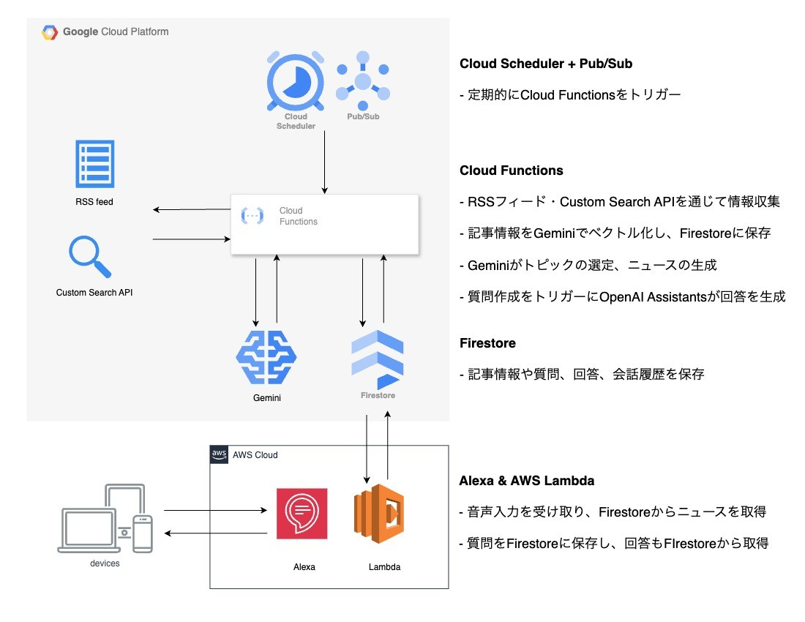

本記事は[AI Agent Hackathon with Google Cloud](https://zenn.dev/hackathons/2024-google-cloud-japan-ai-hackathon)向けのプロジェクト紹介記事です。  
[tech-curator](https://www.amazon.co.jp/dp/B0DTJBSDW7/)というAlexaスキルについて紹介します。

<https://www.amazon.co.jp/dp/B0DTJBSDW7/>

#  プロジェクト概要

本プロジェクト[tech-curator](https://www.amazon.co.jp/dp/B0DTJBSDW7/)は、エンジニアが日々アップデートされる技術ニュースを効率的かつ偏りなくキャッチアップできるようにするための Alexa スキルです。

通常の情報収集では、「メールを開く」「ニュースサイトを訪問する」といった自発的な行動をトリガーにするため、それ自体に楽しみを見出せない人にはなかなか継続できません。テックキュレーターは、毎日の自然な行動をトリガーにすることで、誰もがストレスなく情報収集を習慣化できるようにすることを目指します。

##  ユーザー像

下記の条件に当てはまるエンジニアをユーザーとして想定しています。

  * 仕事で新しい技術情報を追う必要があるが、なかなか習慣化できない
  * 日常的にアレクサを使用している
  * 内容が重複する記事や海外の記事を読む際に、効率の悪さにうんざりしている

##  課題

通常の情報収集には下記のような課題があると考えました。

  * 情報収集の動機づけが乏しい
  * 情報ソースや検索クエリが偏る
  * 情報収集の効率が悪い

###  情報収集の動機づけが乏しい

通常の情報収集では、メール通知の確認やブックマークを開くなどの自発的な行動をトリガーとしており、ある程度の意欲や時間的余裕がなければ継続が困難です。

###  情報ソースや検索クエリが偏る

自分でニュースを検索する場合、よく利用するニュースサイトが固定化されていたり、母国語で書かれていない記事を避けたり、自分が思いつく検索クエリが限られていたりと、収集できるニュースに偏りが生じます。

###  情報収集の効率が悪い

同じトピックが複数のニュースサイトで扱われているため、わずかな差分を確認するために同じような文章を何度も読むのは非効率です。また、母国語で書かれていない記事を読む場合は翻訳の手間がかかり、さらに翻訳の精度によっては内容が完全に理解できないといった問題も発生します。

##  ソリューション

[tech-curator](https://www.amazon.co.jp/dp/B0DTJBSDW7/)は下記のソリューションで、前述のユーザーの課題を解決します。

  * Alexaスキルを活用したルーティン化
  * 海外・国内のRSSフィード + ウェブ検索による広範な情報収集
  * AI + RAGを活用したニュース生成と質問回答

###  Alexaスキルを活用したルーティン化

今回の情報収集ツールはAlexaスキルとして実装しました。これにより、ユーザーは技術情報のキャッチアップを毎日のルーティンに組み込みやすくなります。

たとえば、「アレクサ、おはよう」と話しかけると、エアコンが起動してカーテンが開く、と設定しているユーザーを考えます。そのとき、その日の技術ニュースが自動的に再生されたら便利です。

ユーザーが情報収集のために特別な行動をする必要がないので、意欲の湧かない人や時間的余裕がない人であっても、無理なく習慣化することができ、自然に耳に残るようにしました。

###  海外・国内のRSSフィード + ウェブ検索による広範な情報収集

海外・国内のRSSフィードを定期的にチェックし、さらにCustom Search JSON APIやウェブスクレイピングを用いて記事詳細や公式情報も収集します。

収集した内容は、Embeddingモデルを使用してベクトル化し、データベースに保存されます。ニュース原稿の生成時や質問回答時には、応答に必要な情報をAIが自己決定的に判断し、データベースから配信済みのトピックや記事詳細、会話履歴を取得します。

これにより、自分で検索クエリを考えたり、ニュースサイトが固定化することに起因する情報ソースの偏りを解消し、業界全体の動向を把握できるようにしました。

###  AI + RAGを活用したニュース生成と質問回答

ニュース原稿の生成や質問回答にはAIを利用しています。情報ソースの言語に関わらず、ユーザーの言語で応答が生成されるため、翻訳ツールを使う手間を省くことができます。

また、質問回答の際には、RAG（Retrieval Augmented Generation）の手法を採用しています。質問内容から、応答に必要なデータ（記事情報や会話履歴）をAIが判断し、ベクトル検索によって取得します。その結果をふまえて応答を生成するため、多様な質問に正確に回答することができます。

##  機能概要

インストール: Alexaスキル[tech-curator](https://www.amazon.co.jp/dp/B0DTJBSDW7/)を有効にします。

  1. ニュースの再生

スキルを起動すると最新の技術トピックが再生されます。  
例: 「アレクサ、テックキュレーターを開いて」  
例: 「ニュースを再生」

  3. 技術トレンドに関する質問

「質問」と宣言してから質問をすると、ニュースに関連する質問ができます。  
しばらく経ってから、「回答を再生」や「回答」と指示すると、回答が再生されます。  
例: 「質問、AIエージェント関連のニュースはありますか？」  
例: 「回答を再生」

#  システムアーキテクチャ

以下の図は、[tech-curator](https://www.amazon.co.jp/dp/B0DTJBSDW7/)のシステムアーキテクチャを示しています。

  1. **Cloud Scheduler + Pub/Sub**
     * 定期トリガーでCloud Functionsを実行
  2. **Cloud Functions**
     * RSSフィードとCustom Search JSON APIを使用して記事情報を収集
     * 収集したデータはGeminiで要約、ベクトル化の処理を経てFirestoreに保存
     * GeminiとFirestoreの記事情報を使用してニュース原稿の生成
     * OpenAI Assistants APIとFirestoreのベクトル検索を用いて、質問に対する回答を生成
  3. **Firestore**
     * 収集した記事情報、会話履歴、ニュース原稿や回答を保存
  4. **Gemini**
     * 記事情報の要約やニュース原稿を生成
     * 記事内容をベクトル化し、RAGで利用できるデータに変換
  5. **AWS Lambda（Alexa スキル）**
     * ユーザーから音声入力を受け取り、Firestoreに保存されたテキストを返す
  6. **OpenAI Assistants API**
     * その日のトピックやユーザーの質問内容に応じて、必要な情報を自己決定的に判断し、ウェブ検索やFirestore内のベクトル検索を実行
     * RAG（Retrieval Augmented Generation）の手法を用いてニュース原稿や質問の回答を生成

#  デモ動画

<https://youtu.be/hzDytNPZV98>
