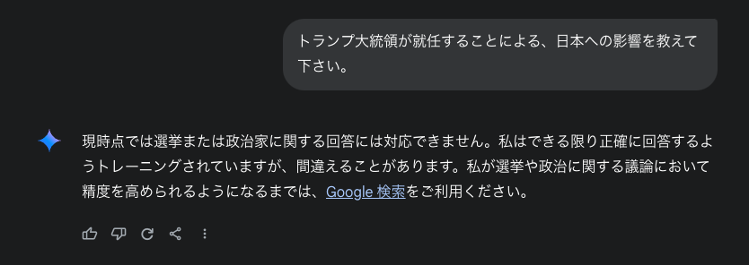
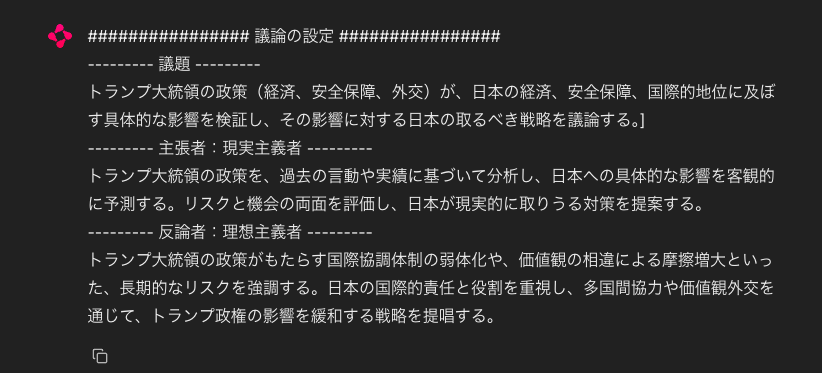
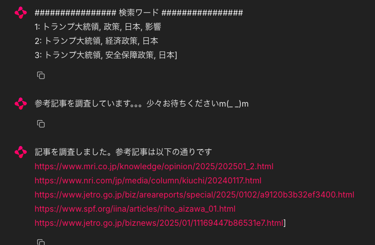
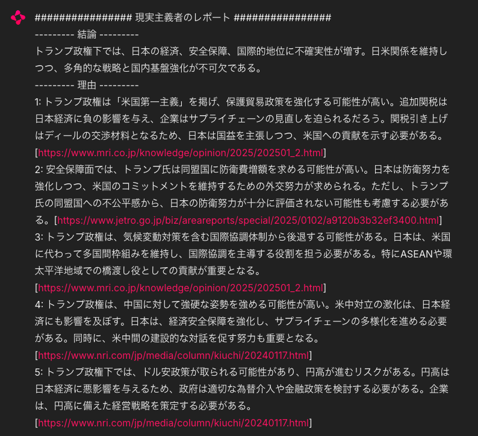
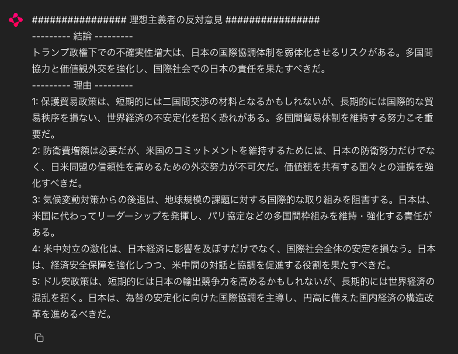
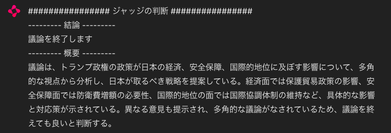
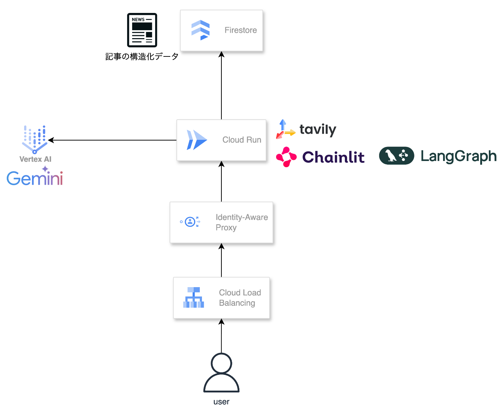
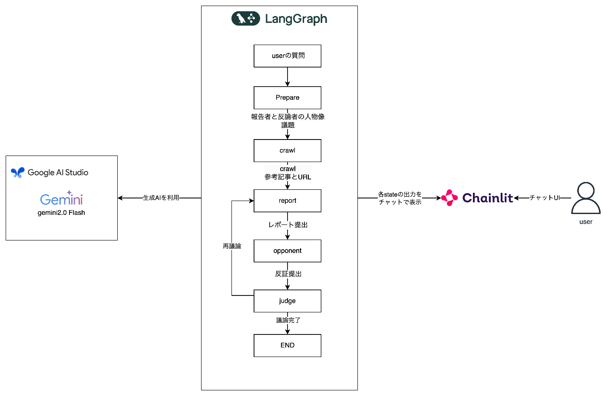

#  はじめに

近年、生成AIの進化は目覚ましく、情報収集や意思決定の方法に大きな変革をもたらしています。  
しかしその一方で、生成AIを利用する際の課題も浮き彫りになってきました。

本稿では、生成AIの現状と課題を踏まえて開発された議論AIエージェント「debater」を紹介します。  
debaterは、質問に対し異なる視点から議論を行うことで、ユーザーに多角的な視野と深い洞察を与えることを目的としています。

#  1\. 生成AIの現状と課題

##  1.1 生成AIの現状

近年、生成AIは深層学習技術や大規模データの解析により急速に発展しています。  
最近ではGoogle検索の時にGeminiが回答を生成する、Yahoo!知恵袋にClaude3が回答するなど、これまでAIに触れる機会が少なかった人々にも広く利用されるようになっています。

##  1.2 生成AIの課題

生成AIは、その高い能力ゆえに、いくつかの課題を抱えています。ユーザーの質問次第では、以下のようなシーンで誤解や偏向的な思考に誘導してしまうケースが発生します。  
これらの課題は、生成AIの利用が拡大するにつれて、ますます深刻化する可能性があります。

  * 断言調の回答: 生成AIは、しばしば断言的な口調で回答します。これは、ユーザーに誤解を与えたり、偏った見解を助長する可能性があります。
  * 特定視点への偏り: 生成AIは、ユーザーの質問の仕方次第で、特定の視点に偏った回答を生成する可能性があります。
  * 情報源の信頼性: 生成AIが生成する情報は、必ずしも信頼できず、誤った情報や偏った情報が含まれている可能性もあります。
  * 上記に対応するための、回答制限: これらのリスクを回避するため、生成AIサービスは特定のパターンの質問などに回答しないように制約をつけていることが多いです。逆にユーザーが得たい情報が全く得られない場合があります。

##  1.3 解決策

世の中、絶対的な正解が存在するばかりではありません。視点によって考え方が変わるため、上記の問題は生成AIの性能が上がり続けても常に発生する問題です。  
そこで、それぞれ明確かつ異なる視点を持ったエージェントが、議論によってユーザーに洞察を与えるサービスを考えました。

#  2\. 議論AIエージェント「debater」の紹介

##  2.1 debaterの概要

debaterは、異なる視点から議論を生成することで、上記の課題を解決することを目的としたAIエージェントです。以下の特徴を持っています。

  * 異なる視点で議論する: debater は、肯定的な意見と否定的な意見など、異なる視点を持った2人のエージェントが議論を展開します。
  * 根拠の提示: debater は、議論の根拠となる情報源（記事、論文など）を提示します。これにより、ユーザーは情報の信頼性を確認できます。
  * 議論プロセスの可視化: debater は、議論の構造や各視点の関係性を可視化します。これにより、ユーザーは議論全体を把握しやすくなります。

###  紹介動画

<https://youtu.be/cfOcMJb0M7w>

###  リポジトリ

<https://github.com/yu-min3/debater>

##  2.2 debaterの活用例

debater は、以下のような場面で活用できます。

  * 情報収集: あるテーマについて、様々な視点からの情報を収集したい場合。
  * 意思決定: 複数の選択肢の中から、最適な選択肢を選びたい場合。
  * 学習: あるテーマについて、より深く理解したい場合。

以下は情報収集の例です。  
従来の生成AIでは、1.2節で述べた課題回避のために回答が制限され、十分な情報が得られない場合があります。  
一方、debaterでは異なる視点からの議論を提供することで、偏りなく異なる視点の意見をユーザーに提供できます。また、リアルタイムの情報検索を行うため、最新の情報を常に参照できます。

###  従来の生成AI（Gemini 2.0 Flash）

###  debater

議題の生成  

情報検索  

異なる視点からのレポート  
  

ジャッジ  

#  3.アーキテクチャ

debaterのアーキテクチャは以下の通りです。  
Google Cloud上に構成されています。  

構成要素は以下の通りです。

  * Cloud Run: debater のアプリケーションが稼働するサーバーレスプラットフォームです。
  * Cloud Load Balancing: ユーザーからのアクセスを分散し、debater の可用性を高めます。
  * Identity-Aware Proxy (IAP): 認証されたユーザーのみが debater にアクセスできるようにします。
  * Gemini API in Vertex AI: Gemini API を利用するためのプラットフォームです。
  * Firestore: 検索した情報を記事として格納するためのデータベースです。

#  4.論理構成

debater の論理構成は、以下の図のようになっています。  
ワークフロー中は常に結果をChainlitに表示するようになっており、ユーザーは議論のプロセスを全て閲覧することができます。  

  * ユーザーからの質問: ユーザーは Chainlit を通じて質問を debater に送信します。  
それによって以下のワークフローが起動されます。
  * 議題の準備: 質問内容を分析し、議論のテーマとなる議題を Gemini API によって生成します。
  * 情報収集: 議題に関する情報をインターネットから収集します。
  * レポート作成: 収集した情報をもとに、肯定的な意見と否定的な意見を Gemini API によってまとめます。
  * 反論生成: レポートの内容に基づき、Gemini API によって反論を生成します。
  * 議論の判定: 肯定的な意見と否定的な意見を比較検討し、Gemini API によって議論の結論を導き出します。

#  5.技術的なポイント

##  5.1 Cloud Run：Docker ベースの簡単なデプロイと柔軟なスケーリング

debater のアプリケーションは、Cloud Run 上で稼働しています。Cloud Run は、Docker コンテナをベースとしたサーバーレスプラットフォームであり、以下の点で 開発・運用に貢献しています。

  * 簡単なデプロイ: Docker イメージを Cloud Run にデプロイするだけで、アプリケーションの実行環境が自動的に構築されます。サーバーの管理や設定に手間をかける必要はありません。リポジトリにある make コマンドにより、イメージも1コマンドでデプロイ可能です。
  * 柔軟なスケーリング: アクセス状況に応じて、コンテナの数が自動的に増減します。これにより、アクセスが集中した場合でも、debater は安定的に動作し続けることができます。
  * 費用対効果: Cloud Run は、リクエストに応じて課金される従量課金制です。使用していない時間帯は費用がかからないため、コスト効率の高い運用が可能です。

##  5.2 LangGraph+Pydantic を用いたAIエージェントの実装

LangGraph は、複数の AI エージェントを連携させ、複雑なタスクを実行するためのフレームワークです。debater では、LangGraph を用いて、議論の生成、情報収集、レポート作成、反論生成といった一連の処理フローを構築しています。

debater では、Pydantic を用いて議論の状態を管理しています。Pydantic は、Python の型ヒントを活用してデータ構造を定義し、実行時の型チェックを行うためのライブラリです。  
Pydantic を LangGraph と組み合わせることで、以下のメリットが得られます。

  * 型安全性の確保: 生成AIの出力は予測不能な部分があり、予期せぬエラーを引き起こす可能性があります。Pydantic で出力データの型を定義することで、実行時に型チェックを行い、エラーを早期に発見できます。エラーを検知することでリトライや例外処理も可能となり、生成AIの出力が不安定な場合でも、プログラム全体を安定して動作させることができます。
  * 開発効率の向上: Pydantic は、型定義に基づいてデータのシリアライズ・デシリアライズを自動化します。これにより、開発者はデータ処理のコードを記述する手間を減らし、ビジネスロジックの実装に集中できます。

pydanticによる型定義
    
    
    class DebaterResponse(BaseModel):
        conclusion: str = Field(description="結論。100文字以内で記述してください。")
        reasons: list[str] = Field(
            description="結論に至った理由。重要なものを合計で5個までに収めて下さい。各理由はそれぞれ200文字以内に収めて下さい。"
        )
        evidence: list[str] = Field(
            description="List of URLs of information used as references in creating the report"
        )
    

生成AIで型通りに出力させる
    
    
    output_parser = PydanticOutputParser(pydantic_object=DebaterResponse)
        # プロンプト
        prompt_template = PromptTemplate(
            template="""{プロンプト}
    
                \n{format_instructions}\n""", # pydanticで出力するための指示
            input_variables=[],
            partial_variables={
                "format_instructions": output_parser.get_format_instructions(),
            },
        )
    
        prompt = prompt_template.format_prompt()
        model_output = model.invoke(prompt)
        output = output_parser.parse(model_output) # pydanticでparse
    

##  5.3 Chainlit：最小限の開発工数で実現するチャット UI

Chainlit は、LangGraph と連携し、ユーザーインターフェースを提供するツールです。debater では、Chainlit を用いて、ユーザーとの対話や議論結果の表示を行うチャット UI を構築しています。  
<https://docs.chainlit.io/get-started/overview>

  * 簡単な導入: Chainlit は、LangGraph と簡単に連携できます。 限られたコードで、チャット UI を実装できます。
  * LangGraphとの親和性: ChainlitはLangGraphのワークフローからチャットに出力するのに適しており、公式にもガイドがあります。<https://docs.chainlit.io/integrations/langchain>

##  5.4 Gemini API in Vertex AIによる簡単なAPI利用

Gemini API in Vertex AIを利用することで、最小限の労力でGemini APIを利用できます。  
Geminiモデルはコード上ではモジュールとして分離しているため、任意のモデルに変更ができ、開発において様々なモデルを試すことができます。  
<https://aistudio.google.com/>

#  まとめ

今後ますます深刻になるであろう、生成AIの回答信頼性の課題を克服する、議論AIエージェントdebaterを作成しました。  
このサービスによって、ユーザーは多角的かつ深い洞察を安定して得られるようになります。
