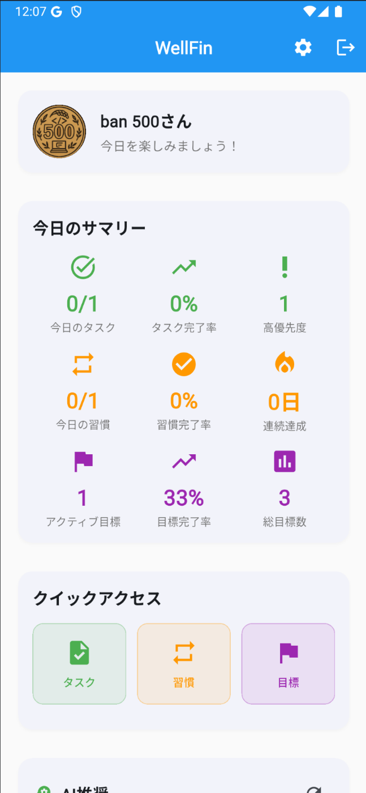
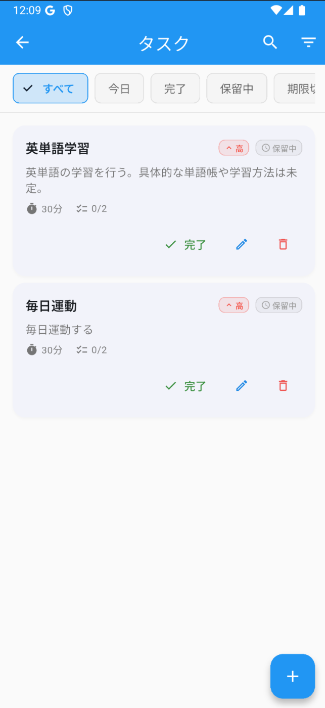
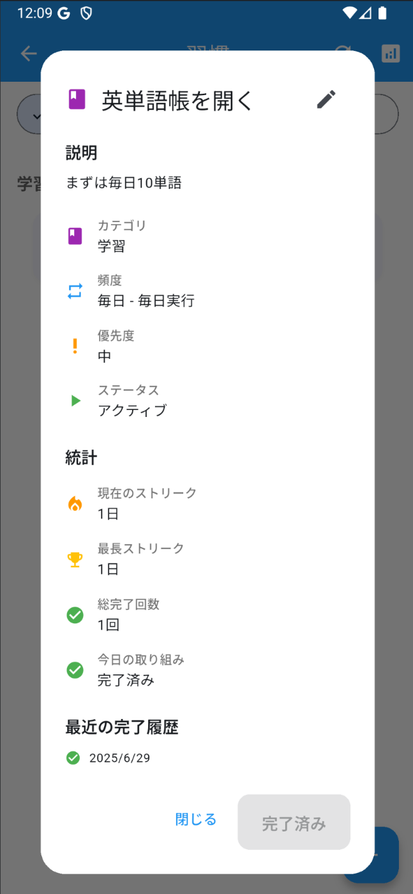
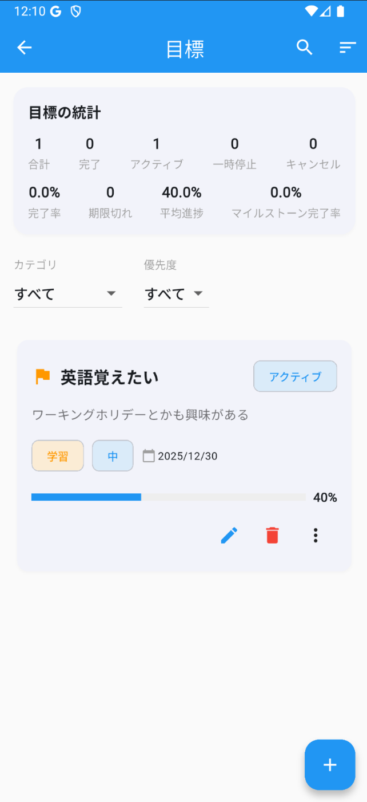

#  WellFin - AI駆動型生産性向上アプリ

##  はじめに

!

Google CloudのAI技術と出会い、Infrastructure as Codeの重要性を学ばせてくれた第2回ハッカソンに特大のリスペクトを送ります。

* * *

##  「WellFin」とは？

  * AIエージェント機能を搭載した生産性向上・習慣形成サポート、モバイルアプリです
  * 「Well」（健康・幸福）と「Fin」（終わり・目標達成）を組み合わせた造語で、「共に良い終わりを目指す」という意味を込めました

###  主な機能

  * 🤖 **AIエージェント機能** : Vertex AI Geminiを活用したタスク分析・スケジュール最適化
  * ✅ **タスク管理機能** : サブタスク対応、優先度管理、フィルタリング機能
  * 🔄 **習慣管理機能** : ストリーク管理、カテゴリ分類、進捗追跡
  * 🎯 **目標管理機能** : マイルストーン管理、進捗分析、統計機能
  * 📊 **ダッシュボード機能** : 一元的な生産性管理とAI推奨事項の表示

###  機能ごとの画面

ダッシュボード | タスク管理 | 習慣管理 | AIエージェント  
---|---|---|---  
 |  |  |   
  
##  ターゲットユーザーと課題

###  ターゲットユーザー

  * 生産性向上を目指すビジネスパーソン
  * 習慣形成に取り組む個人
  * 時間管理を改善したい学生・社会人
  * AI技術を活用した生活改善に興味があるユーザー

###  解決したい課題

  * 日々のタスクに追われて習慣形成がうまくいかない
  * 目標設定はするが継続的な管理ができない
  * スケジュール管理が場当たり的で効率が悪い
  * 既存の生産性アプリが機能過多で使いこなせない

###  課題へのソリューション

  1. **AI駆動型パーソナライゼーション**

     * Vertex AI Geminiによる個別最適化されたタスク分析
     * ユーザーの行動パターンに基づく推奨事項の生成
     * 生産性ピーク時間を活用した効率的なスケジュール提案
  2. **統合的な生産性管理**

     * タスク・習慣・目標を一元管理するダッシュボード
     * 各機能間の連携によるホリスティックなアプローチ
     * リアルタイム同期による継続的な進捗追跡
  3. **科学的根拠に基づく習慣形成支援**

     * ストリーク管理による継続モチベーションの維持
     * カテゴリ別の習慣分析と改善提案
     * 達成感を重視したUI/UX設計
  4. **インフラから考えるセキュリティ**

     * Infrastructure as Code (Terraform) による100%自動化
     * APIキー認証によるセキュアなAI機能連携
     * Firebase Authによる安全なユーザー管理

* * *

##  技術構成

###  アプリケーション技術スタック

  * **フロントエンド** : Flutter (Dart) + Riverpod状態管理
  * **バックエンド** : Cloud Run Functions (Node.js 22 LTS)
  * **データベース** : Firebase Firestore + Firebase Auth
  * **インフラ** : Google Cloud Platform (100% Terraform管理)

###  Google Cloud AI技術の活用

AI サービス | 役割 | 実装状況  
---|---|---  
Vertex AI Gemini Pro | タスク分析・優先度評価・推定時間算出 | ✅ 実装済み  
Vertex AI Gemini Pro | スケジュール最適化・時間効率最大化 | ✅ 実装済み  
Vertex AI Gemini Pro | 推奨事項生成・行動パターン分析 | ✅ 実装済み  
  
###  Google Cloud Platform活用サービス

サービス | 役割 | 実装状況  
---|---|---  
Cloud Run Functions | AI Agent APIのホスティング | ✅ 実装済み  
Vertex AI | AI分析エンジン | ✅ 実装済み  
IAM | セキュリティ権限管理 | ✅ 実装済み  
  
###  Firebase活用サービス

サービス | 役割 | 実装状況  
---|---|---  
Firebase Auth | ユーザー認証管理 | ✅ 実装済み  
Firestore | リアルタイムデータベース | ✅ 実装済み  
Firebase Analytics | ユーザー行動分析 | 🔄 実装予定  
  
* * *

##  使い方

###  基本的な使用フロー

  1. **ユーザー登録・ログイン** : Firebase Authによる安全な認証
  2. **ダッシュボードで現状把握** : 今日のタスク・習慣・目標の確認
  3. **タスクをAI分析** : 「プロジェクト計画書作成」などの入力でAI分析実行
  4. **最適化されたスケジュール取得** : AIによる効率的な時間配分提案
  5. **習慣・目標の継続管理** : ストリーク管理と進捗追跡

###  AI Agent機能の詳細な使い方

  1. **タスク分析機能**

     * タスク内容を自然言語で入力
     * AI が優先度・所要時間・複雑さを自動評価
     * 改善提案とサブタスク分割を受け取る
  2. **スケジュール最適化機能**

     * 既存タスクと新規タスクを同時考慮
     * 集中時間ブロックと休憩時間の最適配置
     * 生産性ピーク時間を活用した効率的な時間割
  3. **推奨事項生成機能**

     * ユーザーの行動パターンを学習
     * 個別最適化された生産性向上提案
     * 継続可能な習慣形成アドバイス

* * *

##  システム アーキテクチャ図

WellFinは、Flutter フロントエンド、Firebase バックエンド、Google Cloud AI サービス、そして100% Terraform管理のインフラを組み合わせた、モダンで拡張性の高いアーキテクチャを採用しています。

###  アーキテクチャの特徴

**フロントエンド層**

  * Flutter による クロスプラットフォーム対応
  * Riverpod による型安全な状態管理
  * クリーンアーキテクチャ準拠の設計

**バックエンド層**

  * Cloud Run Functions による サーバーレス実行環境
  * Node.js 22 LTS による 安定したランタイム
  * APIキー認証による セキュアなエンドポイント

**AI・データ層**

  * Vertex AI Gemini による 高度なAI分析
  * Firestore による リアルタイムデータ同期
  * Firebase Auth による セキュアな認証

**インフラ層**

  * Terraform による 100% Infrastructure as Code
  * Google Cloud IAM による 細かな権限制御
  * Secret Manager による 本番環境セキュリティ

* * *

##  デモ動画

<https://www.youtube.com/watch?v=uHgZ4cPQxL0>

* * *

##  開発で工夫した点

###  1\. Infrastructure as Code の完全実装

最も力を入れたのは、すべてのGoogle Cloudリソースを Terraform で管理することでした。手動設定による設定漂流を防ぎ、環境の複製・変更管理・チーム共有を実現しています。
    
    
    # terraform/main.tf での API 有効化例
    resource "google_project_service" "aiplatform" {
      project = var.project_id
      service = "aiplatform.googleapis.com"
    }
    
    resource "google_project_service" "cloudfunctions" {
      project = var.project_id
      service = "cloudfunctions.googleapis.com"
    }
    

###  2\. セキュリティファーストの設計

APIキー認証、Firebase Auth、Google Cloud IAM の多層セキュリティを実装しました。特に、機密情報の Git 管理からの完全除外と、環境別のAPIキー管理に力を入れました。

###  3\. AI機能の実用的な統合

単なるAI機能の搭載ではなく、実際の生産性向上に直結するよう、タスク分析・スケジュール最適化・推奨事項生成の3つの軸で AI を活用しました。

###  4\. Flutter でのクリーンアーキテクチャ実装

大規模なFlutterアプリでも保守性を保つため、Domain層・Data層・Presentation層を明確に分離し、Riverpodによる型安全な状態管理を実現しました。

* * *

##  実装の詳細統計

###  コードベース統計（2025年6月29日現在）

  * **Flutter アプリ** : 約839行（メイン機能）
  * **Cloud Run Functions** : 534行（AI Agent API）
  * **Terraform** : 136行（インフラ完全自動化）
  * **ドキュメント** : 5部構成の完全なサービス仕様書

###  実装完了度

  * ✅ **100%実装完了** : タスク管理、習慣管理、目標管理、ダッシュボード
  * ✅ **100%実装完了** : AI Agent機能（3つのAPIエンドポイント）
  * ✅ **100%実装完了** : Infrastructure as Code（Terraform）
  * ✅ **100%実装完了** : セキュリティ（APIキー認証 + Firebase Auth）

* * *

##  今後のアップデートでやっていきたいこと

###  短期アップデート

  * **カレンダー機能** : Google Calendar連携による統合スケジュール管理
  * **分析機能** : より詳細な生産性分析とレポート機能
  * **通知機能** : AIによる最適なタイミングでのリマインダー

###  中期アップデート

  * **Vision AI統合** : 手書きメモやホワイトボードのタスク自動認識
  * **Text-to-Speech / Speech-to-Text** : 音声によるタスク入力・フィードバック
  * **Recommendations AI** : より高度なパーソナライゼーション

###  長期ビジョン

  * **チーム機能** : 組織向けの生産性管理ツールとしての展開
  * **Gemma統合** : エッジデバイスでのローカルAI処理
  * **Multi-modal AI** : 画像・音声・テキストを統合したAI分析

* * *

##  Thanks

第2回 AI Agent Hackathon with Google Cloud の開催に携わるすべての皆様に感謝申し上げます。

前回のハッカソンでは Google Cloud の基本サービスに触れる機会をいただきましたが、今回は初挑戦のFlutterに挑みながら実際にAndoroidアプリを構築する機会を得られました。

特に、FlutterやFirebaseなどの未経験の実装をやり遂げたこと、Terraform による完全なインフラ自動化を実現できたことで、1人のエンジニアとして大きく成長したと感じています。

また、Flutter × Firebase × Google Cloud AI の組み合わせをもとに、モバイルアプリを構築できたことは、今後のエンジニアキャリアにとって非常に大きな財産となりました。

Google Cloud の AI サービス群の充実ぶりと、それらを統合して実用的なアプリケーションを作れる環境に改めて感動しています。今後は、今回触れることができなかった Vision AI や Speech AI なども積極的に活用していく予定です。

貴重な学びと成長の機会をご提供くださり、ありがとうございました！
