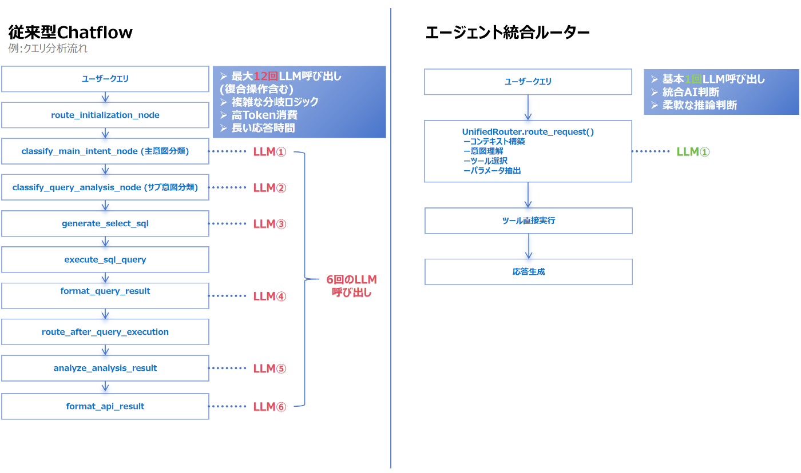
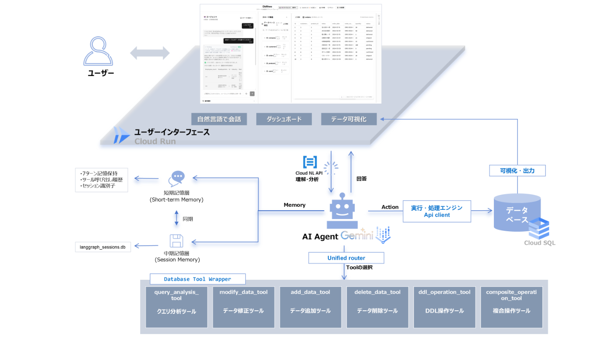

本記事は、Zenn主催「AI Agent Hackathon with Google Cloud」へのエントリープロダクトを紹介するものです。  
<https://zenn.dev/hackathons/google-cloud-japan-ai-hackathon-vol2>

##  はじめに

いまやデータドリブン経営は“掛け声”ではなく、  
**事業成長のコア** となっています。

しかし依然として次のような「あるある課題」が…。

  * **「IT未経験でSQLは難しい…」**
  * **「もっと速く・詳細に分析できれば」**
  * **「現場でデータを自分で操作したい」**

本記事では、  
**「誰もが直感的にデータを扱える世界」**  
を目指して開発した**Database AI Agent Platform「DbRheo」**の誕生背景・技術解説・今後のビジョンまで、開発者のリアルな視点で徹底解説します。

* * *

##  データ活用の“本当の壁”はどこに？

どの現場にも潜む“データ活用の壁”。  
とくに**中小企業・個人開発者・IT未経験チーム** ほど深刻です。

###  1\. リアルな課題

  * **属人化** ：「あの人しかSQL書けない」
  * **ボトルネック** ：ちょっとした依頼でもエンジニアの手が止まる
  * **機会損失** ：分析のリードタイムが長く、ビジネスチャンスを逃すことも
  * **DB拡張の難しさ** ：リスク判断が難しく、新しいカラム追加やテーブル設計の変更がハードルになりがち
  * **反復作業の負担** ：毎回似たような集計やデータ更新を手作業で繰り返し、非効率になりがち

> 「データ担当者が休むと仕事が止まる」「頼みたくても手間と時間がかかる」といった日常的な悩みも多いです。

###  2\. 既存ツールの「残念ポイント」

ツール | 強み | 限界・不満  
---|---|---  
BIツール | グラフ化・可視化に強い | 柔軟な集計/即時分析ができない、操作習得も必要  
DBクライアント | 生データ参照や直接編集に強い | SQL前提、現場にとっては「ハードルが高い」  
Text-to-SQL | 直感的な分析体験の一歩 | 文脈や複雑な業務には弱い、「さっきのデータ」等の理解不可  
  
> **エンジニアではないユーザーほど、“データ活用したくても手が出せない”状況が多発しています。**

* * *

##  私の課題意識 ―「誰でもデータを“自分で”操れる」

  * 個人開発・受託・スタートアップ複業など多様な現場で  
「もっとラクに・もっと安全に・もっと高速に」  
**データ活用できる仕組みを作りたい** と思うように

> **「データ民主化」こそAI時代の本質的なテーマ**

###  それを実現するとして【DbRheo】を設計しました。

* * *

#  DbRheoの全体像と目指す価値

##  DbRheoとは？一言で

> **「自然言語で指示すれば、プロのデータアナリストのように “考え”、 “選び”、 “動く” ―  
>  そんなAIエージェントデータベースPlatform」**

* * *

##  【DEMO動画 2K・4K視聴でお願いします！】

<https://youtu.be/w5_25383c7Q>

##  DbRheoが解決する“困りごと”

###  **業務シーンで、こんな価値が生まれます：**

####  ◯ 非技術スタッフが“自分で”データ抽出・集計

  * SQL不要・複雑な設定も不要
  * 「さっきの結果をもっと詳しく」など、会話ベースで深掘りOK
  * 急な分析依頼・商談前の確認が即対応できる

####  ◯ エンジニアの“DB操作・テスト工数”が激減

  * ダミーデータ・テストユーザー一括生成
  * ユーザー追加→編集→削除…といった**複数操作** も一発
  * エラー時は自動ロールバック、安全対策も

####  ◯ 個人開発者・スタートアップが“小回りの効くDB運用・拡張”を実現

  * 自分だけでテーブル設計やカラム追加、既存データの一括修正もラク
  * ダミーデータの生成や個別データの編集も自然言語でOK

* * *

##  【現場視点】具体的なシナリオ

###  1\. 営業部門の即席キャンペーン分析
    
    
    「今週のキャンペーン成果を部門別で分析し、グラフ化して」
    → 15秒以内に分析結果を可視化
    → 「先週と比較して」と深掘りも即レス
    

###  2\. QAエンジニアのテスト自動化
    
    
    「10人分の新入社員を“営業部”に追加、メールは自動生成で」
    → 全データ一括生成、SQL知識ゼロでテスト設計完了
    

###  3.個人開発者による小規模データベースの拡張・運用
    
    
    「'会員'テーブルに“誕生日”カラムを追加して」
    → リスク判断した上で、テーブル構造を変更、既存データも安全に維持
    

#  技術例

##  統合ルーターによるエージェントアーキテクチャの進化

従来型（ChatFlow）の課題は…

  * 複数段階の分類処理→**レスポンス遅延**
  * **運用コストUP & エラー連鎖**
  * LLM呼び出し多すぎ

**DbRheoの統合ルーターなら**

  * **全ての判断➝実行を1回-2回のLLM呼び出しで完了**
  * 状況理解・ツール選択・パラメータ抽出も一発
  * 「自律的に状況を把握し、推論→意思決定」するAIに進化  

* * *

##  6つの専門ツール（エージェント自律選択）

ツール名 | 主な役割  
---|---  
クエリ分析（`query_analysis_tool`） | グラフ生成・洞察・複雑クエリ  
データ修正（`query_analysis_tool`） | バッチ/曖昧指示の修正  
データ追加 （`query_analysis_tool`） | 関連データ付き自動挿入  
データ削除（`delete_data_tool`） | 安全判定＆バッチ削除  
DDL操作（`ddl_operation_tool`） | テーブル構造変更＆影響分析  
複合操作 （`composite_operation_tool`） | 多段階業務を自動フロー化  
  
* * *

##  プレースホルダーシステム — 複雑な関連操作も一発

  * `{{db(...)}}`：他テーブルからIDなどを自動取得

    
    
    {{db(SELECT id FROM customers WHERE name='田中太郎')}}
    

  * `{{random(...)}}`：ダミーデータやランダム値生成

    
    
    {{random(string)}}              // ランダムで文字列で生成
    {{random(integer(1000,9999))}} // 指定範囲の数値生成
    など
    

  * `{{previous_result[0].id}}`：前の操作結果を自動参照

    
    
    UPDATE users SET department = '開発部'
    WHERE id = {{previous_result[0].id}}
    

  * `{{new(...)}}`：新規作成レコードのIDを自動連携

    
    
     INSERT INTO orders (user_id, order_date) VALUES (5, NOW());
      INSERT INTO order_items (order_id, product_id, quantity)
      VALUES ({{new(orders.id)}}, 10, 2);
    

* * *

#  システムアーキテクチャ

ユーザーが自然言語で入力してから最終的なデータベース操作まで、DbRheoがどのように動作するかを示しています。  

* * *

#  機能例 — シナリオで体験！

##  1\. 代名詞&文脈理解

**ユーザー** ：「山田のデータを確認して」  
**→ システム** ：[山田情報表示、ID=1001]  
**ユーザー** ：「彼の給料を1万円上げて」

**DbRheoの理解プロセス：**

  * 対話履歴から"彼" = 山田として自動認識
  * 給与修正操作として判断し、modify_data_toolを選択
  * 安全確認後に実行

* * *

##  2\. 関連データの自動新規作成

**ユーザー** ：「佐藤さんの新しい注文を作成、商品はiPhone15」

  * 顧客・商品IDは自動取得
  * 注文番号も自動生成  
→ 一度の指示で関連データも全部処理！

* * *

##  3\. テストデータを一瞬で生成

**ユーザー** ：「営業部に新入社員5人追加、メールも自動で」

  * 特に指定なければ名前・メール・社員ID・給料まで全自動生成
  * フィールドに応じて現実的な値を出力

**実行結果例：**

  * 氏名：田中一郎、佐藤花子、鈴木太郎...
  * メール：tanaka_ichiro@company.com、sato_hanako@company.com...
  * 社員ID：SALES1247、SALES8832、SALES3456...
  * 給料：350,000、265,000、485,000..

* * *

##  4\. 業務フローまるごと自動化

**ユーザー** ：「新規ユーザー作成し、あとユーザーの部署変更、最後に30日以前のテストユーザー削除」

  * 一回の指示で複数工程を自動実行
  * 依存関係もプレースホルダーで全部自動解決

* * *

#  現在の課題と今後の展望

##  技術的なチャレンジと現状の課題

DbRheoはまだ開発初期の段階であり、さまざまな機能強化や最適化に日々取り組んでいます。  
現在も下記のような技術的課題に直面していますが、すべて「実用性・安全性・拡張性」を高めるための貴重なフィードバックと捉え、改善を進めています。

  * **操作履歴・ロールバック**  
一部の操作で履歴管理や完全なロールバックが不安定なケースがありますが、後方互換性を維持しつつ設計の見直しとリファクタリングを進行中です。

  * **多言語出力の一貫性**  
稀にAI応答で複数言語が混在することがあり、プロンプト設計と多言語コントローラーの改善を行っています。

  * **複合操作時のプレースホルダー制約**  
一部の複雑な業務フローでは、プレースホルダーの置換タイミングに制約があり、今後は分割実行と内部処理ロジックの最適化を検討しています。

  * **サポートDBの範囲**  
現状はMySQL/PostgreSQL/SQLiteなどRDBを中心にサポートしており、今後はより多様なDBとの連携も視野に入れています。

##  今後の改善計画

###  **短期（1ヶ月以内）**

  * 操作履歴/ロールバック機能の安定化とリファクタリング
  * 多言語応答の品質向上・統一
  * エラー検知・自動リカバリの強化
  * 新たなグラフタイプやデータエクスポート機能の追加

###  **中長期（3〜6ヶ月）**

  * **自己反省・再実行エージェント**  
操作失敗時に原因を自動分析し、最適な方法で再実行できる「自己改善型エージェント」機能の実装

  * **複数操作のシームレスなロールバック**  
連続的な複合操作でも、各ステップの状態を正確に管理・復元できる仕組み

  * **深層データインサイト/能動的な提案**  
エージェントが自らデータ異常や改善点を発見し、ビジネス上の最適解を提案できる機能の強化

  * **エンタープライズ向け拡張**  
マルチテナント対応、外部APIやBIツール連携、さらなるセキュリティ・権限管理の強化

* * *

##  技術進化のビジョン

DbRheoは「ツール活用のエージェント」から、  
**「現場のパートナーとして主体的に考え、意思決定・提案ができるエージェント」**への進化を目指しています。

また、将来的には

  * 複雑なビジネスロジックや分析を直感的に扱える「データ民主化」の実現
  * 誰でも“自分の業務に本当に役立つAI”を育てられるシステム構築

など、プロジェクトの成長と共に社会への価値提供を拡大していきます。

* * *

##  最後に

DbRheoはまだDEMO段階ですが、**「誰もがデータを活かせる世界」**のため、  
これからも進化し続けます。

> **もし気になること・使ってみたいシーン・技術的な質問があれば、ぜひコメントやフィードバックお待ちしています！**

* * *
