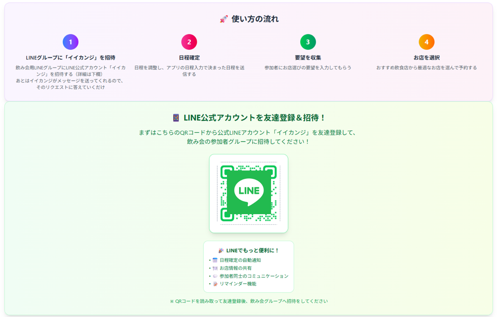
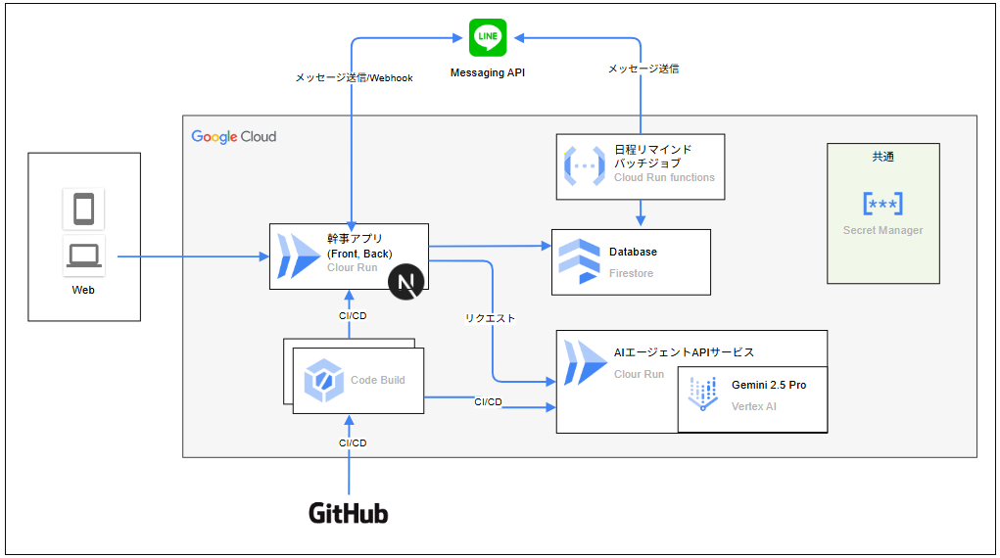
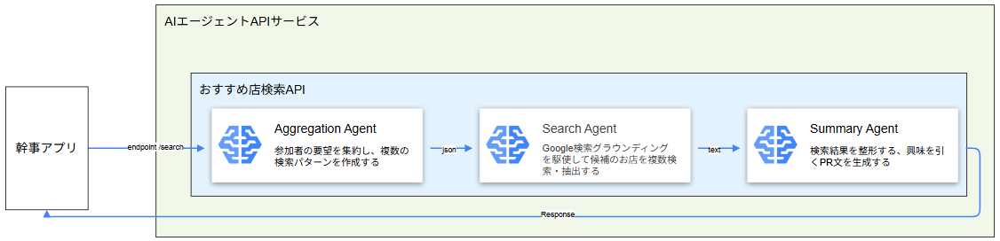

##  1\. 飲み会を楽しめない..幹事なんてやりたくなかった...

> !
> 
> この記事は「第2回 AI Agent Hackathon with Google Cloud」にエントリーのプロジェクト「イイカンジ」の紹介記事です！

「飲み会の幹事」、正直やりたくない…って思ったこと、一度はありますよね？

みんなの予定を聞いて、お店を何件も調べて、アレルギーや好き嫌いも確認して、やっと予約したと思ったらドタキャン連絡…。楽しいはずの飲み会が、いつの間にかめんどくさく感じてしまう。。

「みんなのために頑張ったのに、お礼の一言もない…」  
「良かれと思って選んだ店が、まさかの不評…」  
「ていうか、幹事の自分が一番楽しめてない！」

**この面倒で、プレッシャーで、ハッピーにならない『幹事』の仕事をゼロにして、  
飲み会をみんなでただ楽しめる『イベント』にできないか？**

そんな想いから、**自律型AIエージェントアプリ 「イイカンジ」** は生まれました。  
「みんなが楽しめるイベントこそ、最高の創造だ！」と信じてます！

* * *

##  2\. ソリューション：面倒ごとは「イイカンジ」に丸投げ！

「イイカンジ」は、ただのbotじゃありません。あなたの「みんなで楽しみたい！」っていう気持ちを汲んで、**いい感じに考えて、いい感じに動いてくれる、最高のいい幹事** なんです。

###  「イイカンジ」がいると、こんなにハッピー！

  * **お店選びのプレッシャーをゼロに！** ： お店選びは「イイカンジ」の責任！参加者はわがまま言い放題！お店が良ければみんなハッピー！逆にお店が微妙だったら、「イイカンジ」がサンドバックになりますww
  * **面倒なことは、ぜんぶイイカンジに丸投げ！** ： 日程調整からお店探し、リマインドまで、あなたは質問に回答するだけ。もう面倒な連絡はしなくてOK！
  * **参加者はいつものLINEでOK！** ： 参加者は新しいアプリを入れる必要なし。使い慣れたLINEで「イイカンジ」を利用できます。
  * **AIが最適なお店を提案！** : 幹事にとってお店選びが1番の悩みの種。イイカンジはみんなの要望を踏まえて、最善のお店をAIマルチエージェントで探し出します！

###  【デモ】「イイカンジ」が飲み会をセッティングする様子がこちら！

「イイカンジ」のいい感じの働きをご覧ください。  
<https://youtu.be/QzCYdFVwnyE>

  1. 幹事がWebで「〇〇会やろーぜ！」と参加者を登録。
  2. 「イイカンジ」をLINEグループに招待して、日程調整をスタート。
  3. 日程を回答したら「イイカンジ」が参加者情報と希望やわがままをみんなに質問！
  4. 希望を聞いたら、イケてるお店を複数提案！
  5. 幹事が予約を完了したら、「イイカンジ」が最終案内を全員に送信！
  6. 飲み会が近づくと「イイカンジ」が参加者にリマインド！

* * *

##  3\. イイカンジの仕組み

「イイカンジ」が、どのような技術的な仕組みで動いているのか、その裏側を詳しく解説します。

本サービスは、以下のアーキテクチャ図に示すように、大きく分けて2つのアプリケーションが連携して動作しています。

  * **幹事アプリ** : LINEを介したユーザーとのやり取りや画面表示を担当します。
  * **AIエージェントAPIサービス** : お店探しの頭脳として、最適な店舗を推薦します。

それぞれのアプリケーションについて、詳しく見ていきましょう。

###  幹事アプリ

ユーザーが直接触れるLINEの画面や、データベースとの連携、メッセージの送受信などを担うアプリケーションです。AIエージェントAPIサービスの呼び出しもここで行います。

####  1\. 技術スタック

幹事アプリは以下の技術で構築されています。

分類 | 使用技術 | 用途 | 選定理由  
---|---|---|---  
Frontend | Next.js | アプリ画面実装、入力 | 飲み会を盛り上げるための細かいUIを実装しやすいReactベースで実装できるため。  
Backend | Next.js | LINE Messaging APIを用いたメッセージ送受信、Webhook | APIルートやサーバー処理も同じフレームワークで一元管理でき、デプロイや保守が容易なため。  
DB | Firestore | LINEグループ情報やユーザーの画面入力情報、AIからのレスポンスを格納・管理 | 本サービスでは複雑なデータ操作が不要な一方、リアルタイム性やスケーラビリティが重要であるため。  
  
####  2\. 工夫した点・拡張性

ユーザー体験と将来の拡張性を高めるために、以下の点を工夫しました。

  * **必要な時に必要な操作だけを提供するUI/UX**  
一般的なWebアプリのような「ログイン → 一覧 → 詳細」という画面遷移をあえて採用せず、飲み会の準備段階やユーザーのアクションに応じて、**単一機能を持つ画面のURLを都度LINEで送信** する方式にしました。これにより、ユーザーは迷うことなく、その時に必要な操作（例：候補日時の入力、お店の要望入力）に集中でき、体験の最大化を目指しています。

  * **ステータス管理による高い拡張性**  
飲み会の準備状況を「ステータス」として管理し、そのステータスに応じてLINEで送るメッセージや表示する画面を切り替えています。この設計により、今回は実装を見送った「飲み会当日の二次会探し」や「飲み会後の割り勘精算」といった新たな機能も、新しいステータスを追加するだけで容易に拡張することが可能です。

###  AIエージェントAPIサービス

幹事アプリから受け取った要望をもとに、複数のAIエージェントを駆使して最適なお店を提案するREST APIサービスです。

####  1\. 技術スタック

AIの処理に特化した、以下の技術スタックを採用しました。

分類 | 使用技術 | 用途 | 選定理由  
---|---|---|---  
Google Cloud AI 技術 | Gemini API in Vertex AI, Google Gen AI SDK | AIエージェントの実装 | 最新の`gemini-2.5-pro`モデルを使って高性能なAIエージェントを実装できるため。  
Webフレームワーク | FastAPI | APIサービスの実装 | Google Gen AI SDKと親和性の高いPythonで実装できる。さらに高速性と非同期処理に優れ、ユーザーへの応答を迅速化できるため。  
  
####  2\. お店探しの精度を高める3つのAIエージェント

このサービスの最大の特徴は、3つの異なる役割を持つAIエージェントを直列に連携させることで、お店探しの精度を飛躍的に高めている点です。

協調型や階層型ではなく直列なマルチエージェント構成を採用したのは、**「お店の検索」には明確なステップがあり、一つ一つのステップで精度の高い処理をすることが、最終的な提案の質に直結する** と考えたからです。

各エージェントの役割をご紹介します。

##### 1\. Aggregation Agent（集約エージェント）

複数の参加者から寄せられた、時に相反する要望（例：「魚が食べたい」「肉がいい」）を分析し、全員が納得できそうな検索条件を1〜3パターン生成します。

  * **特徴** : 
    * 参加者全員の要望（予算、アレルギー、エリアなど）を統合的に分析し、バランスの取れた条件を複数提案します。
    * 出力形式をJSONスキーマで厳密に指定することで、後続の処理を安定させています。
  * **工夫点** : 
    * プロンプト内で「相反する要望がある場合はパターンを分ける」といった具体的な指示を与えることで、AIが人間のように柔軟な提案を生成できるように促しています。

##### 2\. Search Agent（検索エージェント）

集約エージェントが生成した検索条件に基づき、Google検索やGoogleマップといった現実世界の情報を活用して、条件に合致する飲食店を具体的に探し出します。

  * **特徴** : 
    * Googleのグラウンディング機能（Grounding）を活用し、Web上の最新情報や正確な位置情報に基づいた店舗をリストアップします。
    * 出力情報を「店名・駅・価格帯・特徴・マップURL・選定理由」といった必要最小限に絞り、後続の処理をシンプルに保ちます。
  * **工夫点** : 
    * あえてお店の特徴の出力形式を厳密に定めずテキスト形式にすることで、AIによる表現の幅を持たせ、より魅力的な店舗紹介文が生成されるようにしています。

##### 3\. Summary Agent（要約エージェント）

検索エージェントが見つけてきたWeb上のテキスト情報から、重要な情報を抽出し、ユーザーに響く魅力的なおすすめコメントを生成します。最終的にこのエージェントが整形した情報が、幹事アプリに返却されます。

  * **特徴** : 
    * 検索テーマやお店の雰囲気を踏まえた、気の利いた紹介コメント（`summary`）をAIが自動生成し、ユーザーが「ここ、いいね！」と思えるような楽しいお店選びをサポートします。
  * **工夫点** : 
    * AIの出力形式が時として揺れることを想定し、辞書型(`dict`)やリスト型(`list`)のどちらで返ってきても、柔軟にパースできる処理を実装しています。

####  おまけ：Cloud Run functions によるリマインド機能

幹事のうっかり忘れを防ぐため、Cloud SchedulerとCloud Run functionsを連携させ、飲み会の日程が近づくと自動でリマインドメッセージを送信する機能を実装しました。

この機能では、特にFirestoreの利用コストを抑えるための最適化を行っています。

  1. **効率的な読み取り** : `status: "pending"`というフィールドを設け、リマインド未送信の飲み会のみをクエリ対象とします。送信後はステータスを`sent`に更新することで、不要なデータの再読み込みを防ぎます。
  2. **データ量の最小化** : 全データを取得するのではなく、`where("remindBefore", "==", 1)`のようにリマインド対象日を絞り込んだり、取得するフィールドを「会議日程」と「LINEグループID」のみに限定したりすることで、読み取りデータ量を最小限に抑えています。

これらの地道なコスト削減の工夫が、サービスの持続可能性を高めています。

* * *

##  4\. 将来、「イイカンジ」は調整を通じて、世界をいい感じにします！

「イイカンジ」の挑戦は、飲み会の連絡だけでは終わりません。

###  飲み会の「予約」「精算」などをまるっと引き受けます！

現状の「イイカンジ」は、人間の幹事が予約や精算などのタスクをする必要があります。  
手間がかかり、センシティブなお金回りもアップデートした「イイカンジ」は取りまとめて、幹事の仕事をゼロに。ただ飲み会を楽しむことだけに集中できます！

###  みんなで「イイカンジ」にフィードバック。「イイカンジ」がクチコミ投稿！

今のクチコミは1人だけの感想。「イイカンジ」は複数人からの感想をまとめて、信ぴょう性のある口コミを可能にします。  
飲み会でそのお店を使うならどうか、何人くらいでどのようなものを楽しめるか、今までなかった体験を知ることができるようになります。

###  「調整ごと」のマーケットプレイス

最終的な野望は、「イイカンジ」の仕組みを応用して、世の中のあらゆる「調整ごと」を自動化するプラットフォームを作ることです。

  * **用途を拡大！：** 飲み会だけじゃなく、旅行の計画、会議の日程調整、なんでもござれ！
  * **プロンプトを売買！：** 「旅行計画に特化したプロンプト」とか「会議調整の神プロンプト」を、みんなで作って共有・販売できるマーケットプレイスを作れるかも！
  * **会社でも大活躍！：** Slackと連携して、社内の面倒なMTG設定やイベント調整を全部自動化するSaaSビジネスも夢見ています。

* * *

「イイカンジ」は、あなたの「面倒くさい」を「楽しい」に変え、調整を通じて世界を「いい感じ」にするAIエージェントアプリです。

第2回 AI Agent Hackathon with Google Cloud：<https://zenn.dev/hackathons/google-cloud-japan-ai-hackathon-vol2?tab=overview>
