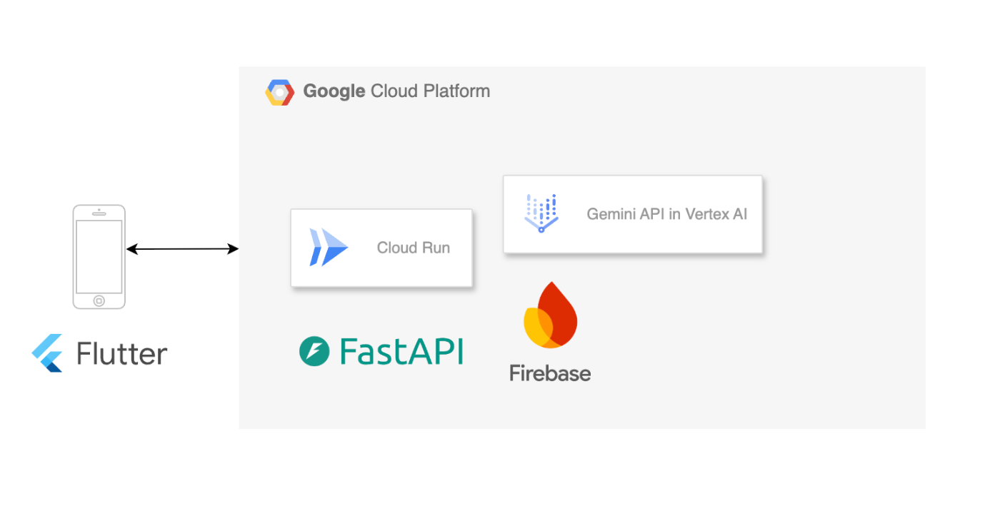

#  プロジェクト概要

MaisokuAI（まいそくAI）は、AI技術を活用して住まい選びをサポートする不動産分析アプリです。

町の不動産屋さんに貼っている物件の図面をよく見かけます。気になる物件があっても、お店に入るのが少し億劫だったり、営業時間外だったり、単純に時間がなかったりすることはありませんか？

MaisokuAIは、そのチラシを写真に収め、自分の好みに合わせてAIに解説してもらうアプリです。お店に入るのが少し億劫でも気になるチラシがあったら、まずは写真に収めてみましょう。

従来の不動産情報だけでは分からない物件の詳細な特徴や周辺環境を、最新のAI技術で分析し、ユーザーの理想の住まい探しをサポートします。

<https://youtu.be/NFndXQlQFxE>

##  なぜMaisoku AIが必要なのか

不動産選びは人生における重要な決断の一つです。しかし、現在の不動産情報には以下のような課題があります。

**情報の断片化** : 物件の基本情報、周辺環境、交通アクセスなど、必要な情報が複数のソースに散らばっている

**専門知識の壁** : 不動産の専門用語や建築的な知識がないと、本当の価値を判断できない

**時間的制約** : 不動産屋の営業時間内に訪問する必要があり、忙しい現代人には負担

**主観的な情報** : 営業担当者の主観的な説明に依存し、客観的な分析が不足

MaisokuAIは、これらの課題をAI技術で解決し、誰でも手軽に質の高い不動産分析を受けられるサービスを目指しています。

#  対象ユーザー像と課題

##  ターゲットユーザー

  * **20-40代の住まい探し中の方** : 初回購入者から住み替えを検討している方まで
  * **不動産投資を検討している方** : 投資価値の客観的な判断材料を求める方
  * **転居や住み替えを予定している方** : 転勤や家族構成の変化に伴う住まい探し
  * **視覚障害者や高齢者** : 音声読み上げ機能でアクセシビリティに配慮したサポート

##  解決すべき課題

###  1\. 情報収集の非効率性

現在の不動産情報収集は、複数のWebサイト、不動産屋への訪問、現地確認など、多くの時間と労力を要します。特に忙しい現代人にとって、限られた時間で効率的に情報を収集することは大きな課題です。

###  2\. 専門知識の不足

建築構造、法的制約、市場価値など、不動産に関する専門知識がないと、本当に良い物件かどうかを判断することは困難です。多くの人が感覚的な印象で決断してしまい、後で後悔するケースも少なくありません。

###  3\. 生活利便性の把握困難

実際に住んでみないと分からない生活利便性や交通アクセスの実用性は、物件選びの重要な要素です。しかし、これらの情報を事前に正確に把握することは困難でした。

###  4\. アクセシビリティの問題

視覚障害者や高齢者にとって、従来の不動産情報は文字情報に依存しており、十分にアクセシブルではありませんでした。

#  特徴

自分の好みを反映させて、AIに物件情報を読み取らせることによって、不動産屋に問い合わせる前に自分好みの物件なのかどうかをある程度把握できるようになっています。

##  AI物件分析機能

###  高度な画像認識技術

MaisokuAIの核となる機能は、Vertex AI(Gemini)を活用した高精度な画像分析です。カメラで撮影した物件チラシや図面を瞬時に解析し、以下の情報を自動抽出します。

  * **間取り情報** : 部屋数、各部屋の配置、動線の効率性
  * **建物の状態** : 築年数、外観の状態、設備の新しさ
  * **設備詳細** : キッチン、バスルーム、収納スペースなどの充実度
  * **投資価値分析** : 立地条件、将来性、リスク要因の総合評価

###  パーソナライズされた分析

ユーザーの個人的な好みや条件（家族構成、ライフスタイル、予算など）を学習し、それに基づいてカスタマイズされた分析結果を提供します。同じ物件でも、ユーザーによって異なる視点から評価されます。

##  AI エリア分析

###  包括的な周辺環境分析

住所や駅名を入力するだけで、以下の要素を統合的に分析します。

  * **交通利便性** : 最寄り駅までの距離、乗り換え回数、主要都市部へのアクセス時間
  * **生活施設** : スーパー、病院、学校、公園などの充実度と距離
  * **治安情報** : 犯罪統計、街の雰囲気、夜間の安全性
  * **将来性** : 再開発計画、人口動態、地価動向

##  アクセシビリティ機能

###  音声読み上げ機能

Flutter TTSを活用し、分析結果を自然な音声で読み上げます。視覚障害者の方でも、詳細な物件情報を音声で把握できます。

###  テキストコピー機能

分析結果をクリップボードに保存し、他のアプリケーションと共有できます。家族や友人との相談時にも便利です。

###  ユニバーサルデザイン

大きな文字、高コントラスト、直感的なUI設計により、高齢者の方でも使いやすいインターフェースを実現しています。

#  システムアーキテクチャ

##  技術スタック詳細

###  フロントエンド層

  * **Flutter 3.29+**

###  バックエンド層

  * **FastAPI** : 高性能なPython Webフレームワーク
  * **Cloud Run** : Google Cloudのサーバーレスコンテナ実行環境

###  AI・機械学習層

  * **Vertex AI(Gemini)** : Googleの最新マルチモーダルAI
  * **画像認識** : 物件写真からの情報抽出
  * **自然言語処理** : 分析結果の自然な日本語生成
  * **リアルタイム推論** : 高速なAI分析レスポンス

###  データ・認証層

  * **Firebase Authentication** : セキュアなユーザー認証システム
  * **Firestore** : NoSQLリアルタイムデータベース

##  段階的認証システム

MaisokuAIは、ユーザーのプライバシーを重視した段階的な認証システムを採用しています：

###  基本分析モード（認証不要）

  * 物件の基本的な分析機能
  * 一般的な周辺環境情報の提供
  * 誰でも気軽に利用可能

###  個人化分析モード（ログイン時）

  * ユーザーの好みに合わせたパーソナライズ分析
  * 過去の分析履歴の保存・参照
  * より詳細で専門的な分析結果

この設計により、初回ユーザーでも気軽に試用でき、継続利用時にはより高度な機能を体験できます。

#  今後の展望

##  短期的な改善計画

###  1\. Android版の開発

現在iOS版のみですが、Android版の開発により更なるユーザー拡大を目指します。

###  2\. 分析精度の向上

より多くのデータを学習することで、AI分析の精度を継続的に改善します。

###  3\. 新機能の追加

  * 価格予測機能
  * 近隣物件との比較機能
  * 投資シミュレーション機能

##  長期的なビジョン

###  1\. 不動産業界のDX推進

MaisokuAIを通じて、不動産業界全体のデジタル変革を促進し、より透明で効率的な市場の実現を目指します。

###  2\. グローバル展開

日本で培った技術とノウハウを活かし、海外市場への展開も視野に入れています。

###  3\. 不動産エコシステムの構築

物件分析だけでなく、契約、管理、売却まで、不動産に関わる全プロセスをサポートするプラットフォームの構築を目指します。

#  まとめ

今回初めてgeminiを触ってみましたが、精度が高く、料金も安いので使いやすいなと思いました。  
もう少し独自のデータを組み合わせてみて、よりユーザーの好みに沿ったり、過去どのような判断をしてきたのか、どのような好みに変化していったのかも可視化できれば自身に対する振り返りにもなるかなと思います。  
実装自体はギリギリになってしまったのを反省して次回もし機会あればまた参加させていただきたいなと思います^^
