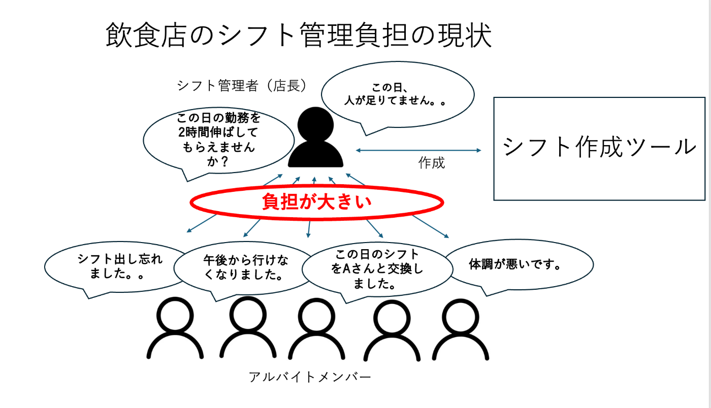
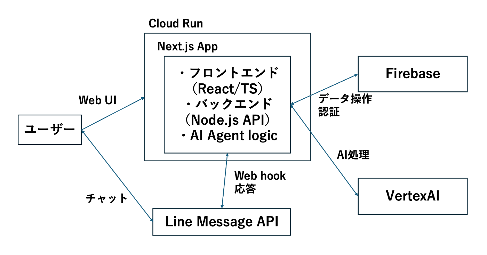

##  はじめに

飲食店の現場では、店長の労働負担が深刻化しています。中でも、日々の「シフト管理」は、店長の大きな重荷となっています。慢性的な人手不足に加え、時間帯によって変動する人員需要。この二重苦の中で、アルバイト・パート主体でのシフト作成は、店長にとって大きな負担です。

これまでにも、シフト管理の効率化を目指すサービスは多数登場してきました。これらのサービスは、従業員からのシフト希望の収集や、自動でのシフト表作成といった工程を共通してサポートしています。

しかし、既存の多くのサービスが解決できていない「現場の壁」があります。それは、初回に集まる希望シフトだけでは完璧なシフト表が組めることは稀であり、不足したシフト枠の募集が避けられないからです。さらに、全体募集だけでは埋まらない場合、最終的には店長が一人ひとりの従業員に直接声かけし、個人的な調整に奔走することでシフトを完成させているという現実です。

この「個別調整のためのコミュニケーション負担」こそが、店長の時間と精神をすり減らす要因となっているのです。

そこで、今回この問題を解決するためのシフト管理AIアプリ「シフ長」を提案します。

シフト管理AIアプリ「シフ長」は、従来のシフト希望収集やシフト表の自動作成といった機能に加え、AI（シフ長）が店長の代わりとなり、不足したシフト枠の募集や、従業員への個別調整をチャット形式で自動的に行い、シフト管理の全工程をサポートする画期的なサービスです。

##  プロジェクト概要

###  対象ユーザーと抱える課題

**対象ユーザー：**

  * **アルバイト・パート主体でシフトを運用している店舗**
  * **慢性的な人手不足に直面し、従業員からの希望シフトだけでは最適なシフト表が作成できない店舗**

**課題：**  
従来のシフト管理サービスは、あくまで「従業員から希望シフトが集まれば、あとは自動で組める」という前提に立って設計されています。しかし、実際の飲食店現場では、以下のような根深い課題が存在します。

  * **コミュニケーションの壁と店長の属人化された負担：**  
希望シフトだけで完璧なシフト表が組めることは稀であり、不足したシフト枠の補充が頻繁に発生します。既存サービスではこの追加募集を全体に呼びかける機能に留まることが多く、最終的には店長が一人ひとりの従業員に直接声かけし、個別の事情を考慮しながら調整に奔走する状況です。
  * **店長の多岐にわたる業務：**  
店長は、店舗運営においてスタッフ業務、採用活動、事務作業、売上管理など、シフト作成・調整以外にも膨大な業務を抱えています。そのため、シフト調整に十分な時間を割くことができず、精神的・時間的な負担が蓄積されています。

###  ソリューションと特徴

これらの課題に対し、私たちはシフト管理AIアプリ「シフ長」を開発しました。

「シフ長」は、従来のシフト管理サービスが提供する「希望シフトの収集」や「シフトの自動作成」といった基本機能に加え、以下に示すAIエージェント機能と連携することで、店長のシフト管理負担を劇的に軽減し、コミュニケーションの質を高めます。

  1. **不足枠の自動募集：**
     * シフトに不足が生じた場合、「シフ長」が自動でアルバイト全体に不足枠を募集します。
  2. **パーソナライズされた個別調整：**
     * アルバイトからの追加出勤や欠勤の依頼に対し、「シフ長」が個人に合わせてチャットで対応します。
     * 「シフ長」が不足しているシフト枠の依頼や、急な欠員への対応を、各アルバイトメンバーの状況（過去の会話、勤務実績、希望傾向など）に応じてパーソナライズされたメッセージで連絡します。
  3. **チャットを通じたシフト変更の自動反映：**
     * アルバイトメンバーとのチャットでのやり取りで合意されたシフト変更（追加出勤、欠勤、時間変更など）を、「シフ長」が自動的にシフト表に反映させます。
  4. **管理状況の定期報告：**
     * 「シフ長」がシフトの管理状況や進捗（募集状況、調整の進捗など）を店長に定期的に報告し、店長は全体の状況を簡単に把握できます。

##  システムアーキテクチャ

「シフ長」は、最新のクラウド技術とAIを組み合わせることで、高機能かつスケーラブルなサービスを実現しています。主要なコンポーネントは以下の通りです。

**主要コンポーネント：**

  * **フロントエンド：** TypeScript, React (Next.jsのクライアントコンポーネント) 
    * 店長、アルバイトメンバーが直接操作するWeb画面を構築。
  * **バックエンド：** Node.js (Next.jsのAPIルート), Firebase 
    * **Node.js (Next.js APIルート):** LINE Webhookの受付、Vertex AIとの連携、Firebaseからのデータ操作など、サーバーサイドのロジックを実行。
    * **Firebase:**
      * Firestore: シフトデータ、ユーザーデータ、ルール設定など、アプリケーションの永続的なデータストアとして利用。
      * Firebase Authentication: ユーザー認証機能を提供。
  * **AIモデル：** Vertex AI(gemini-2.5-flash) 
    * Google CloudのVertex AI上で稼働するGeminiモデルを活用し、シフトの自動生成や個別調整における高度なAI処理を実現。
  * **外部API：** Line Message API 
    * LINEユーザーとのチャットインターフェースを提供。メッセージの送受信やWebhookの連携を担う。

##  デモ動画

<https://youtu.be/PPQwGtQstP0>

##  その他

**技術的実装の特徴と工夫**

「シフ長」の開発において、限られた時間で最大の効果を生み出すため、以下の技術的工夫を施しています。

**モノリスアーキテクチャによる迅速な開発**  
従来のマイクロサービス構成ではなく、Next.js 14のApp Routerを活用したモノリス構成を採用しました。これにより、フロントエンド・バックエンド・API連携を単一のコードベースで管理し、開発効率を大幅に向上させています。Google Cloud Runの単一コンテナデプロイにより、インフラ管理の複雑さも解消しています。

**AIエージェントの高度な文脈理解**  
Google Vertex AIのGemini 2.5 Flashを活用し、単なるチャットボットではなく、個人の勤務履歴、過去の調整パターン、希望傾向を学習・記憶するパーソナライズされたAIエージェントを実現しています。従業員一人ひとりに最適化されたコミュニケーションにより、円滑なシフトの調整を目指します。

**リアルタイム連携システム**  
LINEチャットでの合意内容が即座にFirestoreデータベースに反映され、Web管理画面にリアルタイム更新される仕組みを構築しています。店長は常に最新のシフト調整状況を把握でき、必要に応じて手動介入も可能です。

**MVP版で実装する機能：**

  1. **基本シフト管理機能**

     * シフト希望の入力・収集システム
     * AIによる自動シフト表生成
     * 管理者による手動調整機能
  2. **AI調整エージェント（コア機能）**

     * 人員不足時間帯の自動検出
     * LINEチャットによる個別調整依頼
     * 合意内容の自動シフト表反映

**今後の拡張予定機能：**

  3. **高度な分析・予測機能**

     * 過去データに基づく人員需要予測
     * 従業員の出勤パターン分析
     * 最適なシフト提案アルゴリズム
  4. **マルチ店舗対応**

     * 複数店舗での一元管理
     * 店舗間スタッフ応援システム
     * 本部管理機能

**市場優位性と差別化要因**

既存のシフト管理サービスとの比較において、「シフ長」が持つ決定的な差別化要因：

**従来サービスの限界**

  * シフト希望収集と自動生成までで機能が終了
  * 人員不足時の対応は手動に依存
  * 一斉通知による画一的なコミュニケーション

**「シフ長」独自の価値**

  * AIによる個別最適化されたコミュニケーション
  * リアルタイムでの自動調整・シフト反映
  * 店長の「属人的な調整業務」を完全にAI化

これにより、単なる「ツール」ではなく、店長の「デジタル分身」として機能する革新的なサービスを実現しています。

**技術選定の合理性**

**Google Cloudエコシステムの活用**  
Firebase、Vertex AI、Cloud Runを統合利用することで、認証・データベース・AI・インフラをシームレスに連携。開発・運用コストを最小化しながら、エンタープライズグレードのスケーラビリティを確保しています。

**LINE Messaging APIの戦略的選択**  
日本の飲食店アルバイト・パートの多くが利用するLINEを基盤とすることで、新たなアプリインストールが不要。導入障壁を極限まで低減し、即座に利用開始できるUXを実現しています。

**Next.js 14 App Routerの採用**  
最新のReact Server Componentsにより、SEO対応・パフォーマンス最適化・TypeScript型安全性を同時に実現。将来的なPWA化やモバイルアプリ展開への道筋も確保しています。

**まとめ**

「シフ長」は、飲食店経営における最も深刻な課題の一つである「シフト管理の属人化」を、最新のAI技術によって根本的に解決する革新的なサービスです。

単なるデジタル化ではなく、店長の「思考プロセス」と「コミュニケーション能力」をAIが学習・再現することで、真の意味での業務効率化を実現します。短期間のハッカソン開発でありながら、実用的なMVPの構築と将来的なスケーラビリティを両立させた、技術力とビジネス洞察力を融合したプロダクトです。

現場の課題に真摯に向き合い、技術の力で働く人々の負担を軽減し、より良い職場環境を創造する。それこそが「シフ長」プロジェクトの使命であり、このハッカソンを通じて実現したい未来の姿です。

* * *

**プロジェクト情報**

  * **開発期間** : 2週間（ハッカソン）
  * **チーム規模** : 6名
  * **技術スタック** : Next.js 14, Firebase, Vertex AI, LINE Messaging API, Google Cloud Run
  * **リポジトリ** : <https://github.com/akitozizi818/shift-management-ai>
  * **デモサイト** : <https://shift-management-prod-444098581966.asia-northeast1.run.app/>

