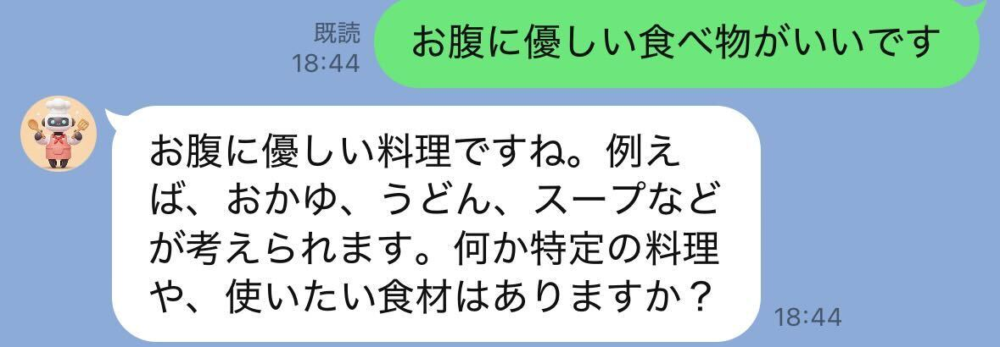
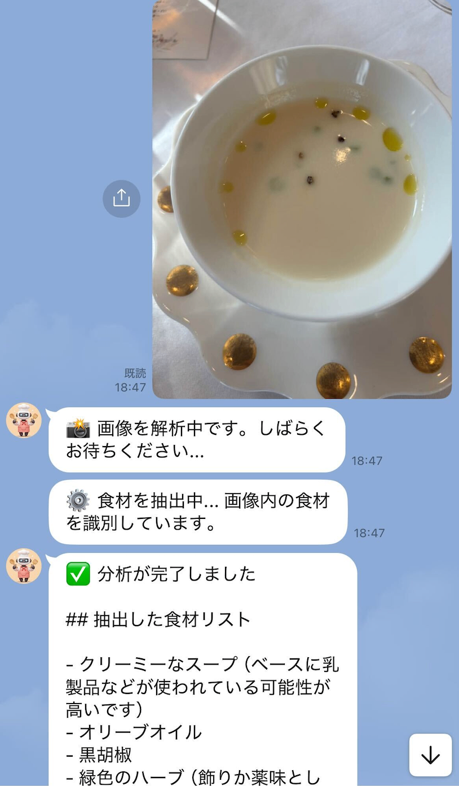
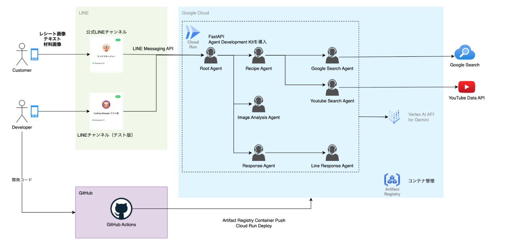

#  「ごはん何作ろう問題」にAIが壁打ち！AI×LINE×YouTubeで解決するボット開発

##  概要

「今日のごはん何作ろう…」  
これは、毎日のように繰り返される主婦、主夫や一人暮らしの人の永遠の悩みです。

そんな悩みを解決するために、ハッカソンで開発したのが、  
**LINEで料理を相談できて、YouTube検索やパーソナライズもできるAIレシピ提案Bot** です。

<https://youtu.be/vLu2Dckv7gQ>

* * *

##  課題背景

毎日の「ごはん、何作ろう…」という悩みは、多くの家庭で発生しています。  
特に忙しい平日の夕方、こんな声が聞こえてきます。

  * 冷蔵庫に食材はあるのに、どの組み合わせで何が作れるか分からない
  * 「昨日カレーだったしなぁ…」と、メニューがマンネリ化している
  * 家族の「これ嫌い」「またこれ？」という反応が不安で、選ぶのがストレス
  * レシピサイトは情報が多すぎて、どれを選べばいいか迷ってしまう
  * スマホで検索しても、調理時間や材料が合わずに結局作らないことも…

SNSやレシピサイトも便利ですが、もっと**カジュアルに相談できて、好みに寄り添ってくれる存在** がいれば…  
そこで誕生したのがこのBotです。

* * *

##  どんなBot？

簡単に言えば、**LINEで話しかけると、AIがあなたに合ったレシピを提案してくれるBot** です。  
ここでは、主な特徴を3つ紹介します。

###  特徴1：AIによるレシピ提案・壁打ち相談

「晩ごはん何にしようかな…」という何気ないつぶやきにも、Botがすぐ反応。  
「冷蔵庫に何がある？」「和風がいい？洋風？」など、**まるで友だちと雑談するような感覚でメニューを一緒に考えてくれます。**

裏ではGoogle検索やYouTube検索も活用して、**信頼性の高いレシピ情報を自動で集約・提案** してくれるため、アイデアの幅が広がります。

> 🗣️「ひき肉とキャベツあるんだけど…」  
>  🤖「ロールキャベツ、そぼろ丼、メンチカツ風キャベツ炒め…どれがいい？」

* * *

###  特徴2：パーソナライズされた提案

Botは、ユーザーの好みや過去のやりとりを記憶。  
そのため、「嫌いな食材を避ける」「最近よく作っている料理は除く」「カロリー控えめを優先」など、提案内容がどんどんパーソナライズされていきます。

> 例：「前回ヘルシーな料理を選んだので、今回は低糖質レシピを優先表示」

会話を重ねるほど、あなた専用の“味の好みを理解したレシピアドバイザー”に進化します。

* * *

###  特徴3：写真1枚でレシピ提案！画像からのメニュー連携

「これ作ってみたい！」という料理写真や、スーパーのレシートをBotに送るだけでOK。  
**画像から自動で食材を読み取り、そこに合ったレシピや類似の料理動画を提案** してくれます。

たとえば…

  * レシートから読み取った食材だけで作れる料理を複数ピックアップ
  * 撮った料理写真をもとに、**似たYouTubeレシピ動画を検索・表示**

言葉にしづらい料理イメージも、**視覚情報から直感的に相談できる** のが魅力です。  
**見せるだけで使えるアシスタント** だから、忙しいときでも頼りになります。

> 🧾📸「買い物帰りにレシートを撮影」  
>  🤖「冷蔵庫の材料だけで作れる5つのレシピを提案！」

> 📷「SNSで見た料理の写真を送信」  
>  🤖「似た動画レシピはこちらです！」

* * *

##  技術構成

  * **LINE Messaging API**  
ユーザーとBotのインターフェース。LINE上でのメッセージ送受信を実現。  
利用者が普段使い慣れたLINEから手軽にアクセスできるのが強み。

  * **Vertex AI（Gemini）**  
ユーザーとの自然な対話やレシピ提案に使用。文脈理解と創造的な応答を生成。  
複雑な会話でも意図をくみ取り、柔軟な返答が可能。

  * **YouTube Data API**  
レシピに関連する動画を自動検索・取得し、提案に活用。  
ビジュアルで手順が確認できることで、ユーザーの理解をサポート。

  * **Cloud Run**  
APIロジックを動かすサーバーレス実行環境。スケーラブルかつ運用コストを最小化。  
トラフィックに応じて自動でスケールし、小規模から大規模まで柔軟に対応。

  * **Agent Development Kit（ADK）**  
Geminiベースの会話型エージェントの構築に使用。複数のツール連携やマルチターン対話を制御。  
料理提案や動画検索など、複数機能を一つの対話に統合できる。

【構成図】  

* * *

##  ハッカソンで工夫したポイント

  * タスク単位でエージェントを分割（ADK活用）  
GeminiベースのAgent Development Kit（ADK）を活用し、  
「食材ヒアリング」「レシピ生成」「動画検索」といったタスクごとにエージェントを分離。  
会話の流れが整理され、処理の失敗や誤応答を抑える構成にしました。

  * プロンプトの細分化とトーン設計  
ユーザーの「相談しやすさ」を意識し、状況に応じてプロンプトを細かく設計。  
たとえば、迷っている時は選択肢を提示、決まってきたら肯定的な返しで背中を押すなど、  
壁打ちアシスタントとして自然な会話体験を目指しました。

  * UIにLINEを採用し、直感的な操作を実現  
ユーザーの多くが慣れ親しんだLINEをインターフェースに採用。  
Flex Messageを活用し、「料理ジャンル」「調理時間」などでレシピを絞り込みできるUIを実装。  
手軽さと視認性を両立し、非エンジニアでも迷わず使える設計にしました。

* * *

##  今後の展望

  * アレルギー・宗教的制限への対応強化  
ユーザーのアレルギー情報や宗教的制限（例：グルテンフリー、ハラールなど）を記録し、  
該当する食材や料理を自動的に除外する仕組みを導入予定。  
Flex Message による食材チェックリストUIの設計も視野に入れています。

  * 数日分の献立をまとめて提案  
単発レシピに加え、数日分のバランスの取れた献立（例：3日分の夕食メニュー＋買い物リスト）を一括提案するモードを検討中。  
ユーザーのライフスタイル（共働き・単身など）に応じて最適化。  
Flex Messageで日付別表示、GCS連携による一括画像保存などと組み合わせることで実現を目指します。

  * レシピ動画・情報ソースの多様化  
現在はYouTubeを中心に動画を取得していますが、今後は複数の料理系動画プラットフォームやレシピAPIとの連携を予定。  
GeminiのImagen 4や Veo 3 を活用し、料理動画の要約・難易度分類・手順の分解なども可能にし、よりスムーズな体験を提供します。

  * 家にある食材から逆引きレシピ提案  
ユーザーが冷蔵庫の残り物や買い置き食材を入力するだけで、それらを活用したレシピを提案する機能を追加予定。  
入力は手動だけでなく、画像認識や音声入力にも対応することを検討中。Flex Messageを用いた食材選択UIと連携し、スムーズな体験を目指します。

  * 好みや評価に応じたパーソナライズ強化  
過去の提案に対するリアクション（👍/👎など）や、ユーザーの食の好み（辛さ、甘さ、ボリューム感など）を学習し、より精度の高いレシピ提案を行う機能を準備中。  
LINE上での簡易アンケートやレコメンド理由の表示も取り入れ、納得感ある提案を実現します。

  * 手持ち調味料データベースによるアレンジ最適化  
ユーザーごとに所有している調味料をデータベース化し、レシピの味付けやアレンジをその範囲で最適化する仕組みを導入予定。  
新しい調味料を必要とする場合には、代替案を提案したり、購入を促すような通知も実装可能です。Flex Messageによる「ある／ない」選択UIや、更新のしやすさも重視しています。

  * Google Maps連携による買い物最適ルートと価格提案  
買い物リストをもとに、近隣のスーパーやドラッグストアの特売情報を取得し、Google Mapsと連携して「どこで何を買えばよいか」「効率よく回るルート」などを提案する機能を検討中。  
今後はレシピ提案と地図上の買い物体験をシームレスにつなげることで、「考える手間」と「買い物の無駄」を一括で削減します。

* * *

##  まとめ

毎日の料理に悩む人にとって、「ちょっと相談できる存在」がそばにいるだけで、気持ちがぐっと楽になります。  
このBotは、まさに“壁打ち相手”のように、ユーザーの気持ちに寄り添いながら、レシピを一緒に考えてくれる存在です。

LINEで気軽に話しかけるだけで、食材からメニューを考えたり、レシピ動画を見つけたり。  
会話を重ねるほどに好みを学習し、あなた専属の料理アシスタントへと進化していきます。

今後も、献立の提案や食の制限対応、動画分析などの機能をさらに強化し、  
もっと自然に、もっと頼れるパートナーとして日々の食卓を支えていきます。

* * *

##  おわりに

Botのデモ体験やソースコードの一部は後日GitHubに公開予定です。  
ぜひ、使ってみた感想や「こんな機能がほしい！」などご意見いただけると嬉しいです！
