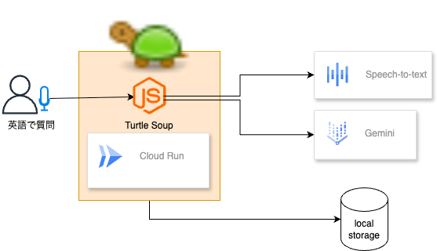

この記事は第2回 [AI Agent Hackathon with Google Cloud](https://zenn.dev/hackathons/google-cloud-japan-ai-hackathon-vol2)提出用の記事です。

##  実際のアプリ動作

<https://www.youtube.com/shorts/g6VfJsVXCL4>

##  リンク

URL：<https://turtle-soup-47osjzu5qq-an.a.run.app/>

##  はじめに：英語で謎を解く、ちょっと変わったAI体験

英語を勉強しようと思って、英単語アプリを開いて3日坊主になった経験はありませんか？  
私たちも、そんな一人です。

今回のハッカソンで私が作ったのは、**「勉強としての英語」ではなく「英語で遊ぶ」**ことを目的としたAIエージェントです。

その名も、**ウミガメのスープ × 英語 × 音声入力 × AI** 。

聞いただけで少しカオスですが、一言でいえば「英語でウミガメのスープ（水平思考クイズ）を楽しめる音声インタラクティブAIゲーム」です。

* * *

##  何を作ったのか？

開発したのは、英語で出題される「ウミガメのスープ」クイズを、音声を通じてAIと一緒に解き明かしていく、1人用のインタラクティブゲームエージェントです。

  * 英語で提示される不思議なストーリー（水平思考クイズ）
  * プレイヤーは音声でAIに質問を投げかける（Yes/No形式）
  * 最大10回の質問で真相にたどりつくことを目指す
  * ヒントとして関連する英単語を2つAIが提示
  * 最後にはAIが英語で正解とその背景を説明

ただし、**このゲームの目的は「正解すること」ではありません** 。

**英語を使ってAIとやりとりしながら、問いかける・考える・つながることそのものを楽しむ** 体験を提供することを意識しています。

* * *

##  なぜこのアイデアなのか？

きっかけは、英語学習のモチベーションの低下でした。

英語学習というと、多くの人が「単語帳をめくる」「文法問題を解く」といった形式的な勉強を思い浮かべると思います。でもそれって、どこかで「やらなきゃいけない」と義務的に感じてしまいがちです。

そこで私たちはこう考えました：

> **「英語を学ぶためにゲームをする」のではなく、「ゲームをするために英語を使う」構造にすれば、自然と英語が身につくのでは？**

英語は目的ではなく、**何かを達成するための手段** に変わる。  
これは語学習得の本質でもありますし、AIを介した体験だからこそできる挑戦だと思いました。

* * *

##  ウミガメのスープ × 英語 × AI の魅力とは？

###  ウミガメのスープとは？

水平思考（Lateral Thinking）クイズとも呼ばれ、**一見不条理に見えるストーリーの裏にある真相を、質問を通じて探るゲーム** です。

AIは出題者として、あらかじめストーリーと答えを保持しています。  
プレイヤーはYes/Noで答えられる質問を英語で投げ、真相に迫っていきます。

このジャンルは元々、**推理力や論理的思考を刺激する遊び** として人気があります。  
今回はそこに「英語」と「音声入力」、そして「AI」を組み合わせることで、教育とエンタメを融合した新しい体験を目指しました。

* * *

##  遊び方の流れ

  1. AIが英語で問題を出題します
  2. プレイヤーはマイクに向かって英語で質問をします（最大10回）
  3. AIはYes/Noで返答しつつ、ヒントとして英単語を提示してくれます
  4. プレイヤーは推理を重ねて真相に迫ります
  5. 最後にAIが答えとその背景を英語で説明してくれます

###  例題：

**Problem**

> A woman walked out of a supermarket, looked at the receipt, and suddenly started crying. Why?

**Questions and Answers**

  * User: _Was it because of the price?_ → AI: No
  * User: _Did she buy something she didn’t mean to?_ → AI: Yes
  * User: _Was it related to a mistake by the cashier?_ → AI: No
  * User: _Did the receipt remind her of someone?_ → AI: Yes

**Answer**

> She saw a familiar item on the receipt — a specific brand of candy her late daughter used to love.  
>  Though she didn’t realize she had picked it up, seeing it on the list brought back memories and emotions.

* * *

##  学べる英語スキル

このエージェントを通じて、以下のようなスキルが自然と身につきます。

###  1\. 質問力（Questioning Ability）

Yes/Noで答えられる質問を英語で即興で考えることで、語順や構文の実践力が高まります。  
→ "Did she know the person?" や "Was it an accident?" のような英語をその場で組み立てる練習になります。

###  2\. 語彙と推論力（Vocabulary & Reasoning）

ヒントとして与えられる英単語から、状況を推理する訓練になります。  
語彙の意味を「辞書的に知っている」から「文脈の中で使える」へと進化させる狙いがあります。

###  3\. 発音と音声認識（Pronunciation & Speech Input）

音声認識を使うことで、自分の発音が伝わるかを意識するようになります。  
認識されないことで気づく発音の課題も含め、**アウトプットの質を高めるトレーニング** になります。

###  4\. 論理的思考と状況把握（Logical Thinking）

ストーリーの背景を読み解く過程で、「なぜこの行動をとったのか」「どんな前提があるのか」などを考える力が養われます。

* * *

##  技術構成とプロンプト設計

###  技術構成

  * **フロントエンド** : Web Audio API + JavaScriptで音声入力対応
  * **AIモデル** : Gemini Proを活用し、ストーリー生成、応答、ヒント提示を制御
  * **音声認識** : Whisper APIによる英語音声→テキスト変換
  * **UI/UX** : モバイルでも操作しやすいよう極力シンプルに設計

###  プロンプト設計

AIの役割は「出題者」ですが、裏では以下のようなプロンプトで制御しています。

  * ストーリーを矛盾なく生成し、その背景に感情や出来事の流れがあること
  * プレイヤーからの質問に一貫性を持ってYes/Noで返答する
  * ゲームバランスを調整するためのヒント生成（英単語2語）

特に、**出題・回答・ヒントの一貫性を保つ** ことに苦労しました。

* * *

##  工夫した点

  * **音声でのやりとり** に特化することで、英語の「話す・聞く」経験を強化
  * **ヒントを単語で出す** ことで、過度に助けすぎない設計に
  * **質問回数を10回に制限** してゲーム性と緊張感をプラス
  * **Geminiの応答スタイルを統一** し、自然な流れを維持

* * *

##  審査観点への取り組み

観点 | 内容  
---|---  
アイデアの質 | 英語学習と娯楽の融合。AIが出題者になる逆転の発想  
課題の明確さと解決アプローチ | 英語学習のモチベーション維持が難しいという課題に対し、問いかけ体験で継続性を支援  
実現性 | Gemini + 音声認識 + UIを用いた一通りの機能を実装。今後の拡張性も設計済み  
  
* * *

##  今後の展望

  * **ユーザーが出題者になれるモード** （逆にAIが質問者に）
  * **質問内容に対するAIの英文添削モード** （学習フィードバック）
  * **ストーリーの難易度調整** （子ども〜上級者対応）
  * **マルチプレイ対応** （協力 or 対戦形式）

* * *

##  最後に

このハッカソンで私たちが目指したのは、「AIを通じて問いかけを楽しむ」という、ちょっと変わった体験です。

英語はあくまで手段。その先にあるのは、**考えることの楽しさ** であり、**誰かとつながる面白さ** です。

AIはただの道具ではありません。ときに仲間として、ときに先生として、**「一緒に遊び、学ぶ存在」**にもなれる。  
そんな未来の片鱗を、今回のエージェントを通じて感じていただければ幸いです。

**ぜひ、英語で遊んでみてください！**
