#  論文の海で溺れる「わたし」へ。

日々、世界中から発表される無数の論文。その一つ一つが、人類の知の結晶です。  
しかしながら（特にAI界隈です）、私たち研究者や学生、知的好奇心旺盛なエンジニアにとって、この情報の洪水はときに圧倒的です。

**「読むべき論文が多すぎて、どこから手をつければいいかわからない」**  
**「難解な専門用語や数式に阻まれて、内容を理解するのに時間がかかりすぎる」**  
**「読んだはずの論文の内容を思い出せず、知識がうまく繋がらない」**

そこで私は、わたしの課題を解決するために「KnowledgePaper」を開発しました。  
もし、あなたにもこんな経験があるなら、「KnowledgePaper」は、あなたのためのプロダクトでもあります。

#  私の課題

本サービスは、わたしの以下の課題を解決するためのプロダクトです。

  * 毎日大量の論文が流れてきていて、何を読めばいいかわからない。
  * 大量の論文に目を通しているが、過去に読んだ論文を思い出せない。
  * 過去に読んだ論文を探したいが、検索でヒットせず、探すのに時間がかかる。
  * 論文の内容が難解で、理解するのが難しい。
  * Alphaxivに要約してもらっても、その要約文章自体が難しいし、情報が抜けている。
  * 数本読んでいると、だんだん集中力が落ちて眠くなってくる。

#  あなただけのパートナーが、研究をもっと楽しく

KnowledgePaperが対象とするのは、まさに論文の海で格闘するすべての人々です。  
私は、論文を読むという行為が、単なる情報収集ではなく、知的探求の喜びであり、自己成長の糧であるべきだと信じています。

ただ、それでも、一人で孤独に学び続けることが苦痛になる日もあったりします。  
だからこそ私は、**「論文」x「美少女」** で、論文を読む行為を**エンタメ** にします！  
このプロダクトが、**あなたの学びをもっと楽しく** 、**刺激的な日常に変化** させます。

こういうAIエージェント系のサービスは、自己満足なプロダクトアウトになりがちですが、このプロダクトは「わたしのためのプロタクト」です。  
わたしが使いたいかどうか、そこに強くこだわって妥協せずに開発をしました。

##  デモ動画

<https://youtu.be/MHhY6vq0uI4>

本サービスの簡単な概要は下記になります。

  * **好きなモデル、好きなプロンプト、好きなキャラクターで論文を要約してもらえる**
  * **まだ読んでいない論文の中から、あなたの好みに合わせて読むべき論文を推薦してくれる**
  * **Agentにより、過去読んだ論文の検索/包括した考察を実施してくれる**

##  サービスの詳細説明

（画像は全て、キャラクターに「咲良」を選択した場合の画面になります）

###  論文追加機能

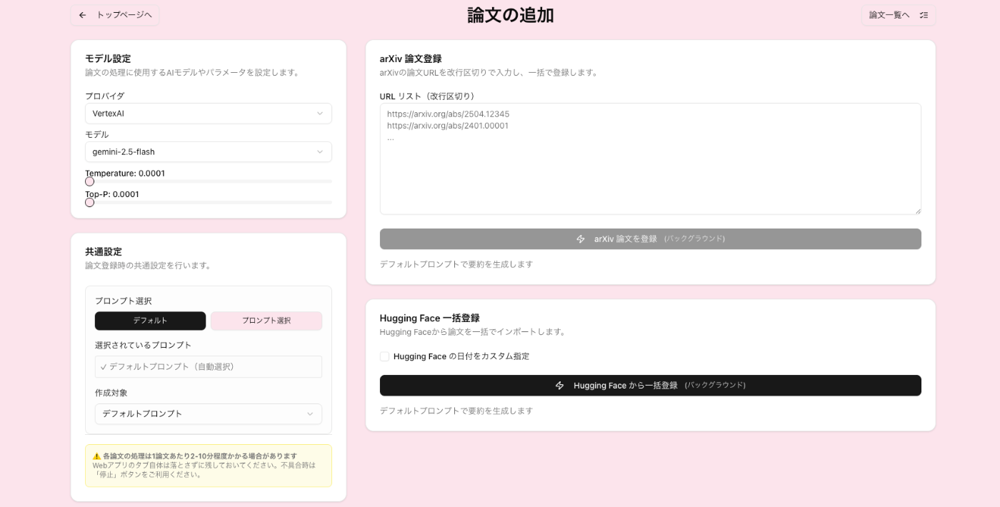

本ページでは、要約したい論文をArxivのURL、もしくはHuggingface Paperの日付指定から登録することができます。

本ページの特徴として、要約に利用するモデルやプロンプトを自由に変更できます。  
VertexAIが提供する多様なモデルを利用できます。

  * Gemini
  * Claude (Rate limit解放申請中。現時点は利用不可)
  * Llama

登録ボタンを押すと、1論文あたり数分程度で要約を完了します。  
複数プロンプトを指定した場合、並列処理するため処理時間は一定です。

また、Service Workerを利用したため、ページ遷移をしたり、タブを閉じたとしても、サービスページに戻れば論文追加の処理が再開します。

###  論文一覧ページ

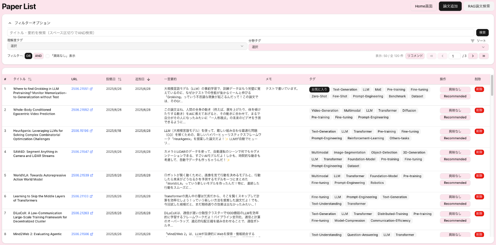

追加した論文を確認できます。

一覧画面にて「一言要約」と「ユーザメモ」を表示しているため、**一覧画面から論文の中身を大まかに把握** できます。  
また、「タイトル」「投稿日」「追加日」でソートも可能です。

####  タグ/検索機能

ページ上部から、キーワード検索とタグの絞り込みが可能です。

論文追加時に、`gemini-2.5-flash-lite-preview-06-17`が論文の要約をベースに、論文の分野を示すタグを付与します。  
適当に付与させると、同じ意味のタグが重複するため、**100以上のタグの例** を与え、それをベースに付与させています。

####  論文リコメンド機能

画面右上のリコメンドボタンを押すことで、**まだ読んでいない論文から最大5件、あなたに合わせてリマインド** します。

「まだ読んでいない」というのは、「理解度タグが付与されていない」という意味です。  
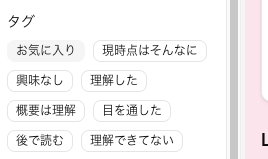  
上記のように、論文の詳細ページ内で、プリセットの8つのタグが用意されており、一度中身を読んだら、どれかは付与できるようになっています。  
これらのタグがついていない論文の中から、おすすめ論文を推薦します。

推薦は、**Embeddings Vector** を利用します。  
「お気に入り」タグと「興味なし」タグが付与された論文のEmbeddings Vectorとの類似度を計算することで、スコアを算出し、スコアの高い上位5件が推薦される仕組みです。  
単純な手法ですが、その分高速です。

###  論文詳細ページ

####  論文Info

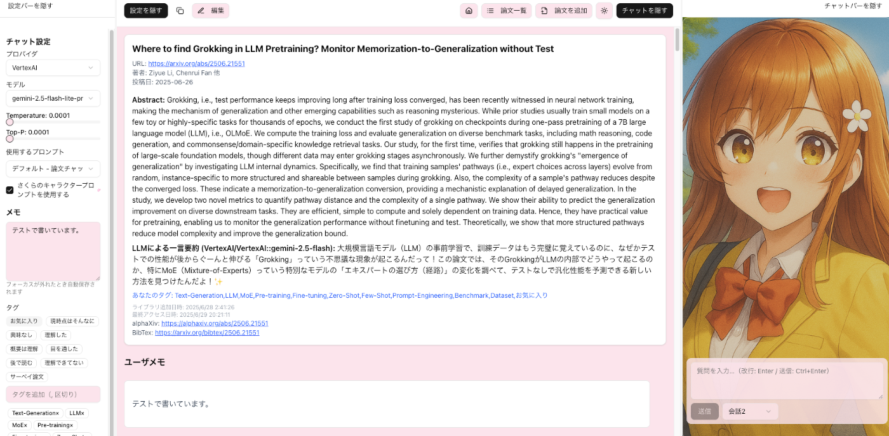  
Arxiv URLや、Alphaxiv URLに、ジャンプすることが可能です。  
また、Bibtexも表示できるので、すぐに自身の論文の参考文献に追加が可能です。

####  論文要約

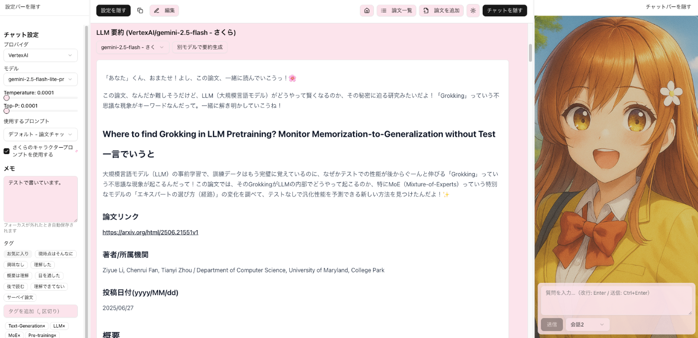  
自分で選択したキャラクター（「咲良」or「深雪」）が論文の要約をしてくれます。

また、自身が作成したカスタムプロンプトでの要約や、別モデルを設定した場合の要約文章を選択したり、別モデルでの追加の要約文章を生成することも可能です。  
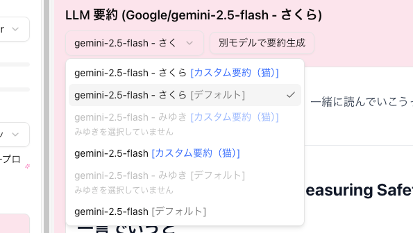

!

キャラクターの名前の書いていない要約文章は、LLMが真面目に要約した文章になります。  
女の子による要約に不満がある場合は、こちらを利用してください。

超真面目に要約してくれます。

!

デフォルトのプロンプトでの要約文章は、全ユーザ共通で保管するようになっています。  
これにより、大幅にコストの削減しています。

####  タグづけ/ユーザメモ機能

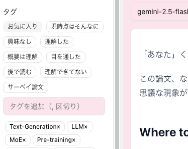  
デフォルトで用意されている「理解度タグ」をクリックすることで、論文にタグを追加できます。  
また、キーワードで好きなタグを付与可能です。

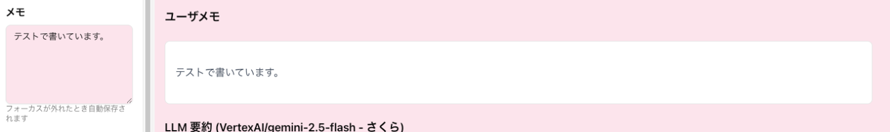

メモ欄に入力した内容は、要約文章の上に表示されます。（一覧ページのメモ欄にも表示されます）  
マークダウン形式で表示され、数式も入力可能です。

####  要約編集機能

ヘッダーにある「編集」ボタンから、要約文章自体を編集することが可能です。  
LLMがハルシネーションした箇所を、修正し保存できます。  
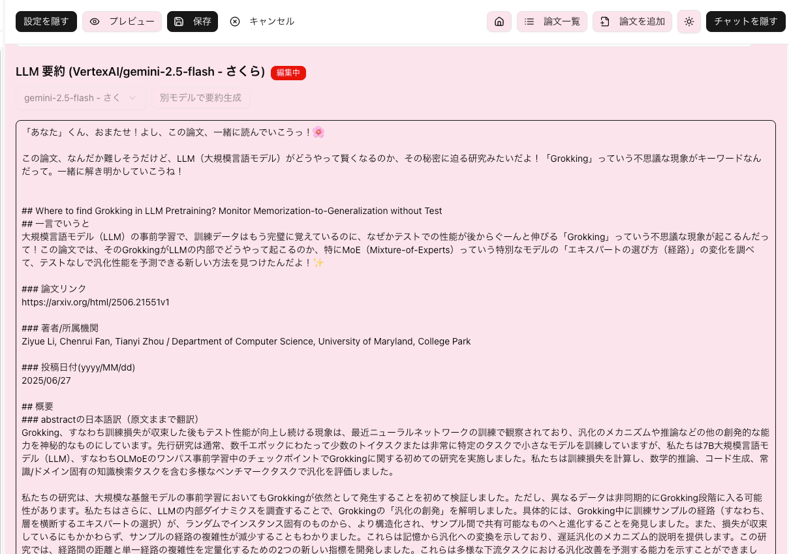

####  質問用チャット

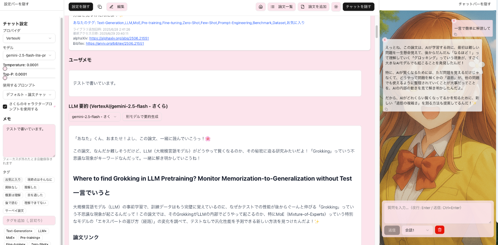

左サイドバーから、質問に利用するモデルとパラメータを設定し、右サイドバーから質問できます。  
この質問チャットには、自動的に論文の全文がコンテキストに含まれるようになっているため、論文の内容を全て把握した上で回答してくれます。

さらに、各吹き出しに「削除ボタン」を用意しているため、LLMの返答が気に食わなくてやり直したい場合に吹き出し単位で会話を消去できます。

!

左サイドバーのチェックボックスをOFFにすることで、LLMが真面目に質問回答してくれます。  
女の子に質問したくないという方は、OFFにして質問してください。

###  Agentベースの調査機能

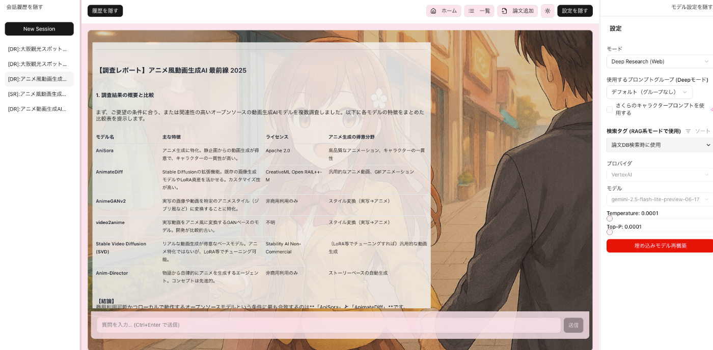

主に以下の機能が利用できます。

  * **DeepResearch**
    * AIエージェントが段階的にWeb検索を実施し、包括的に情報収集します。
  * **DeepRAG**
    * 既存の追加した論文の中からEmbedding Vectorを利用して、包括的に調査します。

これら二つの機能から、Webと論文の両輪で必要な情報を収集できます。  
特にDeepRAGを利用することで、過去に読んだ大量の論文の中から、曖昧な質問をするだけで、ピンポイントで論文を検索できるため、後から読んだ論文を探すのが簡単になります。

!

DeepRAGを利用して取得した論文には引用リンクが付与されており、そのリンクは本プロダクトの要約ページのリンクになっています。  
したがって、エージェントによる検索後、すぐに要約を確認したり、Arxivページにジャンプできます。

####  gemmaによるタイトル生成

過去の会話履歴を効率的に探すためには、タイトル生成が非常に重要です。  
一方で、本質ではないため、タイトル生成のせいで処理時間が長くなってしまうのは本末転倒です。

そこで、プロダクトで採用しているLLMの中でも非常に高速な`gemma-3n-e4b-it`を利用し、ユーザの待ち時間を最小限にする工夫をしています。

###  カスタムプロンプト機能

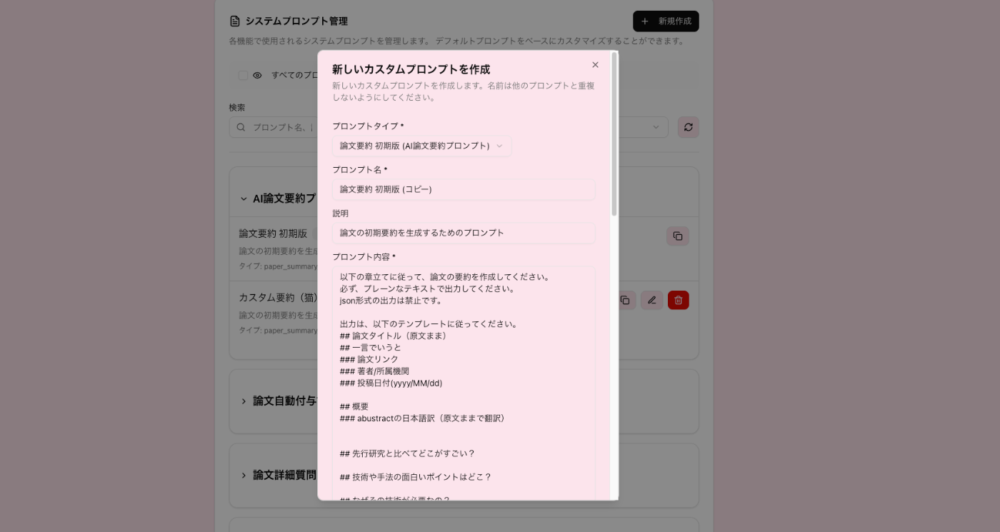

今回紹介したほぼ全ての機能（要約、チャット、Agent）で、プロンプトを変更できます。  
変更したプロンプトはカスタムプロンプトとして、プロダクト内で利用できます。

これにより、ユーザ自身が最も使いやすいプロンプトで、論文の要約やチャットでの質問が可能です。

##  システムアーキテクチャ

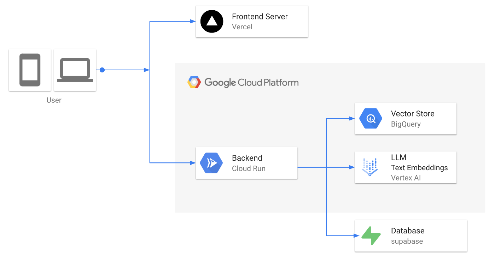

今回は、コスト的な理由で、フロントエンドサーバにはVercelを、データベースにはSupabaseを利用していますが、商用サービス化する際は、Cloud SQL for PostgreSQLを利用する予定です。

  * フロントエンド 
    * Next.js, TypeScript
  * バックエンド 
    * Python, FastAPI, LangChain, LangGraph

また、Vector StoreにはBigQueryを利用しています。  
LangChainから容易に利用でき、コストパフォーマンスに優れているため、非常に使いやすいです。

##  その他

ダークモードや、スマホ表示にも対応しています。  
さらに、キャラクターを「深雪」に設定すると、テーマカラーや画像が変化します。  
（文字数制限で詳細は割愛します）

##  今後の展望

真面目に書くなら、「論文だけでなく他の技術記事/ブログに拡張します」とか「Arxivに存在しない論文もPDFから取得可能にします」とかありますが、個人的には**もっと面白く、エンタメ色の強い形** への進化をさせたいです。

例えば、

  * 論文を読み進めると好感度が溜まり、キャラクターの応答の雰囲気が変わる
  * 過去の質問や雑談の内容をメモリーとして記憶する
  * 好感度がたまるとストーリーモードが解放される

役に立つのは当たり前で、「使ってて**楽しいもの** であるべき」と私は強く考えます。  
そして、私の「楽しい」はこの方向性です。

##  おわりに

KnowledgePaperは単なるツールではありません。  
すべての研究者・学習者にとって「最高の相棒」にしてみせます。  
知識の探究は、それ単体で楽しいものです。**でも、もっと楽しく、面白くできる！**

たとえこの先、**知識の価値がゼロになる** 時代が来たとしても、私は楽しみながら学び続けることをやめないだろう。  
あなたも一緒にどうですか？
