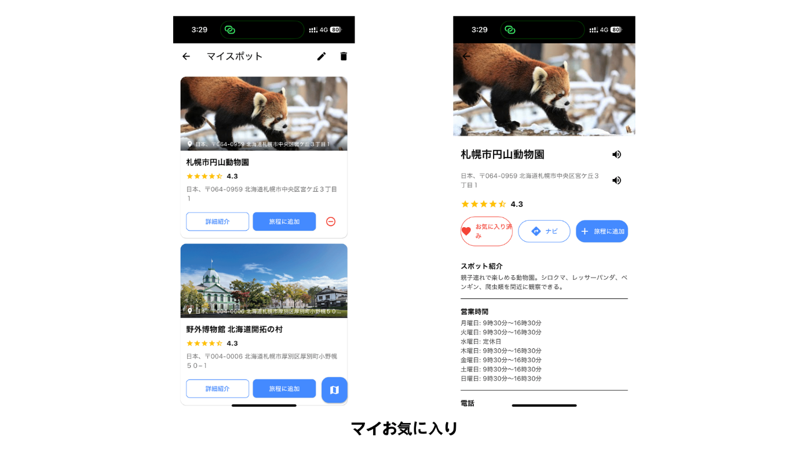
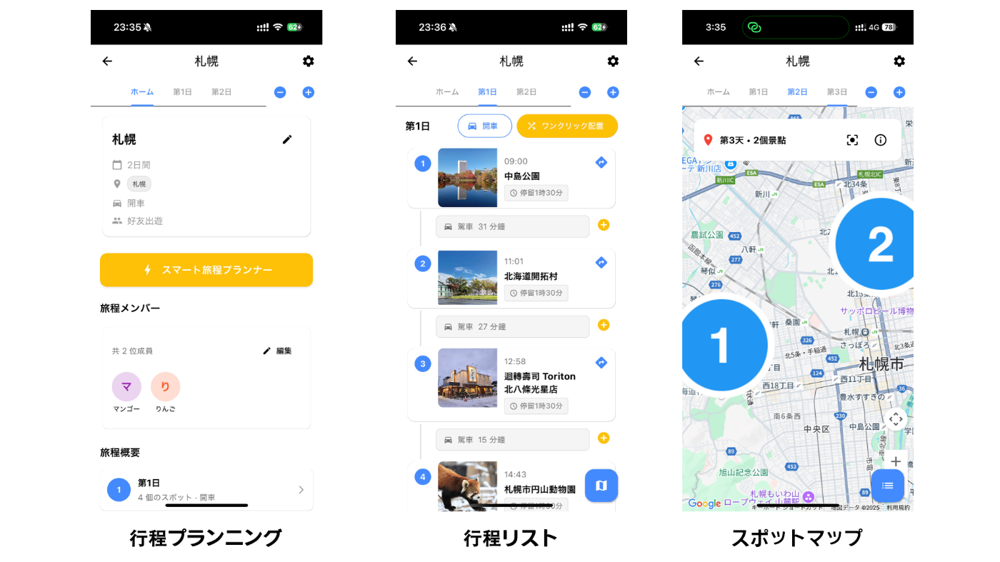
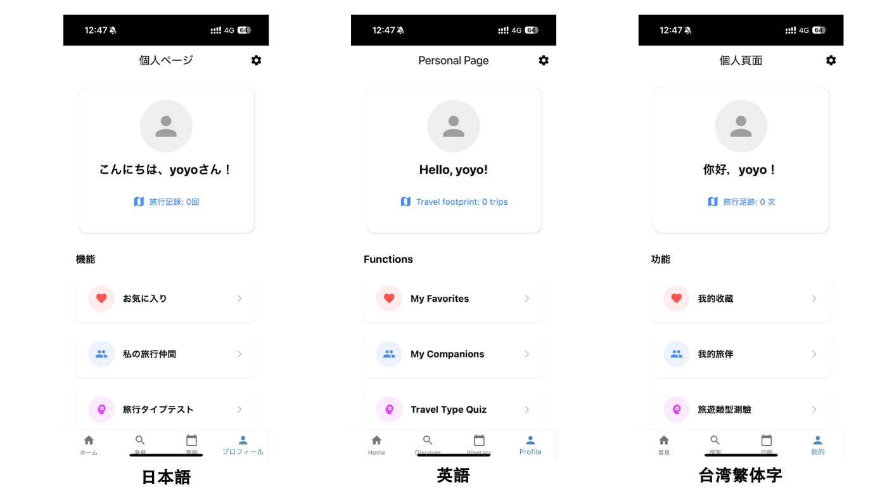
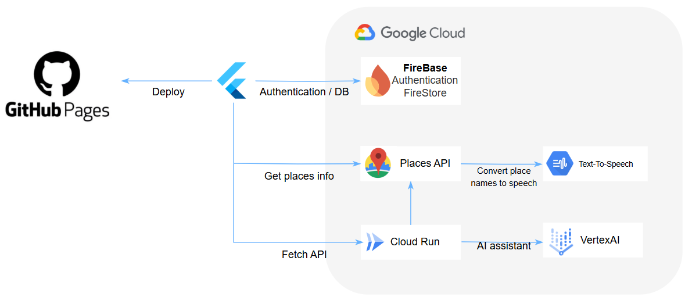

##  はじめに

旅行をしたい！と思っても、いざ計画を立てようとすると「どこへ行く？」「誰と行く？」「どうやって回る？」など、悩みは尽きません。実際、旅行を企画する際には、目的地のアイデアが浮かばなかったり、一緒に行くメンバーの希望をどう考慮するかに迷ったり、ネットの情報が多すぎて整理がつかなくなったりします。せっかく見つけた行程も、移動が非効率だったり、同行者の好みに合わなかったりすることも珍しくありません。

時間をかけて一生懸命調べたのに、誰にも喜ばれない──そんな経験を私たち自身も何度もしてきました。そこで私たちは「旅行計画ってもっと楽にならないの？」という想いから、旅行好きなメンバーでこのテーマを提案し、「どこでもドア」の開発を始めました。

このアプリは、旅の条件を入力するだけでおすすめスポットを提案し、さらに Vertex AI を活用したスマートエージェントがあなたの代わりに最適な行程を考えてくれる、新しい旅行体験を提供します。

**このプロジェクトでは「AIエージェントを旅行の相棒にする」という発想をもとに、「自分で調べて調整する面倒さ」そのものを代替できるように設計しています。**

* * *

##  プロジェクト概要

###  目的

このアプリは、旅行計画におけるよくある課題を解決するために作られました。短時間で行程を作成できるようにし、スポット情報の検索・比較・整理にかかる労力を軽減。ユーザーが旅の目的地や日数、旅仲間の好みを入力するだけで、最適なスポットやルートを提案できるようにすることで、だれでも簡単に納得のいく旅行計画を立てられることを目指しています。

また、旅のあらゆる工程をサポートするために、検索・保存・ルート編集をすべて一つのアプリに統合。すべての旅行が、「後悔のない旅」になるように設計しました。

**特に、旅行スタイルの多様化（ソロ・家族・カップル・多国籍グループ）に対応し、「誰と行くか」によって大きく変わる旅のかたちを AI が理解・調整する点が本アプリの差別化ポイントです。**

* * *

##  機能

###  A. スポット閲覧と保存

ユーザーが旅行エリアを選ぶと、Google Maps Places API を使ってカテゴリ別におすすめのスポットが表示されます。スポットの詳細ページでは、地図、営業時間、連絡先などの情報が確認でき、さらに Text-to-Speech 機能で地名などを音声で再生することも可能です。これにより、現地でタクシー運転手や地元の人とのやり取りがしやすくなります。また、気に入ったスポットはワンタップでお気に入り登録し、行程に簡単に組み込むことができます。  
「お気に入り」機能は行程作成時の個人/グループフィルタとして活用でき、好みの傾向を Vertex AI に学習させる際の判断材料にもなります。  
  

###  B. 行程プランニング

ユーザーは旅行の日数、同行者、予算、目的地を入力し、地図やお気に入りからスポットを選択して日程に追加できます。選んだスポットはマップやリスト形式で表示され、視覚的にもわかりやすく編集できます。さらに、Google Routes API を活用して、移動手段に応じたルートと所要時間を自動計算し、無理のないスケジュールを提案します。

ルート提案では移動時間や交通手段（徒歩、車、公共交通）をもとに、AI が滞在時間とのバランスを考慮した構成を行います。移動負荷の最適化は、体力に合わせた旅を実現するために重要です。  

###  C. パーソナライズ管理

簡単な質問に答えるだけで、ユーザーの旅行スタイル（自然派、文化派、美食派など）をラベリング。加えて、同行者ごとに興味や要望を設定できるため、グループ全体にとって最適なプランが AI によって導き出されます。

**このスタイル設定は、従来の「検索ベース」ではなく「目的ベースの旅設計」への転換を意味し、検索疲れの根本的解決を目指すアプローチです。**

###  D. AIプランニングアシスタント

Google Cloud の Vertex AI を活用し、以下2つのモードを選べるようになっています：

  * 完全プラン生成：旅行日数やメンバーの好み、スタイルに基づいて、ゼロからフルの行程を提案。
  * 補完プラン生成：すでに選んだスポットをもとに、スムーズな流れになるよう間を埋める形でスポットを追加。

また、AIは条件やスタイルに応じて新たなスポットを提案することも可能です。

###  E. 多言語対応（マルチランゲージ）

アプリ全体が日本語、英語、中国語（繁体字・簡体字）など複数言語に対応しており、訪日観光客や国際的なユーザーにも快適な操作体験を提供します。

また、スポット詳細や行程プランも、対応言語で自動翻訳表示されるため、旅行中の言語ストレスを軽減し、現地でのスムーズな移動・会話をサポートします。  

* * *

##  デモ

<https://a-tien.github.io/zenn_hackthon/>

<https://youtube.com/shorts/41N69p8SBbk>

* * *

##  技術構成

  * **フロントエンド** ：Flutter Web による UI 実装
  * **バックエンド** ：Firebase（Authentication & Firestore）
  * **AI モデル** ：Google Cloud Vertex AI を使用した行程・スポット推薦
  * **地図API** ：Google Maps + Routes API による位置情報・移動時間推定

* * *

##  システムアーキテクチャ

本システムは以下の技術構成をもとに構築されています：

  * **フロントエンド** ：Flutter Web による UI 実装。ユーザーは Web 上から旅行条件や希望を入力。
  * **認証管理** ：Firebase Authentication を利用し、ユーザーごとにセキュアなセッションを提供。
  * **データベース** ：Firestore により、スポットの保存情報・行程データをリアルタイムで管理。
  * **地図・ルートサービス** ：Google Maps / Places / Routes API を組み合わせて、スポット表示・ルート計算・所要時間推定を実現。
  * **AI モデル** ：Google Cloud Vertex AI を用い、ユーザーの条件からプロンプトを生成。完全行程・補完行程の両パターンでスポット提案を行う。
  * 

* * *

##  ユーザーシナリオ

###  ケース：大学生グループ旅行

春休みに北海道旅行を計画中の大学生3人。Aさんは自然が好き、Bさんはカフェ巡り、Cさんは観光よりも地元の穴場重視。好みがバラバラで、行程を誰が決めるかで揉めていた。

「どこでもドア」にそれぞれの希望を入力したところ、AIが全員の希望を考慮したバランスの良いプランを提示。地図での確認やルート計算も自動で行われ、移動の無駄がない行程に全員納得。旅行前のストレスが一気に軽減された。

* * *

##  将来的な展望・今後のアップデート予定

今後は、旅程の共有機能や複数人での同時編集機能を追加予定です。グループ旅行では、それぞれの好みがぶつかりやすいため、リアルタイムで行程案を確認・編集できる仕組みを導入し、誰にとっても納得できる旅を実現したいと考えています。

加えて、AIエージェントとの対話型調整（例：「もっと観光重視に」「ゆっくりめにしたい」など）も開発予定。人に相談するように行程を修正できるようになります。

* * *

##  実証実験とユーザーフィードバック

今回の開発において、初期段階から複数のユーザーに協力を仰ぎ、モック版の操作テストやプラン提案の妥当性チェックを実施しました。実際に使用したユーザーからは「自分では見つけられなかったスポットが提案されて新鮮だった」「誰かに旅行プランを任せたような安心感があった」といったポジティブな声が寄せられました。

また、想定外だったニーズとして「旅の記録を残したい」「旅行後にレビューを共有したい」といった要望も得られたため、今後は行程の履歴保存やシェア機能の拡充、旅行記としての活用も視野に入れています。

開発チームとしては、今後もユーザーとの対話を通じて、より“共感”を重視した旅のデザインに向けて改善を重ねていきます。

##  まとめ

どこでもドアは、旅の「情報収集」や「行程作成」といった煩雑な作業を AI が代行し、ユーザーは入力するだけで自分に合った旅ができる体験を提供します。

**今回のハッカソンでは、AI エージェントによる「スマート旅程提案」というアイデアを軸に、ユーザー中心の設計と実現可能な技術スタックを組み合わせることで、旅のあり方そのものを変える可能性を提示しました。**

誰とでも、どこへでも。  
旅行がもっと自由で、楽しく、納得のいくものになるように。  
どこでもドアは、そんな理想を現実にする鍵となる存在です。

##  最後に

チーム名「台湾マンゴー」は、「マンゴーが食べたい！」という純粋な気持ちから名付けました。そして、このハッカソンを通じて、台湾の魅力も少しでも広められたらという思いも込められています。ここまでお読みいただき、ありがとうございました!
