**「あついよ」 熱中症みまもりAI** (以下:「あついよ」) は、保育士や保護者向けの  
子どもの熱中症を予防するAIエージェントアプリです。

今の気温と子どもの年齢から、熱中症危険度を判断してくれます。  
写真を撮れば、疲れ具合も分析してくれるので、安心して外遊びができます。

##  1\. 開発の経緯

今回のハッカソン開発は、チームメンバーの保育士であるご家族の強いペインにより  
スタートしました。

  * 子どもの中には今まで元気にしてたのに突然嘔吐して熱中症の症状が出たりする事が何回かあった
  * 適宜水分補給をさせていたが、それでも個人差で体調が急変する事があった

**小さな子どもは、自分で「暑い」と伝えることができません。**

保育の現場では「なんとなく暑そう」という感覚的な基準で園児の健康状態を判断せざるを得ない実情があります。

データとしても、乳幼児の熱中症での搬送件数は年々増加傾向にあることが確認できます：  
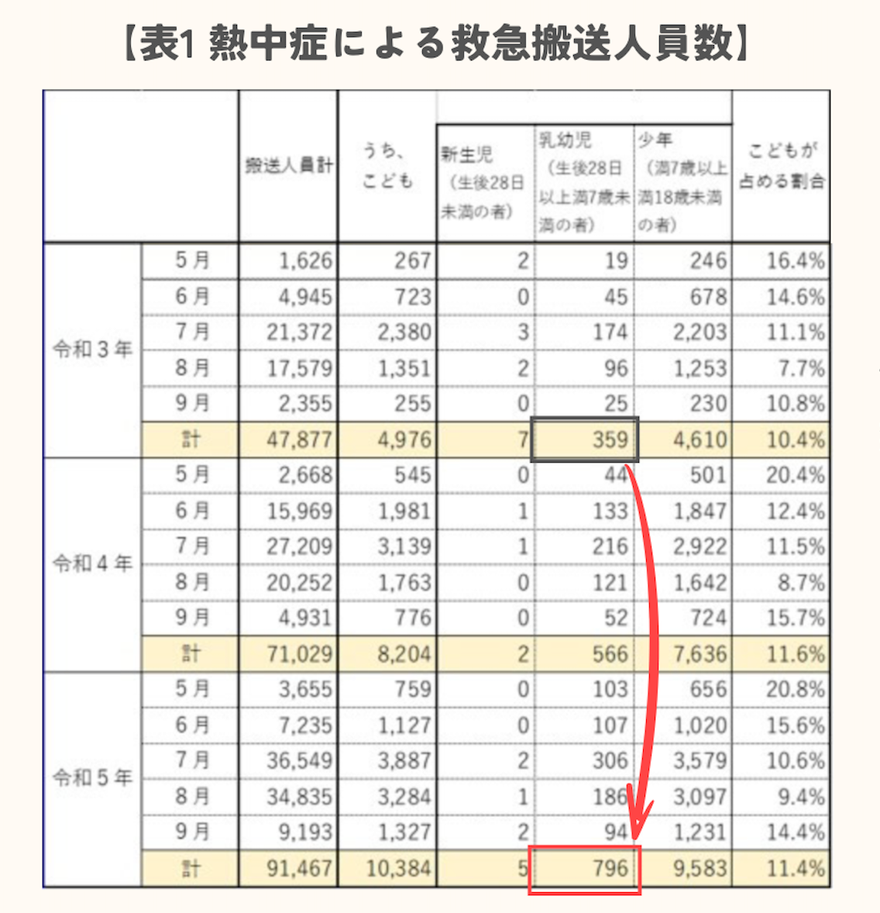  
_引用：こども家庭庁, 「みんなで見守り「こどもの熱中症」を防ぎましょう！」閲覧日：2025年6月27日_

!

**深刻化する熱中症リスク**

令和5年の乳幼児（生後28日〜7歳未満）熱中症搬送は796人で令和3年の約2.2倍を記録  
→直近三年で**最多** ,**年々増加傾向** にある

また、サントリー食品インターナショナルと気象専門会社ウェザーマップ社が2023年5月に実施した実証実験では、

**真夏日の屋外** で大人の胸の高さ（約150 cm）で計測した気温が 31.1 ℃だったのに対し、  
**子ども** の胸の高さ（約80cm）では 38.2 ℃と、**7℃以上も高い** ことが確認されました。

この“こども気温”が示す隠れ高温に加え、乳幼児は発汗機能や体温調節機構が未成熟です。

したがって、**大人と同じ基準で環境を測定・判断している現状では、子どもの身体負担への配慮がどうしても不足してしまう** と言えます。

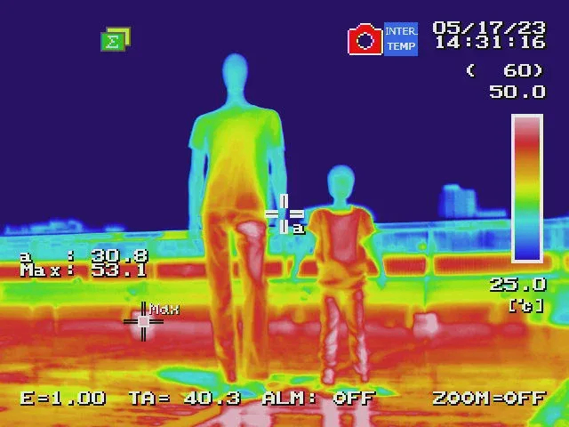  
_引用：PR TIMES, 「判明！真夏日、地面に近い子どもの高さの気温は大人より７℃高い！小さな子ども特有の暑熱環境「こども気温」を知ることが子どもの熱中症対策の第一歩！」閲覧日：2025年6月27日_

!

・**子どもの体温調整機能** が大人に比べて**弱い** ことが考慮されていない

・**一般的な天気アプリや暑さ指数(WBGT)は大人基準** で、子どもの年齢などを考慮されていない

##  2.現状の課題

上記の前提を踏まえたうえで、保育現場においても以下のような課題があります：

  * 「今日は外遊びができるか？」の判断が難しく、感覚に頼らざるを得ない状況
  * 園児30人の体調を一括で可視化・管理できる仕組みが不足
  * 写真と気象データの手動での突き合わせは現実的ではない
  * 事故発生時の説明責任において、科学的根拠に基づくエビデンスが不足０

###  保育士へのアンケート結果から見えた現実

実際に保育現場での熱中症対策について調査を行った結果、以下のような実態が判明しました：

**Q1.「今日は園児を外で遊ばせる／控える」と判断する際に、最も重視している情報やサインは何ですか？**

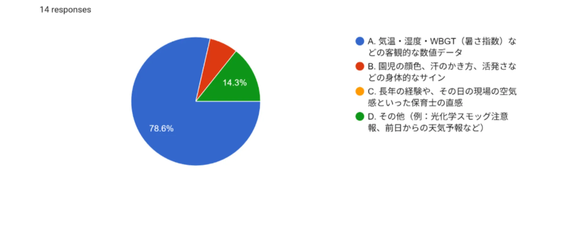

**Q2. 現在の熱中症の方法で、「もっとこうだったら良いのに」と感じることはありますか？**

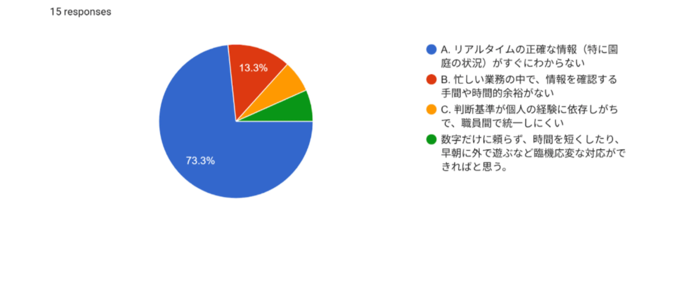

**熱中症情報の取得方法**

  * **環境省や自治体の熱中症予防情報サイト** ：42.9%
  * 園庭設置の温湿度計・WBGT計：28.6%
  * テレビや新聞の天気予報：21.4%
  * スマートフォンの天気予報アプリ：7.1%

**現在の対策で改善したい点**

  * **リアルタイムの正確な情報（特に園庭の状況）がすぐにわからない：73.3%**
  * 忙しい業務の中で、情報を確認する手間や時間的余裕がない：13.3%
  * 判断基準が個人の経験に依存しがちで、職員間で統一しにくい：6.7%
  * 数字だけに頼らず、臨機応変な対応ができればと思う：6.7%

この結果から、**7割以上の保育士が「リアルタイムで正確な状況を知りたい」** と感じていることが分かります。現場のニーズと私たちのソリューションが一致していることが実証されました。

##  3\. 目的

私たちが目指すのは：

  * 写真と気象データをプログラムとAIにより即座に判定し、保育士の意思決定を10秒で支援
  * 科学的根拠をログ化することで、保護者にも安心材料を提供
  * 「経験と勘」に**科学的な裏付けを加え、熱中症事故ゼロの保育園を実現** する

**幼児の熱中症対策** に対して、開発メンバーの専門領域である**気温データ解析の側面から  
ソリューションを開発**することで、社会に大きな影響を与えるツールの完成を目指します。

##  4\. 機能

###  基本機能フロー

  1. **位置情報取得** ： GPS自動取得 + 手動選択のハイブリッド方式で最寄りの気象観測所を特定
  2. **気象データ取得** ：気象庁アメダスから最新の気温・湿度・風速・日射量をリアルタイム取得
  3. **暑さ指数計算** ：環境省公式WBGT計算式（小野ら2014回帰式）で科学的根拠に基づく暑さ指数を算出
  4. **年齢別リスク判定** ：子どもの身長・体調表現能力を考慮した7段階の危険レベル判定（大人基準より厳格）
  5. **AI個別アドバイス** ：Gemini 2.0 Flash Liteが年齢・気象状況・時間帯に応じた具体的なアドバイスを自動生成
  6. **画像解析（オプション）** ：外出前後の写真比較でAIが疲労度・顔色などを分析し、帰宅後ケアを提案
  7. **結果表示** ：水分補給量・頻度、空調設定、体調確認ポイントを箇条書きで分かりやすく表示

!

**重要な設計方針として、プログラムとAIの判定はあくまで保育士の判断を支援するものであり、最終的な決定は必ず保育士が行います。**

###  サービス機能要件 & 実装方針

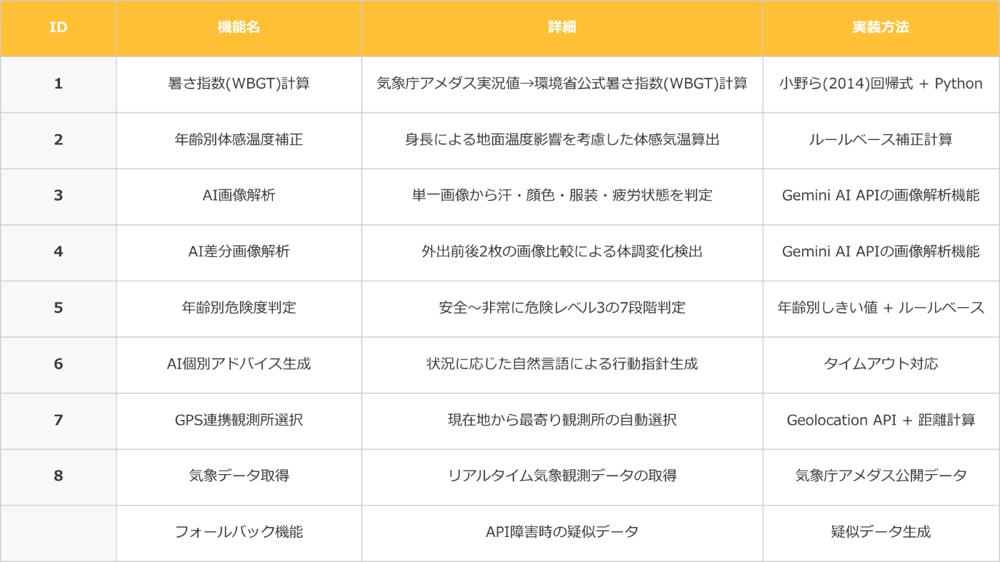

###  システムアーキテクチャ

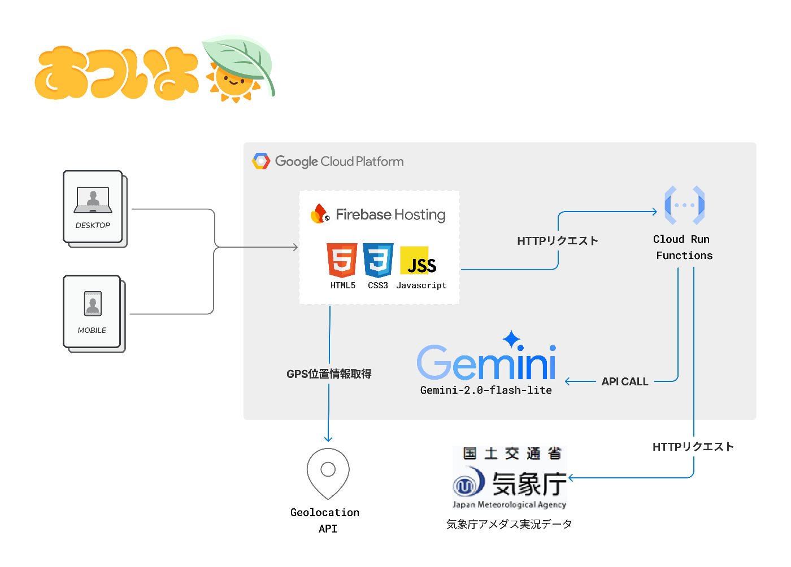

**技術スタック詳細**

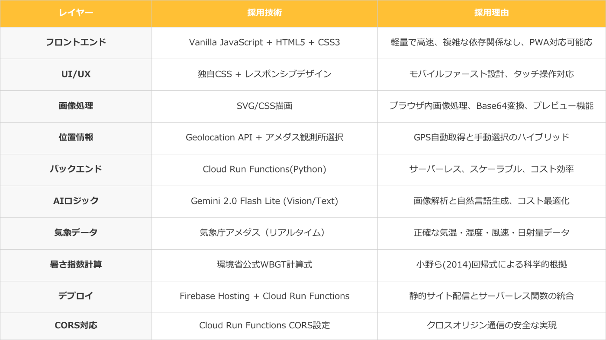

###  プログラム(Python)とAIの組み合わせによるハイブリッドアプローチ

「あついよ」 の核心は、正確なプログラム計算による判定と最新の生成AIを組み合わせたハイブリッドアプローチにあります：

  1. 正確な暑さ指数(WBGT)計算（Python）

     * アメダスの**リアルタイム気象データ** （気温・湿度・風速・日射量）を自動取得
     * 環境省公式のWBGT計算式をPythonで実装し、リアルタイム計算
     * 0-1歳、2-3歳、4-6歳の3つの年齢グループごとに危険度を判定
     * 子どもの身長に応じた**地表付近の温度上昇を考慮**
  2. **生成AIの制御方法**

     * 保育士さんにわかりやすい言葉でGemini APIによるアドバイスを作成
     * ハルシネーション対策として、暑さ指数(WBGT)計算はプログラムによる計算と組み合わせて実装
     * Gemini APIで写真から子どもの様子（汗・顔色・疲労度など）を分析
  3. **現在地の自動取得機能**

     * GPS情報から最寄りのアメダス観測所を特定
     * リアルタイムの気象データを自動取得し、手動入力の手間を削減
     * 保育士の業務負荷を最小限に抑制

###  セキュリティ・プライバシー配慮

セキュリティ・プライバシー保護への取り組みとして以下を構築しています：

  * **画像データ** ：JavaScript変数に一時保存し削除ボタンで即座にnull化、ローカル保存なし、サーバー内で処理後即座に破棄
  * **通信** ：全てHTTPS暗号化通信、CORS設定でGET・POST・OPTIONSのみ許可、Content-Typeヘッダーのみ受信
  * **タイムアウト制御** ：AI画像解析15秒、アドバイス生成8秒、GPS取得10秒で強制終了、DoS攻撃対策
  * **位置情報** ：GPS座標（緯度・経度）を取得し最寄り観測所特定に使用、5分間キャッシュで頻繁取得防止
  * **データ最小化** ：年齢グループ・観測所ID・画像データのみ処理、個人識別情報は一切受け取らない
  * **責任分界** ：AIの判断はあくまで支援、最終判断は保護者・保育士が実施、医療行為は一切行わない
  * **プライバシー保護** ：セッション管理・Cookie使用なし、個人特定情報のログ記録なし、第三者提供は技術的に不可能

###  「あついよ」の構成材料

##  5\. 実際の導入イメージ - 保育現場での活用シーン

保育現場における外遊び判断のためのご利用フローは以下を想定しています：

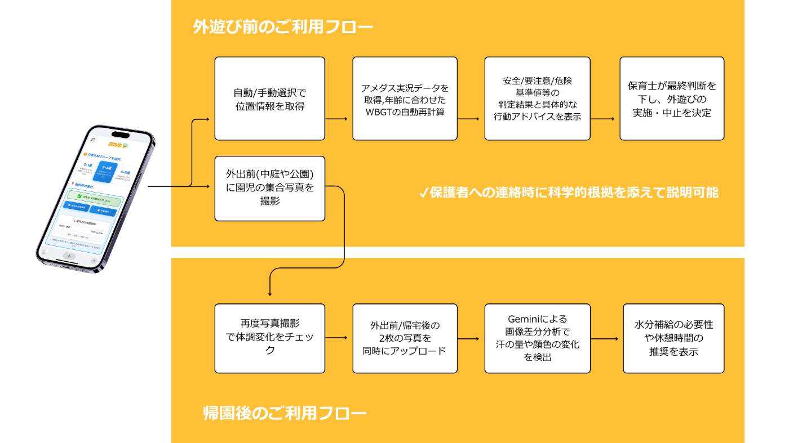

###  期待される効果

  * 熱中症事故ゼロの実現（まず5園でPoC実施予定）
  * 保育士の精神的負荷軽減と業務効率化
  * 園児の外遊び時間最適化による健康増進
  * 保護者との信頼関係向上（透明性のある判断根拠）

###  デモ動画

<https://youtu.be/PBk4hSlkMxk>

###  保育士からの実証フィードバック

開発期間中、実際の保育現場でプロトタイプのテストを実施し、以下のフィードバックを得ました：

**使用感に関する評価**

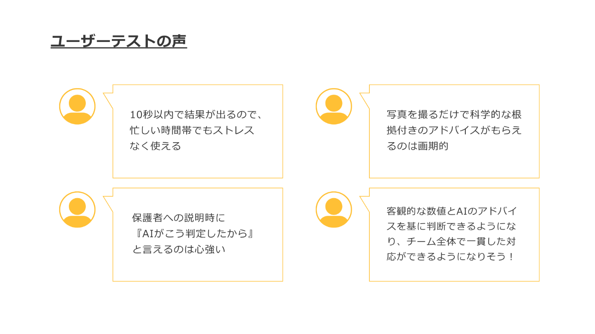

**一方で改善要望も** ：

  * 「判定理由をもう少し詳しく表示してほしい」
  * 「過去の判定履歴と比較できる機能があると良い」
  * 「複数の子どもを同時に判定できるとさらに便利」

いただいた貴重なご意見をもとに、ハッカソン期間中何度も修正を重ねました。

**他サービスとの差別化ポイント**

ユーザーテスト結果から分かった現場のニーズに対して、**「あついよ」** は以下の点で既存サービスと差別化されています：

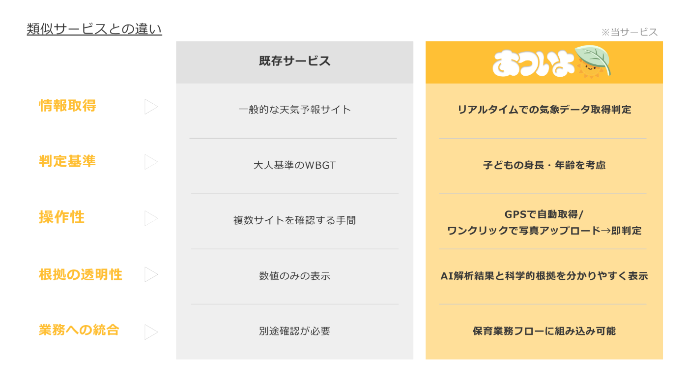

##  6\. 開発での課題と対応

ハッカソンの短い制限時間では"映えるデモ"に走りがちですが、私たちはユーザーテストを繰り返し **現場導入時のユーザー体験の向上** を優先しました。その結果ぶつかった開発における障壁は次の3つです。

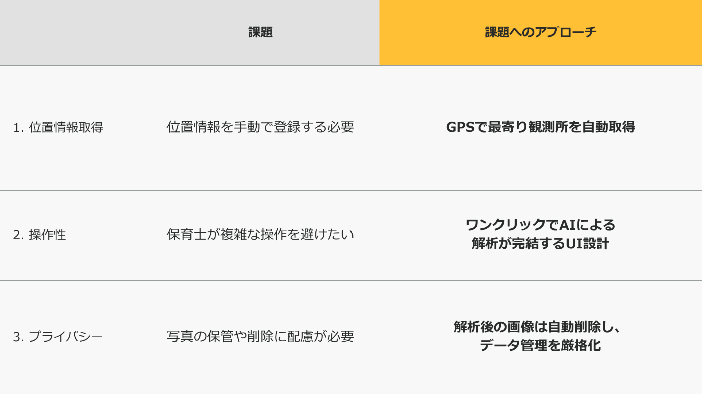

##  7\. 今後の展開

デモは"熱中症検知"のみでしたが、「あついよ」のコアは **「気象データと画像解析の総合判定によるリスク評価」** にあります。

今後は下記のような拡張を想定しています。

  * **モニター機能** ：自動更新で最新情報を表示、いつでも共有が可能
  * **紫外線や花粉量との連動** ：屋外要因と組み合わせて皮膚トラブルを早期検知
  * **自治体との連携** ：地域の気象情報や健康指導と連動したサービス展開、教育委員会との共同導入スキーム
  * **保護者アプリ連携** ：預かり前後の比較を保護者にも共有し、家庭側のケアに接続
  * **学童・幼稚園への展開** ：身長差は年齢が上がっても残るため、同一モデルで横展開が可能

##  おわりに

私たちは **「現場で本当に使えるか？」** を問い続けました。  
熱中症みまもりAI「あついよ」はまだ実証段階ですが、「**AIは判断支援であり、保育士の専門性を拡張するもの** 」というスタンスを貫いてまいります。

保育の現場では人間の温かみと専門的判断が最も重要であり、AIはその判断をより科学的で確実なものにするためのツールとして位置づけています。

最後に、このハッカソン開発を支えてくれた皆さま、ヒアリングに応じてくれた保育士の皆さんに心から感謝申し上げます。

**言えない暑さを、見える声に。**

**子どもの"熱中症リスク"を見逃さない世界へ。**
