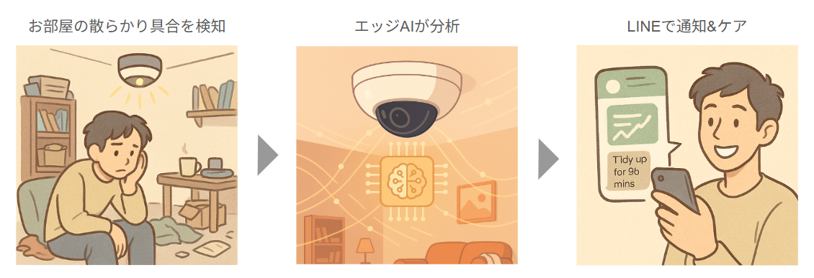
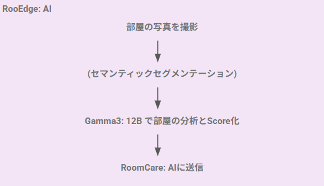
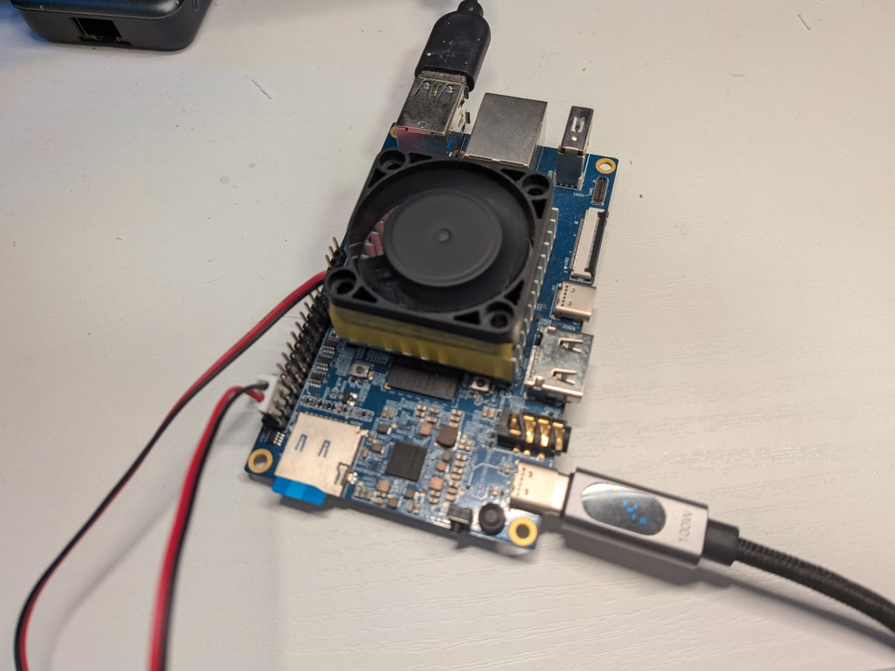
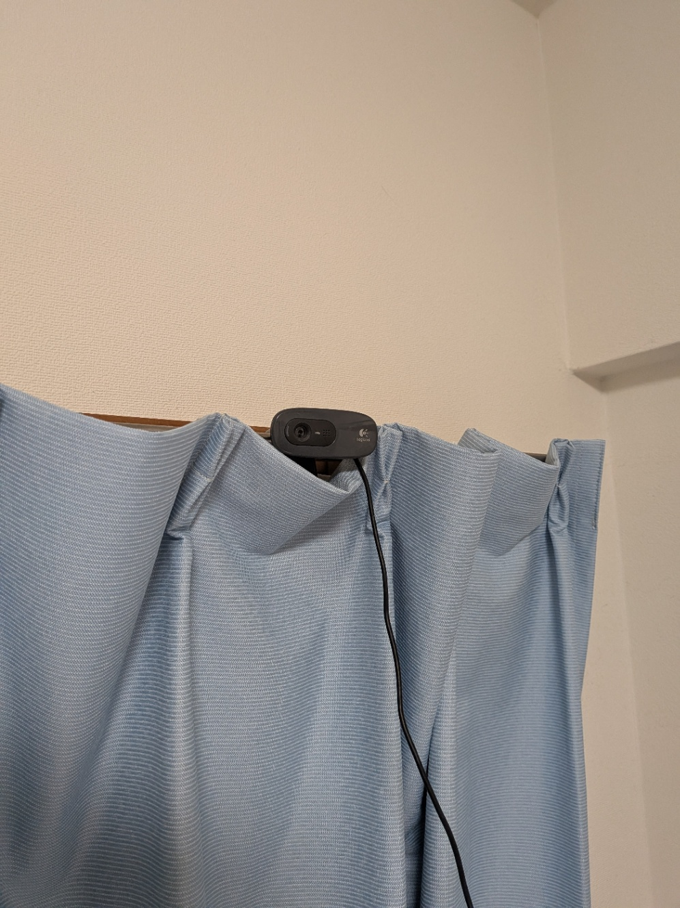
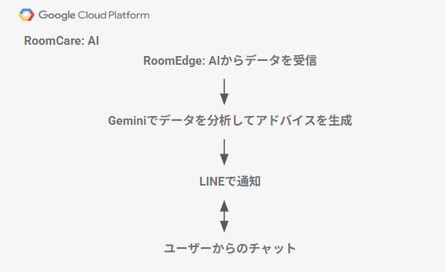
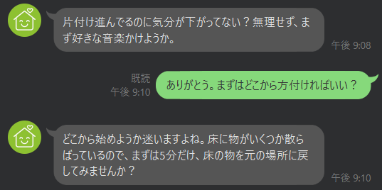
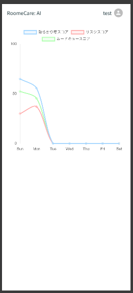

この記事は[第2回 AI Agent Hackathon with Google Cloud](https://zenn.dev/hackathons/google-cloud-japan-ai-hackathon-vol2)提出用の記事です。

#  AIエージェントによる次世代ライフサポート構想

<https://youtu.be/sJoeaiWf4tA>

WEBサイト

<https://roomcareai.web.app/>

公式ライン

<https://lin.ee/QPdc7Sp>

リポジトリ

<https://github.com/ATworks-np/roomecare-ai>

#  1\. なぜ“部屋が散らかる”のか──社会的背景

  1. 時間的貧困  
日本の就労世帯は長時間労働と家事負担の両立に苦しみ、主観的な「時間の不足感＝Time Poverty」が慢性化していることが最近の尺度開発研究でも示されました。

  2. 過剰消費・サブスク時代の物量爆発  
ECや定額サービスの普及で“モノの入口”は拡大した一方、“出口”となる手放し方・整理のスキルが追いつかず、居住空間が圧迫されがちです。

  3. メンタルヘルス危機と可視化されにくいストレス  
家の中の物量が多いほどストレスホルモンであるコルチゾール値が上昇し、特に女性で顕著という心理学研究が繰り返し報告されています。

  4. 高齢化・単身世帯の増加  
片付けが困難なまま孤立し、事故や健康被害につながるケース（ごみ屋敷・孤独死）が自治体の課題になっています。

#  2\. 解決したい社会課題

課題 | 具体的な困りごと  
---|---  
メンタルヘルス低下 | 視覚的ノイズが不安・うつ・睡眠障害を悪化させる  
生産性損失 | 物探しや判断疲れで作業効率が落ちる  
転倒・火災・衛生リスク | 高齢者や子育て家庭で事故につながる  
社会的孤立 | “散らかっているから人を呼べない”→孤独感の深刻化  
  
#  3\. ソリューション概要──

「RoomCare AI」：散らかりスコア×心のケアを同時提供するホームエージェント

機能ブロック | 仕組み | 得られる価値  
---|---|---  
**お部屋常設デバイス** | • 天井や棚に設置する専用カメラが定時／オンデマンドで部屋全景を撮影  
• SoC 内で  
1\. 通常セグメンテーション（床・家具・衣類・廃棄物など）  
2\. **Gemma 3.0** マルチモーダル LLM が画像＋メタ情報を統合し、  
• Clutter Score（散らかり度）  
• Risk Score（転倒・火災・衛生リスク）  
• Mood Cue（照明・色味・ポスターなどから感情手がかり）を**オンデバイス生成** | • エッジAIにより画像をクラウド送信しない **プライバシー保護**  
  
**RoomCare: AI(LINE & WEBアプリ)** |  **デイリーフィードバック（毎朝7時）**  
• 前日比グラフ  
• 「30 秒でできる整理タスク」  
**メンタルケアチャットモード**  
• スコア低下3日連続で自動移行  
• 「最近お仕事お忙しいですか？」など寄り添い質問→Gemma 3.0 が意図解釈し**一緒に原因整理**  
• 合意した解決策を To-Do 固定、自己申告スケールで経過を記録 | • 使い慣れた **LINE UI** だけで完結  
• 「指示」ではなく **伴走型対話** で心理的安全性↑  
  
###  キー Takeaways

  1. **客観データ（部屋写真）** と **主観ケア（伴走対話）** を一つのループに統合し、  
散らかり↔ストレスの悪循環を遮断。
  2. 画像推論はすべてエッジ完結。クラウドには**統計量のみ** 送信するため  
プライバシー・遅延・学習効率を同時にクリア。
  3. フロントエンドは **LINE** だけ。高齢者や IT リテラシーが低い層でも  
**追加アプリ不要** で導入できる。

#  4\. システム構成

本システムは、「RoomEdge: AI」と「RoomCare: AI」に大きく分かれます。

##  アーキテクチャ図

###  RoomEdge: AI

RoomEdge: AI は、天井に取り付けた小型カメラで 定期的にお部屋の写真を撮影し、その画像をデバイス内の Gemma3:12B で即座に解析します。処理は SoC 上で完結し、画像データはインターネットへは一切送信されません。画像データは推論が終わると RoomEdge: AIからただちに消去され、端末内に残るのは暗号化された数値メタ情報のみ。「もし故障や盗難があっても生活の様子が外部に流出するのでは」という心配は無用です。

「常時録画されているようで落ち着かない」「子どもの姿や夫婦の会話まで見られたら困る」という声もありますが、RoomEdge: AI のカメラは静止画しか撮らず、人物そのものを識別するモデルも組み込んでいません。こうした仕組みのおかげで、部屋の状態を把握したいけれどプライバシーは絶対に守りたい——そんな相反する要望を、RoomEdge: AI は両立させています。

上記の要件を満たすためには、小型のガシェット上で、画像分析とマルチモーダル推論が必要となります。

今回のプロジェクトを支えているのは Gemma3:12B という軽量・高性能モデルです。パラメータ数はわずか 12 B に抑えながら、多くの一般的な LLM（70 B クラス）の応答品質に迫る実力を持ち、計算資源の乏しいSoCで動作します。  
今回の実証では、手のひらサイズの Orange Pi 5（RAM 16 GB）を使用しましたが、フル推論が可能になり、エッジ側で画像解析からコメント生成までを完結できました。Gemma3:12B の “軽さと賢さ” がなければ、「完全ローカル・プライバシーファースト」の RoomEdge AI は実現し得なかったと言えます。

↓今回使用した Orange Pi 5（RAM 16 GB）  

（OrangePi5 16GのSBCでもマルチモーダルLLMで十分強力な推論ができるのは正直驚きでした）

↓カメラを設置した様子  

###  RoomCare: AI

部屋をスキャンし終えると、すぐに LINE に通知が届きます。  
「どこから片付ければいいかわからない…」と感じた瞬間に、そのトーク画面で AI にひと言たずねるだけ。今の散らかり具合に合わせて “まずは床の隅に積んだ雑誌を３冊だけ処分しましょう” といった具体的で小さなステップを提案してくれるので、迷わず行動に移せます。LINE ひとつで悩みが解け、片付けが進む――そんな体験を届けます。

さらに、部屋のスコアは専用の Web アプリでいつでもチェック可能。  
スマホや PC を開けば、クラスター・リスク・ムードの各スコアが色分けグラフで一目瞭然。「今日は散らかり度が 10 ポイント改善」「週末になるとリスクが上がりがち」など、変化を客観的に把握できるので、片付けのタイミングを迷わず決められます。

###  今後の展望

###  1\. 画像認識精度のさらなる向上

  * **セマンティックセグメンテーションの前段適用**  
現状はワンショット画像を直接 Gemma 3-12B に渡していますが、先に軽量な SegFormer や DeepLabV3-Mobile で _床・家具・衣類・廃棄物_ を領域分割し、  
① カテゴリ別ピクセル比 → 定量メタ情報  
② マスク済み画像 → 雑音除去された入力  
を生成してから Gemma に投入する二段推論へ発展させます。これにより

    * 少量の散乱物を過大評価しない “甘辛バランス” の最適化
    * 危険物（割れ物・可燃物）の局所検出による **riskScore** 精緻化  
が見込めます。

###  2\. EdgeAI ハードウェアの製品化

  * **専用キャリアボード＋NPU SoC への移行**  
実証では Orange Pi 5 を用いましたが、量産フェーズではカスタムボードを設計し、筐体も生活空間になじむ薄型天井ユニットへ刷新します。
  * **ハード＋ファーム一体のアップデート基盤**  
バージョン管理付き OTA、TPM セキュアブート、リカバリパーティションを実装し、一般ユーザーでも安全にファーム更新できる仕組みを整備。
  * **AI コプロセッサによる電力最適化**  
本実証ではスタンバイモードなどを検討して田舎たため、待機時 0.5 W 以下を目標にし、24 時間常時稼働でも電気代月 30 円程度に抑えます。

* * *

**次のステップは「高精度＆省電力」な完全エッジソリューションへ。**  
セグメンテーション導入による解析精度アップと、量産志向ハードウェアの確立で、家中どこでも安心して使える “片付けパートナー” を実現します。
