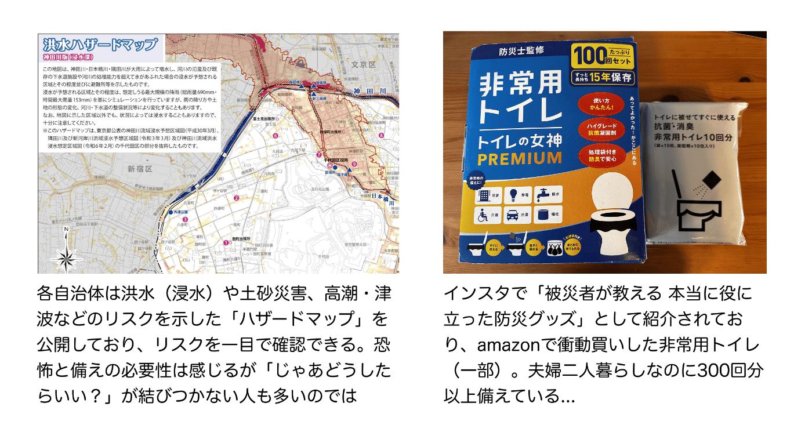
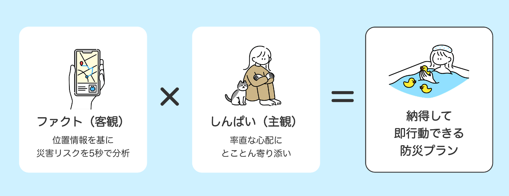
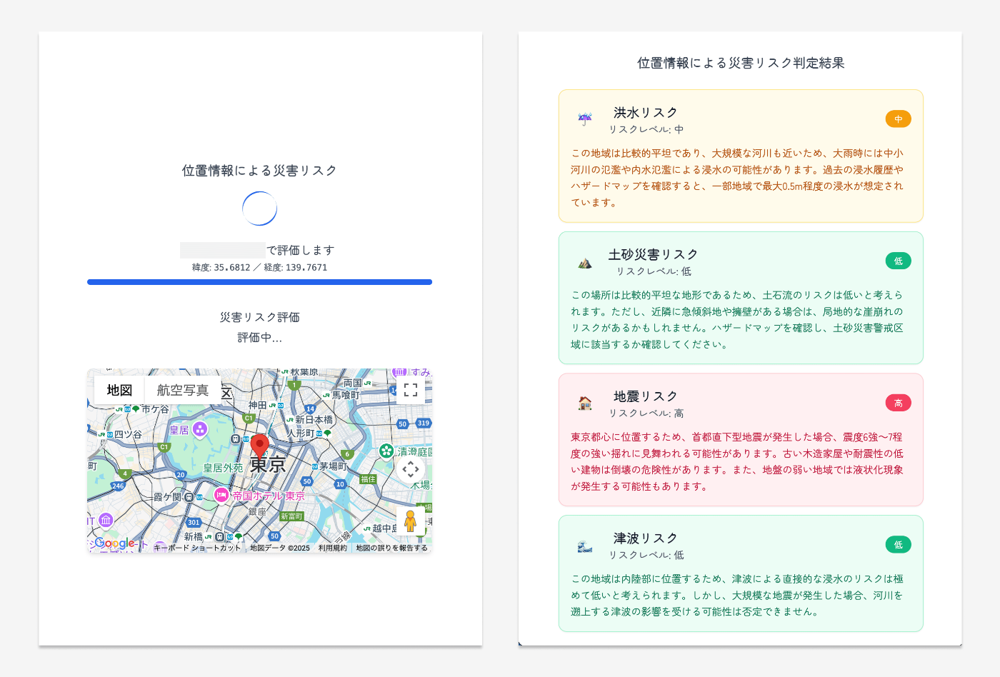
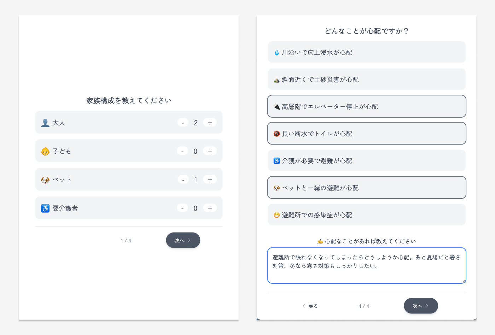
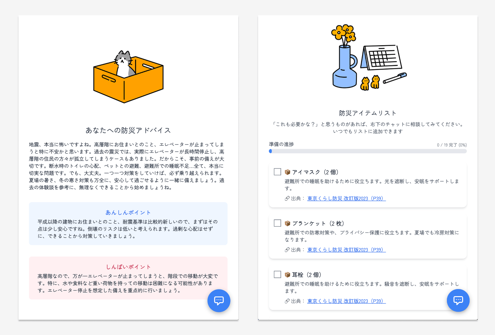
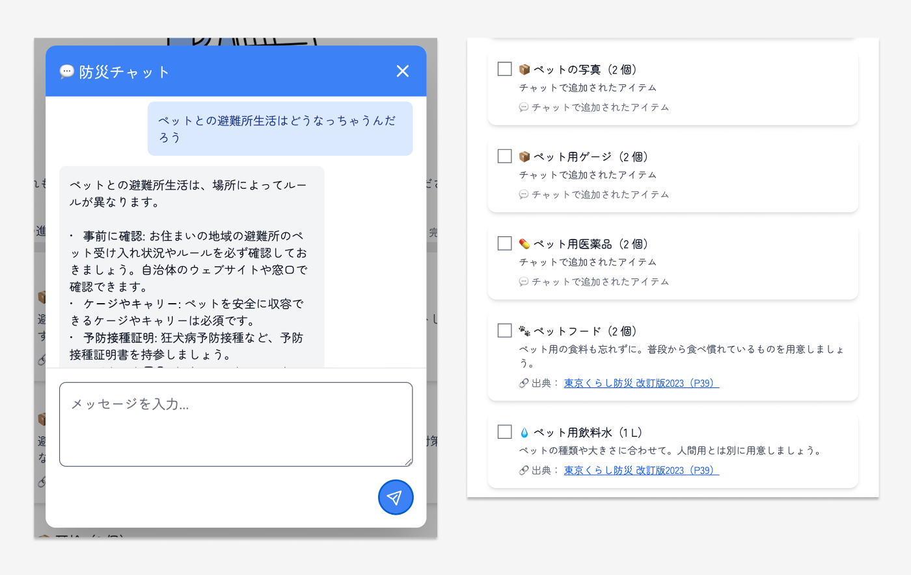
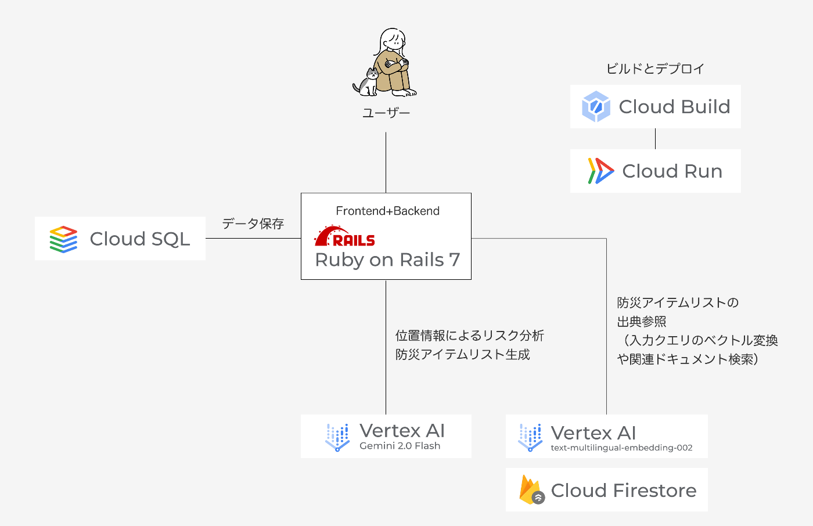

#  背景：数字だけだとピンとこない、でも無性に心配なる「災害への備え」

首都直下地震が今後30年以内に発生する確率はおよそ70%。  
「30年」「70%」……数字は具体的でインパクトはあり、確かに恐怖を感じているのに、“いつか来る”を“今日の行動”に変えられない人、私だけではないかもしれません。

実際の私は──  
・自治体の防災パンフレットを読んでも「ふむ」と閉じる  
・防災アイテム関連コーナーは横目でスルー  
ただ、インスタでたまたま見かけた「被災者が語る！避難所で本当に役立った○選」に触発されて、簡易トイレを衝動買いしてしまう。  
こうして家には“急に心配になって買ったもの”が増えていく一方、本当に被災したら何が必要なんだろう？とりあえず防災アイテムのセットを買っておく？対策は曖昧なままになっていました。  

#  目的：ファクト（客観）と しんぱい（主観）の掛け合わせで、納得感のある防災プラン

**ファクト（客観）だけでは動けない**  
**しんぱい（主観）だけでは偏る**

だからこそ、位置情報を基にしたリスク分析に加え、「避難所で眠れなかったらどうしよう」、「生理への備え、みんなどうしてるんだろう」といった心配にとことん寄り添う。  
ファクト × しんぱい で災害への備えを促す防災コンシェルジュ Sonael(ソナエル)を作りました。  

#  対象のユーザー：防災意識はあるが、具体的な行動に移せていない一般生活者

・備蓄って言われても、何からやればいいか分からない…  
・ハザードマップや自治体の情報は読んだことはあるが、自分に必要な対策が分からない  
・30分程度で防災の「最低限」を整えたい

#  機能：5秒でリスク分析+じっくり心配に寄り添う“二段ロケット体験”

**1\. 位置情報によるリスク分析**  
緯度経度から洪水・土砂災害・地震・津波の4項目を迅速に判定し、「高・中・低」のリスクレベルを提示（⏱約5秒）  

**2\. しんぱいのヒアリング**  
家族構成や住宅条件に加え「被災時にペットが心配」「避難所で眠れなかったらどうしよう」など感情面をヒアリング  

**3\. 分析レポート＆防災アイテム提案**  
「リスク評価」と「しんぱい」を組み合わせたパーソナライズドレポートを生成。推奨する防災アイテムは自治体資料を出典として提示し、家族構成と備蓄目標日数に基づいて必要量を自動計算  

**4\. チャットで深掘りサポート**  
友達に打ち明ける感覚で質問 → AIが追加アイテムや代替策を提案。“自分だけの防災アイテムリスト”が会話のたびに育つ  

###  機能詳細 — 客観と主観を明確に分離

機能 | **客観  
──外部ソースで “測る・示す”** | **主観  
──ユーザーのしんぱいに “寄り添う”**  
---|---|---  
リスク評価 | • 緯度経度 → 洪水・土砂・地震・津波を「低-中-高」でスコア化  
• 各リスクの具体的な影響と対策を提示 | • リスク評価の結果をユーザーの状況に合わせて解説  
• 心配事に関連するリスクを重点的に説明  
防災アイテムリスト | • 自治体が公表する防災関連の資料を出典元とし、必要品目と推奨量を抽出（ハルシネーション抑制）  
• 家族構成と備蓄目標日数に基づいて必要量を計算 | • ユーザーの心配事に関連するアイテムを優先的に提案  
• 準備状況を視覚的に表示（進捗バー）  
防災チャット | • ユーザープロフィール情報をコンテキストとして活用  
• 過去のチャット履歴を参照して一貫した回答 | • 共感的な口調でユーザーの不安に寄り添う  
• 会話から必要なアイテムを検出し、リストに追加  
  
#  アーキテクチャと特徴

・フロントエンド・バックエンドはRuby on Rails 7で構築。  
・事前に東京都の防災ガイドブック（東京くらし防災2023）などはFirestoreに保存し、必要に応じてベクトル化して検索に利用。  
・ユーザーの回答をベクトル化し、Vertex AIのtext-multilingual-embedding-002モデルを使用して埋め込みを生成。VectorSearchServiceを使用して、生成された埋め込みを基にVertex AIのインデックスで類似ドキュメントを検索。  
・検索結果のドキュメントIDを使用して、Cloud Firestoreから関連するドキュメントを取得し、「出典：東京防災マニュアルP.19」などアイテムごとに出典を表記。  
・Vertex AI Gemini 2.0 Flashを使用して防災アイテムリストやリスク評価を生成。生成されたリストや評価結果はCloud SQLに保存。  
・生成したリストや回答の精度に関して、ユーザーからのフィードバックを収集。  
・Cloud Buildを使用してアプリケーションをビルドし、Cloud Runでデプロイ・運用。

#  ユーザーの声

実際に防災エージェント「Sonael」を家族・知人に使用してもらいました。  
**１）30代・女性1人暮らし**  
👉🏻総合評価：8/10

☁️before:  
非常用持ち出し袋はamazonで購入してあるが、それ以外は特に対策していない。

☀️after:  
非常用持ち出し袋に以下のアイテムを追加。  
・生理用品、簡単に着れるワンピース、腹巻き：生理対策。「これまで被災中に生理になることを想像できていなかったが、防災チャットとの会話で気づきを得た」とのこと。  
・カイロ、長めの靴下：避難所での防寒用に。

🙂よかった点：  
・災害について考えるのは暗い気持ちになるが、常に寄り添う口調なので前向きになれるのが嬉しい  
・防災チャットとの会話が良い体験だった。言語化していない不安を抱えていたことに気づき、ひとまず行動に移せたので安心できた

🤔今後の改善点：  
・近くの避難所の情報や公的機関への連絡先などパッと確認できるようにしてほしい  
・実家の家族の分も診断したい。東京以外へのエリア対応してほしい

* * *

**２）60代・男性夫婦2人暮らし**  
👉🏻総合評価：4/10

☁️before:  
水や防災用の食材（缶詰、フリーズドライのおかゆなど）をはじめ、最低限の備えはしている。避難所の場所や緊急連絡先なども把握している

☀️after:  
・現在住んでいる自治体が監修する「ペット防災手帳」の存在を知り、早速プリントアウトして作成

🙂よかった点：  
・今の備えで割と十分であることが確認できた。  
・ペットとの避難所生活はどうするか、ある程度想定して準備はしていたが「ペット防災手帳」の存在は知らなかった。

🤔今後の改善点：  
・位置情報を踏まえた公的なソースの提示の精度を上げてほしい。市役所の情報を正確に引用したり、リンク先を提示してもらいたい。  
・家の中の対策（家具の固定、消化器の設置など）についてもアドバイスが欲しい。gemini liveで聞けば教えてくれるので十分かもしれないが…

#  今後実装したい機能

・エリア・地域別の公式防災ガイドブックのデータを自動でクローリング。位置情報と公的根拠の組み合わせで出典の精度と納得感を向上  
・ハザードマップと組み合わせたリスク情報の可視化  
・防災アイテムの購入リンク表示（Amazonや楽天など価格比較できる形を想定）  
・LINEでのプッシュ通知による「準備の途中離脱」の防止

#  まとめ

第2回 AI Agent Hackathonでは「ファクト × しんぱい」という視点で、防災を自分ごと化し、行動に繋がる体験をどう作るかに挑みました。合理的に考えれば必然的に優先順位が高くなるはずの「防災」をどう行動に直結させるか、UIやストーリー設計に頭を悩ませながらも、「誰でも使えて行動できるAI」を目指して手を動かし続けた数週間でした。今後実装したい機能も見据え、より良いアプリに仕上げていきたいです。
