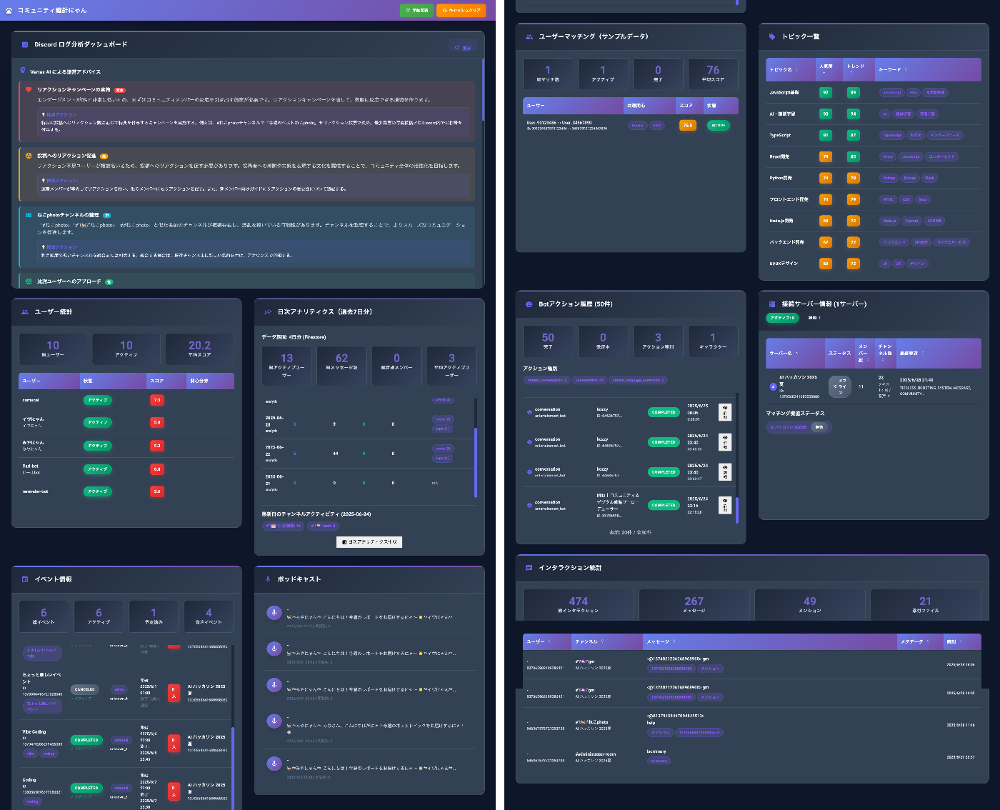
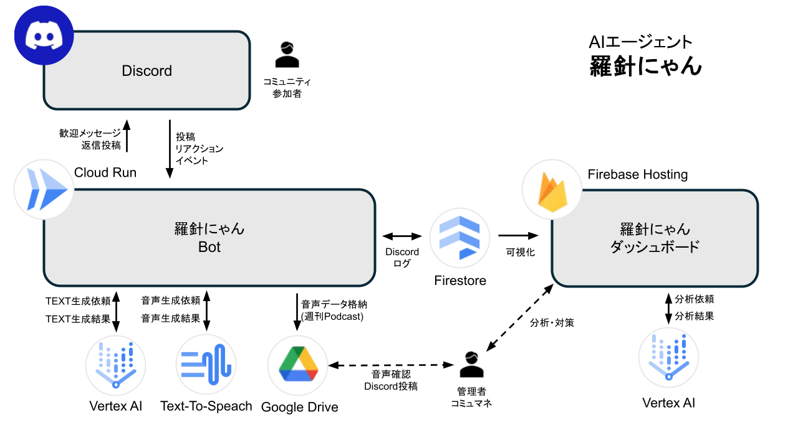

!

本記事は「第2回 AI Agent Hackathon with Google Cloud」参加記事です

##  はじめに

今回、普段コミュニティ運営に携わっているメンバー5名でこのハッカソンに参加しました。

私たちが注目したのは、「Discord」などのオンラインコミュニティを運営する際の“地味に大変な作業”をAIでサポートできないかという点です。

例えば、こんな経験はありませんか？

  * 新しく入った参加者がうまく馴染めずにすぐ離脱してしまう
  * 質問や投稿にすぐに反応できず、雰囲気が冷えてしまう
  * 忙しくて日々の管理がおろそかになってしまう

これらはすべて、コミュニティ運営でよくある悩みで、全てコミュニティ運営者の負担となっています。

###  コミュニティにおけるよくある課題

####  コミュニティ運営者

  * 非定型作業の多さ：新規参加者への挨拶、ルールの説明、質問への回答、活性化のためのコンテンツ企画、参加者同士のトラブル対応など、日々の対応が多岐にわたり、効率化しづらい。
  * 投稿への対応プレッシャー：参加者の満足度低下に直結するため、投稿やメンションが見落とされないよう常に気を配る必要がある。

####  コミュニティ参加者

  * 高い離脱率：参加直後、「ルールが多すぎる」「情報が多く、どこから見ればよいかわからない」と感じて離脱するケースが多い。
  * 投稿しづらい雰囲気：「誰も自己紹介していないから、自分だけ投稿するのは気が引ける」「内輪感が強くて、会話に入る勇気が出ない」といった雰囲気は、参加への一歩を躊躇させます。

そこで私たちは「Discordで活躍するAIエージェント」を開発し、運営者の負担を減らしながら、参加者同士のつながりや活発なやり取りをサポートすることを目指しました。

##  開発したプロダクト概要「コミュニティ羅針にゃん」🐾

このプロダクトは、企業のコミュニティ担当者・サロン主催者・個人クリエイターなどの運営者と、新規参加者が直面する前述のような課題を解決する “コミュニティ運営AIコンシェルジュ” となります。  
AIコンシェルジュは、”にゃんこ”をモチーフにしたbot です。

!

【小話🐈】  
今回猫をモチーフにした理由は、相手の心理的ハードルを下げるためです。  
猫は「かわいくて癒される」「ちょっと抜けていても許される」存在として、多くの人に親しまれています。そのため、Botが猫の姿をしていると、相手が自然と寛容になり、リラックスしてやり取りできるようになると考えました。

###  説明動画

<https://youtu.be/glNtGUrHXso>

###  🧠AIエージェント

新規参加者の歓迎、非アクティブユーザーへの働きかけ、コミュニティ内のつながり強化を目的にAIエージェントを開発しました。このAIエージェントのサポートにより、すべての参加者に心地よい場所の提供を目指します。

このAIエージェントは、下記の３つの機能を持ちます。

####  1\. コンシェルジュ機能

  * 新規参加者に対して、自動で歓迎メッセージを送信し、コミュニティルールや参加の手引きを案内します。
  * コミュニティ内で質問が投稿された際に、自動で回答したり、過去ログやナレッジベースから関連情報を提供します。
  * 必要に応じて、参加者とDMでやりとりを行い、個別サポートも可能です。

####  2\. コミュニティを盛り上げる機能

  * 取得したログを元に参加者毎のステータスを分析し、アクティブでない参加者に定期的にメッセージを送り、参加を促します。
  * 定期配信（例：週刊ポッドキャスト、今日の話題、アンケート）を通じて会話のきっかけとなる投稿を、AIエージェントが自発的に行います。
  * 特定の話題やイベントに対して、参加者をタグ付けしてリマインド通知を送ることで、参加率を向上させます。

####  3\. Discord内のやり取りを記録する機能

  * 投稿、返信、リアクション、DMなどのやり取りを自動でログに保存します。
  * Firestoreを用いて時系列で整理・蓄積し、管理者はダッシュボード上から閲覧できます。
  * ログは分析に活用でき、未反応の投稿を検出したり、活発なスレッドを可視化することが可能です。

これらの機能を組み合わせることで、運営者の負担を軽減しつつ、コミュニティの活性化と参加者の満足度向上を実現します。

###  📈ダッシュボード

AIエージェント機能の他にも、以下のようなコミュニティ内の状態を可視化し、コミュニティ運営者が見て判断できるようなダッシュボードを構築しました。

<https://nyanco-bot.web.app/index.html>

  
_実際のダッシュボード画面_

  * ログ分析機能：Vertex AIによる運営アドバイス、チャネル別アクティビティ状況、コミュニティ健康度など、コミュニティ運営を支える分析情報を可視化します。
  * ユーザー統計：ユーザー毎の活発度をスコア化し可視化します。
  * 日次アナリティクス：日別のアクティブユーザー数や投稿数、人気のトピックを可視化します。
  * イベント情報：Discord内に設置されたイベントの参加状況等を可視化します。
  * ポッドキャスト：Discord内の過去１週間の出来事をまとめたポッドキャストの一覧。
  * ユーザーマッチング：ユーザー毎の関心軸を分析し、似た関心軸を持つ他のユーザーを探します。
  * トピック一覧：Discord内で上がった人気あるトピックを可視化します。
  * Botアクション履歴：AIエージェントがどのような反応をしたのを可視化します。
  * 接続サーバー情報：Discordサーバの情報を提示します。
  * インタラクション統計：誰がどのチャネルで投稿した、リアクションした等の最も生データに近い情報を提示します。

このコミュニティ羅針にゃんの「ダッシュボード」では、運営者はコミュニティの温度感を定量的に把握し、適切なタイミングで介入・改善を行うことが可能になります。Discordコミュニティ運営者が直面する、多岐にわたる手作業による運営負荷の増大や、新規参加者の高い離脱率といった課題に対して、運営をサポートし負荷を軽減します。  
具体的には、アクティブユーザー率、メッセージ投稿数などのエンゲージメント指標や人気トピック、全てのユーザーインタラクション履歴を可視化し、コミュニティの活動状況を一目で把握できます。これにより、運営側が反応していない投稿やメンションに対する見逃し通知などにより、通知漏れを防ぎ、広報の省力化が図られます。  
これらの機能を通じて、データに基づいた迅速な意思決定と、より質の高いユーザー体験を提供し、それらはコミュニティの活性化に貢献します。

##  技術スタックと構成

今回、参加者のエンゲージメント強化とコミュニティ活性化を目指し、最先端の技術スタックを駆使して挑戦しました。核となるDiscordボットは、サーバーレス運用が可能なCloud Runにデプロイ。開発効率を最大化するため、Cursorを主要な開発環境としたVibe Cordingを採用しました。データ管理にはFirebase (Firestore) を使用し、Discordのログやユーザー情報を効率的に格納します。

###  システム構成とアーキテクチャ

###  🧠AIエージェントの技術スタック

  * **Discord.py（Python）**  
羅針にゃんBotは、discord.py をベースに構築したAIエージェントBotです。メッセージやリアクションなどのDiscord内イベントをフックに、各種処理を非同期で実行しています。

    * メッセージ監視・ログ取得・リアクション対応
    * 管理者向けのWebhookやラジオ配信のトリガー処理
    * Firestoreへのログ書き込み処理
    * Geminiとの連携による自然言語生成
  * **Cloud Run（＋Docker）**  
Bot本体はPythonアプリケーションとしてDocker化し、Google Cloud Runで常時稼働。スケーラブルかつフルマネージドな構成で、イベント駆動とスケジューリング双方に対応しています。

    * 複数の処理タスクを単一サービスで統合管理
    * コミュニティの状態を元にしたラジオ自動生成
    * 定期ジョブによる非アクティブユーザーの検知と対応
  * **Vertex AI（Gemini API）**  
生成AIを活用することで、Botのインテリジェンスを担保しており、以下のような「自然言語理解・生成」タスクを実行しています。

    * ユーザーの投稿内容からトピック分類・要約
    * コミュニティの空気を読む「カジュアル挨拶文・参加促進文」の生成
    * ユーザーの関心や発言パターンの分析
    * Botが投稿する定期話題・アンケートテーマなどの企画生成
  * **Text-to-Speech AI**  
Vertex AIで生成した要約テキストをGoogle Cloud Text-to-Speechで音声変換し、Discordラジオとして保存。音声による「週刊コミュニティ要約ラジオ」など、人の作業に依存するオンラインコミュニティプラットフォームでは実現困難であった処理を提供しています。

####  📈ダッシュボード機能の技術スタック

  * **Firebase Hosting（＋HTML/CSS/JS）**  
管理画面は、Firebase Hosting上でホスティングされたシングルページWebアプリ（SPA）として提供しています。

    * 管理者がリアルタイムに状況を確認できるダッシュボード
    * 参加者ごとのアクティブ率や発言傾向を一覧化
    * 投稿ログやエンゲージメント状況の時系列変化を視覚化
  * **Firestore**  
Botとダッシュボードの中心となるNoSQLデータベース。Discord上のユーザー行動・発言・リアクション・トピックなどをすべて構造化して蓄積しています。

    * 投稿/リアクション/DMのログデータを時系列に記録
    * ユーザーごとのプロフィール・ステータス・行動履歴
    * トピック分類・イベント参加履歴・マッチングデータ
  * **Vertex AI（分析モジュール）**  
管理画面でもGeminiを活用し、各種分析とアドバイスを自動生成。「今の盛り上がりトピックはどこか？」「反応されていない投稿は？」などを自然言語でアドバイス表示します。

    * エンゲージメントレベルの予測と、運営の次の打ち手の提案
    * ユーザー属性と行動履歴からマッチング候補を可視化

####  📁 データ連携・外部出力

  * **Google Drive**  
ラジオ生成用の一時データ保管・エクスポートとしてGoogle Driveを活用しています。 
    * 生成された週刊要約テキストとTTS音声ファイルをDriveに保存
    * Drive内データは運営チームが手動/自動で再利用可能（例：YouTube配信用など）

##  今後の展望

**感情豊かな猫型AIエージェントへの進化**  
AIエージェントに感情表現豊かな機能を追加していく予定です。具体的には、合成音声と連携し、ネコのイラストが発話に合わせて口の動きや表情を変化させる機能を実装することで、より親しみやすく、インタラクティブなユーザー体験をお届けできるようにしたいと思っています。

!

開発こぼれ話  
当初、AIエージェント機能とダッシュボード機能を1つのリポジトリで作成をしておりましたが、Vibe Cordingを進める上で、片方の機能の修正時に、逆側の機能についても不意な修正が入ってしまうこともあり、またそれが即時発見できなかったこともあり、締め切り間近になりリポジトリを分けるという事となってしまいました。  
Vibe Cordingにおいては、機能毎にリポジトリを分けるなど、当初からの環境設計が非常に大切だと痛感しました。

##  まとめ

運営者の負担を減らし、みんなが「このコミュニティにずっといたい」と思えるような場所づくりをお手伝いします。  
かわいい猫型ボットが会話を盛り上げたり、データをもとに運営をサポートする専用画面（ダッシュボード）によって、参加者一人ひとりの小さな変化にも気づきやすくなり、自然とコミュニティのつながりが深まることを目指します。

##  ハッカソン参加メンバー

・[Kozzy](https://x.com/kozzy0919)  
・[Mitz](https://x.com/CharaDenMitz)  
・[かーでぃ](https://x.com/_0447222690292)  
・[yukkin](https://x.com/meme_studi0)  
・[あやや](https://x.com/ayyh_18)
