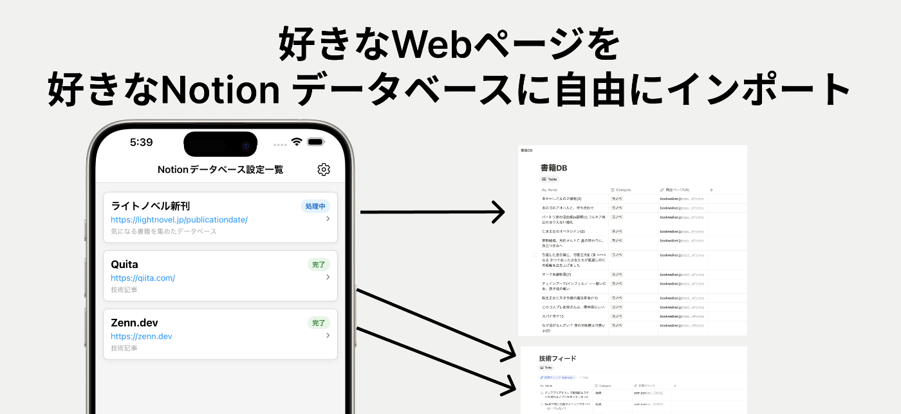
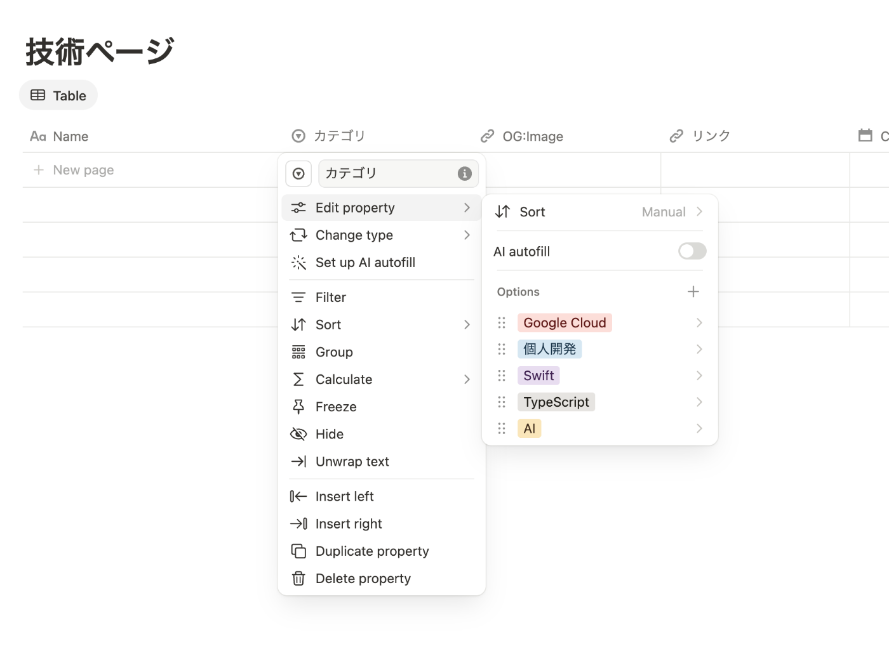

[第2回 AI Agent Hackathon with Google Cloud](https://zenn.dev/hackathons/google-cloud-japan-ai-hackathon-vol2?tab=overview) の応募記事です。Importion というアプリを作りました

##  背景

Webページを好きなNotionデータベースへ保存できるモバイルアプリ **Importion** を作成しました。ちなみに作った経緯は私が熱狂的なNotionユーザー！というわけではないですが、あったら便利そうという理由で作りました。詳しくは後述します。先に類似アプリを紹介します

###  類似アプリ

色々ありますが、有名どころだと[Save to Notion](https://chromewebstore.google.com/detail/save-to-notion/ldmmifpegigmeammaeckplhnjbbpccmm?hl=ja&pli=1) ですかね。こちらはChrome Extensionです。他の類似機能を提供しているサービスはChrome Extensionであるものが多いですね。Importionでは今ゆるゆるとWebとChrome Extensionにも対応しています。現在はiOSのみストアに出ています。ちなみにAndroidへの審査はメタデータを用意するが億劫で需要があったらやろうかなくらいの温度感です。iOSのみだけストアに出してみたのは、そもそもハッカソン用のプロダクトだったというのもあります。

もし期待している方がいたら教えてください。開発と審査のモチベになります

##  課題と解決策

先程の「あったら便利そう」発言を少し深掘りしていきます。Importionで提供している価値は以下のとおりです

  1. 一覧ページのリンクを登録することで、一括で登録。リンク先の情報も見て登録してくれる
  2. zenn.devのようなトップページが毎日更新される情報も定期実行して取得してくれる
  3. Notionデータベースを自由に定義したい

元々 Save to Notion を軽く使っていたのですが、いくつか自分似合ってないと思った部分がありそれならこのハッカソンを機に作ってみようかと思いました。ここで挙げたもの以外にもまだまだやりたいことはあります。ここでは、現在実装されて実現できているポイントをあげさせてもらいました。類似サービスで類似機能があることは確認しているのですが、例えば定期実行や一覧ページのリンク先のコンテンツまで取得するようなことはしてくれるものは見当たりません(もちろん見つけられてない可能性もありますが)。とりあえずコンテンツを入れてNotion AIに問い合わせたい人は多いと思います。あとは最後の「Notionデータベースを自由に定義したい」なのですが、類似サービスだとNotionに備わっているプロパティでもサポートされてなかったり、データベースの形が決まっていたりします。Multi Selectとか使いたいな(画像参照)。と思ったのも作るきっかけとして大きかったです

改めてまとめると「どこからでもどんな形式のWebページでも、好きな形のNotionデータベースに登録できる」そんなサービスになっています

##  動画

<https://youtu.be/WzlU5CTIRsg>

##  🎯 Importion システム構成図（Flutter & Firebase）

FlutterアプリとFirebaseバックエンドの接続を示したシステム構成図です。

###  🔥 Firebase活用のポイント

####  **Cloud Functions** \- サーバーレスアーキテクチャ

  * URL解析、Notion連携、定期実行などの重い処理をサーバーサイドで実行
  * スケーラブルで管理不要な実行環境
  * Cloud Tasks による非同期処理

####  **GenKit for Firebase** \- Google AI統合

  * Gemini APIをシームレスに統合
  * コンテンツ解析とスキーママッピングをAIで自動化

####  **Cloud Firestore** \- リアルタイムデータベース

  * ユーザーデータ、設定、インポート履歴をリアルタイム同期
  * オフライン対応で快適なUX

####  **Firebase Auth** \- セキュアな認証

  * 複数の認証プロバイダー対応
  * セキュアなユーザー管理

##  AI部分について

どのようにAIを使ったのか説明になります。Gemini 2.0 Flash をAPI経由で使用しています。十分な精度が出ているため2.5系列やProモデルは使用していません。NotionのAPIはNotionがそうであるように自由度が高く、様々なプロパティがお互いに関係性を持つように設計されています。構造をどこまでも複雑化することができ、実際にNotionを使えば使うほど複雑になっていきます。それ故にSave to Notionのような従来のNotionのサードパーティツールでは、Notionデータベースのスキーマをツール側が決定して固定するのが現実的な実装方法でした。しかし、GeminiによりNotionのデータベースを事前に定義するのではなく、定義されたNotionデータベースの定義をAPI経由から取得して、それを流用することでデータベースのコンテンツを追加することが可能になりました。この点がこのプロジェクトの一番のチャレンジな部分だったと思います

参考: [Notion API](https://developers.notion.com/docs/getting-started)

###  その他工夫した点や補足

  * 実行後のバックエンドの処理が非同期で完了し、Notionデータベースにインポートしていく形のためCloud Tasksを起用しています。Taskの進捗具合によりFirestoreの状態を更新していき、それをリアルタイムでアプリ側で監視するようにして進捗具合を更新していっています
  * Genkit で Vercel AI から Gemini の使用を検討してたのですが、[Vercelのai-sdk](https://ai-sdk.dev/docs/introduction) を使用してます。Geminiを指定して生の(zod定義とかではない)JSON Schemaを渡すと「対応してない」と言われたのでこのような少し不自然な形になっています。対応したらGenkitの機能を自然と使うようにしたいですね

##  まとめ

NotionのAPIを使ったことある人ならわかると思いますが、すごい柔軟に関係性も複雑にできるように型の設計がされているので扱いが難しいものでした。ですが、AIに解釈させてJSON Schemaを元にAPIを通じてコンテンツを作成できました。プロダクトとしての出来や需要はとりあえず置いておいて、複雑な構造をプログラムを書かずに取り扱ってくれる生成AIの柔軟性をうまく取り込めた作品になったのかなと個人的には思っています。アプリの方も、もしよかったらNotionユーザーの方は使ってみてください。白状するとまだまだ不具合もあるし機能不足なところもあります。そういったフィードバックも大歓迎です

おしまい \\(^o^)/
