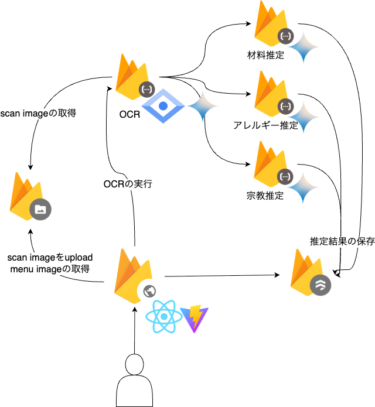

#  すべての人の「食」のバリアをなくしたい！メニュー翻訳＆アレルギーチェックアプリ「すっきゃなー」🌯🍣🍜

##  🚀 はじめに：誰もが「食べたい」を諦めない世界へ

海外旅行先のレストランで、メニューが読めずに困った経験はありませんか？あるいは、食物アレルギーや宗教上の理由で、外食を心から楽しめないという方はいらっしゃいませんか？

食は、文化を体験し、人々と繋がり、喜びを分かち合うための素晴らしい手段です。しかし、言語の壁、食物アレルギー、宗教上の規定、健康上の理由といった様々な「食のバリア」が、その楽しみを不安やストレスに変えてしまうことがあります。

特に、豊かな食文化を誇る日本は、国内外から多くの人々を惹きつけます。しかしその一方で、複雑な食材や調理法が、食事制限を持つ人々にとって大きな障壁となっているのが現状です。

私たち `barbecue-trio` は、この根深い課題をテクノロジーで解決したいと考えました。  
そして生まれたのが、**「手元のスマートフォンで飲食店のメニューを撮影するだけで、一人ひとりの食事制限に合わせて食べられるものを瞬時に判別できる」**アプリケーション、「すっきゃなー」です。

##  🤔 誰の、どんな課題を解決するのか？

「すっきゃなー」は、多様な背景を持つ、以下のような方々が直面している切実な課題解決にフォーカスしています。

###  1\. インバウンド観光客

日本政府観光局（JNTO）の統計でも明らかなように、日本の「食」は観光の最大の魅力の一つです。しかし、その裏側では多くの観光客が困難に直面しています。参考 : [世界の旅行者の「旅行の目的になるもの」は？](https://www.jnto.go.jp/projects/regional-support/resources/3767.html#:~:text=%E7%8E%87%EF%BC%88%E6%9D%B1%E3%82%A2%E3%82%B8%E3%82%A2%E5%B8%82%E5%A0%B4%EF%BC%89-,%E4%B8%96%E7%95%8C%E3%81%AE%E6%97%85%E8%A1%8C%E8%80%85%E3%81%AE%E3%80%8C%E6%97%85%E8%A1%8C%E3%81%AE%E7%9B%AE%E7%9A%84%E3%81%AB%E3%81%AA%E3%82%8B%E3%82%82%E3%81%AE%E3%80%8D%E3%81%AF%EF%BC%9F,-%E6%B5%B7%E5%A4%96%E6%97%85%E8%A1%8C%E3%81%AE)

**具体的な課題:**

  * **言葉がわからない！** 多くのメニューは日本語のみ。翻訳アプリを使っても、「親子丼」が "Parent-and-Child Bowl" と訳されるなど、料理の固有名詞や文化的なニュアンスまでは理解できません。
  * **宗教上の制限を守りたい！**
    * **ムスリム（ハラル）の方々:** 醤油やみりんに含まれるアルコール、豚由来のゼラチンなど、見えない成分との戦いです。
    * **ヒンドゥー教徒の方々:** 牛肉だけでなく、ビーフエキスが使われたカレーなど、知らずに食べてしまうリスクがあります。
    * **ベジタリアン/ヴィーガンの方々:** 動物性の出汁（鰹節や煮干し）は、日本の食文化に深く根付いており、避けるのが非常に困難です。

結果として、せっかくの旅行なのに日本の美食を十分に楽しめない状態に陥る可能性があります。

###  2\. 食物アレルギーを持つ人々

日本国内でも、食物アレルギーを持つ人は年々増加しています。彼らにとって外食は、楽しみであると同時に、命に関わるリスクを伴う行為です。

**具体的な課題:**

  * **表示だけでは不十分！** 食品表示法で義務化されているのは特定原材料8品目のみ。それ以外のアレルゲンや、外食時の詳細な成分は明記されない場合があります。
  * **聞くのが申し訳ない…** 店員さんにアレルギーについて尋ねること自体が、大きな負担になることもあります。「忙しいのに悪いな」「面倒な客だと思われたくない」と感じてしまいます。
  * **コンタミネーションが怖い！** 同じ調理器具を介してアレルゲンが混入するリスクまで、なかなか把握できません。

この課題は、アレルギーを持つ人々やその家族を外食から遠ざけ、大切な食の機会を奪っています。

###  3\. 多様化する食のスタイルを持つ人々

健康や倫理的な理由から、グルテンフリーや糖質制限といったライフスタイルを選ぶ人も増えています。しかし、その選択肢はまだ多くありません。「野菜サラダ」を頼んだらベーコンチップが乗っていた、なんてことも日常茶飯事です。

これらのユーザーに共通するのは、**「情報の非対称性」**と** 「コミュニケーションコスト」**という根深い問題です。

##  ✨ 私たちの解決策：「すっきゃなー」

「すっきゃなー」は、これらの課題を解決するため、「信頼できる食のパートナー」を目指します。

###  📱 コア機能紹介

  1. **高精度メニュースキャン機能（OCR & AI解析）**

     * メニューを写真に収めるだけ、OCRが高速でテキスト化します。
     * AIが料理名や説明文の文脈を理解し、「カツ丼」から「豚肉、卵、小麦」のように、含まれる食材を高い精度で推定します。
  2. **パーソナライズされた食事制限設定**

     * アレルギー28品目はもちろん、宗教上の禁忌、ヴィーガンなどの主義といった個人的な好みまで、きめ細かく設定できます。
     * 一度設定すれば、注文の際に店員さんに伝える手助けをしてくれます。
  3. **分かりやすい解析結果のリスト表示**

     * スキャンしたメニュー画像と、AIが解析した各メニューの詳細リストを並べて表示します。
     * タップすれば、その
  4. **食文化解説機能**

     * 単なる成分分析だけでなく、AIがその料理の文化的背景や特徴を教えてくれます。食への理解が深まることで、食事体験がより豊かなものになります。

##  🛠️ 私たちの挑戦を支える技術（アーキテクチャ概要）

「すっきゃなー」のシンプルで直感的な体験は、様々な技術の組み合わせによって支えられています。ここではその全体像をご紹介します。

###  フロントエンド

  * **フレームワーク:** `React` (`TypeScript`)
  * **ビルドツール:** `Vite`
  * ユーザーがストレスなく操作できる、高速で直感的なUI/UXの実現を目指しています。メニューを撮影すると、その画像と解析結果のリストを分かりやすく表示する中心的な体験を構築します。

###  バックエンド

  * **環境:** `Firebase Functions` (`Node.js` \+ `TypeScript`)
  * サーバーレスアーキテクチャを採用することで、需要に応じた柔軟なスケーリングと、迅速な機能開発を可能にしています。OCR処理のリクエストや、AIへの問い合わせなどを担当します。

###  データベース

  * **DB:** `Cloud Firestore` (NoSQL)
  * ユーザーの食事制限プロファイルや、アプリケーションで利用する各種マスタデータを格納します。柔軟なデータ構造を持つFirestoreは、今後の機能拡張にも対応しやすいという利点があります。

###  AI / 機械学習

  * **OCR & NLP:** `Gemini`
    * メニュー画像から高精度にテキストを抽出するOCR機能と、抽出したテキストから食材を推定したり食文化を解説したりする自然言語処理(NLP)機能の両方を、Geminiモデル（`gemini-2.5-flash`など）を活用して実現しています。
    * 料理の文脈を理解し、単なるキーワードマッチングでは見つけられない「隠れた食材」を発見することが、このアプリの核となる価値です。

これらの技術要素が連携し、ユーザーの手元で「メニューをスキャンするだけ」というシンプルな体験を生み出しています。

##  デモ

<https://youtube.com/shorts/d9IyYLyGEnQ?feature=share>

##  🚀 本ソリューションがもたらすもの

将来的には、ユーザー同士が情報交換できるコミュニティ機能や、飲食店が公式情報を発信できるシステム、さらには事前予約システムとの連携なども視野に入れています。

私たちの旅はまだ始まったばかりです。「すっきゃなー」が、世界中の人々の食生活をより豊かで、安全で、楽しいものにするための一助となることを願っています。

この記事を読んで少しでも共感してくださった方、ぜひ応援よろしくお願いします！ 💪
