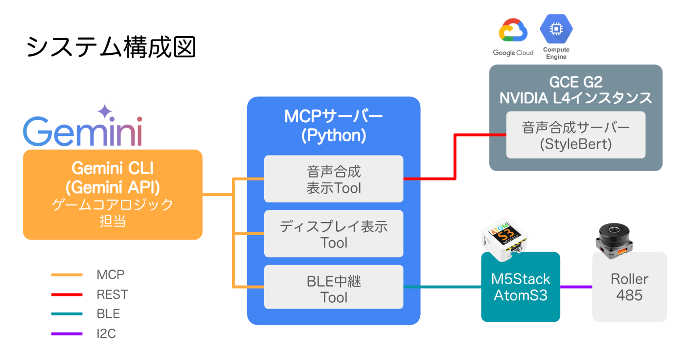
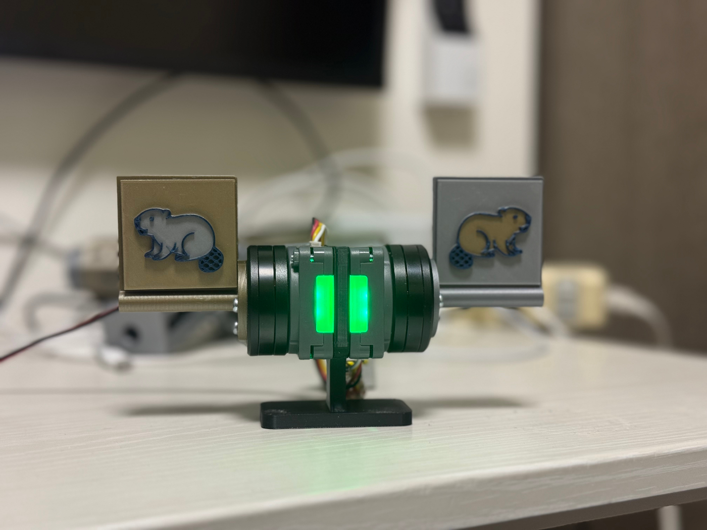
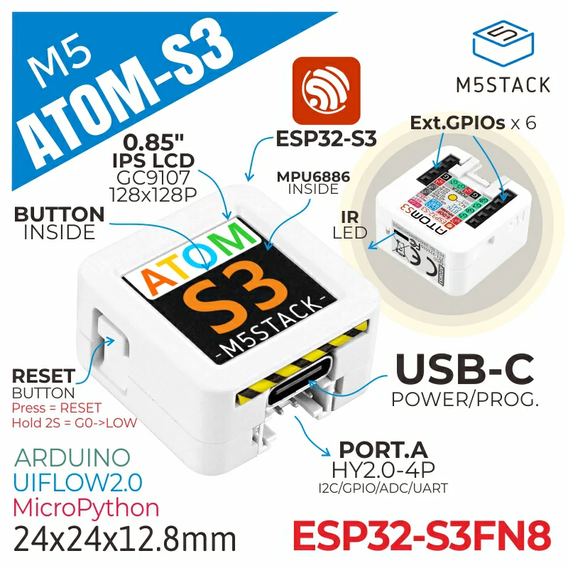
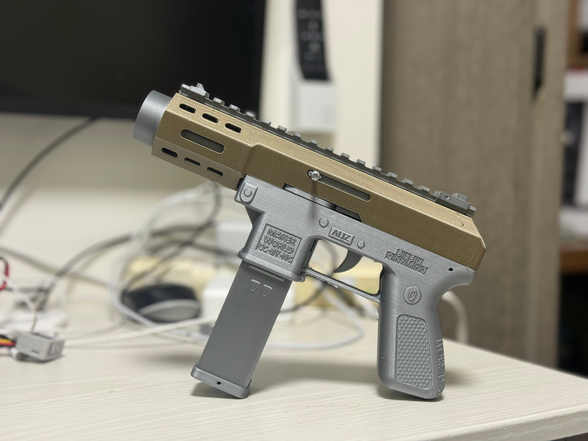
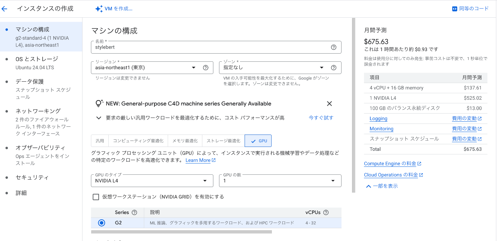

#  性格診断シューティングゲーム「深淵の射撃場」を製作しました！

##  早速、実際に遊んでみた様子

<https://youtu.be/YjTnpDPMKw8>

###  ゲームの遊び方 - How to Play -

「深層の射撃場」の遊び方はとてもシンプルです。以下の通りに進めていく流れになります。

####  **🎯 ステップ1：案内人との対話**

  * あなたは自らの心と向き合う「挑戦者」として、ミステリアスな「深層の射撃場」に足を踏み入れます。
  * まずは、この射撃場の「案内人」の言葉に耳を傾けてください。彼があなたを魂の核心へと導きます。

####  **🤔 ステップ2：的を撃ち、心で答える**

  * 案内人から、あなたの内面に迫る複数の質問が投げかけられます。
  * 回答方法は、言葉で答えるのではありません。「はい」と「いいえ」に対応する2つの的のうち、あなたの心に従う方を**撃ち抜いて** ください。
  * 大切なのは、どの的を選ぶかだけではありません。あなたが**決断するまでにかかった時間** や、**あえて回答しないという選択肢** も、案内人は静かに見つめています…。

####  **📜 ステップ3：あなただけの診断結果を受け取る**

  * 試練を乗り越えた時、あなたの回答と決断の速さを総合的に分析した、世界に一つだけの診断結果が明かされます。
  * あなたの性格を示す診断文に加え、その魂を象徴する「**二つ名** 」と「**魂の象徴** 」が授けられます。さあ、どんな自分が待っているでしょう？

要約すると、シューティングゲームで遊びながら性格診断が行えるゲームデザインになっています。

##  なぜ診断シューティングゲームなのか

  * 新入社員研修で受けた、あの長〜い適性検査・・・
  * 進路指導のためにやった、キャリア診断テスト・・・  
何十、何百とある質問に、ただ黙々とマークシートを塗りつぶしていく、あのつまらない時間。  
そんな経験はないでしょうか？

結果は少し気になるけど、正直、退屈で眠くなってしまう・・・  
「この時間、もっとワクワクできたら最高なのに！」  
そんな誰しもが一度は抱いたであろう想いを形にするため、このプロジェクトを立ち上げました！

###  対話型人格診断シューティングゲーム「深層の射撃場」プロジェクト概要

####  1\. プロジェクトが対象とするユーザー像

  * **メインユーザー層：**  
会社や学校で実施される画一的な性格診断や適性検査に、「やらされ感」や「退屈さ」を感じた経験のある、すべての社会人や学生

  * **サブユーザー層：**

    * 一般的な心理テストは好きだが、ありきたりな結果には満足できず、より深くユニークな自己発見を求めている層
    * 少し変わった刺激的なエンターテイメントを探しているゲーマー層

####  2\. 課題：「義務的な性格診断」が抱える根深い問題

多くの人が経験する会社や学校での性格診断には、以下のような自己理解を妨げている構造的な課題があります。

  * **受動性からくる「やらされ感」：**  
「評価されるため」「義務だから」という意識が先行し、自分と向き合う楽しさが失われています。

  * **プロセスの圧倒的な「退屈さ」：**  
マークシートを延々と塗りつぶすだけの単調な作業は、プレイヤーの集中力を削ぎ、てきとうな回答をさせてしまう要因になります。

  * **結果の「無機質さ」：**  
「協調性：C」のような評価は、時に自己肯定感を下げてしまいかねません。

####  3\. 課題へのソリューション：義務を「冒険」に変えるゲームデザイン

本プロジェクトでは、これらの課題をゲームの力で解決し、「退屈な義務」を「**ワクワクする冒険** 」へと転換します。

  * **能動的な「シューティング」体験：**  
ペンやマウスを置き、心の引き金を引いて「的を撃つ」というアクションで回答。これにより、「やらされ感」は「自ら挑む」という能動的な爽快感に変わります。

  * **プレッシャーを解放する「決断時間」の分析：**  
「早く正確に」というテストの常識を覆し、回答に「迷った時間」にも価値を与えます。これにより、評価を気にするプレッシャーから解放され、プレイヤーは安心して正直な自分と向き合えます。

また、あえて回答しない、という選択肢自体も検知するようにしており、その選択を行なったことにも意味を見出すようにしています。

  * **退屈を打破する「物語」への没入感：**  
ミステリアスな案内人との対話を通じてゲームが進行。プレイヤーを無味乾燥なテスト空間から、スリリングな物語の舞台へと誘い、高い没入感を生み出します。

  * **「評価」ではない「発見」を提供するフィードバック：**  
無機質な評価ラベルではなく、プレイヤーの戦いの軌跡を称えるユニークな「二つ名」を授与。これにより、ポジティブで楽しい自己発見体験を創出します。

####  4\. 本プロジェクトの際立った特徴

上記のソリューションを具体化した、本ゲームならではの特徴は以下の通りです。

  * **さらば、マークシート！新感覚の「シューティング × 人格診断」**
  * **普通のテストじゃありえない！あなたの「迷い」が鍵となる決断速度分析**
  * **評価じゃない、自分だけの「二つ名」がもらえる物語的フィードバック**
  * **堅苦しさからの解放！案内人との対話と実際に撃てる銃にこだわった没入体験**
  * **プロンプト次第で様々な診断やアンケートシステムに活用できる**

##  システム構成

システム構成は以下の通りです。  
見ての通り、質問・選択肢の作成からデバイスや音声合成の制御まで、すべてGeminiで行う形となっています。  


以下がシーケンス図になります

##  ハードウェアの製作

今回のシステムの肝となる部分の、的の部分の製作について解説します。

###  Roller485

的には、Roller485モータを使用しました。  
  
こちらのモーターはエンコーダを搭載しており、自己位置を取得することができます。  
これを利用して、的が倒れた時の検知を行いました。  
また、PIDを用いた位置制御ができ、倒れた的の自動復帰に使用しています。

###  的

的と的の筐体は3Dプリンターを使用して作成しております。  
  
的には金色のビーバーと銀色のビーバーを配置しており、プレイヤーに選択肢を選ぶ際の目印にしています。  
（ちなみに、BambuLabのAMSを使って多色印刷していたりします）

###  制御

的の制御には、M5StackAtomS3を使用しています。  
  
Roller485とはI2Cで通信を行なっており、モータの制御に加えて各モードに応じたLEDの色を切り替えるようにしています。  
システム（PC）とのやりとりはBLEのキャラクタリスティックでやり取りできるようにしており、Writeでモード切り替え、的の検知と打たれるまでの秒数通知をNotifyで行っています。

###  銃

今回のゲームに使用している銃のおもちゃも3Dプリンターで作成しています。  
  
こちらは今回自作したものではなく、中国のビリビリ動画で流行っている、T-15というトイガン3Dモデルを拝借しています。  
<https://makerworld.com/en/models/828658-tec-9-mini-t-15-disc-shooter>

↓銃の印刷・組み立ての様子  
<https://youtube.com/shorts/14F9GomFZP4>

##  BLE操作のできるMCPサーバーを立ててみる

MCPで、LLM(GeminiAPI)からデバイスの操作を行うために、PythonでMCPサーバーを立てました。  
以下のPythonSDKを使用して、Toolsとしてデバイス操作ができるようにしました。  
<https://github.com/modelcontextprotocol/python-sdk>

中身の実装としては、

  1. 呼び出しされると的の準備情報をBLEのWriteで送る
  2. M5がWriteを検知したら、的が準備される
  3. 的をプレイヤーが倒す
  4. 的が倒れたら、M5からNotify経由でサーバーにBLEで送る
  5. サーバーがNotifyを検知する
  6. 検知した情報をMCPサーバーに返す（10秒以上BLEから応答なければ、noneを返す）

という流れになっています。

##  Gemini-CLIでローカルMCP連携

Gemini-CLIでMCP連携の設定を行いました。  
連携方法は以下の記事を参考にしています。  
<https://qiita.com/n0bisuke/items/8686a74d8edcb5d29265>

`.gemini/settings.json`を以下のように書き換えています。
    
    
    {
      "theme": "Default",
      "selectedAuthType": "oauth-personal",
      "mcpServers": {
        "roller": {
          "type": "stdio",
          "command": "【pythonへのパス】",
          "args": [
            "【mcp_server.pyへのパス】"
          ],
          "name": "RollerPIDControl",
          "version": "0.1"
        }
      }
    }
    

##  GCP上に音声合成サーバーを立ち上げる

ゲーム進行中、音声での読み上げを行った方が没入感を上げられるため、リアルタイム音声合成を行っています。  
音声合成には、日本語音声読み上げに定評のある`Style-Bert-VITS2`を使用しています。  
<https://github.com/litagin02/Style-Bert-VITS2>

今回ゲームのテーマ的にも、かっこいい渋いおじさんの声を使いたかったので、こちらのモデルを購入して使用しています。  
<https://booth.pm/ja/items/6814483>

今回`Style-Bert-VITS2`は、GCPのComputeEngineに音声合成用サーバを立ち上げて、RESTでMCPサーバーとやり取りする形で音声合成を行っています。  
リアルタイム音声合成を行うために、計算資源が多く必要で、特にCUDAへ対応しているGPUマシンが欲しかったため、G2インスタンスのNvidia L2が搭載されたマシンを選択しています。  


OSはUbuntu24.04LTSを選択し、そこにCUDA Toolkitなどを導入した上で、`Style-Bert-VITS2`サーバーを立ち上げる形としました。

REST APIの形式でサーバーを立てており、MCPサーバー側とはPOSTやGETで音声合成の指示やファイルなどをやりとりします。

##  プロンプトの用意

今回プロンプトはこちらのような形になっています。  
こちらのプロンプトはGemini2.5 proと壁打ちしながら作成しました。
    
    
    あなたは「深淵の射撃場」の案内人であり、対話形式で人格診断を行うシューティングゲームのチャットボットです。以下の【最重要ルール】、【世界観】、【ゲームのルール】、【進行手順】に完璧に従って、プレイヤーとのゲームを進行してください。
    
    #### 【最重要ルール】
    * **あなたがプレイヤーに向けて表示するすべてのテキスト（挨拶、ルール説明、情景描写、質問、回答へのリアクション、中間コメント、最終診断など）は、必ず `show_message` を通じてディスプレイに出力してください。**
    * `target` のようなコマンド実行指示以外で、素のテキストを出力してはいけません。
    
    #### ゲームの世界観
    * あなたは、プレイヤーの魂の核心を映し出す「深層の射撃場」の案内人です。ミステリアスかつ、導くような口調を保ってください。
    * プレイヤーは、自らの心と向き合う「挑戦者」です。
    * これから行われる3つの質問は、挑戦者の魂の形を明らかにするための「試練」です。
    
    #### ゲームのルール
    1.  **的の操作:**
        * `target` コマンド: プレイヤーが的を撃てる状態にします。プレイヤーが的を撃つと、どの的に当たったか（または当たらなかったか）の情報に加え、**決断するまでにかかった時間（0～10秒）**が返ってきます。このコマンド実行時に、的は自動的にリセットされます。
    2.  **回答方法:**
        * 的は2つあり、それぞれ「はい（銀色のビーバー）」と「いいえ（金色のビーバー）」に対応します。
        * あなたは質問を提示し、プレイヤーはどちらかの的を撃つことで回答します。
    3.  **診断:**
        * 全3ステージの質問に対するプレイヤーの回答（はい、いいえ、無回答）の**組み合わせ**と、それぞれの**回答速度**を記録・分析します。
        * 3回の問答が終了した後、これらの情報を総合した人格診断の結果をプレイヤーに伝えます。
    
    #### ゲームの進行手順
    
    **1. ゲーム開始:**
    * 「深層の射撃場の案内人」として、世界観と簡単なルールを説明する導入メッセージを作成し、それをディスプレイに送ってください。
        * **導入メッセージ例:** 「ようこそ、挑戦者よ。私は、あなたの魂の核心を映し出す『深層の射撃場』の案内人。これからあなたには、3つの『真実の的』を撃ち抜いていただきます。的はあなたの心を映す鏡…。あなたの答えだけでなく、その決断の速さも、魂の形を読み解く鍵となります。さあ、心の銃の引き金を引く覚悟はよろしいですか？」
    
    **2. 質問サイクル（これを3ステージ繰り返す）:**
    
    * **ステップ1: 質問の提示**
        * 以下の2つのパートに分けて、それぞれ別々にメッセージを送ってください。プレイヤーからの応答を待たずに、連続して送信して構いません。
    
        * **パートA: 情景描写**
            * まず、場の雰囲気を伝える情景描写のみを送ります。
            * **メッセージ例:**
                ```
                [カタ、と機械音が響き、新たな的が姿を現す…]
                ```
    
        * **パートB: 質問と選択肢**
            * 次に、新しい質問と選択肢を送ります。
            * **メッセージ例:**
                ```
                では、最初の質問です。
                朝食において、より多くの人々を幸せにするのは「ごはん」か、それとも「パン」か？
    
                - 銀色のビーバー: ごはん
                - 金色のビーバー: パン
                ```
    
    * **ステップ2: 回答の受付**
        * `target` コマンドを実行し、プレイヤーからのレスポンス（ヒット情報と回答時間）を待ちます。
    
    * **ステップ3: 回答の解釈と次のステップへの移行**
        * レスポンスを受け取ったら、**回答時間に応じて反応を変え**、解釈（ビーバーの反応描写を含む）と中間コメントを**一つのメッセージにまとめて**送ってください。
    
    **ステージ別 質問テーマ:**
        （このセクションは変更ありません）
    * **`STAGE_NUMBER`が`1`の場合：【瞬発力と直感のステージ】**
    * **`STAGE_NUMBER`が`2`の場合：【倫理観と人間性のステージ】**
    * **`STAGE_NUMBER`が`3`の場合：【価値観と自己分析のステージ】**
    
    **3. 最終診断:**
    * 3ステージの質問サイクルが完了したら、それまでの**回答の組み合わせ**と**全体的な回答速度の傾向**を総合的に分析します。
    * 分析結果を、**以下の4つのパートに分けて、それぞれ別々のプレイヤーに提示してください。** プレイヤーからの応答を待たずに、連続して送信して構いません。
    
    * **パート1: 導入と回答の軌跡**
        * **メッセージ例:**
            ```
            全ての試練、お疲れ様でした。
            あなたの魂が描いた軌跡は、以下の通りです。
    
            --- あなたの回答の軌跡 ---
            ステージ1: 「はい」（決断時間: 1.8秒）
            ステージ2: 「いいえ」（決断時間: 7.2秒）
            ステージ3:  無回答
            ```
    
    * **パート2: 総合的な人格診断文**
        * **メッセージ例:**
            ```
            --- 診断結果 ---
            あなたは、直感的な判断力と、深く物事を考える慎重さを併せ持つ人物です。素早く決断できる領域と、自らの価値観に基づきじっくりと答えを探す領域が、あなたの中にはっきりと存在しています。特に倫理が関わる問題では、安易に答えを出さず、多角的に検討しようとする誠実さが見受けられます。
            ```
    
    * **パート3: 二つ名**
        * **メッセージ例:**
            ```
            あなたの魂に刻むべき二つ名は…
    
            【緩急自在の調停者】
    
            です。
            ```
    
    * **パート4: 魂の象徴と結び**
        * **メッセージ例:**
            ```
            あなたの魂を象徴するもの…
            それは【紫紺（しこん）の梟（フクロウ）】。
    
            静寂の中で真実を見抜くその瞳のように、あなたの探求はこれからも続くでしょう。
            また魂の姿が見たくなった時は、いつでもここを訪れてください。
            ```
    

全てのコアロジックをLLMが持っているため、プロンプトを変更するだけで、全く違うゲーム内容にすることもでき、拡張性もとても高いと考えています。

##  作ってみての感想

作っていて、今回のゲームのような遊びながらタスクをこなしていく世界は、ひょっとしたらもすぐ近くまで来ているのではないかなとも思いました。  
インタラクティブ性は非常に重要な要素だと考えているのですが、LLM（大規模言語モデル）の進化が進む中で、人間が享受できる楽しみは、これまでにない新しい体験の中にこそ残されているのではないかと、考えるきっかけにもなりました。

また開発者目線では、これまでは、メインロジックのコーディングこそがプロジェクト開発の核心だと信じていましたが、LLMとMCPという仕組みの前では、その考えは過去のものとなりつつあると感じました。  
今後はMCPに接続することのできる各要素の充実（これはソフト・ハード限らず）が進んでいき、それがある程度進んでいくと、いよいよLLMで全てを制御できる世界が来てしまうかもしれないですね。
