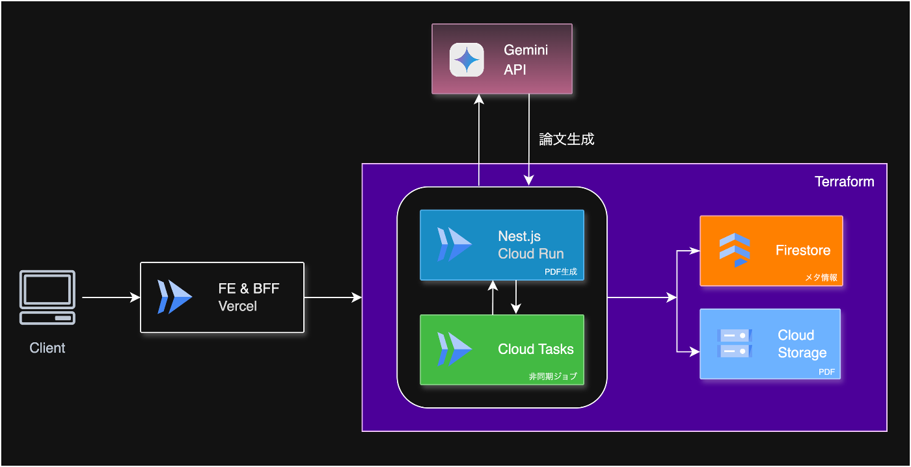
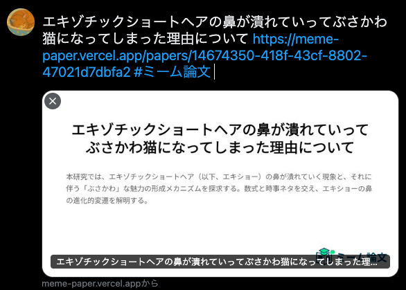

#  あなたの「くだらない」を、権威ある「論文」に。

「は？」って思いますよね。わかります。僕も自分で作っておきながら、時々そう思います。

「くだらないアイデア」と「権威の象徴である論文」を、AIで無理やりくっつけてみたらどうなるんだろう。そんな深夜のテンションから、このサービスは生まれました。その名も「ミーム論文」。

これは、ネットミームや日常の素朴な疑問をテーマに、AIが本格的な論文を自動執筆する、最高にクレイジーな代物です。

百聞は一見に如かず。まずは、このサービスがどんな風に動くのか、簡単なデモ動画をご覧ください。

<https://youtu.be/oC_FBCiDKhs>

はい。みてわかる通り、非常に馬鹿げております。しかし、これこそが「ミーム論文」の真骨頂です。美学です。馬鹿げているが学術的な体裁で表現されることで、逆にそのテーマの面白さや深さが際立ちます。

でも、ただのネタサービスで終わらせるつもりはありませんでした。最高のジョークは、最高のスーツと最高の舞台装置があってこそ輝く。その信念のもと、僕が今持てる技術と設計思想を惜しみなく注ぎ込みました。

この記事では、そんな「ミーム論文」の裏側で動いている、本気の仕組みと考え方の全てを、余すところなくお見せします。

* * *

##  はじめに：筆者について

本題に入る前に、少しだけ自己紹介を。

**charokoukuu** と申します。**Web開発が趣味で、大阪府内の大学院に通う者** です。研究の傍ら、週末にこうして好きな技術を触るのがなによりの楽しみで、今回の「ミーム論文」は、そんな僕の「好き」を全部詰め込んだプロジェクトになります。

それでは、本編をどうぞ。

* * *

##  対象ユーザーと解決したい課題

このサービスは、主に以下のような方々を対象としています。

  * **インターネットのユーモアを愛する人** : ネット上で見つけた面白いミームやネタを、もっと知的に、もっと面白く共有したいと考えている方。
  * **コンテンツクリエイター** : 動画やブログのネタとして、ユニークでインパクトのあるコンテンツを求めている方。
  * **学生や研究者（息抜きとして）** : 日々の真面目な研究の合間に、知的な遊び心でリフレッシュしたい方。

そして、このサービスが解決したい課題は、**頭に浮かんだ、取るに足らない面白いアイデアが、形になることなく消えていってしまう** という、誰もが経験するであろう、ささやかな機会損失です。

ふとした瞬間に思いついた「くだらないけど面白い問い」を、本格的な論文という「形」にすることで、ただの思いつきが、誰かにシェアできる、誰かと笑い合える、価値あるコンテンツに変わる。その変換を、誰でも一瞬でできるようにすること。それが「ミーム論文」の目指すところです。

* * *

##  全体像：役割分担がキモの設計図

この「完璧なバカバカしさ」を実現するためには、実は裏側でかなり真面目な仕組みが動いています。  
「どうせ作るなら、自分が今面白いと思える技術を全部投入して、どこに出しても恥ずかしくないものを作ってやろう」  
そんなエンジニアとしての性が、このサービスのアーキテクチャを決めました。

###  システム構成図



###  シーケンス図

ユーザーのリクエストから論文が生成されるまでの一連の流れを、シーケンス図にすると以下のようになります。非同期処理で重いタスクをバックグラウンドに逃がしているのがポイントです。

##  使用技術スタック一覧

このアーキテクチャを実現するために採用した、主な技術スタックです。

  * **モノレポ管理** : 
    * pnpm Workspaces
  * **フロントエンド (`web`)**: 
    * Next.js (App Router)
    * TypeScript
    * Tailwind CSS
    * shadcn/ui
  * **バックエンド (`service`)**: 
    * NestJS
    * TypeScript
    * Zod
    * Swagger (OpenAPI)
    * Firebase Authentication
  * **データベース** : 
    * Firebase Firestore
  * **AI・PDF・OGP 画像生成** : 
    * Gemini 2.5 Flash
    * LaTeX (lualatex)
    * @napi-rs/canvas
  * **インフラ & DevOps (`terraform`)**: 
    * Google Cloud Platform (GCP)
    * Cloud Run
    * Cloud Tasks
    * Cloud Storage
    * Terraform
    * Docker

* * *

##  こだわりポイント解説

###  ① バックエンド：NestJS で構築する、変更に強い「砦」

このサービスの頭脳であるバックエンドには、特に力を入れました。その中核を担うのが、**NestJS** です。

僕が NestJS を選ぶ理由は、その強力な DI コンテナが TypeScript の型システムと完璧に噛み合うから。今回はその特性を活かし、DDD の考え方を取り入れたクリーンアーキテクチャを採用しました。Usecase 層は Repository のインターフェースにのみ依存するため、データストア（今回は**Firebase Firestore** ）の実装を意識することなく、ビジネスロジックを純粋に保てます。

また、`swagger`で API 仕様をコードから生成し、フロントエンドとスキーマ駆動で連携することで、手作業によるミスや認識齟齬を構造的に排除しました。

###  ② PDF 生成：AI との格闘、そして LaTeX への回帰

このサービスのキモは、なんと言っても「本物感あふれる PDF」です。

当初はモダンな組版ツール**Typst** を検討しましたが、**「AI が、まだ Typst を十分に学習していない」という壁にぶつかり、断念。結局、AI の学習データも豊富な LaTeX** に回帰しました。モデルには Google の**Gemini 2.5 Flash** を採用し、安定してコンパイル可能な LaTeX ソースを生成させるため、執拗なまでに詳細な指示をプロンプトに詰め込んでいます。
    
    
    const systemPrompt =
      "あなたはLaTeXで学術論文を書く専門家です。以下の要件を厳守してください：" +
      "1) 絶対に `\\documentclass[uplatex,dvipdfmx]{jsarticle}` を使うこと。`\\documentclass{article}`は使用禁止。" +
      "2) 冒頭に `\\usepackage{bm} \\usepackage{url} \\usepackage{mathrsfs}\\usepackage{graphicx}\\usepackage{amstext}` などの必要パッケージを読み込む" +
      "3) バッククオートや```マークダウンは一切使わず、純粋にLaTeXソースだけを返す。" +
      "4) 必ず `\\end{document}` で終わるLaTeXソースのみ（自然文の前置きや解説不要）。" +
      "5) 馬鹿馬鹿しい数式・時事ネタを混ぜつつ、著者名は必ず「ミーム太郎」に。" +
      "6) `_` や `&` などは `\\_`, `\\&` のようにエスケープしてビルドエラーを回避。" +
      "7) Markdownスタイルの `[リンク](URL)` は禁止し、必ず `\\url{...}` を使う。" +
      "8) 決して他のクラスではなく `jsarticle` を使い続けること。";
    
    const userPrompt =
      `テーマ: ${paperDetail.theme}。タグ: ${tagList}。` +
      "テーマは必ずネット検索し、その検索結果を踏まえて面白く出力してください。" +
      "絶対にバッククオートや```を含めず、LaTeXソースのみで馬鹿馬鹿しい論文を生成してください。" +
      "冒頭に `\\usepackage{bm} \\usepackage{url} \\usepackage{mathrsfs}\\usepackage{graphicx}\\usepackage{amstext}` などの必要パッケージを必ず読み込む" +
      "自然文の前置きは不要、時事ネタを混ぜても可、数式多めで笑える内容にしてください。" +
      "Markdownスタイルの `[リンク](URL)` は禁止し、必ず `\\url{...}` を使う。" +
      "絶対に `\\documentclass[uplatex,dvipdfmx]{jsarticle}` を使うこと。`\\documentclass{article}`は使用禁止。";
    

この AI を「調教」するプロセスこそ、最高の「それっぽさ」を生み出す秘訣です。

###  ③ シェア体験とマネタイズ構想

このサービスは、シェアされ、継続的に使ってもらうための仕組みも考えています。

  * **動的 OGP 生成** : X などでシェアされた際に、論文のタイトルと概要が反映されたユニークな OGP 画像が自動で生成されます。これはバックエンドで`@napi-rs/canvas`を使い、動的に画像を生成することで実現しています。  


  * **「科研費」という名のクレジット** : 論文生成には、クレジットである「科研費」が必要になります。新規登録時に 1000 科研費が付与され、1 生成ごとに 10 科研費が消費される仕組みです。

  * **将来の展望** : 今後、より高性能な AI モデルを選択できるようにし、その分消費する科研費が増える機能拡張を予定しています。さらに、**Stripe API** を連携させて「科研費を購入する」という、言葉として最高の違和感を放つ機能の実装も構想中です。

###  ④ インフラ：Cloud Run と Terraform がもたらす速度と安心感

最後に、この全てを動かす土台です。バックエンドの実行環境には**Cloud Run** を、その構築には**Terraform** を選びました。

今回のプロジェクトにとって、Cloud Run はまさにうってつけの選択でした。

  * **スケーラビリティ** : アクセスが急増しても自動でスケールしてくれるので、もしサービスがバズっても(取らぬ狸の皮算用)安心です。
  * **コスト効率** : リクエストがあった分だけ課金されるため、アイドル時間はコストを極限まで抑えられます。
  * **高速なデプロイ** : コンテナベースなので、GitHub Actions のような CI/CD パイプラインと組み合わせることで、イメージのビルドから terraform apply、デプロイまでを完全に自動化でき、高速なリリースサイクルを実現できます。

また、PDF 生成を担う Cloud Tasks の非同期ジョブでは、**リトライ機構** を実装しています。万が一、AI の応答の遅延などで一度生成に失敗しても、自動でもう一度だけ再試行することで、システムの安定性を高めています。

そして、この Cloud Run を含む全てのインフラを Terraform でコード化することで、`terraform apply`一発で環境が再現できる。この「いつでもやり直せる」という絶対的な安心感は、一度味わうと手放せません。

* * *

##  まとめ：最高の遊び場としての個人開発

「ミーム論文」は、僕にとって最高の「遊び」であり、最高の「砥石」でした。  
「こんなのあったら面白いな」という純粋な好奇心をドライブに、自分が面白いと思える技術を好きなだけ試せる。個人開発の醍醐味は、まさにそこにあると感じています。

この記事が、皆さんの心の中にある「くだらないけど面白いアイデア」を形にする、何かのきっかけになれば嬉しいです。

**さあ、あなたも一緒に、本気で遊んでみませんか？**

**[ミーム論文で遊んでみる](https://meme-paper.vercel.app/)**
