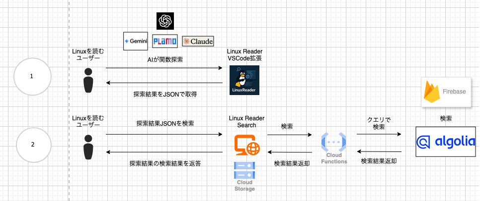

この記事は、[第2回 AI Agent Hackathon with Google Cloud](https://zenn.dev/hackathons/google-cloud-japan-ai-hackathon-vol2) の参加記事です

##  背景

「Linuxの本家コードを読む」それは全エンジニアの夢・・・  
それは儚くも愛おしい夢。  
その夢に挑もうとし無惨に散っていった多くの兵(エンジニア)たちの夢の跡に思いを巡らせると、兵のその哀愁の背中が目の前にありありと思い浮かびそうなものです。

かくゆう私もその悲しき敗北者の一人でした。  
Unix v6本を2周くらいしただけでは、最新のLinux Kernel を読むのすらとても難しく、２・３日して挫折しました。

時は経ち、2025年４月。  
世の中はDevinやClaudeやCursorなど生成AIを使ったプログラミングで沸き、エンジニア不要論すらも散見されるようになりました。  
そんな時に大規模コードを生成AIで読ませてみようという試みを私は始めました。

<https://zenn.dev/coffeecupjp/articles/89bb2b40ced6eb>

Goやk8sでそうこう試しているうちに、ふと思いつきました。  
「昔忘れてしまった、あの夢を取り戻せるのではないか」と・・・  
「あの Linuxをもう一度読めるのではないか」と・・・

この記事は、Linuxの暴力的なコード量に絶望したエンジニアが生成AIを使いかつての「夢」を取り戻そうとする記事。  
これは、この儚い夢の続きをAIと共に歩む私の挑戦記である。

##  なぜ Linux を読むのが儚い夢なのか？その暴力性について

暴力は一般的に力関係の非対称性から生じるものです。そして当人が一度その構造的な非対称性を内在化してしまうと、その構造は再生産されがちです。それは同じ関係性の投影で現れることもありますが、間接的に自身の内面に規範として刻み込まれることも多々あります。  
「Linuxを読む」という夢を抱いた兵たちは、以下に書く３つの力関係の非対称性に遭遇し、そして多くの独学者はその非対称性を負のイメージで内在化してしまいます。

  1. 数千行もあるコード行の暴力  
通常の会社での開発で触れるコード量は、せいぜい数十万行なことが多いと思います。ただ本家LinuxだとKernelだけで数百万行、Driverなどを含めると数千万行もの行数があります。その中からどこが重要か・そもそも構造がどうなっているかを知るのは大変でした
  2. 暗黙知をキャッチアップすることが難しいという情報の非対称性  
Linuxを自分一人で勉強しようとすると、技術記事くらいしか参照のできる情報を見つけることができず、その記事の概念的な内容をコードの上で理解するのに苦労します
  3. 本家Linuxだといきなり最新のアルゴリズムへの理解を要求される  
例えば、Linux Kernelのスケジューラーのアルゴリズムだけでも、最近CFSからeevdfに変更されるなど、変化が激しいです。これらの修正をいきなり見始めて知ろうとするのは至難の業です。

Linuxは夢を抱くにしては、あまりにも暴力が存在しすぎている。そう思いませんか？  
だからこそ、儚い夢なのです（内在化されて規範となるのでなおさらそうだと思いませんか？）。

##  人類の歴史、それは自然という力の非対称性との戦いだった。不可能はない

人類の歴史を振り返ると、人類は自然との葛藤を乗り越え続け今に至ってきました。

「洪水が起きるから、川の流れを人力で変える」  
「寒すぎるから、衣服を織り、火を起こす」  
「日が沈むと見えないから、松明を作り、電気を生み出す」

そしてそれらの力の非対称性との戦いを制し、今の人類があります。  
なのが言いたいかというと、「Linuxのコードを読む」という儚い夢も人類の叡智を結集させれば解決できるのではないかということです。  
そして出てきたのが、「生成AI」！

ただ生成AIに数百行・数千行のコードのコードを渡しても、現状ではコンテキスト的に限界があります。  
問題を生成AIが分かるように細分化する必要があります。  
そして万が一、数百万行・数千万行を渡せるようになったところで、AIは人間が分かるように人間向けに問題を細分化する必要があります。

深淵を覗く時、深淵もまたあなたを覗いているのです。

人間がAI対して細分化して渡すのを考える時、AIがどうやって人間が分かるように細分化して渡すかも考える必要があります。この、今は「人間がAIに対して問題を細分化して渡す作業」、そして将来的には「AIが人間に対して問題を細分化して渡す作業」を解決しようとしたのが、

<https://zenn.dev/coffeecupjp/articles/89bb2b40ced6eb>

の記事でした。  
要約すると、（コードのエントリーポイントから重要関数の候補を選ぶコードリーディングをAIに再帰的に行わせることで）AIと一緒にコードを読もう！という試みです。  
しかし、これではLinuxの暴力性の２である「暗黙知のキャッチアップ」が難しいです。  
そこで、次には、それぞれの暴力性への対処を、上記記事を書いてからのアップデートと、Linuxを読む行いでの応用をまじえて記します。

##  Linuxコードの暴力性を征服する

まずは、前述の暴力性の１・３がどのようにコードリーディングエージェントで解決されるかを見てみます。

１：数千行もあるコード行の暴力

先ほども書きましたが、Linuxほどの大量のコード量になると問題は「AIもしくは人間にとって、どう問題を細分化して渡せるか」になります。その時の最小の細分化単位は、関数になると思います。そこで、その関数探索に注目して、その関数探索で大変な作業を、AIなどを活用し乗り越えます。
    
    
    a. 初見で重要な関数を見つけること　→　AIが重要な関数を候補に出してくれる
    b. 元の関数に戻る作業の煩雑さ　→　履歴を残し過去の経路に戻れるようにする
    c. 初見では分からない関数の文脈を知ること　→　AIが解説してくれる
    

これで全てが解決するわけではないですが、多くの場合はこれで「AIが人向けに問題を細分化」してくれると思います。

３：本家Linuxだといきなり最新のアルゴリズムへの理解を要求される

これは１で乗り越えた作業のcで多くが解決されます（AIの知識カットオフがあるので、本当の最新は分からないかもしれませんが・・・）。上にも書きましたが、AIのモデルはLinux KernelのスケジューラーのCFSからeevdfへの更新を理解していました。

* * *

しかし、２の暴力性である「暗黙知へのキャッチアップ」はこれまではあまり出来ていませんでした。出来ているにせよ「関数の連なりをレポートとしてAIに解説してもらう機能」か「関数の内容をマーメイド図にして表示する機能」くらいしかなく、不十分でした。

そこで最近入れた機能に、「探索経路のインポート・エクスポート」と「探索経路の検索サイトの作成」があります。

<https://storage.googleapis.com/linux-reader/index.html>

１つ目の機能「探索経路のインポート・エクスポート」はその名の通り、必要に応じてとエラーが発生した時にこれまでの関数探索の経路をJSONで落としてくれる機能です。これによって間違った操作をした時や機能がバグっていた時でも、容易に本来探索していた関数探索を見ることができます。そして何より他の人が探索した経路を見ることができ、必要に応じてそのJSONの結果から探索を開始できます。これによって、人の頭の中にしかなかった「関数探索」という暗黙知が、いつでも再現できる形になります。

ここまでできたら、このJSONを登録して検索できるようにしよう、というのが、「探索経路の検索サイトの作成」です。これによって過去の自分や他人の暗黙知が共有される形になり、２つ目の暴力性も解決します。  
もはや「一人でLinuxを読む時代」は終わりました。他人が何をどう読んだかを、誰でも再現できる。それがこのシステムの自慢できる点です。

（この検索サイトでは、Linuxのスケジューラー・fork・read_iterの内容が登録されて検索できます。今後もLinuxの勉強を続けていき増やしていきます）

##  Linux、その暴力性の征服方法

改めて、ここではどのようにして文明の利器を使い、Linuxの暴力性を征服するかを手順を追って説明します（再度になりますが、問題の細分化は「人からAIへの手加減」であると同時に「AIから人への手加減」でもあります）。

<https://marketplace.visualstudio.com/items?itemName=coffeecupjapan.linux-reader>

  1. Linuxで知りたい機能のエントリーポイントを、ChatGPTやClaudeなどの生成AIに聞きます（APIキー不要）
  2. Linux Reader で APIキーなどの設定を入力します
  3. [Linux Reader の VSCode拡張機能](https://marketplace.visualstudio.com/items?itemName=coffeecupjapan.linux-reader)で、１の結果のエントリーポイントを入力します
  4. ２の続きで、タスクを開始し、AIが関数の候補を出すのを待ちます
  5. ３で関数の候補を出してくれたら、その中から次にAIに探索させる関数を選びます
  6. 人間が十分探索できたと思うまで３〜４を繰り返します
  7. 関数探索経路履歴も出力できます。またその履歴に書いてあるハッシュ値を入力することで、その入力箇所から探索を続行できます
  8. 関数経路履歴のJSONへのエクスポートも可能です。また２の段階でそのJSONを入れることで、インポートも可能です。このエクスポート結果は、<https://storage.googleapis.com/linux-reader/index.html> から検索・登録できます
  9. ６・７の他、関数探索レポート機能・バグ候補出力機能・関数説明機能などがあります

動画↓

<https://youtu.be/cuhBrpQenJs>

これによって、本当にLinuxのコードの暴力性が征服できるか？  
それは自分で試してみないと実感が湧かないかもしれません。ただ自分のケースでは、今までは初見では難しかったLinuxスケジューラーなどの実装を、AIと一緒に関数探索することでほんの少し理解することができました。  
これまで登録した探索結果は、

<https://storage.googleapis.com/linux-reader/index.html>

で「Linux」なんかで検索してみて、参考にしてください。

##  システムアーキテクチャ

VSCode拡張機能の実装に関する技術記事が少なかったこと以外は難しい部分はあまりない構成です  
Algolia は Firebase Storage に保存してあるアセットに対して検索をかけていて、Firebase へのJSONアセットの登録も Cloud Functions を通して Webサイトから可能になっています。  
Algolia は１つの文書あたり100MBまでしかアップロードできないので、もしそれを超える大きさのJSON文書をアップロードするケースが出てきたら困る問題がありそうではあります。

##  実装したレポジトリ

<https://github.com/YmBIgo/ai-agent-linux-reader>

##  最後に

世の中、大きな問題が解決し尽くされているように見えて、まだ解決しきっていない問題もあるものかもしれません。  
この記事が、そのような誰もが解いたことがない問題を解決する挑戦のきかっけになれば幸いです。
