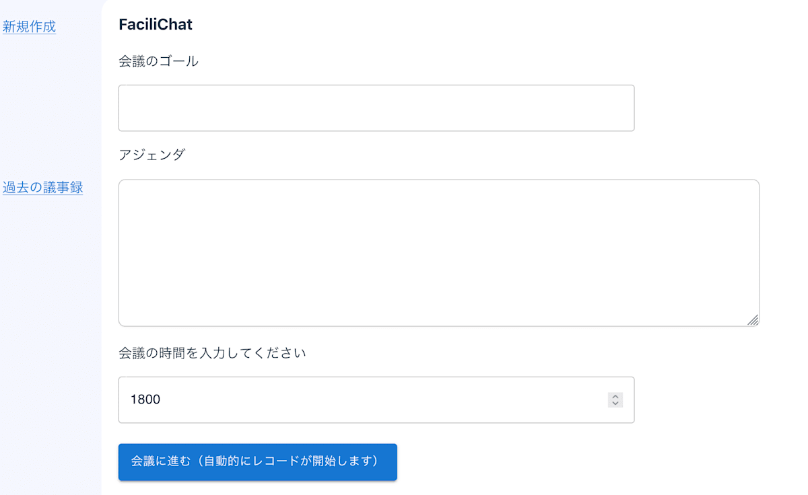
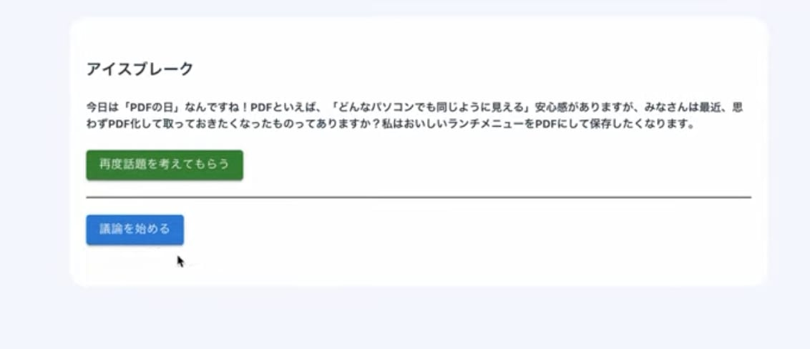
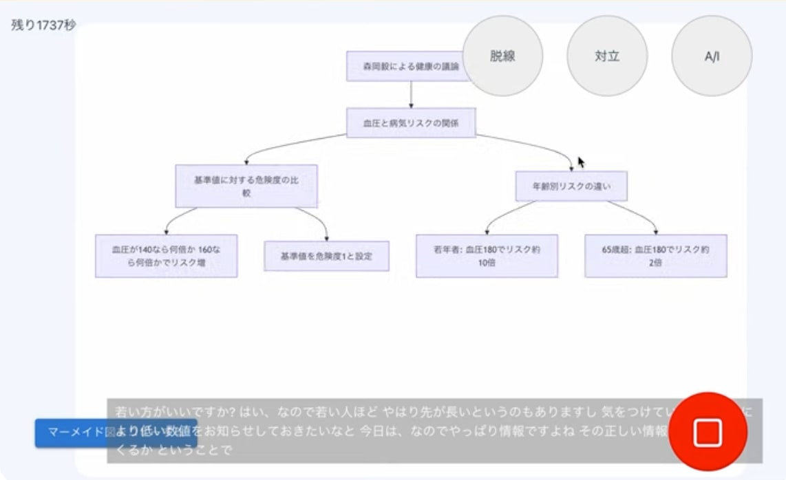
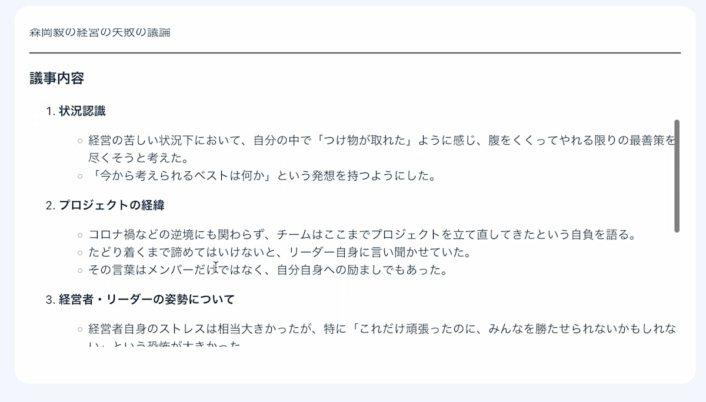
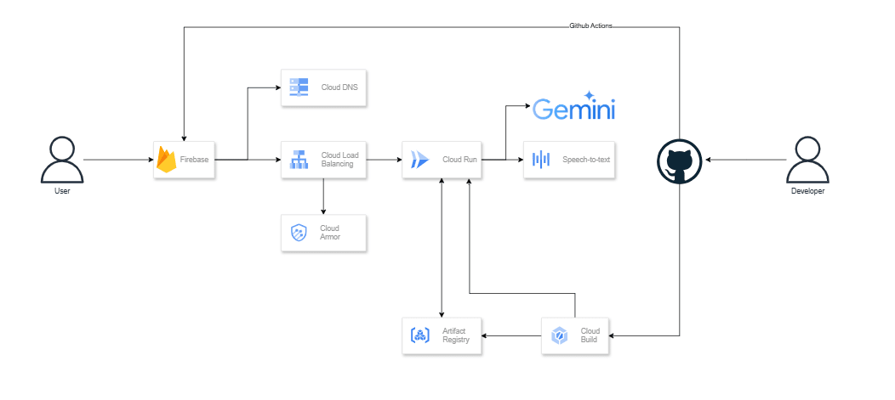
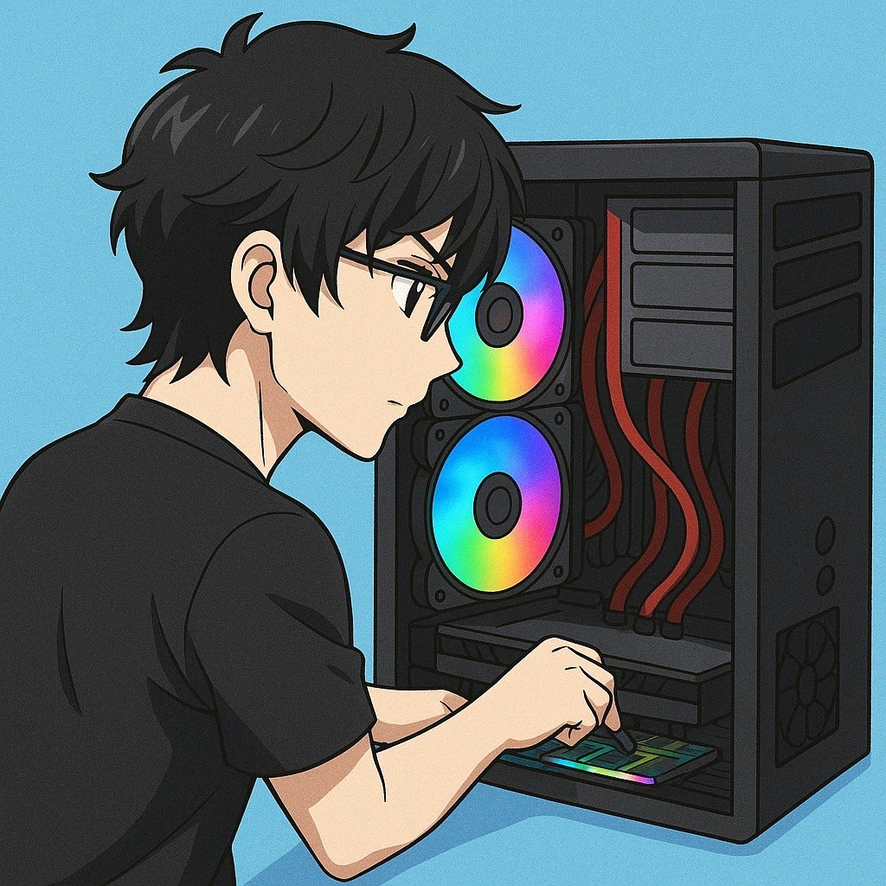

##  概要

会議の障壁をなくす会議ファシリテーションwebアプリ

<https://youtu.be/pn-BfHPG_7A>

「アイスブレイクがイマイチ盛り上がらない」  
「意見が対立して話が進まない」  
「話が脇道に逸れて結論が出ない」  
「アクションアイテムを記録しそこねる」

などなど会議をする上での障壁は意外と多いもの。  
そんな日頃の会議のガードレールとなるウェブアプリを生成AIで作りました。

あなたがすべきなのは、会議とともにこのwebアプリを起動するだけ。  
そうすることで、AIが会議の内容を聞き、会議の障壁に対して対処方法を教えてくれます。

盛り上がらない会議・進まない会議・次につながらない会議とは、今日でさよならしましょう！

##  背景

日本人は多くて３割の時間を会議に費やすそうです。それを全日本の社会人の時間で換算すると、１年で数千億時間もの時間にもなります。  
しかしそんな会議も千差万別。上手く進む会議もあれば非効率な会議もありますが、あなたは「上手い会議」を進められている自信はありますか？

・盛り上がらない会議  
・進まない会議  
・次につながらない会議

などなど・・・会議の罠はたくさんあります。  
そんな「会議」という身近だが奥深い課題を解決すべく会議ファシリテーションwebアプリを作りました。

##  現状の課題

チームでも話して出てきた、会議の課題は以下のようなものがありました。

１：アイスブレイクがイマイチ盛り上がらない

背景・状況

  * 会議の冒頭にアイスブレイクを試みるものの、発言者が限られたり、反応が薄く一方通行になりがち。
  * テンプレート的な質問（「最近あった良いことは？」など）が繰り返され、形骸化している。
  * 参加者が「早く本題に入りたい」と感じており、アイスブレイクに心理的な価値を感じていない。  
問題点
  * 会議の雰囲気が固くなり、率直な意見交換の土壌が作れない。
  * 特に新メンバーや異なる部署の人が入りづらい空気が形成されてしまう。

２：意見が対立して話が進まない

背景・状況

  * 複数の立場から正論がぶつかり合う場面で、ファシリテーションがうまくいかない。
  * 感情的な衝突になりやすく、建設的な議論に戻すのが難しい。
  * 「合意を目指すこと」が目的化され、意見の多様性や深掘りが停滞してしまう。  
問題点
  * 結論が出ないまま時間切れになることが多く、メンバーにフラストレーションがたまる。
  * 次回以降の会議参加意欲にも影響する。

３：話が脇道に逸れて結論が出ない

背景・状況

  * 雑談の延長や思いつきで話が展開され、気づけば議題とずれた内容に時間を費やしている。
  * 話を止めるタイミングが分からず、結論が曖昧なまま終わってしまう。  
問題点
  * 会議後に「で、何が決まったの？」という疑問が残る。
  * 本来の目的を達成できないまま会議が形骸化していく。

４：アクションアイテムを記録しそこねる

背景・状況

  * 決まったことがメモされない、あるいは曖昧な表現で書かれており、後で見返したときに意味が分からない。
  * 誰が何をいつまでにやるかが不明確なままになってしまう。  
問題点
  * 会議の成果が実行につながらず、「話しただけ」で終わってしまう。
  * 次回の会議で「これ前も話したよね？」という既視感が生まれ、生産性が下がる。

５：記録できない関係性が議論されない

背景・状況

  * チーム内の人間関係やパワーバランスに関わるようなセンシティブな課題は議論されにくい。
  * ログや議事録に残ることを気にして、表立って発言できない空気がある。  
問題点
  * 組織の根本的な課題や本音レベルの問題が議題にならず、解決されないまま蓄積していく。
  * 表面的な改善だけが繰り返され、根本原因に手が届かない。

これらの課題に対して、それぞれの解決方法を探りました。

##  解決方法

これらの課題を解決するために、今回考えて実装したのが議事ファシリAIです。

<https://mac-sdo-hackathon.web.app/>

上記で記述したそれぞれの課題をただ解決するだけではなく、直感的に操作できるようなUIがどのようなものか考えて実装しました。では上記に出てきたそれぞれの課題にどうアプローチしたか見てみましょう！

１：アイスブレイクがイマイチ盛り上がらない  
→ _**AIによるニュース・記念日ベースのアイスブレイクで、空気を和らげる**_

会議の冒頭で雰囲気が硬く、発言が少ない状態を打破するために、AIが当日のニュースや記念日をもとに、その場に合った自然な話題を提供します。  
例えば「今日は〇〇の日ですね。皆さんにとって〇〇にまつわる思い出はありますか？」のように、タイムリーかつ参加者が答えやすい話題を投げかけることで、会議のスタートをスムーズにし、心理的安全性を高めます。  
これにより、発言のハードルが下がり、続く議論も活発化しやすくなります。

２：意見が対立して話が進まない  
→ _**対立を検知して、AIが仲裁のヒントを通知する**_

会議中に複数の立場がぶつかり、話が止まってしまう場面に対して、AIが音声解析により意見の対立を検出。  
「対立」ボタンが赤色になることで通知を表示し、仲裁のためのヒントや、論点の整理方法をその場で提示します。  
例えば「お互いの前提条件を明確にしてみましょう」や「一度論点を箇条書きにして整理してみてください」などの提案を行います。  
議論を再スタートさせるきっかけとなり、対立が発展的な議論へと転じやすくなります。

３：話が脇道に逸れて結論が出ない  
→ _**脱線をAIが検知し、話を戻すアシストをする**_

会議が本題から逸れてしまっているとAIが判断した場合、リアルタイムで画面上に通知を表示し、話を軌道修正するための一言アドバイスを添えてくれます。  
たとえば、「現在の話題は議題と関連が薄いようです。議題に戻すなら〇〇の確認から始めましょう」といった具体的な提案がされます。  
これにより、ファシリテーターだけに議事進行の負担が偏らず、チーム全体で会議の質を維持することが可能になります。

４：アクションアイテムを記録しそこねる  
→ _**AIが自動でアクションを抽出・記録し、議事録まで生成**_

会議の音声をリアルタイムで解析し、「〇〇を担当する」「〜までに対応する」といった発言を検出して、アクションアイテムとして自動で記録。  
会議終了時には、誰が・何を・いつまでに、が明確に整理されたアクション一覧と議事録が出力されます。  
記録漏れの不安やメモに集中するあまり議論に参加できない問題を解消し、チーム全員が議論に集中できます。

５：記録できない関係性が議論されない  
→ _**AIが関係性を図式化して「見える化」し、沈黙の構造を浮かび上がらせる**_

人間関係や利害関係など、発言しづらい・文字にしづらいトピックが議論の俎上に乗らないことがあります。  
AIは会議内容をもとに、発言者・キーワード・関係性をマーメイド図（Mermaid.js）形式で自動可視化。  
これにより、「誰と誰の意見が近いのか」「どの論点が孤立しているか」といった構造が一目でわかり、議論されなかった要素にも気づけるようになります。  
ファシリテーターがこれを参考に補助質問を入れることで、議論の質が一段階深まります。

##  使い方

では、使い方を説明します。

  1. 会議のアジェンダ・目的・時間を入力  

  2. AIがアイスブレイクの話題を提供してくれる  

  3. 会議の録音が始まり、リアルタイムで以下の情報がAIから提供される  

     1. 会議が脇道に逸れて脱線していないかの通知 
        1. 会議の音声から会議が脇道に逸れていたら、脱線ボタンが赤くなる形で通知が飛びます
        2. 赤になった脱線ボタンを押すと、脱線を回避する方法がダイアログ上で開きます
        3. ２の回避方法に沿って人がファシリしなおし、会議を正しい方向に導きます
     2. 会議に対立が起きていないかの通知 
        1. 会議の音声から会議で対立が起きていたら、対立ボタンが赤くなる形で通知が飛びます
        2. 赤になった対立ボタンを押すと、対立を仲裁する方法がダイアログ上で開きます
        3. ２の仲裁方法に沿って人がファシリしなおし、会議の無駄を回避します
     3. 現段階のアクションアイテム 
        1. 会議の音声からアクションアイテムが更新されると、A/Iボタンが赤くなる形で通知が飛びます
        2. 赤くなったA/Iボタンを押すと、アクションアイテムが表示されます
     4. 図式化された会議の内容 
        1. 会議の音声から、直近の会議内容が30秒ごとにリアルタイムで図式化されます
     5. 直近の15秒で話された内容
  4. 議事録が作成される  

##  システムアーキテクチャ

フロントはFirebase HostingにReactアプリを、バックエンドはCloud Load Balancingを挟み Cloud Runにnodeアプリを載せる構成にしました。バックエンド・フロントエンドともに、mainブランチにマージされたら、デプロイされるようになっています。また図では書いていませんが、最新のニュース取得してアイスブレイクを考える部分はcloud run functionsでpythonで作りました。  
音声認識にはGoogleのSpeechToText APIを、アイスブレイク作成・会議の脱線,対立検知・アクションアイテム提示・マーメイド図作成・議事録生成はGeminiを使いました。  
Geminiは想定できない事態への対応もできて、例えばアイスブレイクのためのデータをAPIで取れない時もアイスブレイクのネタを考えてくれるので、すごい便利で役に立つなと思いました。

レポジトリは以下にあります。

<https://github.com/mac-sdo-hackathon/mah-app>

##  メンバー紹介

####  ゆう

要件を担当しました  
AIサブスクが家計の負担になっています

####  あざらし

インフラ担当  
ハッカソン初めて完走しました。これからも頑張ります！

####  かず

見習い担当です。これから走ります！

####  かずや

アプリケーションのフロントバックエンドを担当。  
素敵なアイデアを考えてくれたメンバーに感謝してます！

##  最後に

チーム結成したのが5月中旬で、１か月ちょっとという短い間でしたが、メンバーのアイデアと実装力を組み合わせて、充実した開発ができました。このハッカソンの運営に携わってくれた皆様に感謝いたします。
