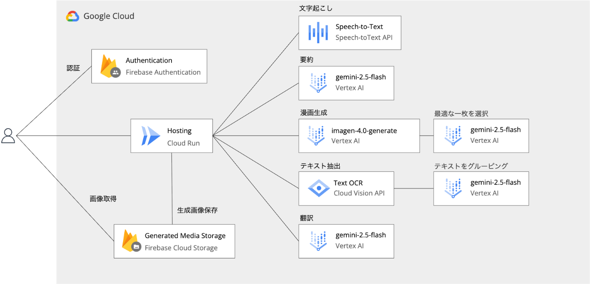

##  はじめに

「会議の内容が、もっと直感的に、そして楽しく伝わればいいのに…」

そんな想いから、私たちは議事録や音声ファイルから自動で 4 コマ漫画を生成する Web アプリケーション「MangaMaker」を開発しました。文字だけの議事録を読む手間をなくし、会議の要点を誰もが瞬時に理解できる。そんな新しいコミュニケーションの形を提案します。

このアプリは、入力されたテキストや音声を AI が解析し、起承転結のある 4 コマ漫画のストーリーを自動で生成。さらに、そのストーリーに基づいたイラストまで描き出してくれます。退屈だった議事録の確認作業が、まるで創作活動のようなワクワクする体験に変わる。それが MangaMaker の世界です。

##  デモ動画

<https://youtu.be/0a6pwzMY2m0>

##  プロジェクト概要

###  課題

####  会議内容の可視化の難しさ

会議やミーティングの内容を記録する際、**文字だけの議事録では内容が伝わりにくい** という問題があります。特に以下のような課題が存在します：

  * 議事録を読むのが面倒で、内容が頭に入りにくい
  * 会議の雰囲気や流れが文字だけでは伝わらない
  * 後から振り返る際に、重要なポイントが分かりにくい
  * チームメンバーへの共有時に、興味を持ってもらいにくい

###  目的

以上を踏まえて、我々は次のようなアプリを作成したいと考えました：

  * 議事録ファイル（テキストや音声）を入力するだけで、自動的に 4 コマ漫画が生成される
  * ストーリー性のある可視化で、会議内容が理解しやすくなる
  * 音声入力にも対応し、より手軽に利用できる
  * 生成された漫画は保存・共有が可能

「議事録を漫画に変換する」ことで、会議内容を楽しく、そして効果的に可視化できるツールを目指しました！

##  主要な機能詳細

###  1\. 多様な入力方式

####  テキスト入力

  * 議事録を直接テキストエリアに入力
  * 議事録ファイルのアップロード
  * サンプルテキストの読み込み機能

####  音声入力

  * 音声ファイルのアップロード
  * Google Cloud Speech API による音声認識
  * 日本語音声の自動文字起こし

###  2\. AI 駆動の漫画生成

####  ストーリー生成

  * Google GenAI（Gemini 2.5 Flash）による 4 コマ漫画ストーリーの自動生成
  * 導入 → 展開 → クライマックス → 結論の 4 段階構成
  * 英語での自然な会話文の生成

####  画像生成

  * Google Imagen 4.0 による 4 コマ漫画の自動描画
  * 2x2 グリッドレイアウトの統一されたデザイン
  * 吹き出し付きの漫画スタイル

###  3\. リアルタイム処理

####  Server-Sent Events（SSE）

  * 処理状況のリアルタイム表示
  * 各ステップの進行状況を可視化
  * エラーハンドリングとリトライ機能

####  処理ステップ

  1. 音声認識（音声ファイルの場合）
  2. 内容の要約・ストーリー化
  3. 4 コマ漫画の画像生成
  4. 最適な画像の選択
  5. OCR 処理とテキスト翻訳

###  4\. 画像処理と翻訳

####  OCR 機能

  * Google Cloud Vision API による画像内テキスト検出
  * 吹き出し内のテキスト位置の特定
  * テキスト領域のマスキング処理

####  翻訳機能

  * 生成された英語テキストの日本語翻訳
  * 翻訳テキストの画像への自然な合成
  * 元画像と翻訳版の切り替え表示

###  5\. ユーザー管理とギャラリー

####  Firebase 認証

  * セッション管理によるユーザー認証
  * 安全なログイン・ログアウト機能

####  作品保存

  * 生成された漫画の Firebase Storage への保存
  * メタデータ（生成日時、ストーリー内容）の管理
  * ギャラリー機能による過去作品の閲覧

##  システムアーキテクチャ

###  技術スタック

####  フロントエンド

  * **React Router 7** : 最新のルーティングシステム
  * **TypeScript** : 型安全性の確保
  * **Tailwind CSS** : モダンなスタイリング
  * **Uppy.js** : ファイルアップロード機能

####  バックエンド

  * **Node.js** : サーバーサイド実行環境
  * **Google Cloud Speech API** : 音声認識
  * **Google Cloud Vision API** : OCR 処理
  * **Google GenAI** : AI 生成機能
  * **Firebase** : 認証・ストレージ

###  アーキテクチャ図

###  データフロー

  1. **入力処理** : ユーザーがテキストまたは音声ファイルを入力
  2. **音声認識** : 音声ファイルの場合、Google Cloud Speech API で文字起こし
  3. **ストーリー生成** : Gemini 2.5 Flash で 4 コマ漫画のストーリーを生成
  4. **画像生成** : Imagen 4.0 で 4 つの候補画像を生成
  5. **画像選択** : Gemini 2.5 Flash で最適な画像を選択
  6. **OCR 処理** : Vision API と Gemini 2.5 Flash で画像内テキストを検出
  7. **翻訳処理** : 英語テキストを日本語に翻訳
  8. **画像合成** : 翻訳テキストを画像に合成
  9. **保存** : Firebase Storage に画像とメタデータを保存

##  開発での苦労と解決への道のり

###  1\. 4 コマ漫画を「安定して」生成するプロンプト技術

**【課題】** 単純な指示では、AI は意図した通りの 4 コマ漫画を安定して生成してくれませんでした。初期の実装では、以下のような問題が頻発していました：

  * コマの構成が崩れる（1 コマしか生成されない、6 コマになってしまう）
  * ストーリーと無関係な画像が出力される
  * 吹き出しが適切に配置されない
  * キャラクターの一貫性が保たれない

**【解決策】** 試行錯誤を重ね、最終的に以下の要素を組み合わせたプロンプト設計にたどり着きました：

  1. **構造的な指示** : 「2x2 grid comic strip」「exactly 4 panels」といった明確な数値指定
  2. **視覚的要素の指定** : 「speech bubbles」「consistent character design」
  3. **コンテンツ構造化** : 議事録を起承転結の形式に前処理してから AI に渡す

この結果、4 コマ漫画の生成成功率が向上しました。

###  2\. 複数の画像から最適解を選択する仕組みの実装

**【課題】** 単一の画像生成では、元のストーリーに合わない画像が生成されることがあり、安定した品質を保つことが困難でした。

**【解決策】** Imagen 4.0 で 4 つの候補画像を並列生成し、その中から Gemini 2.5 Flash を使って最適なものを自動選択する仕組みを実装しました。複数の候補から選択することで、より元のストーリーに適合した高品質な漫画を安定して生成できるようになりました。

###  3\. 画像生成 AI の「日本語の壁」を乗り越える技術

**【課題】** Imagen 4.0 は、残念ながら日本語のテキストを画像内に正しく描画できません。日本語文字が文字化けしたり、意味不明な記号になってしまうことが多く、日本語話者向けのサービスとしては致命的な欠点でした。

**【解決策】** 「一度英語で生成し、後から日本語に差し替える」という逆転の発想で解決しました：

OCR 処理とテキストマスキングを組み合わせることで、生成された画像の吹き出し内テキストを正確に検出し、翻訳テキストを自然に合成しています。Vision API で英語テキストの位置と内容を抽出し、その領域を白い矩形でマスキング後、Canvas API を使って日本語フォント（Noto Sans JP）で翻訳テキストを描画することで、自然で読みやすい日本語漫画を実現しました。

###  4\. リアルタイム処理とユーザー体験の両立

**【課題】** 音声認識 → ストーリー生成 → 画像生成 →OCR→ 翻訳という長い処理チェーンでは、ユーザーが処理の進捗を把握できず、不安に感じる問題がありました。

**【解決策】** Server-Sent Events（SSE）を活用し、各処理ステップの進捗をリアルタイムで可視化しました。「音声を文字に変換中...」「4 コマ漫画のストーリーを作成中...」「漫画のイラストを描画中...」「テキストを検出中...」「日本語に翻訳中...」「完成しました！」といった分かりやすいメッセージで処理状況を表示することで、ユーザーの不安を軽減し、安心して待てる体験を提供しています。

##  まとめ

「議事録を漫画にする」というシンプルなアイデアから始まったこの旅は、AI 技術の可能性と制約、ユーザー体験設計の重要性、そして技術的創造性の価値について多くのことを教えてくれました。

**MangaMaker は、単なるツールではなく、コミュニケーションの新しい形を提案するプラットフォーム** です。堅い議事録を楽しい漫画に変換することで、チーム内の情報共有をより効果的で親しみやすいものにできると確信しています。

今後も、AI 技術の進歩とともに MangaMaker も進化させ、より多くの人々に創造的なコミュニケーションの機会を提供していきたいと考えています。

この記事が、AI 技術を活用した新しいものづくりに挑戦するすべての開発者の皆様の刺激となれば幸いです。

最後までお読みいただき、ありがとうございました！
