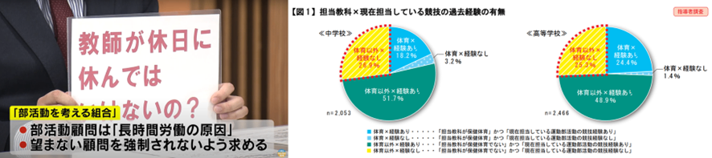
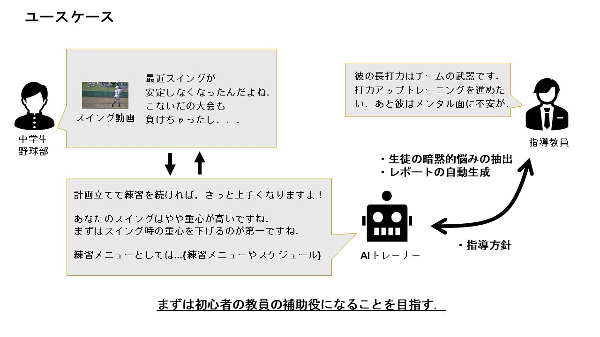
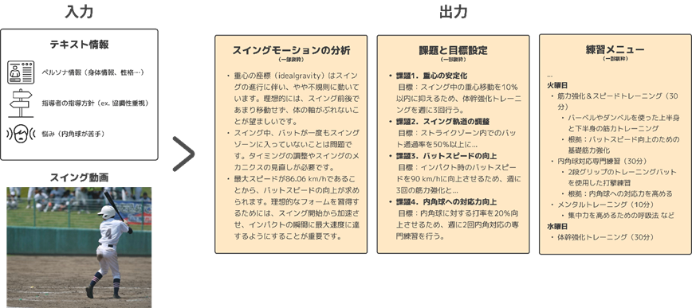
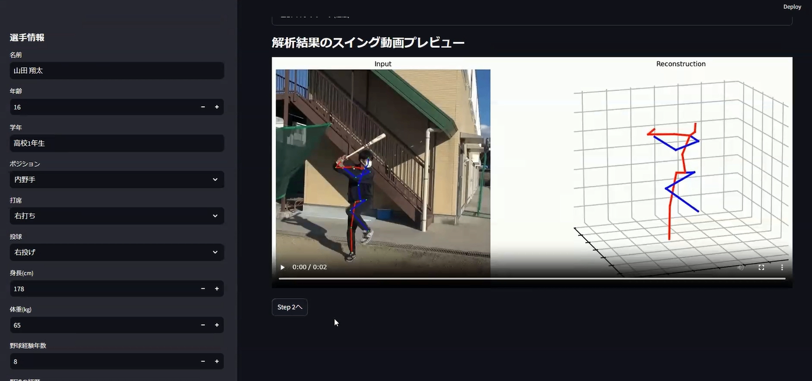
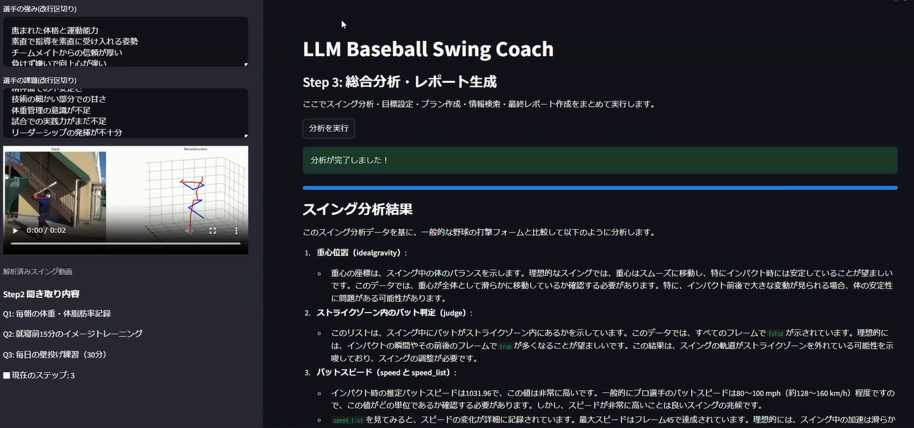
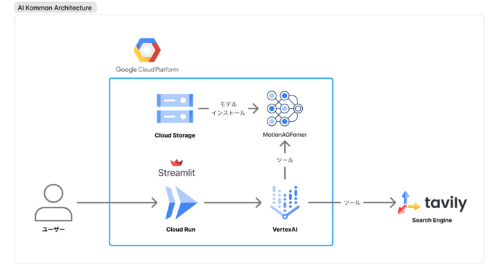
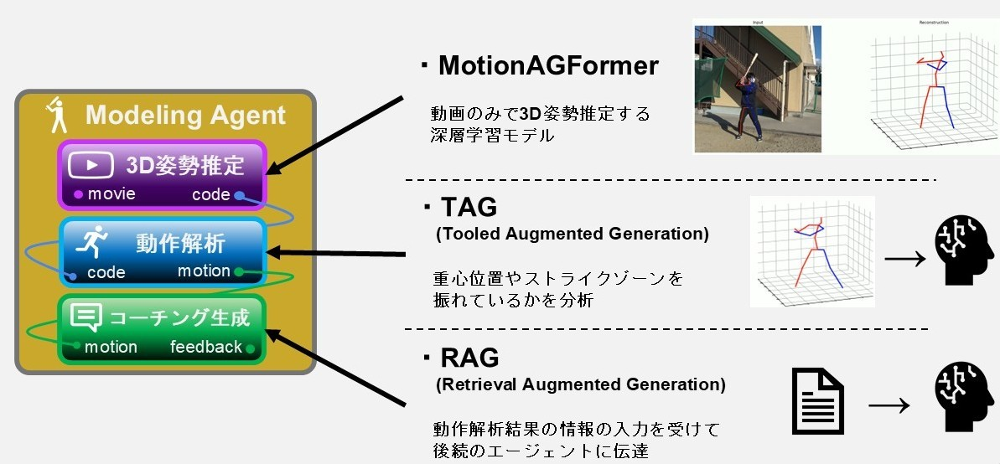
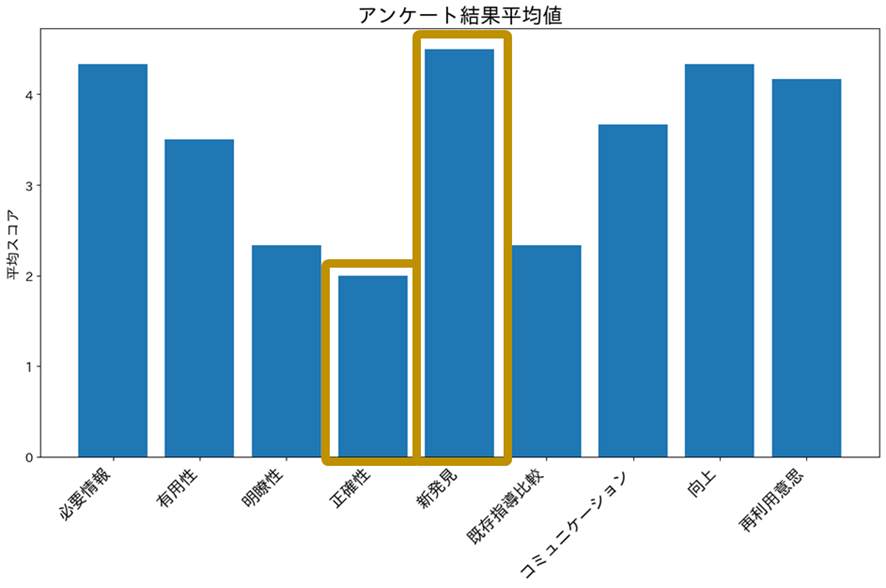
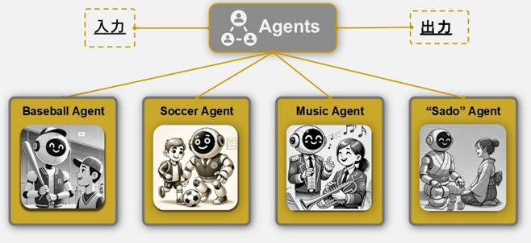

#  0\. Demo

<https://youtu.be/H5cZcR3v6XE>

#  1\. 背景

> 「部活動の顧問になったけど、そのスポーツは未経験…」  
>  「練習メニューって、どうやって作ればいいんだろう？」  
>  「生徒のやる気を引き出す声かけって、難しい…」

> 「フォームを直したいが、具体的な改善点を教えて」  
>  「スランプで結果が出ず自信を失っている」  
>  「文武両道の両立が難しく、練習と勉強の時間配分に迷う」

これは学校現場で日々奮闘されている先生方から聞こえてくる，切実な悩みです．  
文部科学省の調査によると，中学校高校の運動部顧問の約25%が，担当する部活動の競技経験がないというデータがあります．先生方の多忙化や専門知識を持つ教員の不足から，自分が経験したことがない，あるいは指導したことがない部活動の顧問をしなければならないケースが増えています．慣れない指導に多くの時間を費やし、心身ともに疲弊してしまうケースは少なくありません．実際に我々がヒアリングを行った若手教員でも，「仕事なのでもちろんやるが，自分が専門ではない部活動の顧問になると，給与にも見合わないし，勝手もわからないし，人脈もないしでモチベーションもわかず，」  

一方で生徒は程度に差はあっても，部活動にチャレンジする以上，運動部であれば「その競技でうまくなりたい，活躍したい」，「自分の運動能力を上げたい」，「体を動かすのが好き」，一方で文化部であれば「好きなことを追求したい」，「創造的な活動がしたい，自己表現の場がほしい」などの様々なモチベーションを持っています．しかしながら，顧問や指導者がその活動の専門家，あるいはそれに準ずる人ではない場合，生徒らは満足な情報を得ることが難しいです．

生徒たちは「うまくなりたい！」，「自分の課題がわからない！」という想いや疑問を持っている一方で，非専門家顧問はどうすればいいか分からない…。そんなを、テクノロジーの力でサポートできないかという想いから、私たちはLLMエージェントを活用した部活動支援システム「AI-Kommon」を開発しました！

* * *

#  2\. AI Kommon とは？ — 使い方は 3 ステップ

**AI Komonは**  
**1.指導方針（例：協調性を重視したい、まずは楽しんでもらいたい）  
2.生徒の情報（例：身長170cm、最近スランプで悩んでいる）  
3.生徒のプレー動画（今回は野球のスイング動画）**  
**これらを基にAIが現状の課題を分析し，いくつかの質問を経て，具体的な指導戦略や練習メニュー，応援コメントを提案してくれるAIエージェントです．**

使い方のイメージ↓  

  
上の出力例では．「内角球が苦手」という生徒の悩みに対し、具体的な対策練習メニューを生成しています。さらに、スイング動画の分析から「重心のブレ」という本人も気づいていなかった新たな課題を発見し、改善策まで提示してくれています．

実際のWEBアプリの画面  
  

* * *

#  3\. システム「動作解析 × マルチLLMエージェント」

> UI からレポート生成までを **非同期パイプライン** で一気通貫．技術データと会話データを往復させ，先生と生徒の「納得感」を生む設計です．

レイヤ | 主なモジュール | 役割  
---|---|---  
**UI / Presentation** |  `app.py`（Streamlit）・`main.py`（CLI） | 入力フォーム、進捗バー、最終レポート表示  
**Orchestration** |  `core/webui/system.py`, `core/cli/system.py` | 各エージェントの呼び出し順制御と状態管理 (`WebUIState` / `SystemState`)  
**Agent Layer** | `agents/*` | 6 つの責務特化エージェント（対話／モーション解析／目標設定／プラン生成／検索／要約）  
**Shared Core** |  `core/base/*`, `utils/*` | ロギング (`SystemLogger`)、バリデーション、動画ユーティリティなど横断機能  
**Domain Models** | `models/*` | すべて **Pydantic** で型定義。Pose, Plan, Persona などを厳密にスキーマ化  
**External Engines** |  `MotionAGFormer/`, Gemini API | 3D 姿勢推定と LLM 推論を提供  
  

アーキテクチャはGoogle Cloud runを用いてデプロイし，各LLMエージェントはgemini-2.5-flash，エージェントシステム内で使っているSearchはGoogle Search APIを使っています．

※内部で用いているVMはCPUのみですが，本来はGPUを利用されることが推奨されます．

* * *

#  4\. 技術的核 - LLMが動作を"解釈"する

今回のフレームワークを図にするとこうなります．

  1. **ModelingAgent** ：`MotionAGFormer` で動画→3D 点群 → 独自 `metrics/` で数値化
  2. **InteractiveAgent** ：LLM で質問生成し、得た回答から _洞察_ を抽出
  3. **PlanAgent** ：ユーザー情報から目標を設定する**GoalSettingAgent** と，その後作成された練習メニューの草案からエビデンスを追加する**SearchAgent** からなる．計画生成を担当．
  4. **SummarizeAgent** ：全結果を 1 枚の Markdown レポートに統合し UI へ返却

**我々の技術的な核は1つ目のModelingAgentです．**  
以下にModelingAgentの図解を示します．

少し話は逸れますが，

昨今の大規模基盤モデルはマルチモーダル化の道を辿っています．  
<https://qiita.com/Dataiku/items/3e86c8012b2a7a7a3cf0>  
動画や画像，音声などといったテキスト以外のモーダルを取り扱うことができるLLMを使って，Computer useや動画像認識するなど，従来のシングルモーダルLLMではできなかったことができるようになりつつあります．

これが発展すれば動画(動作)を入力として，フィードバックやコーチングを生成できるかもしれませんが，説明性が落ちる，ブラックボックス性を孕んでします懸念があります．そこで我々はMotionAGFormerという3D姿勢推定モデルとLLMを組み合わせ，説明性を落とさずシングルモーダルで処理しきるエージェントを考えました．

**それがModeling Agentです．**

まず動画から選手の動きを捉え，MotionAGFormerを用いて，姿勢データを得ます．これにより、体の各関節が時間と共にどう動いたかを数値で正確に把握できます．次に事前にユーザーと対話して情報を得ているLLMが，このデータに対して独自に用意したpython解析コードを実行します．それらはたとえば野球のスイングであれば，

  * 重心のブレはどのくらいなのか？
  * バットとボールのインパクトポイントはストライクゾーン内なのか？
  * 理想的なフォームに対して肘の角度はどうなのか？

といったポイントを定量的に評価するコードになっています．  
ユーザーに合わせて実行するプログラムをLLMが判断し，その動かした結果をもとに出力を作ります．  
このフレームワークにより，動画(画像)とテキスト(言語)という異なるモーダルを、点群データという客観的な数値情報で繋ぐことができます．これによりブラックボックス性を低減し，高い説明性を実現できると考えいます．

ポイント | 技術・仕組み | **先生へのメリット** | **生徒へのメリット**  
---|---|---|---  
**1\. 説明力** | 動画 → 3D点群 → LLM解析 | 指導根拠が数値化され安心 | 自分の課題を“見える化”し納得  
**2\. 人間味あるコーチング** | 声かけ・メンタルケア生成 | 効率的にチームを鼓舞 | モチベ維持、スランプ克服  
**3\. アタッチメント式拡張** | 競技ごとに解析モジュール交換 | 様々な部を一気にサポート | 自分の競技・活動に合ったアドバイス  
  
* * *

#  5\. 実証実験 — 奈良高専野球部での変化

現場の声を聴きたい！  
という想いで，開発したプロトタイプを奈良高専の野球部員4名と，野球未経験の顧問の先生に実際に使っていただきました．  
アンケートの結果，多くの指標で高評価をいただきましたが，特に注目すべきは「指導では気付かなかった課題や，新しい解決策を提案してもらえたか（新発見）」という項目です．ここでは5段階評価で平均4.5という非常に高いスコアを記録しました．  
選手自身も顧問の先生も気づいていなかった課題をAIが可視化し，具体的な解決策まで示せたことは，私たちにとって大きな自信となりました．

* * *

#  6．今後に向けて - AI Kommonの

##  6.1 部活動の地域移行

実は，今後部活動は地域移行することがほぼ濃厚です．  
<https://www.mext.go.jp/content/20220727-mxt_kyoiku02-000023590_2-1.pdf>  
特に中学校から地域の余剰人材を活かしていくことなどを目的として，部活動を学校の中から切り離していく動きが加速していっています．

しかし，我々は現場の先生へのヒアリングを通して，

  * 地方を中心に人材不足により，まだまだ現場の先生が部活動を担当しているケースが多い．
  * 地域に移行し，地域人材(部活動指導員)と協業したとしても，現場監督としての責任は先生側に残り続けている．
  * 部活動指導員というステークホルダーが増えた上に，地域移行後の部活動の管轄は自治体になる(元来部活動は県が管轄することが主)ので，事務処理が増えてしまっている．

などの課題があることが分かっています．  
今回の我々のソリューションで

  * 非専門家顧問の先生の部活動に対する負担感の軽減
  * 専門家人材にアクセスできない生徒らの成長意欲の加速

といったメリットはあるものの，上記課題はまだまだ解決できていません．今後のAI Kommonは地域移行という"これからくる"部活動の新しい課題も先んじて解いていきます！

##  6.2 AI Kommon が目指す“誰も置き去りにしない”部活動

  * **文化部にも拡張** ：吹奏楽部、茶道部などの文化部も含めた部活動全体を評価も視野
  * **大規模部活への適応** ：強豪校などの生徒数が多い部活が故にコーチの指導が行き届かない生徒へ向けた，より高度な指導を．
  * **保護者・地域連携** ：家庭での練習・学習状況を共有するレポート機能．今後進む部活動の地域移行後の先生と部活動指導員の連携のサポート

> **ビジョン**  
>  「生徒一人ひとりが自分のペースで成長し、先生が“教える喜び”に集中できる環境をつくる。」

##  これらを掲げ，AI Kommon とともに、**部活動の未来をアップデート** しましょう．

**最後までお読みいただき、ありがとうございました！**
