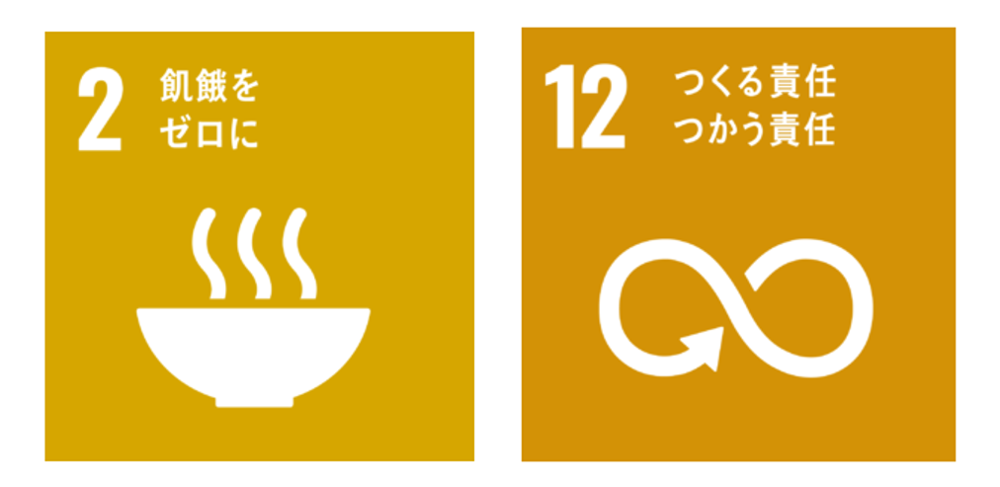
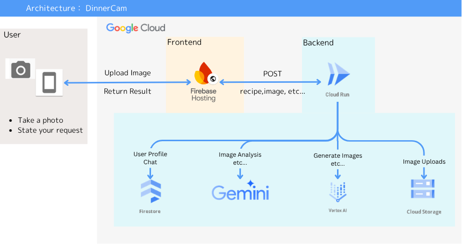

#  デモ動画

<https://youtu.be/_szth-XAVXk>

#  はじめに

現代社会では、多くの家庭が次のような課題を抱えています。

  * 「冷蔵庫に食材はあるのに、何を作ればよいかわからない」
  * 「食材を使い切れずに捨ててしまう」

本プロジェクトでは、Googleの**Vertex AI** や**Gemini AI** といった最先端AIを活用し、冷蔵庫内の写真から瞬時にレシピを提案するAIエージェントの実現を目指しています。これにより、SDGsの以下の目標達成に貢献します。

  * **目標2「飢餓をゼロに」** ：食材を無駄なく使い、家庭内での飢餓や栄養不足リスクを減らす
  * **目標12「つくる責任 つかう責任」** ：食品ロス削減、持続可能な消費・生産パターンの推進

AI技術とSDGsの精神を融合させることで、食品ロス削減、多様な食文化の推進、そして健康的な食生活の実現に寄与することを目的としています。

* * *

##  背景とSDGsへの意識

食品ロスは、世界的な社会課題です。  
イギリスでは家庭内で年間470万トンもの食品が捨てられ、アメリカでも平均家庭が週6.2カップ分の食品を廃棄しているというデータがあります。

日本の家庭でも、**年間244万トン** もの食品が捨てられています。

  * 「特売だから」と買ったものの、結局使いきれなかった…
  * 「いつか使おう」と思っていたら、いつの間にか期限切れ…

そんな **もったいない** 経験、ありませんか？

実は、日本の家庭から出る食品ロスのうち、**約43%が調理もされずに捨てられる『直接廃棄』** なんです。  
これは、食卓で食べきれずに残してしまう「食べ残し」とほぼ同じ量であり、多くの食材が活躍の場を与えられないままゴミ箱へ向かうという、非常に残念な現実があります。

さらに、私たちは「**冷蔵庫ブラインドネス** 」（食材が見えているのに、どう使えばいいのかわからない状態）に陥りがちです。  
このような「見えていても使えない」状況を打破するには、視認性だけでなく、「提案」や「選択肢」を与えてくれる仕組みが必要です。

* * *

##  小さな工夫が、大きな変化を生む

でも、あきらめるのはまだ早い！  
冷蔵庫の中の写真をスマホで一枚撮るだけで、そんな **もったいない** 経験を防ぐことができます。

週末に、私たちが開発した **「Dinner-Cam」** を使って、冷蔵庫の余った食材にもう一度活躍のチャンスを与えてみませんか？  
日々の忙しさの中でも、**気軽に・楽しく・持続可能** な食生活を送れるようになる ――そんな仕組みの実現を目指しています。

とくに忙しい共働き家庭や、一人暮らしの学生や高齢者にとって、**手軽に料理の選択肢を得られる** という安心感は、生活の質を大きく変える要素になります。

* * *

##  システム概要とAI活用

本プロジェクトでは、Google Cloudの**Vertex AI** を基盤とし、冷蔵庫内の写真をアップロードするだけで、AIが画像を解析し、中身の食材を自動で認識します。

さらに、**Gemini AI** を活用することで、画像とテキスト情報を組み合わせた**高度なマルチモーダル推論** が可能となり、「葉物野菜と卵があればオムレツが作れる」といった文脈推論も実現できます。

###  システムの動作フロー

  1. **画像認識**  
冷蔵庫内の写真から食材名を自動抽出  
（パッケージのラベルはOCRで読み取り、不明な場合は文脈推論により推定）

  2. **レシピ生成**  
抽出された食材リストに基づき、Gemini AIなどの生成系AIが材料を活かせるレシピを提案  
調理時間や嗜好（和食・中華・ベジタリアンなど）も反映可能

  3. **レシピ表示とフィードバック**  
生成されたレシピをユーザーにわかりやすく表示  
調理後は評価やコメントを送信でき、AIモデルの改善に役立てる

  4. **既存レシピとの連携**  
AIが独自生成だけでなく、クックパッド等の既存レシピデータベースとも照合し、品質や実現性を担保、実用的なレシピを提案

このようなアプローチは、Hellmann’s社の「Meal Reveal」やGE Appliances社の「Flavorly AI」などグローバル企業によるSDGsへの取り組みにも通じています。  
いずれも、Google CloudのAIやベクトル検索技術を活用し、冷蔵庫スキャンから最適なレシピを提案する共通の構想を持っています。  

* * *

##  想定されるメリット

  * **利便性向上**  
冷蔵庫の写真を撮るだけで献立が決まり、忙しい日でも素早く夕食の準備ができます。  
料理初心者でも自炊のハードルが大幅に下がります。

  * **食品ロス削減**  
使い忘れていた食材を有効活用し、SDGs目標12の達成に直結します。

  * **創造性・満足度の向上**  
AIは多様なレシピデータを学習しているため、ユーザーが思いつかない新しい料理やアレンジを提案可能。  
嗜好データを学習することで、よりパーソナライズされた提案も実現できます。

  * **プロセスの効率化・スマートキッチン連携**  
将来的には、提案されたレシピに合わせて家電を自動制御するなど、スマートキッチンとの連携も視野に入れています。  
これにより持続可能で快適な生活が広がります。

たとえば、ユーザーの嗜好を学習したAIが「月曜は15分以内の中華系」「金曜はビールに合うメニュー」といった週間パターンにも対応できるようになれば、日々の料理がルーティンでなく、楽しみになるのです。

* * *

##  技術的課題とその対応

###  1\. 食材認識の精度

冷蔵庫の写真には、パッケージや保存容器などが多く含まれるため、AIが正確に食材を識別できるかが鍵となります。  
対応としては、データセットの拡充とマルチモーダルAIによる推論で精度向上を図ります。

###  2\. レシピ品質の保証

生成AIは時に奇抜な提案や現実的でないレシピを出すことがあります。  
そのため、既存レシピとの照合やユーザー評価によるフィードバックを通じて品質サイクルを回し、実現可能で美味しいレシピの提案を目指します。

###  3\. リアルタイム性の確保

写真解析からレシピ提案までを迅速に行うため、Google Cloudのスケーラビリティやパイプライン最適化を活用し、数秒でレシピ提示ができるようにします。

* * *

##  フィードバックと持続的改善

ユーザーが提案されたレシピで調理した後、評価やコメントを送ることで、AIモデルの継続的な改善につながります。  
人気レシピは次回以降に優先的に提案されるなど、ユーザー体験の最適化を図ります。

加えて、ユーザーの料理嗜好や過去のフィードバックを活かすことで、単なるレシピ提案にとどまらず、**「継続的な食生活パートナー」** としての役割も担っていきます。  
たとえば：

  * 「先週作ったレシピに似た和風アレンジ」
  * 「毎月第3週に登場した人気レシピ」

といった家庭ごとの傾向や好みを学習し、提案の質を高める仕組みです。

* * *

##  今後の展望とSDGs社会への波及効果

冷蔵庫の写真からAIがレシピを提案する仕組みは、かつては夢のような話でしたが、現在では現実のものとなりつつあります。

本プロジェクトを通じて、日々の食卓がよりスマートで楽しくなり、

  * 「残り物で新しい料理ができた」
  * 「食品の無駄捨てが減った」

といった声が生まれることを期待しています。

将来的には、**栄養バランスのチェック** や **調理工程のリアルタイム補助** 、**音声操作による調理ナビゲーション** などへの応用範囲が広がり、キッチン全体をコーディネートする存在として、より快適で持続可能な生活を支援していきます。

さらに、この仕組みは家庭だけでなく、

  * 学校給食
  * 介護施設
  * 自治体の食育事業

などへの展開も視野に入れることで、社会全体にとって有用なインフラとなる可能性を秘めています。

私たちは、AIと人間が協調して「食」を通じて社会に貢献する時代がすぐそこまで来ていると考えています。  
本プロジェクトは、公式データや信頼できるAIサービスを活用し、「今日何食べよう？」 という日常の小さな悩みを解決すると同時に、**豊かで持続可能な社会** の実現に向けて歩みを進めています。

* * *

##  参考出典

  * Hellmann’s「Meal Reveal」開発記事（Sustainable Brands, 2024年3月21日）
  * GE Appliances × Google Cloud「Flavorly AI」プレスリリース（GE Appliances News, 2023年8月29日）
  * IBM Chef Watson解説記事（Bernard Marr, 2021年7月23日）
  * Inverse Cooking（CVPR 2019）

