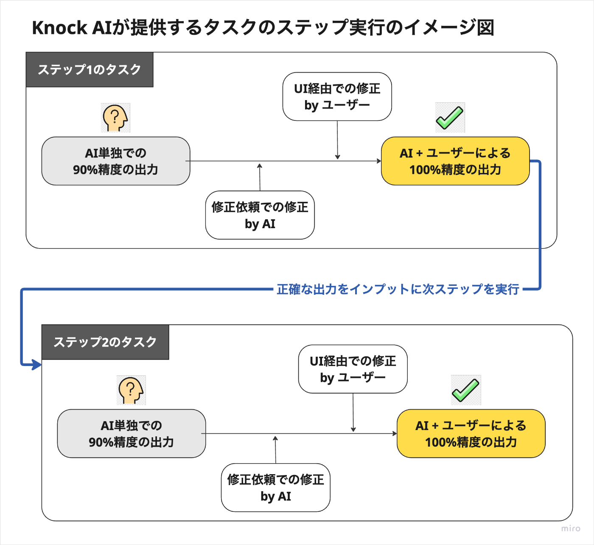
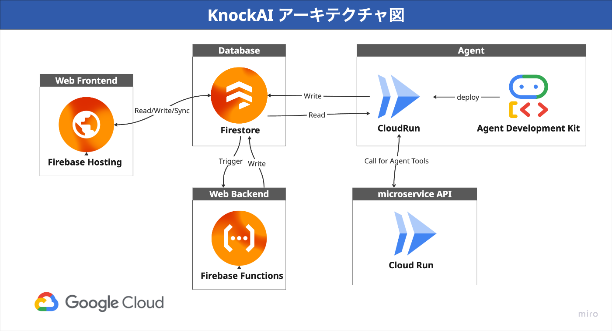
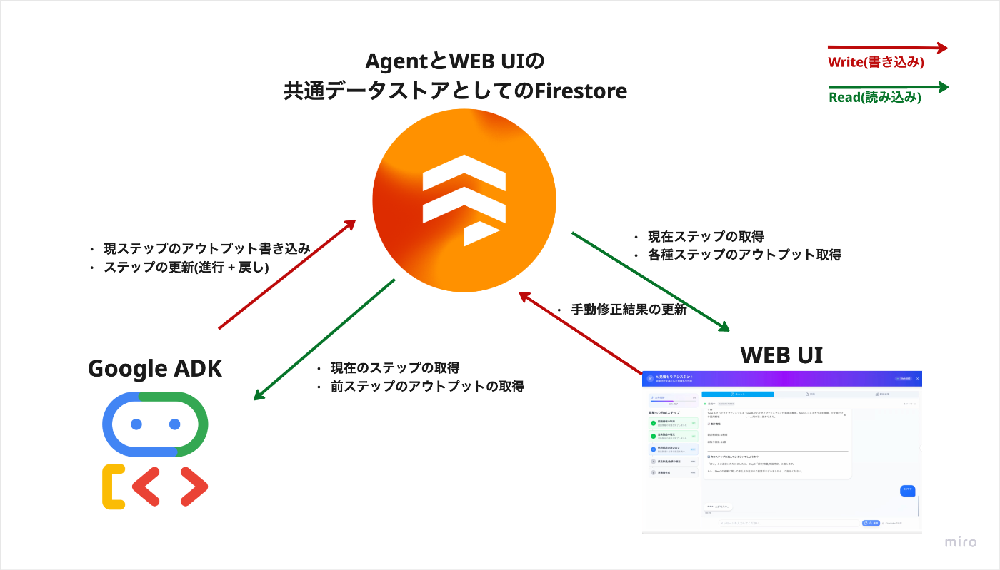

##  追記✏️

本プロジェクトは第2回 AI Agent Hackathon with Google Cloudにて、Moonshot賞を受賞しました🌕  
<https://zenn.dev/hackathons/google-cloud-japan-ai-hackathon-vol2>

##  🚀 KnockAI(ノックエーアイ)が解決する課題：

木工をはじめとする多くの**ものづくり** の現場において、**見積もり作成** は生産性を大きく阻む要因となっています。

課題 | 具体的な内容  
---|---  
**縮小し高齢化する労働力** | 日本の製造業は、過去約20年で約150万人もの就業者を失いました。さらに深刻なのは、34歳以下の若年層が120万人以上も減少した一方で、65歳以上の高齢層が30万人以上増加しているという構造的な逆ピラミッド化です。この「担い手不足」は、もはや待ったなしの状況です。  
**🤔 属人化と精度** | この人的資本の危機がもたらす最も深刻な影響は、マニュアル化できない「暗黙知」—長年の経験で培われた直感や「勘」—の喪失です。多くの企業が技能継承に不安を感じており、かつての「背中を見て覚えろ」式のOJTは機能不全に陥っています。  
  
ベテラン技能者は、本来最も価値を生むべき技術開発や後進の指導ではなく、見積もり作成のような間接業務に膨大な時間を奪われています。一件の見積もりに多くの時間を費やすことは、企業の成長機会を逸失させる深刻なボトルネックとなっています。

こうした課題に対し、私たちは「職人の頭の中をエージェントとして再現する」というアプローチで負の連鎖を断ち切るために **「KnockAI」** を開発しました。

##  デモ動画🎥

<https://youtu.be/oi97GbeGuiQ>

##  💡 KnockAIの特徴：人とAIエージェントが協業して複雑なタスクをこなす 新しいシステムの在り方

KnockAIは、単にAIに業務を依頼し、指針となるような大雑把な出力を得るサービスではありません。**人とAIが互いの長所を活かし、非常に高い精度 & AIエージェント完結で業務を遂行するためのサービス**です。

###  1\. 🤝 ステップ毎のタスク実行 + ユーザによる手動介入による高いタスク精度の実現

AIの回答は、時として不正確であるという課題が存在します。特に、金額を扱う見積もり業務では致命的です。この分野では、AIが得意とするような **高速で8-90点の回答を導き出す** だけでは不十分であり、**追加修正不要な100%精度のアウトプット** が求められます。

KnockAIは、この課題を **"複雑なタスクのステップ分割 + ユーザーによる出力の強制更新"** を組み合わせたアプローチで解決します。

「**インプットを前提としたAIによる7-8割精度の草案 → ユーザー or AIによる出力の軌道修正 → 妥当性確認後のユーザーによる承認** → **次ステップへの正確なインプット** 」の処理を順次繰り返すことで、AIのスピードと人間の正確性を両立。複雑かつ高い精度が求められる業務においても、安心してAIを活用できます。

今回は実際に木工制作業務に従事されている現職の皆様に、見積もり作成時に実際に頭の中で行われている工程のヒアリングを実施。図面からの見積もり作業作成を完全再現するAIエージェント実装へと落とし込みました。ご協力頂いた皆様にはこの場を借りて、感謝を申し上げます。

No. | ステップ名 | 実装した機能 | 人がチェックする観点  
---|---|---|---  
1 | **図面の読み込み** | PDFファイルを受け取りキャプチャを作成 | UI経由で登録したPDF図面をAIエージェントに読み込む  
2 | **制作物の種類と個数の特定** | 制作対象の制作物の種類と個数を推測し、リストUIで表示 | 制作物の名称/数量は正しいか? 抜け漏れがないか?  
3 | **各制作物に使用する部材の数量/価格の特定** | 各制作物で使用する部材数量/価格などを推測・出力し、テーブルUIで表示 | 特定の制作物で使用する部材が網羅できているか? 使用する部材の数量は正しいか?  
4 | **見積もり書類の作成** | STPE3の出力を元にPDFファイルで見積もり/明細書を出力 | 出力された書類のフォーマットが問題ないか? 前ステップまでの内容を正確に取り込めているか?  
  
**★STEP2:制作物の種類と個数の特定におけるエージェント動作例**

!

  1. **🤖 AIが下書きを作成** : PDF図面から制作物の名称と個数を推測して出力
  2. **👨‍💻 人が確認・修正** : ユーザーが名称や個数を確認して、必要に応じて直感的なUIで修正します。
  3. **👨‍💻 AIによる修正** : そもそもの精度が低い場合は、ある程度の指針を示した上で再出力をAIに依頼することも可能
  4. **✅ ステップを承認** : ユーザーが確認してOKであれば次に進むように命令
  5. **🕰️ ステップを遡ったやり直しも可能** :〇〇からやり直したいとなった際も、再度指示を出すことで、柔軟に現在ステップを調整可能

###  2\. 🧩 高い汎用性："見積もり作成"だけでなく"あらゆる定型業務"へ

KnockAIのコア機能は、先に述べたように「**①ステップ式タスク実行** 」と「**②やり直しが効く修正機構** 」の組み合わせに加えて、「**③任意テンプレートでのファイル出力** 」も含まれます。

要素技術 | 説明  
---|---  
**A: ステップ式タスク実行** | 複雑な業務を単純なサブタスクに分解し、AIと人が協業しながら段階的に処理する処理機構。  
**B: やり直しが効く修正機構** | AI出力に誤りがあっても、人力 or 再出力指示でステップ単位でピンポイント軌道修正  
**B: 任意フォーマット出力** | Jinja2テンプレートエンジンを活用し、最終成果物をPDF、Excel、Wordなど、業務でそのまま使える形式で生成。  
  
今回は「PDF図面から見積書を作る」エージェントを実装しましたが、このフレームワークは非常に汎用性が高く、**ステップ毎に分解可能であり、高い精度が求められる** ユースケースにおいて幅広く応用可能です。

  * **応用例1：人とAIが協調動作する契約書レビュー** ⚖️

    * Step1: AIが契約書の要点を抽出・リスク項目を指摘
    * Step2: 弁護士が内容をレビュー・修正
    * Step3: 修正内容を反映したサマリーレポートをWordで出力
  * **応用例2：人とAIが協調動作する営業提案資料の作成** ⚖️

    * Step1: AIが対象企業の事前情報をリサーチ
    * Step2: AIに想定読書の情報をインプット
    * Step3: アウトラインの生成
    * Step4: 提案本文の生成
    * Step5: 最終的なパワーポイント/PDFファイルの出力

このように、KnockAIは**あらゆる業界の定型業務をDXするポテンシャル** を秘めています。

##  🔧 技術的挑戦とアーキテクチャ

本ハッカソンでは、**Google CloudのAI/MLサービスをフル活用** し、プロダクション環境で運用することも見越して、スケーラブルかつセキュアなシステムを構築しました。

###  アーキテクチャ図

####  主要な技術選択

  * Nuxt3 + Vue3: モダンなフロントエンド開発
  * Firebase: 包括的なBaaSソリューション
  * Zod + TypeScript: 実行時型安全性
  * Vertex AI: Google Cloud AI統合
  * Cloud Run: サーバーレスマイクロサービス

####  設計原則

  * 🔒 型安全性の担保: Zod + TypeScript による厳密な型管理
  * 🤖 最新AIエージェント機能の利活用: VertexAI 及び Agent Development Kit によるタスク処理機構
  * 🔥Firstoreの全面採用によるシンプル化
  * 🔄 リアルタイム性の高いUX: Firestore リスナーによる即座の更新

###  🚀 特に工夫した点

**実際に業務に適用 & 継続的にサービス運用できる** 点に拘り、以下の技術的工夫を行いました。

####  Agent Development Kit(以後ADKと表記) と WEB UIのスムーズな統合

開発にあたり**ADKで開発したエージェントをバックエンドとして、WEB UIから自然な形で扱えるUXの実現** を目標としました。

色々試行錯誤しつつ最終的には、**ADKで開発したエージェントからFirestoreに現在のステップや各ステップの出力を書き込ませるアーキテクチャ** を採用する事で、多種のリソースが絡み合う複雑な作りにせずとも、以下図のような比較的シンプルな構成で、AIエージェントとWEB UIの自然な統合を実現しました。

フロントエンドでは、FirestoreのSnapshot機能を用いて、AIエージェント側からの出力結果をリアルタイムにUIに反映する形で、あたかもAIエージェントとWEB UIが完全に統合されているようなユーザー体験を実現しています。(例: AIエージェント側で特定ステップのタスクが完了すると即座にUIに反映される/UI側で出力を調整し保存すると、直ちにAIエージェント側で調整内容を元にしたタスクの再実行が起動する..etc)

ADKで開発したAIエージェント自体は、認証付きのCloudRunサービスとしてデプロイされており、バックエンドが当該サービスにリクエストを送ることで、やり取りを行なっています。

####  マイクロサービス思考に基づく疎結合なTool設計

AIエージェントが使用するTool（=ルートエージェントが呼び出す各種機能群）は、それぞれ独立したCloud Runサービスとして実装しました。

ADKの実装自体は、モジュール単位でファイル分割するなどして、見通しが悪くならないように工夫はしつつも、以下の判定基準を元に、必要に応じて機能単位で独立したCloudRunサービスとしてデプロイ。それらをAIエージェントがToolとして呼び出す構成としました。

**◾️マイクロサービス化の判定基準**

!

①エージェント実装に含めて問題ない程度にコード分量が少ないか?  
②実行処理に汎用性があり独立したAPIとして用意することで横展開が可能か?

CloudRunAPI 兼 Tool | 実施処理 | サービス内利用箇所  
---|---|---  
PDF画像化Tool | PDFファイルを受け取りキャプチャを作成 | 図面一覧画面のプレビューで使用  
帳票生成Tool | テンプレートHTMLと注入JSONを受け取りファイル生成⇨GoogleCloudStorageにアップロード | 最終的な出力の実装  
  
この設計方針により、**今後別の業務領域や全く新しいAIエージェント開発に着手する際にも、構築済みToolの流用が可能となりました。**

####  フルサーバーレス＆スケーラブルなアーキテクチャ

コンピューティングリソースは全てサーバーレスで構成されており、Firebase(Hosting/Firestore/Cloud Storage for Firebase)とCloud Runを全面的に採用。ユーザー数の増減に自動でスケールします。インフラ管理のコストを最小限に抑え、開発者はアプリケーションロジックに集中できる環境を構築しました。

特に図面や出力書類ファイルの保存/読み取りには、クライアントSDK経由で容易に扱えるCloud Storage for Firebaseを採用することで、バックエンドからのストレージアクセスをスキップ。シンプルな実装を実現しました。

####  エンタープライズレベルの堅牢なセキュリティ

Firestore/Cloud Storage for Firebase: テナント（企業）ごとにデータアクセスを分離する厳格なセキュリティルールを設定。認証必須のCloud Run/ Firebase App Checkを導入し、未認証の不正なリクエストをブロック。APIキー管理: Secret Managerを活用し、機密情報を安全に管理。

など、高いセキュリティレベルを担保する形で各種実装を行いました。

##  【課題】さらなる精度向上

現在は汎用的な知識で回答していますが、今後は各社の過去の見積もりデータや、建材メーカーの製品カタログをRAG (Retrieval-Augmented Generation) を用いて取り込み、AIエージェントがより専門的な回答を生成できるようにします。Vertex AI Search の活用を検討しています。

##  【展望】プラットフォーム化と横展開

KnockAIの汎用的なフレームワークを基盤に、建設、製造、士業など、あらゆる業界向けのAIエージェントを開発できるプラットフォームへと進化させていきます。ユーザーがノーコード/ローコードで独自の業務自動化エージェントを構築できる世界を目指します。

最後までお読みいただき、ありがとうございました。  
[参考記事]<https://www.careerlinkfactory.co.jp/blog/shortage-of-skilled-labor/>
