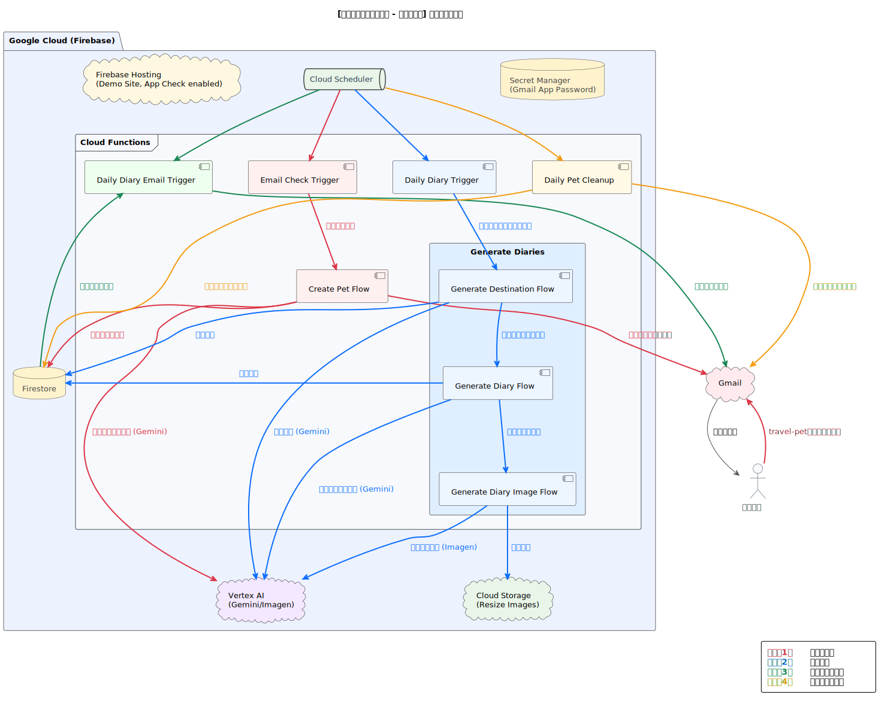
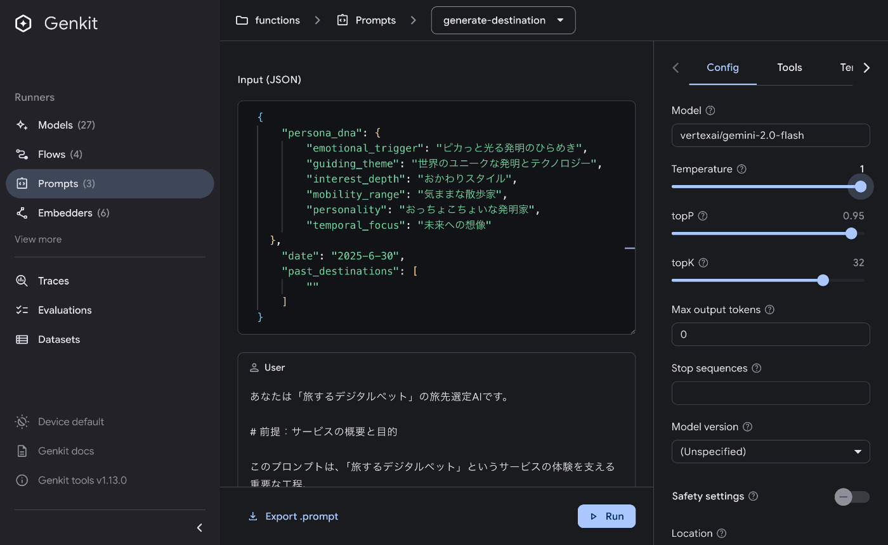
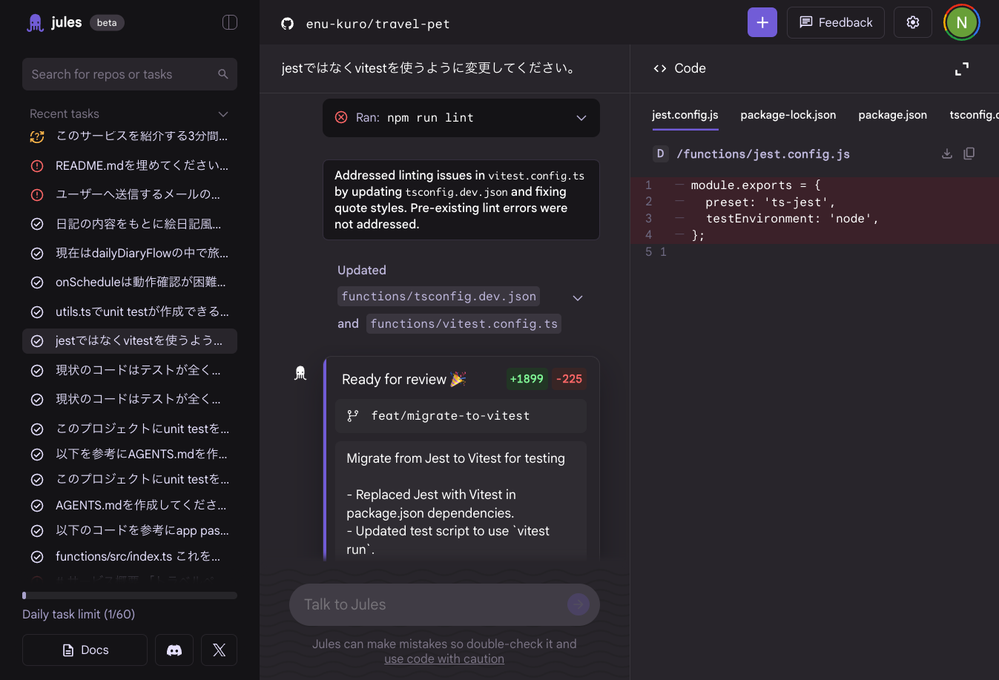

!

Zenn主催の【[第2回 AI Agent Hackathon with Google Cloud](https://zenn.dev/hackathons/google-cloud-japan-ai-hackathon-vol2)】提出プロダクトの紹介記事です。

##  📨 サービス紹介

あなたのメールに届く、ちいさな世界の旅。

知らない世界に、出会ってみませんか？

「たびぺっち」は、あなたのもとに毎日1通、小さな旅日記を届けるデジタルペットです。  
ペットは気まぐれに世界を巡り、観光地だけでなく、誰も知らない村や、その日に話題になった遠い国の出来事、静かな港町の朝など、思いもよらない景色や物語をメールで教えてくれます。

日々の情報が自分好みに並ぶ時代だからこそ、  
「たびぺっち」は、あなたが普段出会えない場所・文化・出来事を、“ゆるいノイズ”としてそっと届けます。  
見慣れた毎日に、ちょっとだけ新しい視点と驚きを。  
忙しいあなたの心に、小さな冒険と癒しを。

さあ、メールボックスで世界を旅する日々をはじめましょう。

<https://www.youtube.com/watch?v=uAvbsXyD3zU>

###  🌏 なぜ「たびぺっち」をつくったのか？

AI技術の進歩により、私たちはこれまで以上に自分好みにパーソナライズされた情報に囲まれるようになりました。おすすめの商品、好みに合わせたニュース、興味に沿ったコンテンツ――こうした利便性は日常を快適にしてくれますが、一方で「フィルターバブル」という問題も指摘されています。

フィルターバブルとは、自分に都合のよい情報ばかりが届くことで視野が狭まり、新しいものとの出会いや偶然の発見が失われてしまう現象です。便利である反面、世界が狭くなり、多様な価値観との接点が薄れてしまう恐れがあります。

「たびぺっち」は、あえてこの流れに逆らい、「普段なら決して触れることがない世界」への小さな扉を提供します。

パーソナライズによって心地よく整理された情報空間ではなく、むしろ全く無関係で偶発的な世界との出会いを楽しむサービスです。AIの力を「自分好みに絞り込む」ことではなく、「まったく関心のなかったものを、いかに面白く、魅力的なエンターテイメントに変えるか」という点に活用しました。

世界は本来、自分の知らないこと、関心がなかったことに満ちています。だからこそ、新しい発見と驚きが絶えません。「たびぺっち」を通じて、あなたの日常に少しだけ「心地よいノイズ」としての新しい視点を届けたい、そんな想いからこのサービスを作りました。

###  ✉️ 「たびぺっち」のはじめかた

「たびぺっち」を始めるのはとても簡単です。  
下記のアドレスにメールを送るだけ。本文や件名は空でも構いません。

> **[kotobasoft+travel-pet@gmail.com](mailto:kotobasoft+travel-pet@gmail.com)**

これだけで、あなたのもとに毎朝6時、旅するペットからの旅日記メールが届くようになります。

  * ペットの旅には寿命があり、数日で旅は終わります。
  * 配信を停止したい場合は、件名に「配信停止」と入力したメールを送ってください。すぐに旅が終了し、以降のメール配信は行いません。
  * 旅の終了時には、登録されたメールアドレス等の情報は**完全に削除** されます。
  * なお、ユーザーのメールアドレスは本サービス以外の目的で利用することは一切ありませんので、ご安心ください。

* * *

##  🛠 技術解説

###  ⚙️ たびぺっちはどんな仕組みで動いているの？

「たびぺっち」は、FirebaseとGoogle Cloudのサービスをフル活用したサーバーレス構成で実装されており、ユーザーが指定のメールアドレスにメールを送るだけで、世界を旅するペットとの日々が始まります。ここでは、その技術的な仕組みについてご紹介します。

###  🗂 主な構成要素

  * **Firebase Cloud Functions**  
定期的なメール受信チェック、ペットの生成、旅日記の作成、メールの自動配信など、サービスのほぼ全てのロジックを担っています。Google Cloud Schedulerと組み合わせることで、すべての処理が自動的に実行されます。

  * **Google Cloud Scheduler**  
各処理フロー（メール受信チェック、日記生成、メール送信、データ削除）に対して、あらかじめ設定した時間や間隔でCloud Functionsをトリガーする役割を担っています。これにより、定期的な処理が自動で実行されるようになっています。

  * **Cloud Firestore**  
ユーザーのペット情報や、今までに送った旅日記を記録するデータベースとして活用しています。

  * **Cloud Storage for Firebase**  
AIが生成した旅の画像を保存しています。

  * **Firebase Extensions（Resize Images）**  
画像生成AI「Imagen」の出力はサイズが大きいため、Firebase Extensionsを活用して自動リサイズしています。これによりメールというUIに合わせた最適なユーザー体験を実現しています。

  * **Google Cloud Secret Manager**  
Gmailのアプリパスワードなどの機密情報を安全に管理しています。

  * **Firebase Hosting（デモ用 UI）**  
シンプルな動作確認用のデモサイトをホスティングしています。ユーザーはブラウザ上のボタン操作だけで、メール送信不要で「ペット生成 → 日記生成 → 画像生成」のフローを手軽に試せます。

  * **Firebase App Check**  
デモサイトから発行されたApp Checkトークンをリクエストヘッダーに付与することで、Cloud FunctionsのAPI呼び出しを検証しています。サイト以外からの不正なアクセスや大量リクエストを防ぎ、乱用によるコスト増加を抑制します。

* * *

###  🤖 AIを活用した旅日記体験の実現

「たびぺっち」の特徴である“毎日世界から届く旅日記”は、複数のAI技術を連携させて生み出しています。

####  🧩 GenkitでAI開発を効率化

Googleが提供するAIフレームワーク「Genkit」を採用することで、AI関連の開発作業を効率化しています。

  * **宣言的なフロー定義**  
ペット生成・旅先の選択・日記作成という一連の処理を、TypeScriptの明確な`flow`定義で管理しています。これにより、複雑なAI処理も簡潔で見通しよく設計でき、メンテナンス性が大幅に向上しています。

  * **ローカル開発UI**  
`genkit start` コマンドを利用すると、ローカル環境で直感的にフローのテストやデバッグが可能です。入力データやプロンプトをGUIから簡単に操作でき、リアルタイムで結果や処理経路を確認できます。

  * **プロンプト管理**  
プロンプトやAIモデルの設定を.promptファイルに切り出すことで、コードと分離された再利用・編集しやすいプロンプト管理が可能になります。設定変更やチューニングの試行錯誤をよりスピーディに行えるのが特徴です。

  
_GUIでflowやpromptの試行錯誤が高速にできます。_

####  🖼 テキスト・画像生成AIの連携によるリッチな表現の実現

  * **Gemini**  
ペットのプロフィールや旅日記のテキスト生成にはGeminiモデルを採用。構造化された詳細なプロンプトと、Geminiに内蔵されたGoogle Search機能の活用で、最新の出来事と意外性を両立させた豊かな出力を実現しています。

  * **Imagen**  
生成した日記の内容に合わせて、Imagenで情緒ある画像を自動生成。AIならではの多様な旅風景を毎日楽しめます。

* * *

###  🪄 シンプルなUXを支える仕組み

「たびぺっち」は、ユーザーがただメールを送るだけでサービスを始められるという、非常にシンプルなユーザー体験を実現しています。その裏側では、複数の技術がシームレスに連携し、スムーズな利用を支えています。

  * **IMAP/Nodemailer**  
専用のメールアドレスに届いたメールを、Google Cloud Schedulerのスケジュールに従ってIMAP経由でチェックし、新規ユーザーの登録を自動で検知します。  
その後は、Nodemailerを使って、AIが生成する旅日記を毎日メールで配信します。

この構成により、登録から配信までのすべての処理が自動化されており、シンプルなUXと運用のしやすさを両立しています。

* * *

##  💡 開発で工夫した点・苦労した点など

###  🚀 Firebase中心の技術構成による開発効率化

メール機能以外は、Firebase（Genkit含む）ですべてカバーできる技術構成を採用しました。複雑に見えるシステムですが、実際の実装は非常にシンプルです。Firestore、Cloud Storage、Cloud Schedulerは特別な設定が不要で、コードを書くだけで連携できるため、開発効率が大幅に向上しました。

###  🏗 アーキテクチャの汎用性

今回構築したCloud SchedulerとCloud Functionsを組み合わせたサーバーレスアーキテクチャは、「たびぺっち」以外のさまざまなサービスにも応用できる汎用性の高い構成です。

例えば：

  * パーソナライズされたニュース配信サービス
  * 定期的なAIレポート生成システム
  * ユーザー別カスタムコンテンツ配信サービス

AIを活用した定期配信型サービスの基盤として、このアーキテクチャパターンは今後も様々な場面で活用できると考えています。

###  📧 メール機能実装の苦労

メール機能の実装は、今回最も苦労した部分でした。当初はGmail APIの利用を検討していましたが、審査が非常に厳しいことがわかり、App Passwordsを使う方法に変更しました。

エイリアスを使った送受信を正しく行うには、Gmail側での複数の設定が必要で、調べながらの実装となりました。IMAP周りの実装はAIに任せることで開発スピードは確保できましたが、知識が浅い分野だったため、レビューや設定に時間がかかりました。

###  🤖 AI駆動開発の実践

今回のプロジェクトでは、**可能な限りの作業をAIに任せる** ことを試しました：

  * 実装コードの生成
  * プロンプトの作成
  * システム構成図の作成
  * README.mdなどのドキュメント作成

ただし、AIに任せる際の課題も見えてきました：

**過度な抽象化問題** : AIは複雑で汎用的なコードを生成しがちですが、ハッカソンでは直感的で分かりやすいコードが重要です。この問題に対して、`AGENTS.md`に以下のような指示を追加することで対応しました：
    
    
    - **Simplicity First:** Implementations should prioritize simplicity and clarity over premature abstraction or optimization.
    

**AI特有の文体** : どうしても「AIが書いた感」が出てしまいます。この記事もご多分に漏れず、AIっぽさ全開なのはご愛嬌ということで...😅

###  🛠 開発ツールの比較検証

Google協賛のハッカソンということで、当初はGoogle製の**Jules** と**Firebase Studio** を使用していました。しかし、いまいちうまく使いこなせなかったため、途中から**OpenAI Codex** に切り替えました。

現時点では、**Codexの方が圧倒的に使いやすい** 印象です。ただし、Julesはまだリリースされたばかりなので、今後差は縮まっていくと思います。

  
_頑張ってタスクをこなす Jules さん。_

Firebase Studioについては、今回のプロジェクトのユースケースとは合わなかった感があります。ゼロからプロンプトだけでアプリを作ったり、UI実装を高速に試すような用途により適しているかもしれません。

###  🎮 LLMによるゲームロジック制御の実験

今回は、主要なゲームロジックをLLMに全て任せられないかという実験も行いました。ランダム性をすべてプロンプトで表現することを試みましたが、やはり偏りが生じやすく、コントロールの難しさを実感しました。  
現在は未実装ですが、将来的にはペットの成長システムやイベントの発生などもLLMに任せて、ゲーム環境全体をLLMでコントロールできるような仕組みも実現できたら面白そうだなと思いました。

* * *

##  🎯 参考サービス・インスピレーション

「たびぺっち」の開発にあたり、以下のサービスからインスピレーションを得ました：

###  🐸 旅かえる

かえるが勝手に旅をする人気ゲーム。どこに行くかはカエルの気分次第という、プレイヤーがコントロールできない「見守る楽しさ」が「たびぺっち」のコンセプトと重なります。

###  🧸 ぬい旅

自分ではなくぬいぐるみに旅をさせるという独特な体験。第三者視点で旅を楽しむという発想が、デジタルペットの旅日記というアイデアに繋がりました。

###  🥚 たまごっち

成長システムや寿命といった、ペットとの長期的な関係性を築く仕組み。「たびぺっち」では成長システムは未実装ですが、将来的にはペットの成長や変化を楽しめるシステムを追加したいと考えています。

* * *

##  🔗 リンク集

###  🐙 GitHubリポジトリ

<https://github.com/enu-kuro/travel-pet>

###  📮 デモサイト

「メール使うのは嫌だ！」というあなたのために、たびぺっちの旅日記を仮体験できるデモサイトを用意しました。  
<https://travel-pet-b6edb.web.app/>
