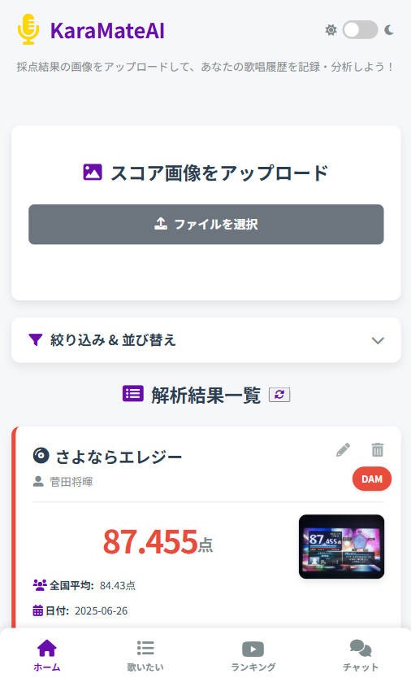
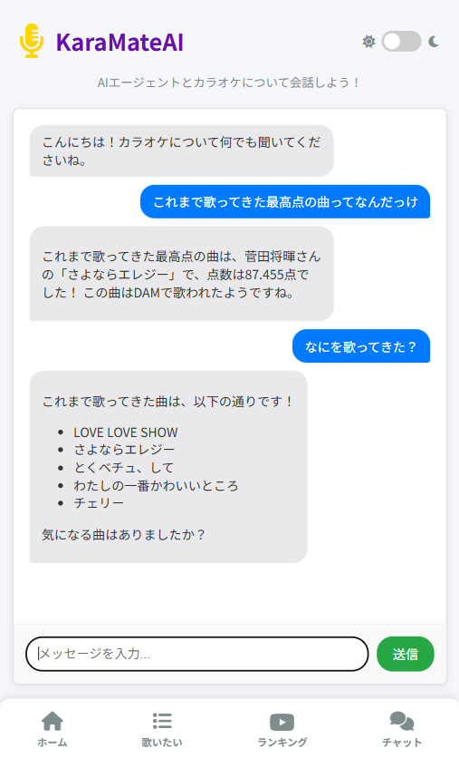
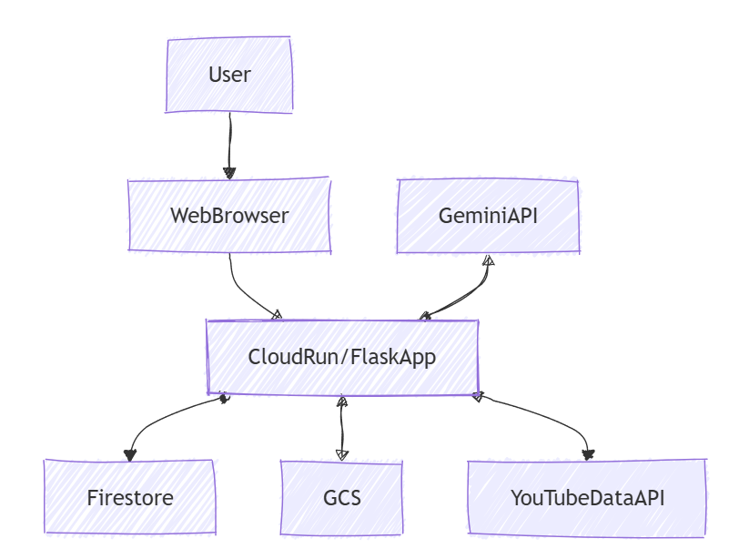

##  概要

本記事はZennが主催する「第2回 AI Agent Hackathon with Google Cloud」にエントリーするプロジェクトについての紹介記事です。  
<https://zenn.dev/hackathons/google-cloud-japan-ai-hackathon-vol2>

##  プロジェクト概要

KaraMateAI（カラメイトエーアイ）は、GoogleのGemini AIを活用して、あなたのカラオケ採点履歴を記録・分析し、より豊かなカラオケ体験を提供するWebアプリケーションです。採点結果の画像アップロードから、AIによるデータ解析、履歴の管理、さらにはAIとのチャットまで、カラオケに関する様々なニーズに応えます。

###  ユーザー像と課題

####  ユーザー像

  * **カラオケ愛好家** : 定期的にカラオケに行き、自分の歌唱力向上に意欲がある方。
  * **データ分析好き** : 自分の採点結果を数値で把握し、傾向を分析したい方。
  * **効率的な管理を求める方** : 採点画面を写真に撮るだけで、手軽にデジタル管理したい方。
  * **AIの力を活用したい方** : 最新のAI技術に興味があり、カラオケ体験にAIを取り入れたい方。
  * **レパートリーを広げたい方** : 歌いたい曲の管理や、新しい曲の発見に役立つツールを探している方。

####  課題

従来のカラオケ体験には、以下のような課題があります。

  * **採点履歴の管理が煩雑** : 採点画面の写真が溜まり、過去の記録を振り返るのが難しい。機種（DAMやJOYSOOUND）を横断して、一括して管理できない。
  * **歌唱データの分析不足** : 点数だけでは、どこが良かったのか、改善すべき点はどこか分かりにくい。
  * **レパートリーの偏り** : いつも同じ曲ばかり歌ってしまい、新しい曲に挑戦するきっかけがない。
  * **AI技術の活用機会の少なさ** : 日常の趣味にAIをどのように取り入れれば良いか分からない。

###  ソリューションと特徴

####  ソリューション

KaraMateAIは、これらの課題に対し、AIとクラウド技術を組み合わせた革新的なソリューションを提供します。

  * **採点結果の自動デジタル化** : 採点画面を撮影するだけで、AIが主要データを自動抽出し、デジタルデータとして一元管理します。
  * **パーソナルなカラオケアシスタント** : 過去の履歴から最高点や平均点を瞬時に提示し、ユーザーの歌唱成長を可視化します。
  * **レパートリー拡張のサポート** : 歌いたい曲リスト機能や、AIによるタグ提案、YouTubeランキングで新しい曲との出会いを創出します。
  * **AIとの対話で疑問を解消** : カラオケに関するあらゆる質問にAIがチャットで回答し、ユーザーの知識を深めます。

  
_ホーム画面_  
  
_チャット画面_

####  特徴

▼デモ動画  
<https://youtube.com/shorts/rPOEIKLf6Og?feature=share>

###  システムアーキテクチャ

####  システムアーキテクチャ図

####  使用技術

  * **バックエンド** : Flask (Python)
  * **データベース** : Google Cloud Firestore
  * **画像ストレージ** : Google Cloud Storage
  * **AI** : Google Gemini API
  * **フロントエンド** : HTML, CSS, JavaScript
  * **アイコン** : Font Awesome
  * **その他** : Pillow (画像処理), requests (API通信)

