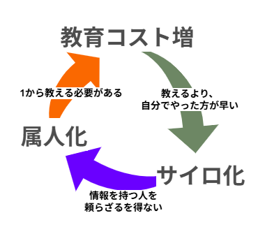
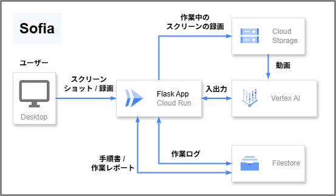
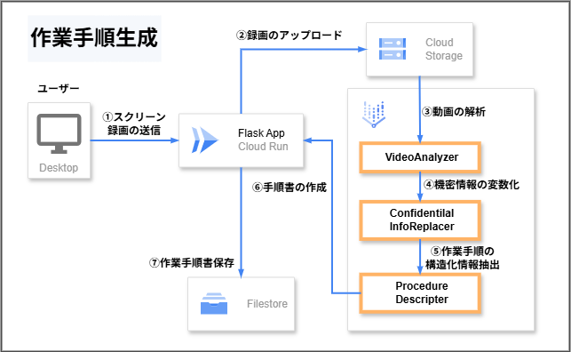
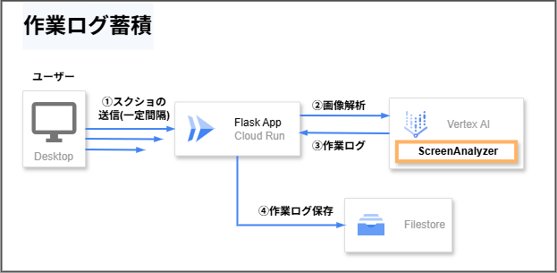
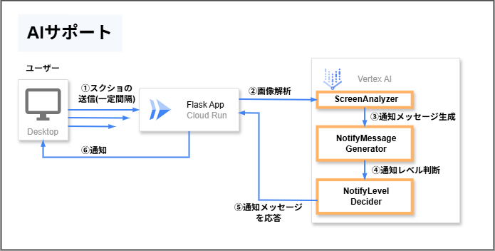
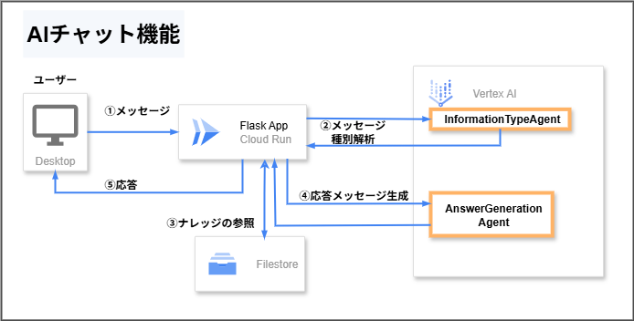

##  1\. **知的作業の"暗黙知"問題**

デジタル化が進んでいる現代でも、エンジニアリングやデータ分析といった知的作業の現場では、暗黙知問題が深刻化しています。

###  こころあたりありませんか？

  * "〇〇さんがいないと進まない業務がある"
  * "いろんな人に同じ質問をされて、同じ説明を繰り返している"
  * "資料を作ろうと思いながら、数か月経過"

もしひとつでも当てはまるのであれば、暗黙知問題に直面していたと言えます。

###  3つの暗黙知問題

####  作業ノウハウのサイロ化

> 先輩「評価項目のレビュー、検査Tに回した？」  
>  自分「いや、してないです（そんなルール聞いてない…）」

このような「知らなかった」によるミスは、組織全体で膨大な手戻り作業を生み出します。  
作業手順が口伝えでしか共有されないため、同じミスが繰り返され、品質のばらつきが常態化してしまいます。

####  作業の属人化

> 上司「問い合わせきたから、至急〇〇さんに回して」  
>  自分「〇〇さん、今日休みです」  
>  上司「」

特定の人しか手順を知らない作業があると、作業効率の悪化や業務負荷の偏りが生じます。  
その人が休暇や異動になった瞬間、業務が完全にストップする「単一障害点」問題は非常に深刻です。

####  人材育成の高コスト化

> 新人「ここの作業のやり方わからんくて… 今お時間ありますか？」  
>  先輩「今ちょっと手が離せないから後で説明するね」

専門性の高い業務だと、業務をこなすレベルに達するまでの育成コストが高くなります。  
OJTと自業務の兼務で業務負荷が高くなり、教育の質の低下を招くこともあります。

###  そして始まる **"負のスパイラル"**

これらの問題は相互に影響しあって、深刻化していきます。

###  従来アプローチが抱える根本的な限界

これらの問題を解決する王道として、「マニュアル作成」「手順書の整備」が挙げられます。実際、多くの組織で「とにかく文書を作ろう」という取り組みが行われています。

しかし、業務の現場では、理想通りにいかない現実があります。

####  文書作成の現実

> PM「今回の手順、ちゃんと文書化しておいて」  
>  自分「はい、落ち着いたらやります」← やらない

  * 文書作成・整理の工数が確保できない
  * 〆切のある目先の作業を優先する

等の理由により、文書化は後回しにされ、最終的に忘れ去られます。

####  作成した文書の陳腐化

> 新人「手順通りにやったのに、エラーが出ます」  
>  先輩「あー、それ古いから使えないよ」  
>  新人「」

文書を作成した後も継続したメンテナンスが必要になる場合が多く、メンテナンスを怠ると陳腐化してしまいます。

必要になったときに陳腐化していることに気づかず、ミスを誘発してしまう可能性もあります。

###  **「頑張って文書化しよう」では限界がある**

必要なのは、**文書化の負担を無意識に** 変える全く新しいアプローチです。  
この課題に対して、AIエージェントを使った解決策を提案します。

##  2\. **提案：AIエージェントによる知的作業の見える化と支援**

提案するのは、**作業者がいつも通り業務をするだけで、自動的に知識が蓄積される仕組み** です。

従来の「人間が頑張って文書化する」アプローチではなく、「AIエージェントが自動的に文書化する」ため、作業者が負担を感じることなくナレッジの蓄積が行われます。

###  コアアイデア：PCスクリーンの逐次解析による作業の文章化

普段通りの作業をしている中で、作業者のPCのスクリーンキャプチャを一定間隔でAIエージェントに渡します。  
AIエージェントはバックグラウンドで逐次解析し、どういった意図で、何をしようとしているかなど、作業に関する情報を抽出します。

抽出された作業情報をクラウドに蓄積することで、「自動で」ナレッジが残る仕組みを実現します。

!

ユーザーのスクリーンキャプチャなどの生のデータはクラウドに保存していません。入力としてのみ使用しています。

LLMの出力に含まれる機密性の高い情報やプライバシーに関する情報は、変数化や一般化によって排除しています。

###  期待効果

**サイロ化の防止**  
作業に関連する情報が自動で文章化されるため、情報共有が進み、誰でも最新の作業情報を参照可能になります。

**属人化の解消**  
個人に依存していた作業手順やノウハウが常に記録されるため、「この人しか知らない」問題を解消します。

**育成負荷の削減**  
新人への教育時、常に最新の業務手順が参照可能となるため、OJTの時間や負荷を大幅に削減できます。

###  本提案のターゲット

以下のような課題を抱える方に、特に効果を発揮します。

"冒頭の質問に心当たりある"と思ったあなた  
"OJT指導に割く時間がない"育成担当の中堅社員  
"作業の標準化を進めたい"プロジェクトリーダー

##  3\. 見える化する仕組み「Sofia」

前章で提案した「**AIエージェントによる暗黙知の自動蓄積** 」を実現するシステム「**Sofia** 」を開発しました。

> Sofia = Smart Operations & Flow Intelligence Assistant

###  全体像

「Sofia」はCloud Run上で実行されるWebアプリです。

スクリーンキャプチャからの作業の解析や、手順書・レポートの生成はVertex AIが担います。  
作業ログや作業手順書は、FireStoreに蓄積されます。  
録画動画は、**一時的に** CloudStoreに保存されます。

###  デモ動画

<https://youtu.be/vwHcl85IR5M>

###  4つの機能

####  作業手順生成と一覧

作業をしている様子を録画し、動画を解析することで作業手順を自動で生成します。

作業中に画面に表示される機密情報やプロジェクト固有の情報は変数化されるため、情報漏洩のリスクを最小限に抑えながら、汎用的な手順書として活用できます。

##### 作業手順自動生成の流れ

####  作業画面ログの蓄積

手順書の生成よりも粗い間隔で作業中の画面を解析し、何をしたか、どこに何を保存したか、などの作業に関する情報を文章化し、作業ログとしてFireStoreに蓄積します。

作業ログは後述する作業レポート生成で活用されます。

##### 作業ログの蓄積の流れ

####  作業レポート生成と一覧

作業ログから、その日の作業レポートを自動で生成します。  
生成されたレポートは、FireStoreに保存され、レポート一覧画面から参照可能です。

レポートには、どれぐらいの時間、なんの作業をしたか、作業の成果などの情報がまとめられており、作業改善に役立てることができます。

##### レポート生成の流れ

####  AIによるリアルタイムサポート機能

作業内容から、改善点や警告をほぼリアルタイムで通知します。  
知らなかったショートカットや、危険な操作をしようとしていることを通知することで、作業効率の改善やヒューマンエラーの予防をします。

!

サポート時は、解析間隔が短くなります。

##### AIサポートの流れ

####  AIチャット機能

AIエージェントがユーザーからの質問をもとに、ナレッジ内の情報を参照し、回答を生成します。  
蓄積されたナレッジに誰でも簡単にアクセス可能になります。

##### AIチャット機能の流れ

##  4\. 検証

AIAgentハッカソンの開発を題材に、前述の機能の検証をしました。

###  作業手順書の自動生成

GitHubのリポジトリをCloneした後、WorkTreeを作成する流れの手順を自動作成しました。

> Git Clone 後の WorkTree 設定手順
> 
>   1. Git リポジトリのクローン  
>  PowerShell を開き、ローカルのサンドボックスディレクトリ（例：C:\Users\user\dev\sandbox）に移動します。  
>  その後、以下のコマンドを使用して、指定された GitHub リポジトリをクローンします。  
>  `git clone https://github.com/fky1714/sample_project.git`
> 
>   2. クローンされたリポジトリへの移動  
>  中略
> 
>   3. Worktree の追加  
>  以下のコマンドで feature/task_a と feature/task_b の Worktree をそれぞれ作成します。  
>  `git worktree add ../task_a feature/task_a`  
>  `git worktree add ../task_b feature/task_b`
> 
> 

実は途中`git branch -a`でブランチを確認したりしていたのですが、省かれてしまいました。  
また、リポジトリのクローンの手順ですが、録画用にサンドボックスを使用しただけで、一般化してほしい情報でした。

とはいえ、手順書通りの操作でWorkTreeの作成ができるので、目的は達成しています。修正が必要な箇所も限定的なので、手順書作成の工数削減が期待できます。

###  作業レポートの生成

AIサポート機能の改善作業していた日のレポートを自動作成しました。

> #  📋 作業レポート
> 
> ##  🎯 概要
> 
> 主にPythonを用いた通知システムの機能改善と、タスクレポート生成機能の新規開発に取り組みました。  
>  略
> 
> ##  ⏰ 作業時間
> 
> **総作業時間** : 1時間18分  
>  その他: 0時間2分  
>  コーディング: 1時間3分  
>  文書作成: 0時間2分  
>  調査: 0時間8分  
>  コミュニケーション: 0時間3分
> 
> ##  🏆 成果
> 
> ###  ✅ 完了したタスク
> 
> notify_service.pyにおける既読済み変数の不具合修正  
>  中略  
>  time_table_maker.pyの編集（稼働時間の日時フォーマット関数format_timedelta_jp実装、レポートテンプレートの改行修正）
> 
> ###  ⚠️ 課題
> 
> 通知機能において、イベントが頻発した場合に通知が過多になる問題が発生。これに対し、3分間のクールダウンロジックを導入・調整して対応した。  
>  Google Cloud Platformのプロモーションコードを適用しようとしたが、既に使用済みであったため適用できなかった。
> 
> ##  📝 総評
> 
> 複数の機能改善・開発（通知システム、タスクレポート）を並行して進め、Gitによるバージョン管理も適切に行われていました。特にコミットメッセージが具体的で変更追跡が容易な点は素晴らしいです。  
>  以下略

完了したタスクや課題として挙げられている内容は的確で、このレポートを見ることでどういった作業をしていたかを思い出すことができました。

個人的には、課題に書かれている3分間のクールダウンの記載はすごいなと思いました。機能の改善背景が作業レポートからわかるようになるという意図していない良い結果が得られたました。

###  AIサポート機能/チャット機能

文字数制限により紹介しきれないので、デモ動画を見てください！

##  ５\. まとめ

私たちが直面する知的作業の本質的な課題は、暗黙知の放置による **「記録されず、共有されない知識」** にあります。  
従来型の「文書化を頑張る」というアプローチ には、残念ながら限界があります。

そこで、AIエージェント『Sofia』を通じて、**「無意識のうちに作業の知識が自然と蓄積される仕組み」** を実現しました。

『Sofia』は、人が本来集中すべき付加価値の高い作業に集中できる環境をつくり、「見えない仕事が見えるようになる」新たな知的作業の未来を提案します。

さらに、この提案から発展した未来の話をしたいと思います。

###  AIエージェントと共創する未来

####  【今】知的作業のAIエージェントの介入

AIエージェントを使って、人間が無意識で作業ナレッジを蓄積できるようになります。

####  【ちょっと先】AIエージェントの"スタンド"化

AIエージェントが人間の作業を見守り、リアルタイムのアドバイスをします。  
ヒューマンエラーをAIエージェントの指摘により防ぎます。

####  【もっと先】知的作業の主体の交代

AIエージェントが蓄積された作業ナレッジを参照し、作業を実施します。  
人間はAIエージェントの作業を見守り、管理をします。

##  最後に

AIエージェントと共に自分のアイデアを形にする過程で、「AIとの共創」の可能性を感じました。Sofiaは、この共創体験をより多くの人に提供できるプロジェクトだと思います。

最後まで読んでいただき、ありがとうございました！！
