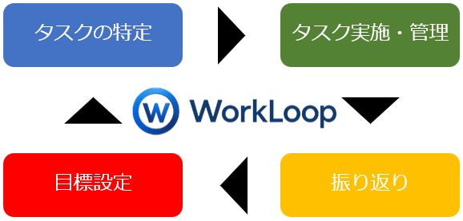
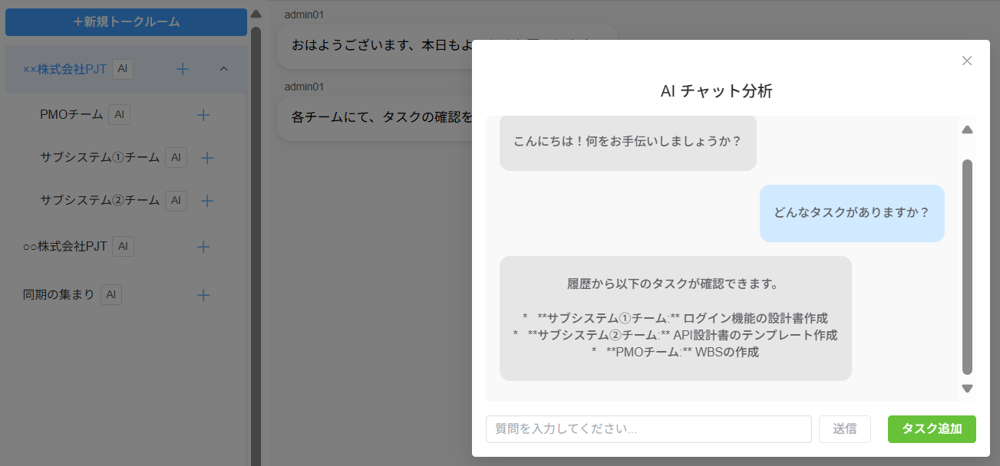
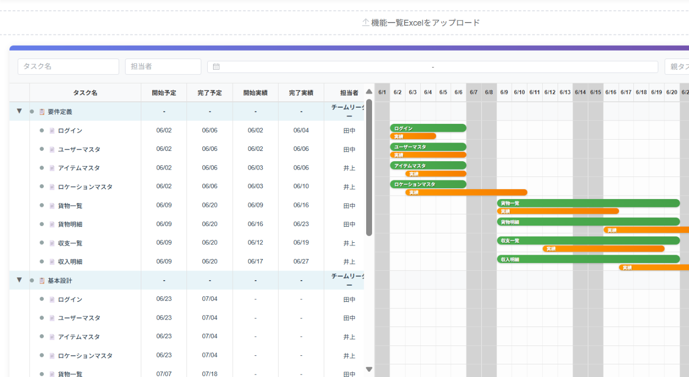
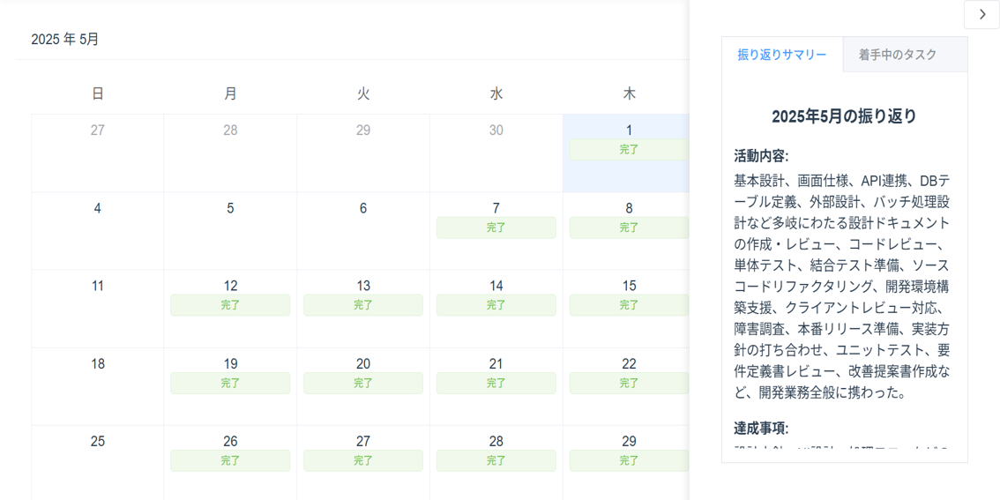
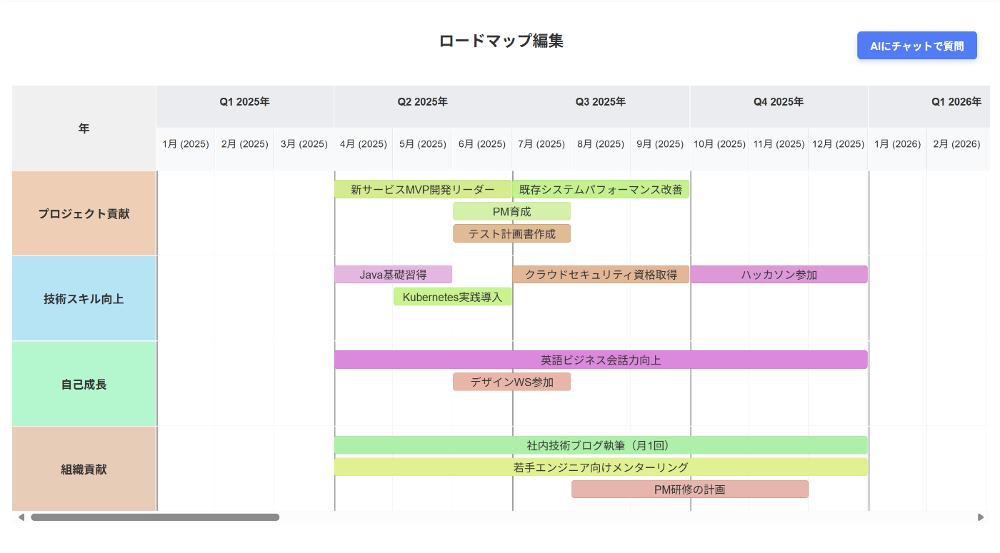
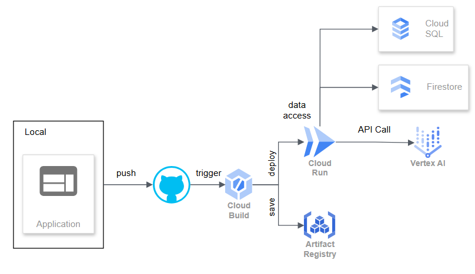

##  はじめに：仕事に、思考のループを。

私たちは、日々の仕事の中で、こんなことを感じていました。

「タスク管理アプリは便利だけど、振り返りは別のツールでやってるな」  
「チャットでやりとりして、内容を遡ってタスクに落とし込むのが大変だ」  
「目の前の仕事に追われて、長期的な目標を見失いがちだ」

──もし、これらすべてをひとつのアプリで完結できたら？  
そして、ただ“こなす”だけでなく、考え、振り返り、成長する仕事ができたら？

そんな想いから生まれたのが、**WorkLoop** です。  
  
**WorkLoop** は、

チャットでのやりとりから  
タスクの管理、  
振り返り、  
そして長期的なロードマップの設計まで  
仕事のすべてを、ひとつのループにまとめるアプリケーションです。

私たち自身が「本当に欲しかった」このツールを、  
今、あなたの仕事にも届けたいと思っています。

##  目的：仕事の“思考と行動”を、ひとつのアプリに。

私たちは、日々の仕事の中で感じていた課題を、一つのアプリで解決したいという想いから、WorkLoopを開発しました。

現代のビジネスパーソンは、  
チャット、タスク管理、振り返り、目標設定などを複数のツールで分断的に行い、  
情報の整理や連携に無駄な時間と労力を費やしています。

WorkLoopの目的は、  
ツールの分断による非効率さを解消し、仕事の「思考」と「行動」を一つの流れとしてつなげることです。

本アプリは、チャット、タスク管理、振り返り、ロードマップ作成といった機能を一つに統合。  
さらに、すべての機能にAIを組み込み、ユーザーの思考を支援しながら、行動へと自然に導く設計になっています。  

たとえば、チャットではAIに質問するだけで、過去のトーク履歴から関連情報を検索・抽出。  
そのまま同じ画面からタスクを追加できるため、「会話から行動」への移行がスムーズです。

タスク管理では、Excelに記載された作業内容をアップロードするだけで、AIがWBS構造のタスク群を自動生成。

振り返り機能ではその日のタスク一覧を確認しながら記録を作成できるため、行動と内省が密接につながります。さらに1ヶ月単位の振り返りサマリをAIが自動で作成してくれ、その内容をもとにロードマップ作成画面でAIが目標案を提案。

このように、**各機能がAIを介して連携し合うことで、思考・行動・振り返り・目標設定がひとつの流れとして循環します。**

現時点でも、機能間の連携は着実に進化しており、  
「一つのアプリで完結できる」こと自体が、すでに大きな価値を生み出しています。

WorkLoopは、**効率化と成長の両立を目指す、すべてのビジネスパーソンのための仕事の土台です。**  
あなたの働き方に、もっと自然な流れと、もっと深い意味を。

##  特徴と機能紹介

WorkLoopは、ただの“便利なツール集”ではありません。  
仕事の思考と行動を、自然な流れでつなぐための設計思想に基づいています。  
以下の4つの機能が、それぞれの役割を果たしながら、あなたの仕事を支えます。

###  ① 💬チャット機能：会話から、すぐに行動へ。

WorkLoopのチャットは、単なるメッセージ機能ではありません。  
親子階層でトークルームを構成できるため、プロジェクトやチームごとの会話を整理しやすく、情報の迷子を防ぎます。

さらに、各トークルームにはAIアシスタントボタンを搭載。  
ボタンを押すと、選択中のトークルームとその子階層の履歴をもとに、AIが関連情報を検索し、回答してくれます。  
「誰が何を言っていたか」「過去の議論の結論は何だったか」など、探す手間を大幅に削減できます。

そして、AIの回答からそのままタスクを追加できるボタンも用意。  
**会話の中で生まれた“やるべきこと”を、その場でタスク化できるため、情報と行動が自然につながります。**  

###  ② 🗓️タスク管理機能：構造化された計画で、プロジェクトを前進させる。

WorkLoopのタスク管理は、ただのToDoリストではありません。  
親子階層でタスクを整理できるため、プロジェクトの全体像と細部を同時に把握でき、進行中の業務を迷わず管理できます。

タスクはタイムライン（ガントチャート）形式で表示。進捗やスケジュールを視覚的に確認できるため、チーム全体での認識のズレを防ぎます。

さらに、Excelファイルをアップロードするだけで、Gemini AIが内容を解析し、WBS（Work Breakdown Structure）形式のタスク群を自動生成。親子関係やスケジュールも含めて構造化されるため、プロジェクト立ち上げの初期工数を大幅に削減できます。

UI面でも工夫が満載。親タスクの展開・折りたたみ機能や、インデントによる階層表示により、複雑なタスク構造も直感的に把握可能。視覚的にも論理的にも、タスクの全体像を見失いません。

**「Excelにプロジェクト概要を書くだけで、AIが自動的にWBS構造のタスクを作ってくれる」**  
そんな次世代のプロジェクト管理体験を、WorkLoopが実現します。  

###  ③ 📋振り返り機能：行動を、学びに変える。

WorkLoopの振り返り機能は、単なる日報ではありません。  
日々の行動を記録し、AIの力で“気づき”と“成長”へとつなげる仕組みです。

カレンダーから日付を選ぶだけで、その日の振り返りを直感的に登録可能。  
登録済みの日付はカレンダー上で可視化されるため、振り返りの習慣化もサポートします。

さらに、登録した内容に対してAIが即時にフィードバックを生成。  
主観だけでは見落としがちな視点を、客観的に補ってくれるため、より深い内省が可能になります。

月末には、1ヶ月分の振り返りをAIが自動で要約。  
ボタンひとつで、今月の成果や課題を俯瞰でき、次のアクションへのヒントが得られます。

また、タスク管理機能と連携しており、振り返り作成時にはその日のタスク一覧を確認可能。  
「何をやったか」「なぜうまくいったか」「次にどう活かすか」を、具体的に振り返ることができます。

日々の行動を記録するだけで終わらせない。  
WorkLoopの振り返り機能は、**あなたの仕事を“経験”から“学び”へと変えていきます。**  

###  ④ 📈ロードマップ機能：目の前の仕事を、未来につなげる。

WorkLoopのロードマップ機能は、ただのスケジュール管理ではありません。  
5年間という長期スパンで、自分自身やチームの未来を見据えた計画を立てることができます。

ロードマップは、ユーザーが自由に設定できる4つのカテゴリーに分類可能。  
プロジェクト貢献、技術向上、組織貢献、自己成長など、目的に応じて柔軟に設計できます。  
目標は専用の入力フォームから登録し、設定した内容がそのままバーとしてタイムライン上に反映。  
バーをクリックすれば、内容や期間の修正も簡単に行えます。

さらに、AIアシスタントボタンを使えば、過去のReflection（振り返り）をもとに、AIがあなたに合ったロードマップを提案。  
自分の価値観や経験をもとに、納得感のある未来設計が可能です。

「将来、何を目指せばいいのか分からない」  
そんな時こそ、WorkLoopのロードマップ機能を。  
**AIと一緒に、あなたらしい未来を描いてみませんか？**  

##  デモ動画

<https://youtu.be/lU3zl8c3wzA>

##  ユースケース（使い方のイメージ）

**1日の仕事が、WorkLoopでつながる。**

🕘 **9:00｜朝のチームミーティング（チャット機能）**  
「○○プロジェクト」トークルームで、チームメンバーと進捗を共有。  
会話の中で出た「次にやるべきこと」をAIに質問して要点を整理。  
そのまま同じ画面からタスク追加ボタンで、今日のToDoを即登録。  
会話 → AIによる要約 → タスク化が、ひとつの流れで完結。

✅ **10:00〜17:00｜集中してタスクをこなす（タスク管理機能）**  
朝登録したタスクを、優先度順に処理。  
タスクには期限を設定できるため、やるべきことのスケジュールが明確に。  
さらに、Excelで作成した作業リストをアップロードすれば、AIが自動でWBS構造のタスクに変換。  
進捗が可視化され、チーム全体の動きも把握しやすい。

🔁 **17:30｜1日の振り返り（振り返り機能）**  
今日の成果や気づきを、テンプレートに沿って簡単に記録。  
AIが1ヶ月単位でサマリを自動生成してくれるので、振り返りの質も向上。  
「うまくいったこと」「改善したいこと」を書き出すことで、次へのヒントが見える。  
過去の振り返りも一覧で確認でき、成長の軌跡が残る。

🗺️ **金曜日｜週次のロードマップ更新（ロードマップ機能）**  
過去の振り返りサマリをもとに、AIが今後のロードマップ案を提案。  
目標は自由にカテゴリを設定でき、フォームから入力した内容がバーとして反映。  
クリックで内容や期間の修正も可能。  
タスクや振り返りと連動しているので、目標と日々の行動が自然につながる。

このように、WorkLoopは日々の仕事の流れを自然にサポートし、  
「考える → 実行する → 振り返る → 目標に向かう」というループを無理なく回せるよう設計されています。

##  技術スタック・開発の工夫点

WorkLoopは、**モダンな開発基盤とAI技術** を融合させ、拡張性・保守性・ユーザー体験を重視した設計を行っています。

###  システムアーキテクチャ図

###  技術スタック

**フロントエンド** ：Vue.js  
→ 軽量かつ柔軟なUI構築を実現。コンポーネントベースで開発効率を向上。

**バックエンド** ：Spring Boot  
→ REST APIの構築とデータ処理を高速に実装。堅牢なアーキテクチャを採用。

**インフラ／CI/CD** ：Cloud Build + Cloud Run + Artifact Registry  
→ GitHubへのPushをトリガーにCloud Buildが自動でビルド・デプロイ。  
Cloud SQL(postgreSQL)やFirestoreと連携し、スケーラブルかつ安定した運用を実現。

**AI機能** ：Vertex AI + Retrieval-Augmented Generation（RAG）  
→ チャット履歴をもとに、関連情報を抽出してAIが回答を生成。  
メッセージ登録時に3000次元以上の特徴量を保存し、質問時には類似度検索で関連履歴を抽出。  
必要な情報だけをAIに与えることで、精度と効率を両立。

###  開発の工夫点

**フロント・バックの分離とコンテナ化**  
Vue.jsとSpring Bootをそれぞれ独立したコンテナで運用し、開発・デプロイの柔軟性を確保。

**CI/CDパイプラインの自動化**  
GitHubへのPushをトリガーに、Cloud Buildが自動でビルド・デプロイを実行。  
開発スピードと品質の両立を実現しています。

**AIによるチャット支援の高度化**  
RAGを活用し、チャット履歴から意味的に近い情報を抽出してAIに渡すことで、  
ユーザーの質問に対して文脈に沿った正確な回答を生成。

##  まとめ：WorkLoopが描く、これからの働き方。

私たちは、WorkLoopを通じて**仕事の思考と行動を、ひとつの流れにする** ことを目指してきました。  
単なるツールの集合ではなく、チャット・タスク・振り返り・目標設定がAIを介して連携し合うことで、  
ユーザーの仕事に**意味のある循環** を生み出す。それが、WorkLoopの本質です。

現代のビジネス環境では、スピードと柔軟性が求められる一方で、  
自分の仕事を見つめ直し、成長につなげる余白が失われがちです。  
WorkLoopは、そうした現実に対するひとつの解答として、  
**考える → 実行する → 振り返る → 目標に向かう** というループを、誰もが自然に回せる環境を提供します。

まだ発展途上の部分もありますが、  
私たちはこのプロダクトに、働き方の未来を変える可能性があると信じています。

WorkLoopが、誰かの「もっとよく働きたい」という想いに応える存在になれるよう、  
これからも進化を続けていきます。
