こんにちは、本記事では私が開発に携わっている「紙カルテ電子化AIエージェントシステム」について紹介します。

医療機関におけるデジタル化の推進は急務ですが、特に紙カルテからの移行は多くの課題を抱えています。

本システムは、Google Gemini 2.0 Flashを活用し、紙カルテの電子化と構造化を低コストかつ効率的に実現するソリューションです。

##  AI Agent としての革新性

本システムは単なる画像認識ツールではなく、以下の自律的判断機能を持つAI Agentとして設計されています：

  * **個別最適化品質評価** : 各項目ごとに事前に設定した閾値で品質担保
  * **適応的学習** : 医療機関ごとの記載スタイルに応じた閾値の自動調整機能
  * **エラー予防機能** : 複数の類似度指標による交差検証で偽陰性・偽陽性を最小化
  * **コンテキスト理解** : 医療用語の略語展開や同義語認識による意味的解釈

これらの機能により、従来の単純なOCRシステムを超えた、知的判断能力を持つエージェントシステムを実現しています。

##  背景①: 医療現場の紙カルテ課題

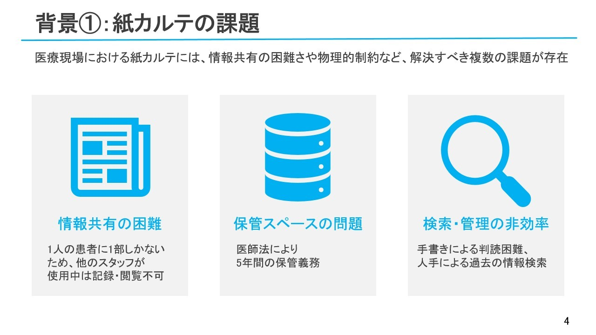

厚生労働省は2030年までに電子カルテの標準化と普及を推進していますが、多くの医療機関ではまだ紙カルテを使用しています。その主な課題として

  * **情報共有の非効率** : 一人が閲覧中は他者が利用できず、情報伝達が遅延
  * **保管と長期保存の問題** : 最終診察日から5年間の保存義務があり、物理的スペースを圧迫
  * **検索管理の非効率化** : 手書き文字による判読困難、人手による過去の情報検索

そのため、電子カルテへの完全移行が理想的ですが、**システム導入・運用コスト** 、**業務変更の負担** 、**医療従事者の習熟時間** 、**コンプライアンス対応** などの障壁により、特に中小規模の医療機関では即座の実現が困難です。

##  背景②: 政策的要請と現状​

「医療DX令和ビジョン2030」では電子カルテ普及率100%を目標としています。

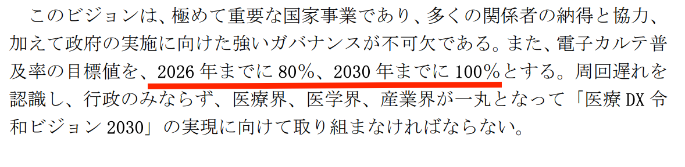  
引用：<https://storage2.jimin.jp/pdf/news/policy/203565_1.pdf>

ただし現状は普及率100%には遠く、特に小規模医療機関である一般診療所(19床以下の医療機関)で大きく普及が遅れています。

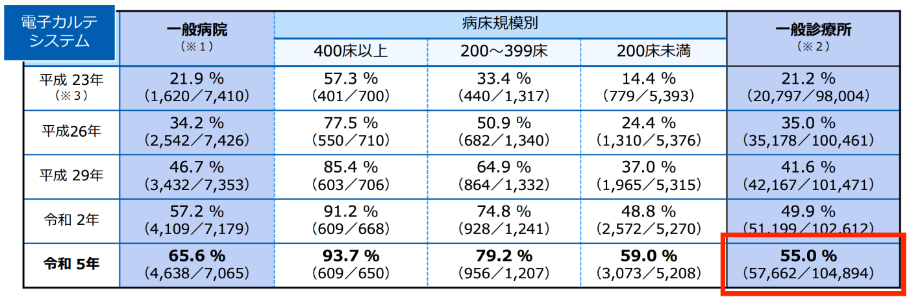  
引用：<https://www.mhlw.go.jp/content/10800000/000938782.pdf>

##  本研究の目的と解決すべき課題​

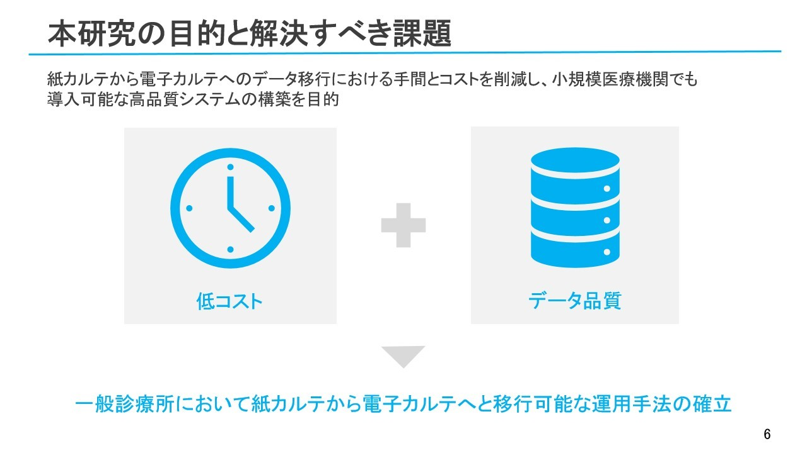

電子カルテ移行の障壁は、高額な費用とデータ品質の低さにあると考えられます。そこで本研究では、月額28ドルの超低コストかつ高精度なデータ読み取りを実現し、小規模医療機関でも導入可能なシステム構築を目指すことを目的とします。

##  Gemini-2.0 Flash APIを活用した解決アプローチ

これらの課題に対し、マルチモーダルLLMとして、OpenAI、Anthropic、GoogleのLLM最新モデル（GPT-o4 mini、Claude 3.7 Sonnet、Gemini 2.0 Flash）を比較検討した結果、低コストかつ精度面で優れるGemini 2.0 Flashを採用しました。

##  AI Agent アーキテクチャの設計思想

###  自律性（Autonomy）

システムは人間の監督なしに基本的なカルテ解析を実行し、確信度の高い項目は自動承認、低い項目のみ人間にエスカレーションします。

###  説明可能性（Explainability）

なぜその項目が「要確認」とフラグされたのか、AIの判断根拠を可視化し、医療従事者が迅速に判断できるよう支援します。

###  協調性（Collaboration）

完全自動化ではなく、人間の専門知識と AI の処理能力を最適に組み合わせる Human-in-the-loop 設計です。

###  学習能力（Learning）

承認・修正の履歴から継続的に学習し、各医療機関の記載スタイルに適応していきます。(※今後実装予定)

##  データ抽出精度向上のための閾値設定検証​

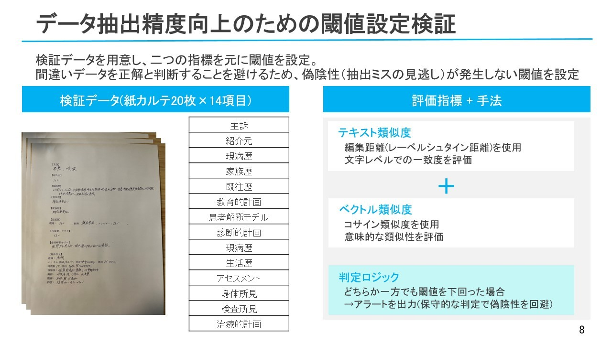  
AI Agentの自律的判断には閾値が必要になります。本研究では、紙カルテ20枚の14項目、計280項目を検証データとして使用しました。閾値は以下の2種類を設定しております。

  1. テキスト類似度：レーベンシュタイン距離を用いて**各項目ごとの** 文字レベルの一致度を評価
  2. ベクトル類似度：コサイン類似度を用いて**各項目ごとの** 意味的な類似度を評価

AIエージェントのフラグ判定ロジックについては、どちらか一方でも閾値を下回った場合、アラートを出力するようにしております。

##  AI Agent としての性能評価①

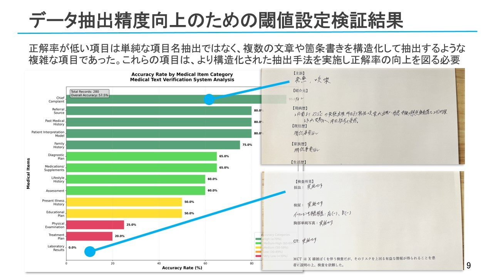

全14項目の抽出において、正解率に差異が見られました。正解率の高い項目は単語や短文の抽出であった一方、低い項目は複数文章や箇条書きの構造化を伴う複雑な抽出でした。

後者は、紙カルテからの抽出時に構造化の検討が必要となります。

##  AI Agent としての性能評価②

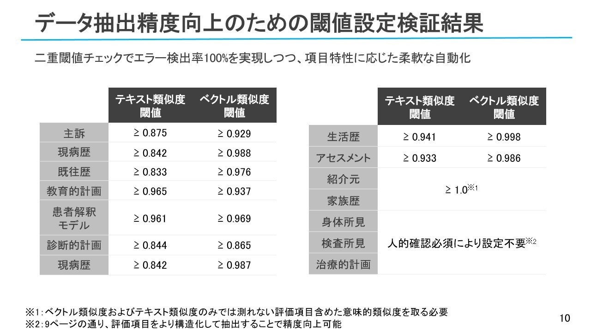

検証の結果、全14項目で偽陰性を回避する閾値を設定しました。ただし、紹介元や家族歴等の項目は、2指標のみでは十分な精度が得られませんでした。

原因として、短い文字列の誤抽出（例：「なし」を「C」と抽出）が挙げられます。AI修正後も誤りが残存し、ベクトル類似度・テキスト類似度が共に高くても、意図した正解とは異なる場合がありました。

今後は、抽出された各項目の意味内容の妥当性を含めた検証が必要となります。

##  超低コスト運用の実現

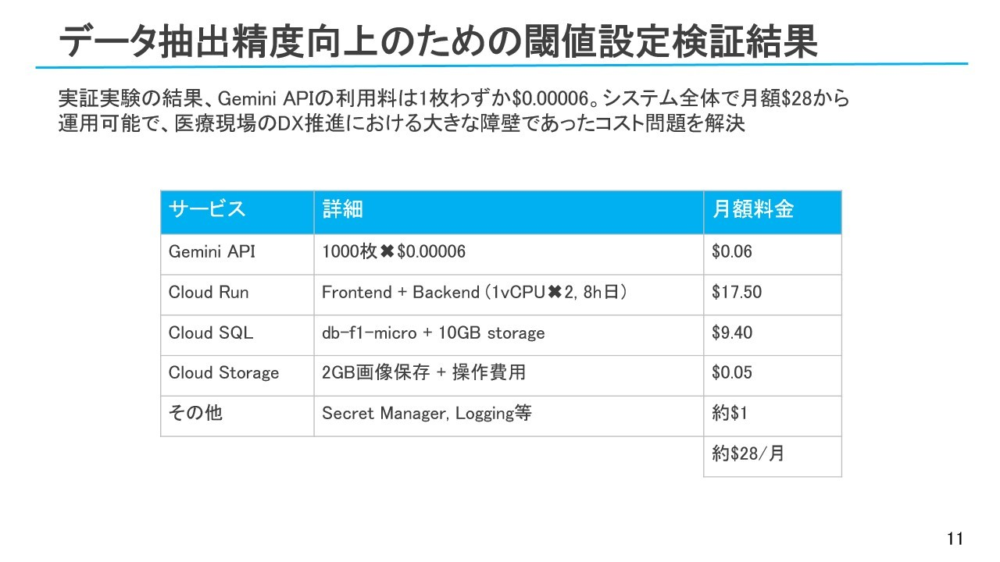

紙カルテ電子化のコストは想像以上に低く、実証実験では1枚あたりわずか0.00006ドルです。システム全体でも月額28ドルで運用可能なため、小規模病院でも導入しやすいと考えます。

##  システムの特徴

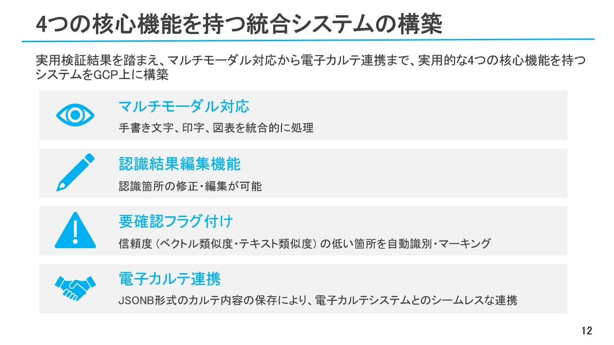

実用可能性検証を踏まえて、マルチモーダル対応から電子カルテ連携まで、実用的な4つの核心機能を持つシステムをGCP上に構築しました。

##  AI Agent コンポーネント

###  IntelligentReviewAgent:

  * 抽出精度の自動評価
  * リスク項目の優先度付け
  * 医療従事者への推奨アクションの提示

###  AdaptiveLearningAgent:

  * 承認・修正履歴からの学習
  * 医療機関特有の表現パターンの蓄積
  * 閾値の動的調整機能

##  システムアーキテクチャ

本システムは、Next.js (TypeScript) による **Frontend** と FastAPI (Python) による **Backend API** で構成され、RESTful APIで通信します。データ永続化には **Cloud SQL for PostgreSQL** （構造化データ）と **Google Cloud Storage (GCS)** （画像ファイル）を使用します。

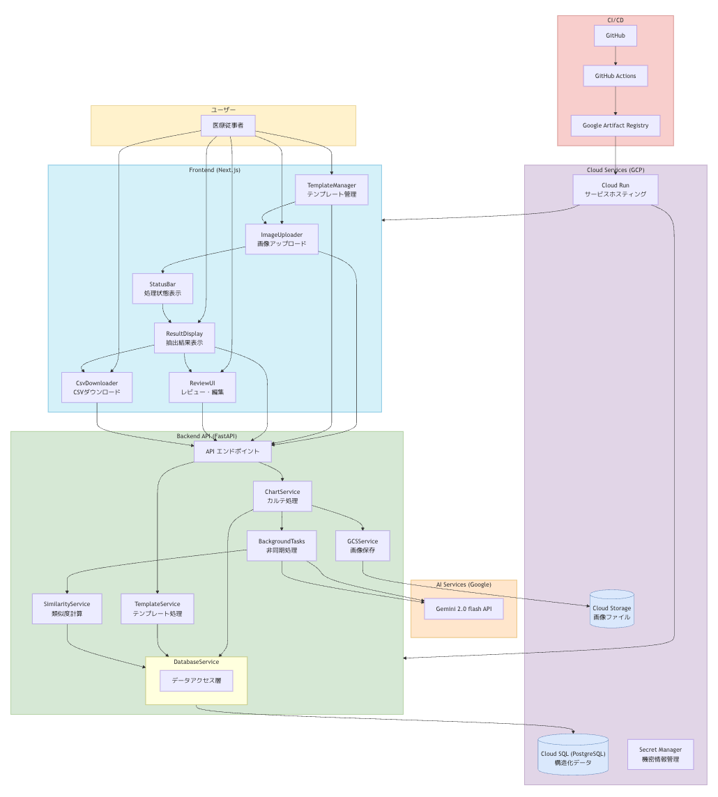

###  フロントエンドサービス

  * **ImageUploader** ：画像ファイルのアップロード処理
  * **TemplateManager** ：テンプレートの作成・編集・選択
  * **ResultDisplay** ：抽出結果の表示
  * **StatusBar** ：処理状態のリアルタイム表示
  * **ReviewUI** ：要確認項目のレビュー・編集
  * **CsvDownloader** ：構造化データのエクスポート

###  バックエンドサービス

  * **ChartService** : カルテ画像の処理とAI連携
  * **TemplateService** : テンプレートの管理
  * **GCSService** : Google Cloud Storageとの連携
  * **BackgroundTasks** : 非同期処理の実行
  * **SimilarityService** : 類似度計算と要確認判定
  * **DatabaseService** : データアクセス層

###  クラウドサービス

  * **Cloud Run** : コンテナ化されたサービスのホスティング
  * **Cloud SQL** : PostgreSQLデータベース
  * **Cloud Storage** : 画像ファイルの保存
  * **Secret Manager** : APIキーなどの機密情報管理

###  CI/CD

  * **GitHub Actions** : 自動テスト・ビルド・デプロイ
  * **Artifact Registry** : Dockerイメージの保存

###  データモデル (Cloud SQL - PostgreSQL)

PostgreSQLのJSONB型を活用したハイブリッドデータモデルを採用し、多様なカルテ形式への柔軟な対応を実現しています：
    
    
    CREATE TABLE extracted_data (
        id BIGSERIAL PRIMARY KEY,
        chart_id UUID NOT NULL REFERENCES charts(id),
        overall_confidence_score FLOAT,
        needs_review BOOLEAN NOT NULL DEFAULT FALSE,
        reviewed_by VARCHAR,
        reviewed_at TIMESTAMP WITH TIME ZONE,
        extracted_timestamp TIMESTAMP WITH TIME ZONE NOT NULL DEFAULT CURRENT_TIMESTAMP,
        data JSONB NOT NULL
    );
    

このJSONBデータ構造の例：
    
    
    {
      "主訴": {
        "raw_text": "あたまがいたい",
        "interpreted_text": "頭痛",
        "visual_similarity": 0.75,
        "semantic_similarity": 0.82,
        "needs_review": true,
        "review_reason": "low_visual_confidence",
        "review_comment": "AIの解釈が微妙、要確認"
      },
      "現病歴": {
        "raw_text": "3日前から頭痛あり、市販薬で一時的に軽快するが再度悪化。",
        "interpreted_text": "3日前から頭痛が出現。市販薬で一時的に軽快するが、再度症状が悪化している。",
        "visual_similarity": 0.87,
        "semantic_similarity": 0.93,
        "needs_review": false,
        "review_comment": null
      }
    }
    

##  シーケンス図

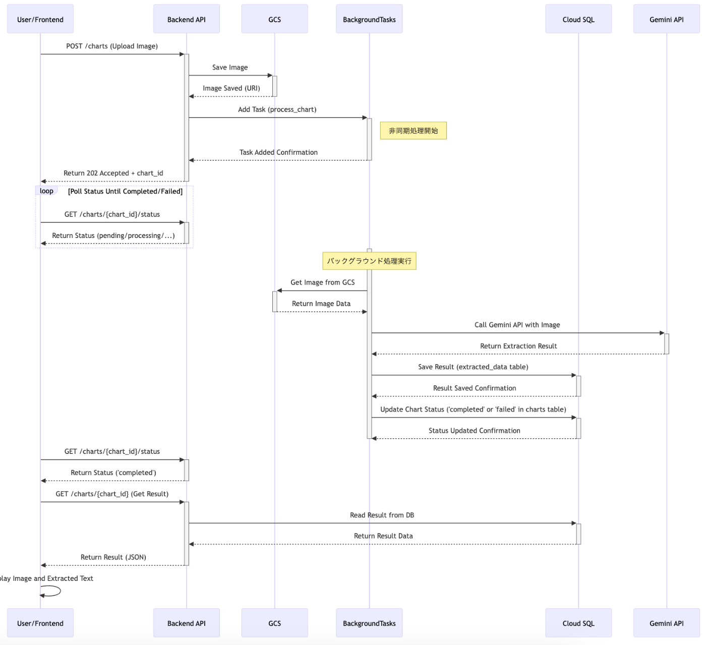

画像のアップロードから結果表示までの流れは以下の通りです。

画像をアップロードすると、GCSに保存され、バックグラウンドで画像処理が実行されます。処理の進捗状況は定期的なポーリングにより監視され、ユーザーに通知されます。

処理完了後、GCSに保存された画像に加え、テキスト類似度とベクトル類似度が返され、これらの値に基づいて確認フラグが設定されます。

##  デモ動画

以下は、本システムの実際の動作を示す約2分間のデモ動画です。

🎬 デモ内容（2分）  
0:08 - 電子カルテ項目設定  
0:12 - AI判定閾値設定  
0:17 - テンプレート選択  
0:23 - 紙カルテアップロード  
0:57 - 非同期処理（ポーリング）  
1:04 - AIによる要確認項目自動抽出  
1:21 - 人間によるレビュー・承認  
1:51 - 構造化データエクスポート

<https://youtu.be/b9NVLjPxMII>

##  実装の工夫点

###  1\. 非同期処理による高速レスポンス

ユーザー体験を向上させるため、画像アップロード後の重い処理（AI抽出、類似度計算）をバックグラウンドで非同期実行します：
    
    
    @router.post("/charts", response_model=schemas.ChartCreateResponse, status_code=202)
    async def upload_chart(
        background_tasks: BackgroundTasks,
        file: UploadFile = File(...),
        template_id: UUID = Query(...),
        db_session: Session = Depends(get_db),
    ):
        # ファイル検証と保存処理（省略）
        
        # チャートレコード作成
        chart_id = uuid4()
        chart = db.create_chart_record(db_session, chart_id, file.filename, gcs_uri, template_id)
        
        # バックグラウンドタスクとして処理を登録（非同期実行）
        background_tasks.add_task(
            process_chart_with_template, 
            db_session, chart_id, template_id, gcs_uri
        )
        
        # 即時レスポンス返却
        return schemas.ChartCreateResponse(
            chart_id=chart_id,
            status="pending",
            message="処理を開始しました。後ほど結果をご確認ください。"
        )
    

###  2\. AIエージェントによる要確認項目の自動判定

医療スタッフが一目で要確認項目を識別できるよう、フロントエンドでは要確認フラグ付き項目を視覚的に目立たせています：
    
    
    // React/TypeScript component
    const ExtractionResultItem: React.FC<{
      itemName: string;
      itemData: {
        raw_text: string;
        interpreted_text: string;
        visual_similarity: number;
        semantic_similarity: number;
        needs_review: boolean;
        review_reason?: string;
      };
      showDetailedScores: boolean;
    }> = ({ itemName, itemData, showDetailedScores }) => {
      const {
        raw_text,
        interpreted_text,
        visual_similarity,
        semantic_similarity,
        needs_review,
        review_reason
      } = itemData;
      
      // 要確認理由のテキスト表示
      const getReviewReasonText = (reason?: string) => {
        switch (reason) {
          case 'low_visual_confidence': return '見た目の類似度が低い';
          case 'low_semantic_confidence': return '意味的類似度が低い';
          case 'visual_semantic_diff': return '見た目と意味の差異が大きい';
          case 'empty_or_short': return '内容が空または短い';
          default: return '';
        }
      };
      
      return (
        

          

            <h3 className="font-bold text-lg">{itemName}</h3>
            

              {needs_review && (
                
                  要確認 {review_reason && `(${getReviewReasonText(review_reason)})`}
                
              )}
              
              {showDetailedScores && (
                

                  = 0.9 ? 'text-green-600' : 
                    visual_similarity >= 0.7 ? 'text-yellow-600' : 'text-red-600'
                  }`}>
                    見た目: {Math.round(visual_similarity * 100)}%
                  
                  = 0.9 ? 'text-green-600' : 
                    semantic_similarity >= 0.7 ? 'text-yellow-600' : 'text-red-600'
                  }`}>
                    意味: {Math.round(semantic_similarity * 100)}%
                  
                

              )}
            

          

          
          {/* 原文と解釈後テキストの差分表示 */}
          {raw_text !== interpreted_text ? (
            

              
原文:

              
{raw_text}

              
解釈後:

              
{interpreted_text}

            

          ) : (
            
{raw_text}

          )}
          
          {/* 編集・承認ボタン */}
          

            <button className="bg-blue-500 text-white px-3 py-1 rounded text-sm">
              編集
            </button>
            <button className="bg-green-500 text-white px-3 py-1 rounded text-sm">
              承認
            </button>
          

        

      );
    };
    

このUIにより、医療スタッフは一目で要確認の理由を理解でき、効率的にレビューが行えます。

##  ハッカソン応募における技術的挑戦

本プロジェクトでは、以下の技術的チャレンジに取り組みました：

  * **マルチモーダルAIの医療特化** : Gemini 2.0 Flashの汎用性を医療分野に特化
  * **リアルタイム信頼度計算** : 複数指標による動的な品質評価アルゴリズム
  * **Human-in-the-loop設計** : AIと人間の最適な協調関係の実現
  * **スケーラブルアーキテクチャ** : 中小から大規模医療機関まで対応可能な設計

##  今後の展望

###  1\. 個人情報保護機能の強化（最優先課題）

現在のシステムはクラウドベースのため、医療機関での実導入には個人情報保護法の制約があります。医療情報は要配慮個人情報として、患者データをクラウドLLMに送信することは原則禁止されています。

解決策として、次期バージョンではGEMMA3によるローカル個人情報マスキング機能の追加を計画中です：

  * **ローカル処理（GEMMA3）** : 患者名・住所・電話番号等の個人識別情報を自動検出・マスキング
  * **クラウド処理（Gemini 2.0 Flash）** : マスク済みデータから医療情報のみを構造化

####  期待される効果

  * **法的コンプライアンス** : 個人情報保護法・医療情報システム安全管理ガイドライン準拠
  * **実用性向上** : 実際の医療現場での導入が可能に
  * **医療情報保持** : 診断・治療に必要な情報は完全保持

####  導入コスト

  * **追加ハードウェア** : GPU搭載サーバー（約20-50万円）
  * **月額運用費** : 約2万円（電気代含む）

法的リスクを最小化しながら、中小規模医療機関でも安心して導入できるシステムの実現を目指します。

###  2\. データの構造化と二次利用

本システムは抽出された情報を構造化し、以下のような活用が見込まれます

  * **診断名のコード化** : ICD-10等の国際疾病分類コードへのマッピング
  * **経過記録の時系列分析** : 患者の症状推移の可視化

###  3\. 医療標準への対応

HL7 FHIR（Health Level Seven Fast Healthcare Interoperability Resources）など国際標準規格への対応も視野に入れており、データポータビリティと相互運用性を高めていきます。

###  4\. 少数データでの効率的AIモデル活用

少数の医療データでも効率的に活用できるファインチューニングやシステムプロンプトの最適化手法の研究を継続し、医療機関固有の表現や書式への適応性を高めていきます。

###  5\. レガシーシステムとの連携

既存のレセプトコンピュータや電子カルテシステムとの連携APIを開発し、シームレスなデータ統合を目指します。

###  6\. マルチエージェント協調システム

  * **SpecialistAgent** : 診療科別特化エージェント（内科、外科、小児科等）
  * **QualityAssuranceAgent** : 品質管理専門エージェント
  * **ComplianceAgent** : 法的コンプライアンス監視エージェント

##  まとめ

紙カルテ電子化・構造化システムは、医療現場のデジタル変革を支援する低コストのAI駆動ソリューションです。特に

  1. **低コストで実現** : Gemini 2.0 Flashの活用により、月額28ドルで中小規模医療機関でも導入可能な価格帯
  2. **AI Agentにより高精度抽出** : 医療分野特化のプロンプト最適化と診療科別テンプレートによる精度向上
  3. **業務効率化** : 独立信頼度スコアと要確認フラグ機能により、人間の確認作業を必要最小限に
  4. **将来性** : 構造化データとしての活用により、医療データの二次利用や分析が可能に

厚生労働省が目指す2030年までの電子カルテ標準化・普及に向け、特に中小規模医療機関の紙カルテ電子化の「入り口」として、本システムが貢献できれば幸いです。

ご質問やフィードバックがあれば、ぜひコメントにてお寄せください。また、本システムの試験導入や共同研究にご興味のある医療機関様も歓迎しております。

* * *

_免責事項：本記事に掲載されている情報は、あくまでも技術的な観点からの紹介であり、実際の医療データ取り扱いには各国・各地域の法令や規制に従う必要があります。特に個人情報保護法や医療情報システムの安全管理ガイドラインに準拠した運用が求められます。_
