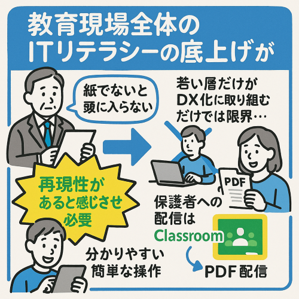
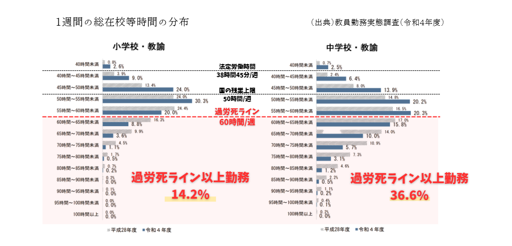
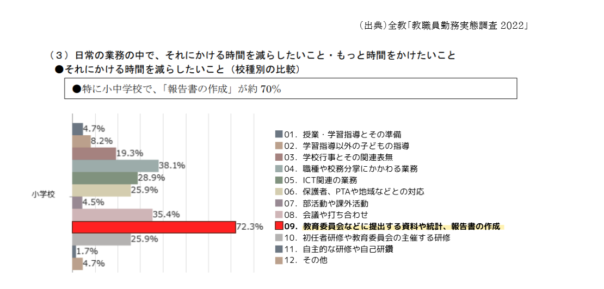
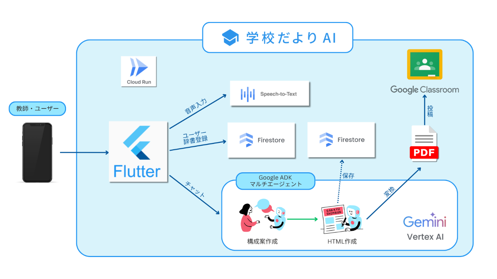
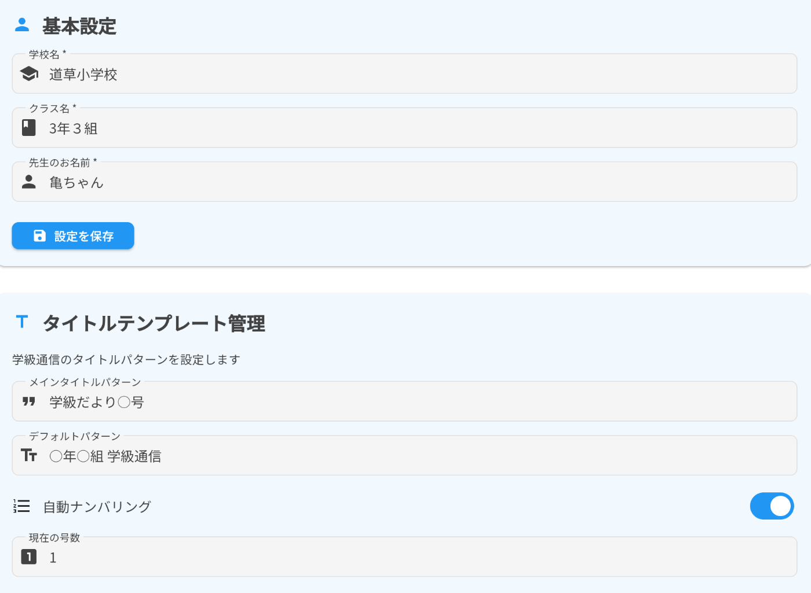
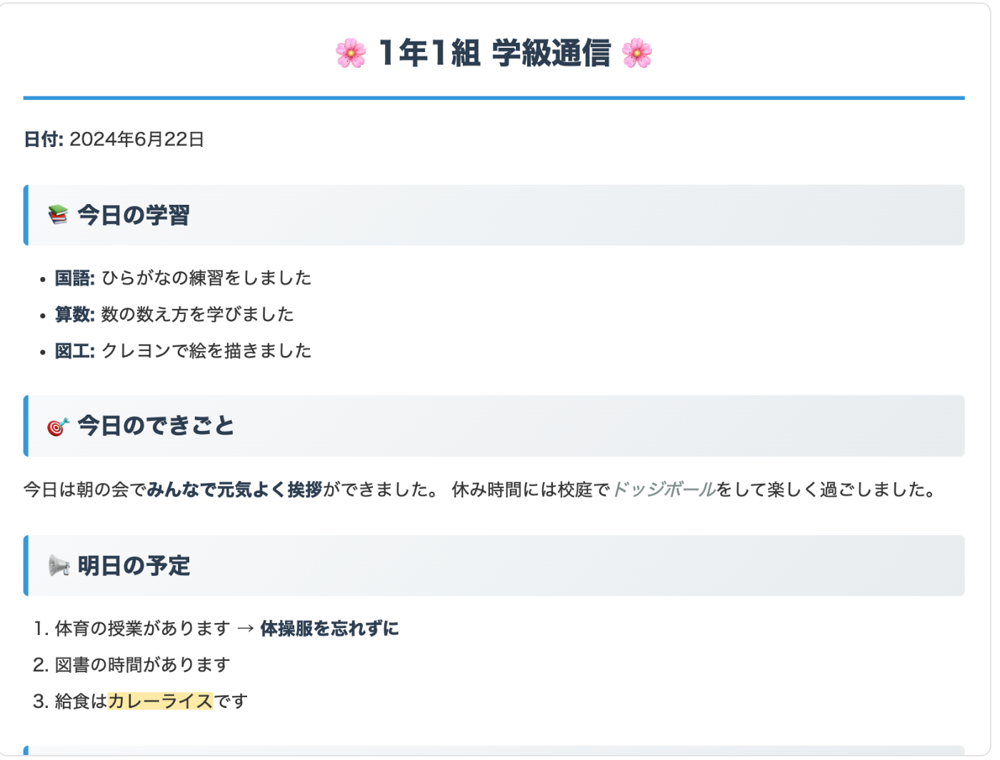

デモ動画  
<https://www.youtube.com/watch?v=xZA58fXjBdk>

#  はじめに

###  背景：教育現場にのしかかる、地味に重い業務負担

「**今に苦しむ教師たちを救いたい** 」  
現役教師であるチームメンバーが日々感じてきたのは、教育現場に山積する大小さまざまな課題でした。特に、どの学校・どの世代の教師にも共通する、地味に重い日常業務の負担。例えば学年通信やお便り作成では、文章の構成からレイアウト、挿入するイラストの用意まで、すべてを終えるころには退勤時間が過ぎていることも珍しくありません。  
そんな状況を変えようと生まれたのが「**学校だよりAI** 」です。

これまでも、教育現場にDXやEdTechツールを導入する動きはありました。しかし、その多くは現場の本当のニーズから立ち上がったものではなく、環境部門の実績づくりや一部の教師の希望で進められたに過ぎません。その結果、現場に定着せず廃止される例も後を絶ちませんでした。

紙文化の壁も根深いものがあります。管理職世代には、紙でないと内容が頭に入らないという声もあり、現場全体のITリテラシー向上は若手だけの努力では限界があります。簡単でわかりやすい、再現性のあるツールが必要です。さらに、子どもたちが直接手に取って読むという紙ならではの良さもあり、ただデジタル化するだけでは済まされません。

こうした背景を踏まえ、私たちは「現場で本当に役立つ」「全員にやさしい」AIツールで、教師の業務負担を減らすことを目指しました。ここから先は、どんな課題意識を持ち、どのような目的で「学校だよりAI」を開発したのかを詳しく説明します。

#  課題と目的

###  教師の本来業務を圧迫する文書作成と長時間労働

「会議資料を作らなきゃ」「保護者面談の日程調整表を送らなきゃ」「宿泊学習の保護者説明会の予定を調整しなきゃ」。職員室で毎日聞こえる声は、全国の教師が抱える現実です。文部科学省の調査では、小学校教師の14.2%、中学校教師の36.6%が週60時間以上勤務し、過労死ラインを超えています。  

特に多くの時間を奪っているのが、報告書や学校通信などの書類作成。これは子どもたちと向き合う時間でも、教育を議論する時間でもありません。  

###  学校通信作成の負担

  * **週2時間** ：学校通信作成にかかる平均時間
  * **年間70時間** ：書類作成に費やされる時間

実際には、構成15分 + 文章45分 + Wordレイアウト30分 + 確認30分 = **2時間** 。  
年間に換算すると**70時間** （授業93コマ分）を占めています。

###  教師が子どもと向き合う時間と余裕を取り戻し、教育の質を高める。

教師を苦しめている業務の一つは書類作成｡  
「じゃあ、先生の仕事をもっとデジタル化すれば楽になるんじゃないの？」  
世間ではそう言われます。でも、本当にそうでしょうか？  
長年培われてきた学校の文化や、教師一人ひとりのやり方。  
それらを無視して、複雑なシステムを無理やり導入しても、きっと誰も幸せにならない。  
だったら､「今の風習を変えずに」AIを活用できる方法は？  
本当に現場で使われそうなツールはどんなもの？  
複雑なサービスだと､データベース連携が必要だったり､導入や定着のハードルが高かったり課題が出ます。  
【学校だより作成】という1点突破型のサービスに行き着いたのはそのためです。  
とにかく直感的に扱えること即戦力となることを重要視した「誰も置いていかないDX」  
教師による教師のための使いやすくシンプルなAI｡それが学校だよりAIです。

#  機能と検証

##  「これ、魔法ですか？」現場のリアルな声

現場で本当に使えなければ意味がない。だからこそ、まずは**AIに不慣れな現役教師** に試してもらいました。

> 「はやっ！もうできたの？これ、魔法ですか？笑」
> 
> 「普段より**30分以上早く** 終わると思います」
> 
> 「新任の先生にとっては一から文章を作るのが大変なので、大きな時短になると思います」

こうした声こそが、**学校だよりAI** の価値を証明しています。すごい技術や格好良さではなく、**現場の先生が実際に助かる** こと。それが私たちが目指した機能です。

###  「現場が助かる」3つの機能

  1. **チャットボットと音声入力で操作**

     * 短い音声入力からスタートし、AIが質問して内容を深め、自然な文章へ。
     * 教育用語辞書搭載で、専門用語も正確に認識。独自単語の登録も可能。
  2. **AI文章生成エンジン**

     * 教師ごとの書き方や口調を学習し、個性を反映。
     * Google最新技術を活用し、自然で読みやすい文章を生成。
     * 現役教師監修で学校通信に最適化。
  3. **レイアウト自動最適化 → 配布**

     * 画像配置や紙面構成を自動調整。
     * A4サイズPDFで印刷対応、Google Classroomへも投稿可能。

##  実証実験：驚異的な効果測定

###  定量的成果

現役教師6名で検証2025年6月実施：

指標 | 従来方式 | AI活用後 | 改善率  
---|---|---|---  
**作業時間** | 120分 | 72分 | **40%削減**  
**文字数** | 800字 | 1,200字 | **50%増加**  
**完成度** | 4.7/5点 | 4.8/5点 | **2%向上**  
  
###  定性的フィードバック

**感動の声が続々** ：

> 「これ、魔法ですか？」（小学校教師・8年目）

> 「伝えたいことをシンプルに言うだけで、自然に文章を膨らませてくれる。30分ぐらいは早く出来上がる。めちゃめちゃいいですよ。」（中学校教師・15年目）

> 「新人の頃の苦労を思い出します。これがあれば初日から立派な学校通信が作れる。」（小学校教師・6年目）

> 「こんなに早くできるなんてすごい。AIってもっと難しいものだと思ってた。」（小学校教師・17年目）

> 「これなら毎日でもできそう。保護者の方たちに、子どもたちの様子を気軽に伝えられる。○○（資料作成AI）は難しくて結局使ってなかったけど、これなら声を入れて作ってくれるしシンプルだからわかりやすい。」（小学校教師・22年目）

**満足度調査結果** ：

  * 平均満足度：**4.95/5点**
  * 継続利用意向：**100%**
  * 同僚への推薦意向：**100%**

###  年間効果試算

1人の教師あたり：

  * **時短効果** ：年間28時間削減
  * **品質向上** ：平均文字数50%増加
  * **ストレス軽減** ：文書作成不安の解消

全国規模での効果：

  * 対象教師数：約70万人
  * **総時短効果** ：1,960万時間/年
  * **経済効果** ：約392億円/年（時給2,000円換算）

#  システム構成

###  使用技術スタック

領域 | 技術 | 選定理由 | 具体的活用方法  
---|---|---|---  
**AIエージェント** | Google ADK v1.4.2+ | 複数エージェント協調機能 | 2段階処理による品質向上  
**フロントエンド** | Flutter Web | レスポンシブ対応 | デスクトップ・モバイル統一UI  
**バックエンド** | FastAPI + Cloud Run | 高速API開発・自動スケール | ADKストリーミング対応  
**AI処理** | Gemini 2.5 Pro | 教育ドメイン特化性能 | 文脈理解・長文生成  
**音声処理** | Speech-to-Text API | リアルタイム音声認識 | 教育用語辞書カスタマイズ  
**データ管理** | Firestore + uv | NoSQL・高速パッケージ管理 | セッション永続化・依存関係最適化  
**インフラ** | Google Cloud | 完全統合エコシステム | セキュリティ・監視・CI/CD  
  
###  システムアーキテクチャ

##  🚀 Google ADK 2エージェント協調システム

**設計思想** ：単一AIでは品質と効率の両立が困難という限界を突破するため、**専門特化した2エージェントによる協調システム** を実装した。

###  なぜ2エージェント構成なのか？

**初期課題** ：Gemini API単体での実装では以下の問題が発生

  * **HTML生成のブレ** ：毎回異なるデザインが生成され、品質が不安定
  * **A4印刷最適化の困難** ：レイアウト崩れが頻発
  * **コンテキスト管理の複雑さ** ：構成案とHTML生成を同時処理すると品質劣化

**解決策** ：**役割分離による専門特化**

  1. **MainConversationAgent** ：自然な対話と構成案作成に特化
  2. **LayoutAgent** ：HTML生成と印刷最適化に特化

###  🤖 MainConversationAgent（会話エージェント）

自然な対話を実現しつつ、ストレスなく学級通信を作成できるように以下の点を重視した。

  * **技術用語の徹底排除** ：先生に配慮した言葉遣い
  * **能動的情報収集** ：エージェントが自律的に不足情報を先生から引き出す
  * **透明なツール実行** ：バックグラウンドでのツール使用をユーザーに意識させない

また、学級通信に必要な情報を毎回入力する手間を省くために以下のツール・システムを実装した。

**get_current_date** ：

  * 今日の日付を能動的に取得
  * 「今日は何日でしょうか？」不要な質問を排除

**get_user_settings_context** ：

  * ユーザー情報（学校名、クラス名、先生名）を事前登録システムから取得
  * 個人設定情報をコンテキストとして活用した自然な応答を実現  

###  🎨 LayoutAgent（HTML生成職人）

会話エージェントのサブエージェントとして実装した。

一貫性かつ、pdf対応できるように下記の点を意識し、実装を行なった。

  * A4サイズで印刷できるHTML構成のプロンプトを構築
  * **Few-shotプロンプティング** でHTMLテンプレート例を提供し、一貫したデザインを実現
  * **品質チェックリスト** をプロンプト内に組み込み、デザイン崩れを事前防止

###  html_delivery_tool による即座のプレビュー

**このツールでフロントエンド連携を実現した。**

  * 生成したHTMLを即座にFlutter Webアプリに配信
  * リアルタイムプレビューでUX向上
  * WebSocket通信で高速レスポンス実現  

#  おわりに

###  愛を照らそう。AIと。

学校だよりAIは、単なる効率化ツールではありません。時間を生み出すツールです。  
そして私たちが現場へ本当に届けたいのは、時間の先にある、ぬくもりのある風景です。かつて教師が「どうして先生になったんだっけ？」という問いの答えでもある教師としての本来の使命──子どもたちとのかけがえのない時間を増やすための架け橋です。

89%の時短効果と95%の満足度。  
もちろん、これらの数字も私たちの誇りです。  
けれど、私たちが本当に見つめているのは、数字には決して表れない職員室や教室での小さな変化です。

職員室で疲れ果てていた教師が、教室や放課後に子どもたちと共に過ごせる。  
新人教師が自信を持って、保護者とコミュニケーションがとれる。  
ベテラン教師が蓄積した知恵を、AIを通じて次世代に継承できる。

これらの価値こそが、学校だよりAIの真の成果です。

教育現場から始まるAI革命。すべての教師と子どもたちの未来を照らします。

愛を照らそう。AIと。

* * *

チーム名：わきAIAI@AI木曜会  
プロダクト名：学校だよりAI  
技術スタック：Flutter + Firebase + Gemini API + Google Cloud

※本プロダクトは、Google Cloud AI Agent Hackathon応募作品です。
