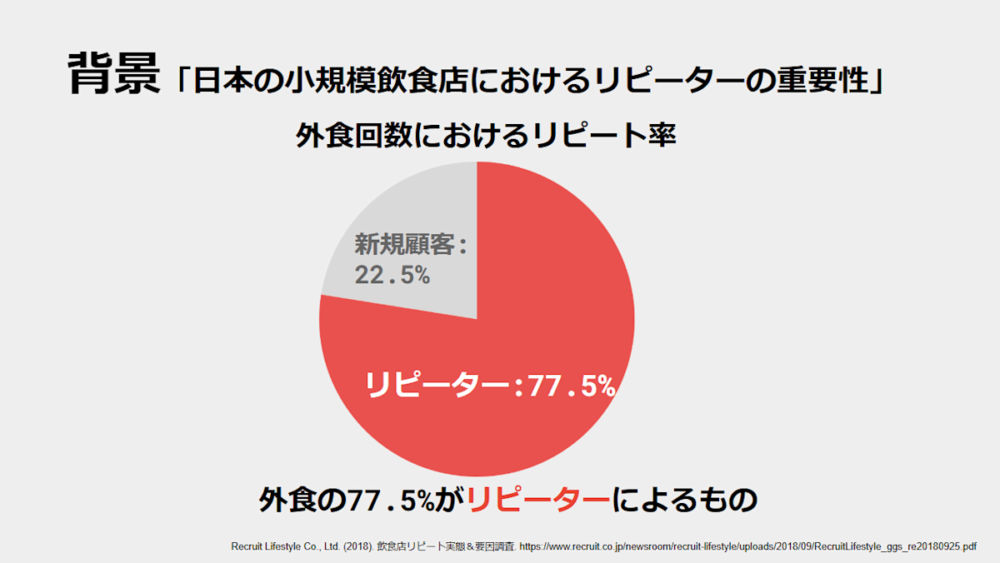
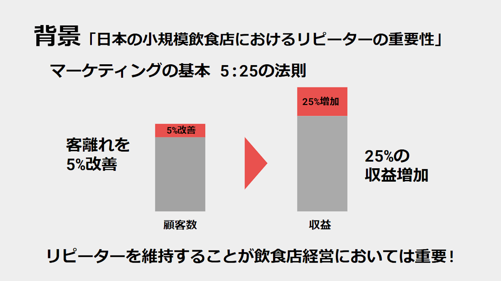
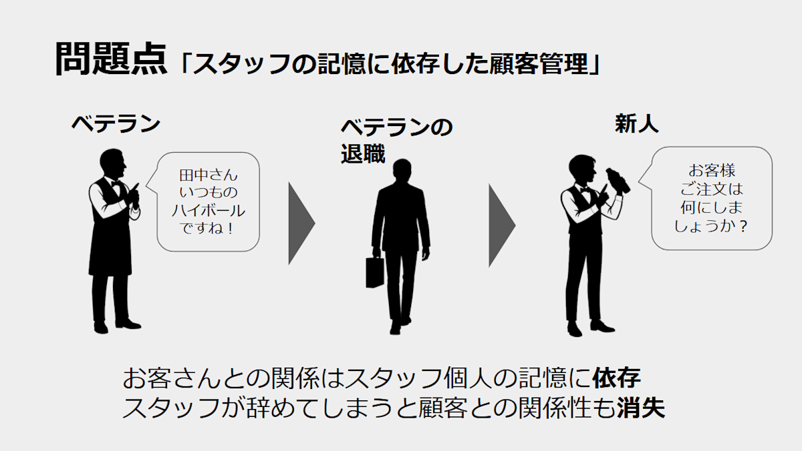
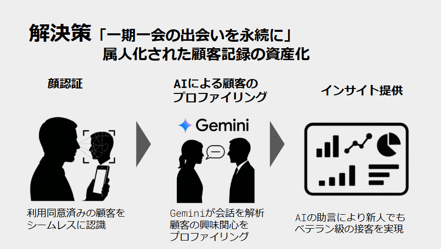
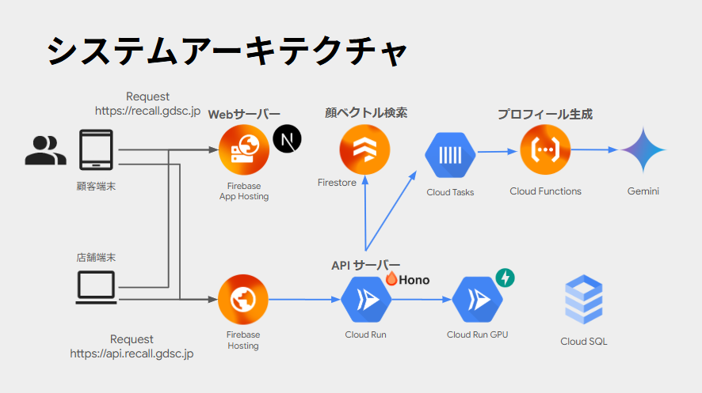

#  デモ動画

<https://youtu.be/Ipo2gEMS9EQ>

#  背景：「リピーター」がいなければ、飲食店は回らない？

みなさんは、行きつけのお店ってありますか？  
「ここの味が好きだから」「接客が丁寧だから」「なんとなく落ち着くから」──そんな理由で、つい何度も足を運んでしまうお店。実は、こうした“リピーター”こそが、日本の外食業界を支えている存在なんです。

リクルートライフスタイルの調査によると、私たちが外食をする回数のうち77.5％はリピート利用。つまり、10回外食するうち7〜8回は「いつものお店」に行っているということになります。[1]

さらに、マーケティングの世界では「5:25の法則」と呼ばれる考え方があります。[2]  
これは、「顧客の離脱を5％減らすだけで、利益が25％も増える」という法則です。  
それほどまでに、“今いるお客さん”を大切にすることが、飲食店の経営にとって重要だということです。

でも実際には、多くの小さな飲食店が「繁盛しているように見えるのに苦しい」状況に陥っています。  
その理由は、“新規のお客さんばかりを追いかけている”こと。  
新しいお客さんを1人呼ぶためには、広告費や割引など、たくさんのコストがかかります。  
それを毎回繰り返していると、まるで自転車を漕ぎ続けないと倒れてしまうような状態に…。

本当に経営が安定しているお店は、「新しい人を呼ぶこと」よりも、「来てくれた人にまた来てもらうこと」を大切にしています。  
“また来たくなるお店”であることが、飲食店の未来を支えているのです。

#  問題点：「記憶に頼った顧客管理」

小規模な飲食店では、常連客に「自分は特別に扱われている」と感じてもらうことが、再来店につながる大切なポイントです。[3]  
しかし、この“特別感”を継続的に提供するには、一人ひとりの顧客情報を丁寧に記録・共有する仕組みが欠かせません。

ところが実際の現場では、多くの店舗がその仕組みを持っておらず、スタッフ個人の記憶に頼って顧客を把握しているのが現状です。  
たとえば、「〇〇さん、いつものハイボールですね」といった声かけができるのは、そのスタッフが個人的に覚えているからにすぎません。  
このように、お客さまとの関係性がベテランスタッフの記憶の中だけに蓄積される状態は、いわゆる「業務の属人化」と呼ばれる典型例です。

そして問題は、そうしたスタッフが退職・異動することで顧客情報も一緒に失われてしまうことです。外食業界では、アルバイトスタッフの離職率が50%を超えるという調査もあり[8]、情報の引き継ぎが難しい環境が常態化しています。  
結果として、新しいスタッフは一から関係を築き直すことになり、顧客の満足度や再来店率が大きく下がってしまうのです。

こうした状況の背景には、慢性的な人手不足があり、日々の接客業務に追われて「情報を引き継ぐ余裕がない」という現場の実情があります。[4]  
スタッフの記憶に頼った顧客管理は、短期的には便利に見えても、長期的にはお店の運営リスクを高めてしまう構造的な課題となっています。

#  解決策：顧客記録の資産化による「記憶に頼らない接客」

こうした課題を解決するために、私たちはAIと顔認証技術を組み合わせた顧客支援システムを提案します。  
このシステムは、これまでスタッフ個人の記憶に頼っていた常連客の情報を店舗全体で活用できる「資産」として蓄積・活用する仕組みを提供します。

##  顧客を自動で識別し、接客の第一歩を支援

お客様が来店すると、あらかじめ同意を得たうえで顔認証によって本人確認を行います。これにより、スタッフが顔や名前を覚えていなくても、「〇〇さん、いらっしゃいませ」と自然に声をかけることができる環境を整えます。スタッフごとの経験や記憶に左右されず、すべてのお客様に一貫した接客体験を提供することが可能になります。

##  会話を自動で理解し、プロフィールとして蓄積

顔認証で識別されたお客様との会話は、AIによってリアルタイムに解析されます。単なる音声テキスト化ではなく、会話の内容から「趣味」「最近の話題」「悩み」などのトピックを抽出し、顧客ごとの“生きたプロフィール”として自動的に構造化されていきます。これにより、記憶に頼ることなく「前回の話の続きをする」など、文脈を踏まえた接客が可能になります。

##  ダッシュボードでスタッフを支援し、接客の質を安定化

こうして蓄積された情報は、スタッフ専用のWebダッシュボードにリアルタイムで表示されます。過去の話題や関心が視覚的に整理されているため、新人スタッフでも「〇〇さん、前回の釣りはいかがでしたか？」といった自然な声かけが可能になります。接客への不安を軽減しつつ、パーソナライズされたサービスの提供を実現します。

##  店全体で顧客との関係を「引き継ぎ、育てていく」

このシステムの導入により、顧客情報が特定のスタッフの頭の中に留まることはなくなり、店舗全体でお客様との関係を共有・継続できる体制が整います。スタッフの退職や交代があっても、情報の断絶が起きず、長期的な顧客ロイヤルティの向上と、安定した収益構造の構築に貢献します。

#  対象ユーザーと課題

本プロジェクトは、顧客との関係づくりを重視する小規模飲食店を対象としています。人手不足や属人化により、顧客情報の管理や継続的な接客に課題を感じている店舗スタッフ・経営者に向け、AIによる支援システムを提供します。

##  サービス機能要件と実装方針

以下の機能要件とその実現方法について説明します。今回は特に1〜3の機能を先行実装の対象とします。

ID | 機能名 | 概要 | 実装方法  
---|---|---|---  
1 | 顔認証 | 利用同意済みの顧客を来店時に自動認識し、スムーズな接客を支援します。 | 顔認証AI＋同意管理UI  
2 | 会話プロファイリング | 会話内容をAIが自動で解析し、顧客の関心・話題をプロフィールとして蓄積します。 | Gemini API＋Cloud Functions  
3 | インサイト提供 | プロファイル情報をダッシュボードに視覚化し、接客のヒントをスタッフに提供します。 | Webダッシュボード＋自然言語処理  
  
#  システムアーキテクチャ

本システムは、飲食店におけるリピーター獲得を支援するため、AIによる顔認証と音声認識を活用した顧客情報の蓄積・活用を行う仕組みです。目的は、スタッフの異動や記憶に依存しない接客の継続性を実現することにあります。

##  構成の全体像

店舗には2種類の端末を設置します。ひとつは入口に設置された顧客端末で、来店者の顔を1〜2秒ごとに検出・撮影し、顔画像をAPIサーバーへ送信します。APIサーバーは顔認証サーバーと連携して既存顧客とのマッチングを行い、認証に成功した場合はプロフィール情報を取得します。新規顧客であれば、同意確認のうえで会話録音を開始し、録音データを順次サーバーへ送信します。

録音が終了すると、データはGemini APIなどの外部LLMへ送られ、顧客の嗜好や話題、特徴などを含んだプロフィールが生成されます。これらの情報はRDBに保存され、店員が利用する店舗端末に自動で反映されます。店舗端末は、来店中の顧客リストをリアルタイムに表示し、接客時に参照できる設計としています。

##  技術的構成と意図

APIサーバーには軽量なHono.jsを採用し、認証にはFirebase Authを使用。顔認証はFastAPIベースのサーバー上で、日本人の顔に特化した「Japanese Face」モデルを活用しています。顧客データはSupabaseのPostgreSQLに格納され、プロフィール生成には外部の大規模言語モデルを使用します。

録音データはプロフィール抽出後すぐに削除される設計とし、プライバシーにも配慮。顔画像については保護のためベクトル表現のみを保存する実装となっています。

#  まとめ

飲食店にとって、お客様との信頼関係は何よりの財産です。とくに小規模なお店では、「また来たい」と思ってもらえる接客が、リピーターの獲得や経営の安定につながります。

しかし現実には、その接客がスタッフの記憶や経験に大きく依存しているケースが少なくありません。スタッフが変わるたびに、せっかく築いた関係が一からやり直しになってしまう。そんな課題を、私たちはテクノロジーでサポートしたいと考えました。

今回提案するシステムでは、AIと顔認証の力を活用して、お客様の情報や会話内容を自然な形で記録・共有し、どのスタッフでも一貫したおもてなしができる仕組みを実現します。これにより、「また来たくなるお店づくり」を、現場全体で支えることが可能になります。

人と人とのつながりを大切にする接客を、より確かなかたちで継続していけるように。この仕組みが、その後押しとなることを私たちは目指しています。

参考文献  
[1] Recruit Lifestyle Co., Ltd. (2018). 飲食店リピート実態＆要因調査. <https://www.recruit.co.jp/newsroom/recruit-lifestyle/uploads/2018/09/RecruitLifestyle_ggs_re20180925.pdf>  
[2] R-labs. (n.d.). 1:5の法則と5:25の法則とは？Web戦略で活用する方法. <https://r-labs.jp/the-1and5-rule-and-the-5and25-rule/>[3] Foodist Media by Inshokuten.COM. (n.d.). 常連客を掴むには"特別感"の演出が大切. <https://job.inshokuten.com/foodistMagazine/service/customer_relations/detail/39>[4] Nuro Biz. (n.d.). 店舗運営における課題. <https://biz.nuro.jp/column/129/>

[5] 幻冬舎ゴールドオンライン. (2023). 飲食店アルバイトの離職率『50%』… <https://gentosha-go.com/articles/-/50819>
