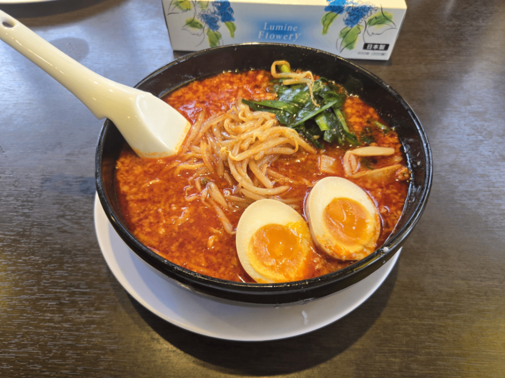
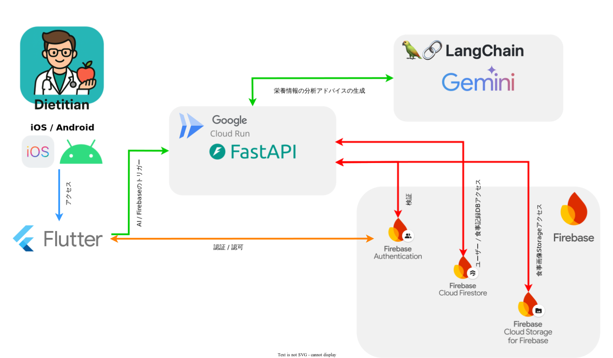

#  面倒な記録はもう終わり！ AI栄養管理アプリ「Dietitian」で、今日から始める賢い食生活

#  １．「続かない」栄養管理にサヨナラを

##  現状

みなさん、健康的な食生活、意識していますか？「もちろん！」と答えたいところですが、忙しい毎日の中で、つい手軽な食事や好きなものばかりを選んでしまってはいないでしょうか。

近年、生活習慣病への懸念や健康寿命への関心の高まりから、個人の健康管理、特に栄養管理への注目は世界的に高まっています。実際、健康・ウェルネス関連の市場は拡大を続けており、多くの人がスマートフォンアプリを活用して日々の健康管理を行っています。[[openPR](https://www.openpr.com/news/4012396/japan-health-and-wellness-market-size-share-growth), [Global Growth Insights](https://www.globalgrowthinsights.com/jp/market-reports/health-and-wellness-market-104424?utm_source=chatgpt.com)]。

摂取カロリーや栄養バランスを可視化できる食事管理アプリは、食生活を見直すための強力なツールです。「最近、塩分を摂りすぎだな…」「思ったより野菜が足りていない」といった気づきは、スーパーでカップ麺に伸ばした手を止め、野菜コーナーに向かわせるきっかけになります。

しかし、その一方でこんな声も聞こえてきます。

##  挫折の壁：なぜ食事管理アプリは続かないのか？

私たちの周りでも、意気込んでアプリを使い始めたものの、いつの間にか使わなくなってしまった…という話をよく耳にします。この記事を読んでいるあなたも、心当たりがあるかもしれません。

その原因は、大きく分けて2つの「壁」があるからだと私たちは考えます。

###  ① **面倒すぎる「記録」の壁**

  * 「外食先のメニューがアプリのデータベースになくて、結局『その他』で登録。これじゃ正確な記録にならない…」
  * 「自炊した料理の材料を一つ一つ入力するのが大変で、三日坊主で終わってしまった…」
  * 「そもそも、毎食記録すること自体がストレス…」

忙しい日常の中で、この「記録」という行為そのものが大きな負担となり、継続のモチベーションを削いでしまうのです。

###  ② **心に響かない「アドバイス」の壁**

  * 「『脂質が多いです』と一言注意されるだけでは、次に何をどうすれば良いのか分からない…」
  * 「毎日同じような定型文のアドバイスで、だんだん通知を読まなくなった…」
  * 「もっと自分に合った、パーソナルな助言が欲しい！」

せっかく頑張って記録しても、機械的で画一的なフィードバックしか得られなければ、やる気は下がってしまいます。本当に必要なのは、一人ひとりの状況に寄り添った、血の通ったアドバイスではないでしょうか。

#  ２． AIがあなたの「専属栄養士」になる解決策

この「記録が面倒」「アドバイスが画一的」という2つの大きな壁を乗り越えるため、私たちは生成AIの技術を活用した新しい栄養管理アプリ**Dietitian** を開発しました。

近年、AIは文章だけでなく画像も深く理解できる**マルチモーダルAI** へと進化しています。この技術を応用することで、従来のアプリでは難しかった体験を実現しました。

  * 解決策①：料理の写真を撮るだけ。面倒な手入力は一切不要！
  * 解決策②：あなた専用のパーソナルAIが、温かみのあるアドバイスを提供！

もう、挫折する必要はありません。「Dietitian」が、あなたの食生活に寄り添うパートナーになります。

#  ３．AI栄養管理アプリ Dietitian について

百聞は一見に如かず。まずは、Dietitianが実際にどのように動作するのか、こちらの動画をご覧ください。

<https://www.youtube.com/watch?v=aeKh1l6zvYI>

Dietitianならではの体験：あなただけのAI栄養士  
Dietitianの最大の特徴は、単なる記録ツールではなく、あなただけのパーソナルな栄養士として機能することです。

例えば、下の画像のような美味しそうなラーメンを食べた日。従来のアプリとDietitianでは、こんなに違いがあります。

【一般的なアプリのアドバイス】  
警告：今日の摂取カロリーは目標を超えています。炭水化物の摂取量に注意してください。

【Dietitianのアドバイス】  
ラーメンにもやしやニラ、煮卵を追加して、栄養バランスを意識されているのは素晴らしいですね！しかし、ラーメンは塩分が高くなりがちです。今日の食事全体の塩分が少し気になります。次の食事では、カリウムが豊富な海藻類や野菜をたっぷり使った「わかめと豆腐の味噌汁」を追加して、塩分の排出を助けましょう。また、主食を「雑穀米」にすることで、食物繊維やミネラルを補いつつ、塩分を控えることができますよ。

このように、Dietitianはあなたの名前やプロフィールを理解し、まるで専属の栄養士と対話しているかのような、具体的で温かみのあるアドバイスを生成します。

##  機能要件

**Dietitianは、以下の機能を備えています。**

###  主な機能

  * Googleアカウントによるログイン・ログアウト
  * スマホで料理の写真を撮影・選択してアップロード
  * 料理の写真からカロリー・栄養素を自動分析、食事に関するアドバイスを受ける
  * 過去の食事記録の閲覧（リスト形式／グラフ形式）
  * マイ情報（名前・年齢・性別・身長・体重）の登録・編集

なぜ「Gemini」なのか？ 技術的なこだわり  
Dietitianの心臓部には、Googleの最新AIモデル**Gemini 2.5 Flash** を採用しています。  
高速かつ高精度な画像認識能力はもちろん、人間のように自然で文脈を理解した対話生成能力に優れています。このモデルを採用したことで、単なる栄養計算ツールではない、ユーザー一人ひとりに寄り添う「AI栄養士」という温かみのある体験を実現しました。

**具体的な機能の実現方法は以下のようになっています。**

###  ユーザー情報管理

  * マイ情報は Firebase Authentication から発行されるユーザーIDとともに Firestore に保存されます。
  * 料理の写真のアップロードや、分析、食事記録の閲覧、マイ情報の登録・編集などの操作ごとにユーザーIDの検証を行います。

###  画像のアップロード・分析

  * ユーザーが撮影または選択した料理の画像は Firebase Storage にアップロードされます。
  * アップロードされた料理の画像はLangChain経由でGeminiに渡され、カロリーと栄養素が推定されます。
  * 推定されたカロリーと栄養素について、入力された身体情報をもとにGeminiによって分析が行われ、アドバイスが生成されます。
  * 推定結果とアドバイスは Firestore に保存され、ユーザーは分析履歴をリスト形式で閲覧することが出来ます。

###  食事記録

  * 各食事の記録は日時、画像、栄養素情報、アドバイスなどとともに Firestore に保存されます。
  * ユーザーは記録一覧をAPI経由で Firestore から取得し、リスト表示またはグラフ表示で確認でき、日々の栄養バランスを振り返ることができます。
  * グラフでは食事ごとのカロリーや栄養素（たんぱく質・脂質・炭水化物など）の推移を確認でき、健康管理のモチベーション向上に貢献します。

##  システムアーキテクチャ

Dietitianは、モダンで堅牢な技術スタックで構築されています。

  * **フロントエンド** : Flutter(Dart)
  * **バックエンド** : FastAPI(Python)
  * **認証、データベース** : Firebase(Firestore, Auth, Storage)
  * **AIモデル** : Gemini 2.5 Flash
  * **フレームワーク** : LangChain

##  各機能の処理フロー

###  1\. ログイン

  * [ユーザー] → Googleアカウントを選択しログインを実行
  * [アプリ] → GoogleからIDトークンを取得 → トークンを使って Firebase Auth にサインイン要求
  * [Firebase Auth] → 検証・認証 → 認証トークン発行、ログイン成功

###  2\. 画像アップロード

  * [ユーザー] → 画像を選択/撮影
  * [アプリ] → Firebase Storage に画像保存
  * [Cloud Run] → FastAPIに画像URL送信
  * [FastAPI] → 画像から栄養素を推測してアドバイスを生成 → 結果を Firestore に保存

###  3\. データ表示

  * [アプリ] → Firestoreからデータ取得
  * [アプリ] → リストまたはグラフで表示

##  アドバイス生成までの3ステップ

あなたが写真を撮ってから、パーソナルなアドバイスが届くまで、裏側ではAIがこのように働いています。

  * 【料理名の特定】: まずAIが画像を分析し、「焼き鯖、ごはん、味噌汁、たくあん」のように、写っている料理名を正確に特定します。

  * 【栄養素の推定】: 次に、特定した料理名と画像全体のボリューム感から、カロリーや三大栄養素（たんぱく質、脂質、炭水化物）、ビタミン、ミネラルなどの栄養素を詳細に推定します。

  * 【アドバイス生成】: 最後に、推定された栄養素とあなたのプロフィール情報（年齢、性別、目標など）を統合的に分析し、あなただけに向けたパーソナルなアドバイスを生成します。

#  ４．今後の方針

Dietitianはまだ始まったばかりです。今後、さらにあなたの健康管理を強力にサポートするため、以下のアップデートを計画しています。

##  分析・アドバイスの精度向上

  * 複数料理の認識精度向上: 大皿料理や鍋など、複数の料理が混在した画像でも、より正確に個々の料理を認識できるよう改善します。

  * パーソナライズの深化: 過去の食事履歴や好み（「揚げ物は好きだけど、週に2回まで」など）をAIが学習し、よりあなたのライフスタイルに合ったアドバイスを最適化します。

##  さらに充実した機能の実装

基本的な機能は実装済みですが、今後も以下のような機能を追加し、さらに充実した栄養管理の実現を目指します！

  * 冷蔵庫の食材からのメニュー提案: 「冷蔵庫にある食材を写真で撮るだけで、健康的なレシピを複数提案。買い物に行かなくても、今日から健康的な食生活を始められます。」

  * ヘルスケアアプリ連携: 「Apple ヘルスケア / Google Fitと連携し、その日の運動量を自動で食事記録に反映。運動した日は少し多めに、デスクワークの日は控えめに、といった賢いカロリー調整をAIがサポートします。」

  * 長期的な食習慣レポート: 1ヶ月、3ヶ月といった単位であなたの食生活の傾向を分析し、「〇〇さんは塩分を摂りすぎる傾向があるので、出汁を効かせた調理法を試してみませんか？」といった、長期的な視点での改善レポートをお届けします。

#  ５．終わりに

私たちは、「忙しい毎日でも、誰もが手軽に、そして楽しく栄養管理を続けられる世界」を目指してDietitianを開発しました。

面倒な記録からあなたを解放し、AIがパーソナル栄養士として日々の健康づくりをサポートします。基本機能はすでに整っており、健康を意識するすべての方に、きっと役立てていただけると信じています。

ぜひ一度、この新しい栄養管理の形を体験してみてください。  
あなたの健康的な未来づくりを、**Dietitian** が全力で応援します！

#  6\. インストールはこちら

<https://play.google.com/store/apps/details?id=com.aiagenthackathon2.dietitian>
