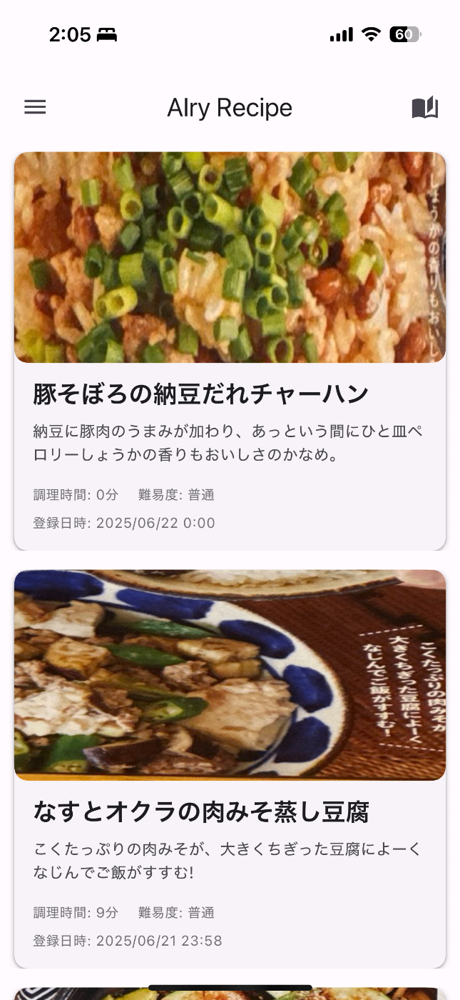
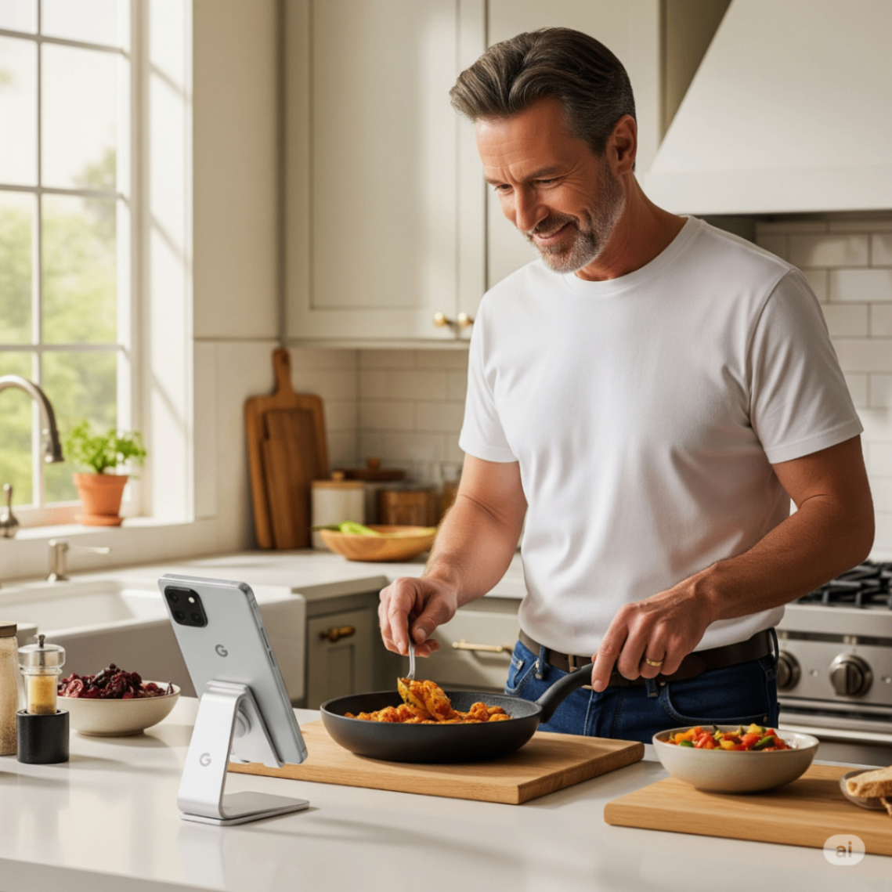
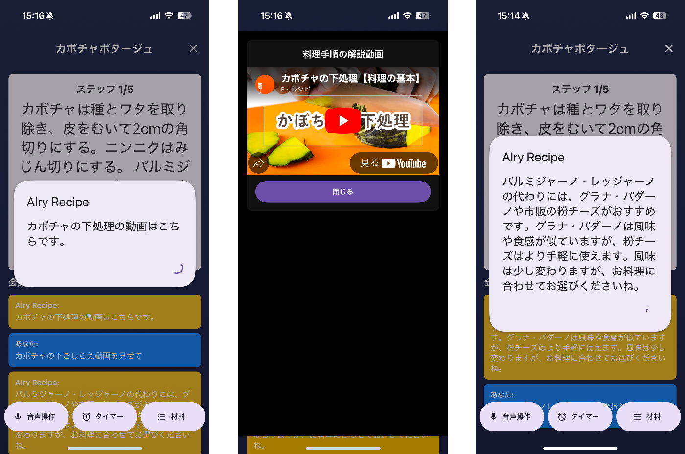
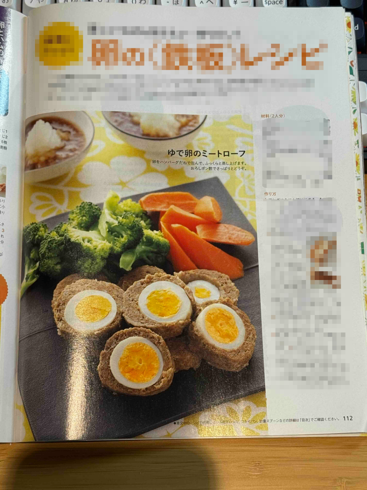
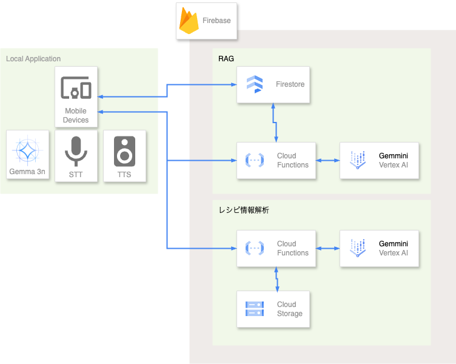

※この記事は「[第 2 回 AI Agent Hackathon with Google Cloud](https://zenn.dev/hackathons/google-cloud-japan-ai-hackathon-vol2?tab=overview)」の参加のための提出物です。

#  料理体験をアップデートするレシピアプリ「AIry Recipe（アイリー・レシピ）」の開発

スマートフォンのレシピアプリは、無数のレシピを手軽に検索・閲覧でき、紙のレシピ本が主流だった時代に比べて料理を格段に便利にしてくれました。  
しかし、その便利さの裏で、新たな「小さなストレス」が生まれているのではないでしょうか。

「AIry Recipe（アイリー・レシピ）」は、AI を活用し、これまでのレシピアプリが抱えていた問題を解消することで、料理体験をアップデートする **「スマートフォン・タブレット向けのレシピアプリ」** です。

##  はじめに

インターネットが普及し、今や数え切れないほどの多くのレシピが公開されています。  
その中でも「レシピアプリ」は、気軽にレシピを検索・閲覧し、いろいろな料理を作るのをサポートしてくれる心強い存在です。

昔であれば、本を買ってそれを眺めながら料理をしていました。  
しかし本は濡れたり汚れたりすると劣化してしまいます。  
また、本は場所も取り、新しいレシピが欲しければ都度買い足していく必要がありました。

これを解消してくれたのがスマートフォンとレシピアプリだと思います。  
レシピアプリがあれば、新しいレシピも簡単に追加でき、ページめくりの動作もすっと指で撫でるだけです。  
また、アプリによっては動画などで作り方を確認したりすることも可能です。  
これは従来の紙のレシピでは実現できないことでした。

しかし、その便利さの裏で、新たな **「小さなストレス」** が生まれています：

  * **いざ調理を始めると、手が濡れたり汚れたりしてスマートフォンを触れない。**  
当然ですが、料理中は材料や調味料を手で触れて、手についてしまいます。  
その状態でスマートフォンに触れるのは嫌なので、いちいち手を洗ったり、手の甲で操作してみようとしたりと、ちょっとめんどくさい事になりがちです。

  * **調理中にふと「この専門用語って何だっけ？」と思っても、アプリを切り替えてブラウザで調べるのが面倒。**  
レシピって、基礎知識的なものは載っていないことが多いです。  
例えば、「玉ねぎをくし切りにする」と書かれていても、「くし切りってどんな切り方だっけ？」となってしまった場合、ブラウザで「玉ねぎ くし切り やり方」と検索することになってしまいます。  
基礎知識を乗せてくれているアプリもあったりしますが、レシピ上に載せると情報量が多すぎて煩雑になるので、別コンテンツとして用意されていることがほとんどです。

  * **結局、長年愛用している雑誌の切り抜きや手書きのレシピは、アプリとは別に管理されていて活用しきれない。**  
レシピアプリのレシピも良いものはたくさんありますが、紙のレシピ本も欲しいということは多いと思います。  
好きな料理研究家さんのレシピは本でしか無かったりすることもあるでしょう。  
でも、そのレシピはレシピアプリで閲覧することはできません。

――私は、この「あと一歩」のストレスを解消し、料理体験を真にアップデートしたいと考えました。

そこで、Google Cloud の最新 AI 技術とローカル LLM を組み合わせることで包括的に解決するアプリケーション「AIry Recipe」を開発しました。

##  スマホ・タブレット向けアプリ『AIry Recipe』の紹介

  
_AIry Recipe のメイン画面イメージ_

<https://youtu.be/eAyeXRcQ0y8>  
_AIry Recipe の動作デモ_

AIry Recipe は、以下３つの機能で課題を解決します：

###  ① ハンズフリーでサクサク！柔軟な音声操作

  
_「AIry」と話しかけるだけで、手を汚したままでも操作可能_

「AIry（アイリー）、材料リストを見せて」→「AIry、次の手順は？」→「AIry、タイマーを 8 分セットして！」といった一連の音声操作が可能です。

**技術ポイント：**  
端末の音声認識機能（Local Speech to Text）と、ローカルで動作する Gemma 3n が、これらの定型的なコマンドを高速に解釈することで、タイムラグのない快適な操作性を実現しています。

音声認識だけでも実現は可能なのですが、「次見せて」「次お願い」「次のページ」「次のステップ」など、話し言葉の揺れに対応するため、LLM に意図解釈をさせることで自然な言葉での操作を実現しました。

「料理中」という状況の特性から、なるべく遅延なく、通信環境が悪くても一定の操作は可能とするため、端末の音声認識機能＋ローカル LLM で実装することで、オフライン環境でも基本機能が使えるようにしています。

また、アプリからのフィードバックは文字だけでなく、端末の Text to Speech を用いて耳でも聞けるようにし、画面を凝視しなくても作業が進められるようにしました。

###  ② それって何？に応える！RAG による賢い情報提供

  
_専門用語や代替食材の質問にも的確に回答_

レシピに出てきた「エスプーマって何？」や「カロリーが低い代替食材を教えて」といった専門的な質問に対し、アプリが的確な回答を生成します。  
特に用意された動画がある場合は、手順を動画で確認することが可能です。  
仮に用意していないことが質問された場合も、LLM として一般的な料理情報として回答を生成します。

**技術ポイント：**  
Gemini 2.5 flash の広大なコンテキストウィンドウと、Firestore のベクターサーチ機能を活用した RAG（Retrieval-Augmented Generation）により、信頼性の高い情報源から回答を生成しています。

特に料理の場合は、言葉で説明を読んでも分かりづらいことが多いため、ユーザーの質問に応じて予め用意した写真や動画から最適なものを選んで表示する機能も実装しました。「かぼちゃの下ごしらえのやり方教えて」と聞くだけで、アプリが最適な動画を表示してくれます。

###  ③ 紙のレシピも一瞬でデータ化！マルチモーダル入力

  
_雑誌のレシピページをカメラで撮影するだけ_

スマホのカメラで雑誌のレシピページを撮影すると、材料と手順が自動でテキスト化され、アプリに登録されます。お気に入りの紙のレシピも、デジタル管理して活用できます。

**技術ポイント：**  
マルチモーダルな LLM である Gemini 2.0 flash を利用し、レシピ写真と指示を与えることで、レシピの情報を OCR＆構造化して取得することが可能となりました。

  
_アプリに取り込まれた情報_

料理写真の部分についても、Gemini に料理写真と思われる部分の座標を抽出してもらい、それを切り出すことで自動で設定されるようになっています（精度は高くないため、後で自分で修正する場合も多いですが）。

材料や手順の情報は概ね取得できるようになっているため、一部調整すればアプリの中で利用できる状態になります。

##  『AIry Recipe』を支えるハイブリッド AI アーキテクチャ

  
_システム全体構成図_

###  技術選択の理由と役割

####  ローカル LLM: Gemma 3n

**役割：**

  * 音声コマンドの意図解釈（「次へ」「タイマーセット」など）
  * 基本的なレシピ閲覧操作のハンズフリー制御

**なぜ Gemma 3n か？**

  1. **高速応答性** : ネットワーク通信を必要としないため、レイテンシが極めて低く、ユーザー体験が向上
  2. **オフライン動作可能** : インターネット接続がない環境でも基本機能が利用可能
  3. **API コストがかからない** : 使用頻度が高い基本操作をローカルで処理することでコスト効率が向上

####  クラウド LLM: Gemini 2.5 flash (on Vertex AI) & Gemini 2.0 flash

**役割：**

  1. RAG による高度な質疑応答(Gemini 2.5 flash)
  2. マルチモーダル機能による画像からのレシピ抽出(Gemini 2.0 flash)

**なぜ Gemini 2.5 flash & Gemini 2.0 flash か？**

  1. **広大なコンテキストウィンドウ** : 料理のレシピや手順などの長文コンテキストを一度に処理できる
  2. **高速かつ低コスト** : 他の大規模モデルに比べて推論速度が速く、コスト効率も良好
  3. **Google Cloud サービスとの親和性** : 他の GCP サービスと連携しやすい

なお、用途によって動作の安定性に違いが出たため、2.0 と 2.5 を使い分ける構成にしています。

####  バックエンド & 開発基盤

**Firebase Platform:**  
バックエンドの基盤を Firebase に統一しました。これにより、認証、データベース(Firestore)、サーバーレス関数(Functions)、ストレージ(Storage)をシームレスに連携でき、インフラ構築の手間を最小限に抑え、開発に集中できました。

**Genkit (クラウド AI オーケストレーション):**  
クラウド側の AI 処理フローは Genkit で構築しました。Firebase Functions 上で動作し、ユーザーからのリクエストに応じて Firestore のベクトル検索を行い、その結果をプロンプトに組み込んで Gemini 2.5 flash を呼び出す、といった一連の RAG フローをコードで簡潔に定義できます。Genkit の UI で処理の流れを可視化・デバッグできるため、複雑な AI ロジックの開発体験が劇的に向上しました。

##  今後の展望

###  機能拡張

  1. **冷蔵庫の中身を撮影して作れるレシピを提案する機能**

     * カメラで冷蔵庫の中を撮影すると、AI が食材を認識し、それらを使ったレシピを提案
  2. **段取りを提案する AI 機能**

     * レシピの内容と自宅のコンロの数や調理家電の情報から、どのような段取りで調理を進めればよいかを提案してくれる AI
  3. **パーソナライズされたレシピ推薦**

     * ユーザーの過去の調理履歴や好みを学習し、よりパーソナライズされたレシピ推薦を行う
  4. **複数人での同時利用**

     * 家族や友人と一緒に料理する際に、複数のデバイスから同時アクセスして作業を分担
  5. **組み込み LLM の利用への切り替え**

     * Gemma 3n(2B)でおよそ 3GB あり、ダウンロードが困難なため、iOS / Android の組み込み LLM を利用するようにしていきたい

##  まとめ

今回のハッカソンを通じて、Google Cloud の AI サービス、特に Gemini 2.5 flash と、それを支える Firebase エコシステム、そしてクラウド AI フローを統括する**Genkit** の組み合わせが、複雑な AI アプリケーションのアイデアを素早く、かつ堅牢に形にする上で非常に強力なツールであることを実感しました。

ローカルとクラウドのハイブリッド AI アーキテクチャは、オフライン動作とリッチな機能を両立させ、さらにコスト効率も考慮できるアプローチとして、今後のアプリケーション開発の重要な選択肢になると考えています。特に、ユーザー体験が重視されるモバイルアプリケーションでは、この手法が効果的に機能するでしょう。

* * *

_※ 本記事で使用しているスクリーンショットや図表は、ハッカソン参加時点のイメージであり、今後リリースされた場合の実際の画面とは異なる場合があります。_
