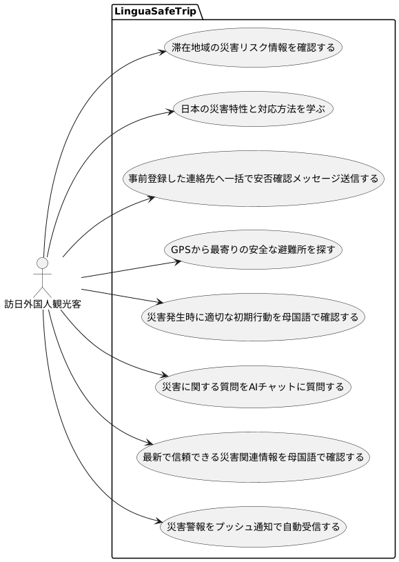
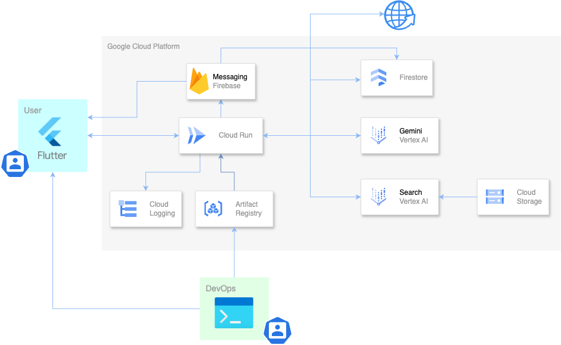
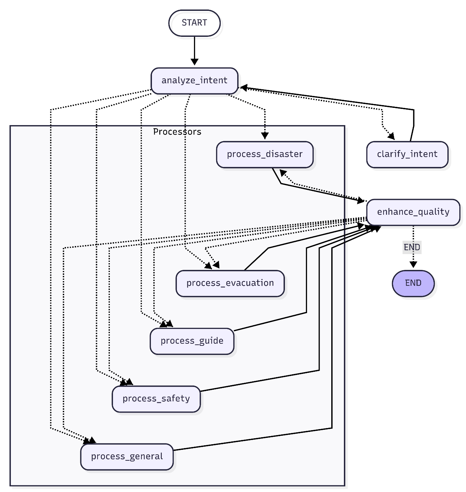

##  LinguaSafeTrip 🌐

LinguaSafeTrip は、訪日外国人の「言語の壁」と「災害リスク」を解消するAIエージェントです。言葉の光で、旅の安全をつなぎます。

###  デモ動画

<https://youtu.be/3F2hXNkcY6M>

###  📈 プロジェクト背景と目的

2024年の訪日外国人は 年間約3,687万人と過去最高を記録し、月単位で記録を更新し続けています。

<https://www.jnto.go.jp/news/_files/20250115_1615.pdf>

一方で、日本は地震・台風・豪雨など自然災害リスクが極めて高く、特に2011年の東日本大震災では、約19兆円の直接損失が試算されました。

[https://ja.wikipedia.org/wiki/東日本大震災の経済への影響](https://ja.wikipedia.org/wiki/%E6%9D%B1%E6%97%A5%E6%9C%AC%E5%A4%A7%E9%9C%87%E7%81%BD%E3%81%AE%E7%B5%8C%E6%B8%88%E3%81%B8%E3%81%AE%E5%BD%B1%E9%9F%BF)

「歴史的な観光ブーム × 世界有数の災害多発国」という二律背反が同時進行している状況です。

もし災害が起きると、

  * 最新の災害情報の多くが日本語で理解できない
  * 土地勘がなくどこに避難すればよいかわからない。
  * デマが拡散され正確な情報に到達できない

###  🎯 価値提案

訪日外国人旅行者が災害に見舞われた時に、言語や情報の壁、心理的パニックのハードルを下げて安全確保をサポートします。

  * **多言語対応** \- 日本語の災害情報を母国語で届ける
  * **AIエージェントによる災害サポート** \- LangGraph で高度な災害対応を支援
  * **最新で信頼性の高い情報** \- 気象庁・国土地理院APIや信頼できるWebソースからの情報を統合

* * *

##  📝 要件定義

###  📋 ユースケース

###  🎯 主要シナリオ

シナリオ 1: 地震発生時

震度5強の地震が発生

  1. LinguaSafeTrip からの即時プッシュ通知を確認
  2. 母国語で即時行動の指示を確認
  3. 母国語で最新の信頼できる地震情報を取得
  4. 最寄りの安全な避難所を確認
  5. 家族への安否確認メッセージをSMS送信

シナリオ 2: 平常時の防災準備

観光のため日本の空港に到着

  1. アプリを初回起動
  2. 緊急連絡先の登録
  3. 現在地の災害リスク情報を確認
  4. 防災ガイドで災害対応を学ぶ
  5. 最寄りの避難所の事前確認

* * *

##  🏗️ アーキテクチャ

アーキテクチャ図

###  🧑‍🤝‍🧑 ステークホルダー

区分 | 説明  
---|---  
**User**  
訪日外国人旅行者 | \- スマホアプリから Cloud Run API へリクエスト  
\- 災害情報・避難所検索  
\- 多言語チャットによる質問  
**DevOps**  
開発・保守 | \- FastAPI、Flutter コード実装  
\- Docker ビルド & Artifact Registry へ push  
\- Cloud Run へのデプロイ／監視  
  
###  ☁️ クラウド＆アプリケーションコンポーネント

サービス | 役割 | インタラクション  
---|---|---  
**Cloud Run** | サーバーレス FastAPI: すべてのリクエストを集約し各サービスを呼び出す中核 | Vertex AI・Vertex AI Search・Firestore・Cloud Logging などと通信  
**Vertex AI ( Gemini )** | LLM 推論（意図解析／翻訳／応答生成／要約 | Cloud Run からプロンプトを受け取り結果を返す  
**Vertex AI Search** | RAG 用ベクトル検索エンジン | Cloud Storage の PDF をインデックス化し検索結果を Cloud Run へ返却  
**Cloud Storage** | 災害 PDF ガイドやインデックスデータの保存 | Vertex AI Search へのデータ提供・DevOps からのアップロード  
**Firestore** | NoSQL データベース: 会話履歴／デバイス設定／提案履歴を保持 | Cloud Run と双方向同期  
**Firebase Cloud Messaging** | プッシュ通知配信 | Cloud Run から緊急アラート・災害速報をモバイルデバイスへ送信  
**Web** | Tavily / Google CSE で外部ニュース取得   
公式の地震・津波・気象警報データ | Cloud Run から最新情報を検索して要約を返す   
Cloud Run が 5 分周期でポーリングして緊急通知生成  
**Cloud Logging** | ログ集約・可観測性 | エラー／パフォーマンス指標を収集しダッシュボード表示  
**Artifact Registry** | Docker イメージの保存・脆弱性スキャン | Dev が push → Cloud Run が pull して自動デプロイ  
  
**Cloud Run** で自動スケールする **FastAPI** コンテナを基盤として、Dockerイメージを **Artifact Registry** から継続的にデプロイします。

会話履歴やユーザー設定は **Firestore** に保存し、防災ガイド（PDF）は **Cloud Storage** に格納して **Vertex AI Search** のインデックスに利用します。

**Vertex AI Search** に取り込んだ防災ガイド (PDF) を **RAG** のコンテキストに組み込み、 **Tavily** ・ **Google Custom Search** で取った最新 Web 検索結果と、公式の気象庁 XML・国土地理院タイル／GeoJSON を **Cloud Run** 上の **LangGraph ** で合流させ、最終応答は **Gemini** が生成という流れです。

###  🔄 データフロー

フロー | 経路 | 内容  
---|---|---  
① ユーザーリクエスト | User → Cloud Run → LangGraph → Gemini | 自然言語問い合わせ → 意図解析・応答生成  
② RAG検索 | Cloud Run ↔︎ Vertex AI Search ← Cloud Storage | 災害ガイドPDFから関連段落を検索  
③ Web最新情報 | Cloud Run ↔︎ Web Search API | 外部ニュースを取得・要約  
④ 公式警報取得 | Cloud Run ↔ JMA | 地震速報をポーリングしてプッシュ通知  
⑤ データ永続化 | Cloud Run ↔ Firestore | 会話履歴・デバイス設定を保存／更新  
⑥ ログ監視 | Cloud Run → Cloud Logging | エラー・指標を送信／可視化  
⑦ CI/CD | Dev → Artifact Registry → Cloud Run | Dockerイメージのビルド・デプロイ  
  
* * *

##  🤖 AI エージェント設計

###  LinguaSafeTrip Orchestrator

LinguaSafeTrip Orchestrator は、LangGraph ベースの有向非循環グラフ（DAG）で構築された、多言語災害特化型AIエージェントです。8つの専門ノードが状態管理と非同期並列処理により協調して動作するため、品質を高く保ち、高速で回答します。

**タスク適応型モデル** : LLMレイテンシとコストを最適化する二段階モデル

  * **Gemini 2.0 Flash** : 意図分析・翻訳・エンティティ抽出などの構造化タスク
  * **Gemini 2.5 Flash** : 災害分析・避難アドバイス・感情的サポートなどの生成タスク

**LangGraph ノード構成**

ノード | 役割・主処理  
---|---  
**analyze_intent** | 意図分類・初期ルーティング決定  
**clarify_intent** | 曖昧クエリに対する追加質問生成  
**process_disaster** | 気象庁 API・RAG 統合で災害速報取得  
**process_evacuation** | 避難所検索・危険度評価・経路提示  
**process_guide** | RAG として防災ガイド PDF から段落抽出・要約  
**process_safety** | 安否確認 SMS テンプレート生成  
**process_general** | 雑談・ユースケース外質問の処理  
**enhance_quality** | 多言語化 + セルフリフレクション評価  
  
ユーザーの自然言語入力を **analyze_intent** ノードで即時分類し、災害情報・避難支援・安全確認・防災ガイド・一般問い合わせの 5系統プロセッサへルーティングします。分類ができない質問の場合は、 **clarify_intent** がユーザーに追加で質問をして、曖昧さ解消を図ります。

プロセス完了後、**enhance_quality** ノードがセルフリフレクションを実施し、事実性・安全性・言語品質を自動検証してハルシネーション軽減や多言語翻訳の品質評価をします。

* * *

##  🙋‍♂️ プロアクティブ提案機能

プロアクティブ提案は、デバイス状態を先読みして災害対策・防災行動を提案する機能です。バックエンドのAIエージェントとフロントエンドのSSE（Server-Sent Events）技術を組み合わせ、パーソナライズされた提案を配信します。

###  提案リスト

提案タイプ | 内容  
---|---  
ウェルカムメッセージ | ようこそ! LinguaSafeTripへ  
緊急連絡先設定 | 家族・友人の連絡先登録提案  
季節警告 | 季節別災害リスク情報（台風、大雪、熱中症など）  
防災準備情報 | 平常時の備え・防災グッズ準備の提案  
災害ニュース | 最新の災害関連情報・警報  
避難所情報 | 近隣の安全性評価済み避難所の情報  
ハザードマップ | 国土地理院ハザードマップへ誘導  
SMS提案 | 安否確認メッセージ送信の提案  
即座行動 | 緊急時の基本安全行動の提案  
低バッテリー警告 | 45%未満で充電推奨  
位置情報許可 | 位置情報アクセス許可のリクエスト  
通知許可 | プッシュ通知許可のリクエスト  
  
* * *

##  🤔 課題とこれから

  * 通信/電力が絶たれた場合

スマホに地図、ハザードマップをオンライン時にDLして置くとオフライン時でも現在地や周辺の危険度を確認できます。Google マップはオフライン保存に対応しています。

Small Language Model（SLM＝端末内で動く小型AI）が普及すると、クラウドなしで翻訳・要約・画像動画分析が可能になり、省電力で最低限の支援機能が実装できるかもしれません。

通信/電力が復旧したら、「家族へ安否連絡」や「災害情報を取得」などAIが複数の操作をまとめて実行してくれると負担やバッテリー消耗が最小化できると思います。

  * LLMコストは誰が負担するのか

防災アプリに広告を表示するのは、被災状況にあるユーザーの心を考えるとそぐわず、ユーザー負担ゼロが原則です。維持費は自治体補助金や寄付プラットフォームで賄う「みんなで支える」仕組みを想定しています。

  * AIエージェントからの信頼できる回答

本プロジェクトでは、RAGや公的 API データを組み合わせて、ハルシネーションを抑制をしています。災害に関わる情報は AI 単独で完結させず、人間の最終確認を必須とする安全設計が欠かせません。そこで、「命令や確定した情報」ではなく「推奨・提案」という形で、誤情報の可能性ありと注釈をつけて応答をしています。

AI の性能が向上しても、ユーザーが抱く信頼は、直感・経験・相手との関係性にも左右されます。今後、AI エージェント活用の普及により 実績や経験を積み重さね、課題を克服していくと、災害時でも頼れるパートナーとして広く受け入れられるようになるかもしれません。「災害時も AI エージェントが役に立つ」 未来を垣間見る一歩になれば幸いです。

以上です。日本旅行の安全を願って。ありがとうございました。
