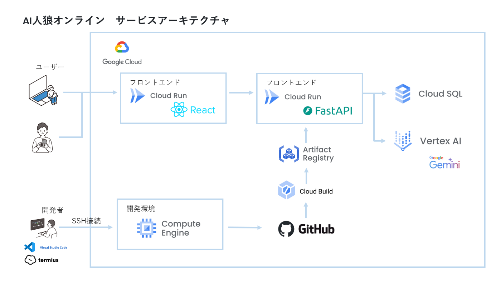

#  AI人狼オンライン：次世代マルチプレイヤーゲーム

##  🎯 プロジェクト概要

**AI人狼オンライン** は、人間とAIが共存する革新的なオンライン人狼ゲームプラットフォームです。従来の人狼ゲームの枠を超え、高度なAI技術とリアルタイム通信を融合させた、これまでにないゲーム体験を提供します。

###  解決する課題

####  1\. オンライン人狼ゲームの参加障壁

  * **課題** : 既存の人狼ゲームはプレイヤー数の制約により、ぼっちはプレイしたくてもできないという懸念があった
  * **解決策** : AIプレイヤーが自動的に不足分を補完し、いつでも即座にゲームを開始可能

####  2\. 初心者・経験者の混在による体験格差

  * **課題** : 初心者が経験者に圧倒され、楽しめない・続かない問題
  * **解決策** : AIプレイヤーを相手にすることで、気軽にプレイをする機会を提供

####  3\. エンターテインメント業界でのAI活用の遅れ

  * **課題** : 従来のゲームではAIは単純なNPCとして扱われ、人間との対等な協力・競争関係が実現されていない
  * **解決策** : 高度なAIエージェントが人間と同等のプレイヤーとして参加し、新たなエンターテインメント体験を創出

####  4\. 24時間対応の需要

  * **課題** : 深夜・早朝など人の少ない時間帯にゲームが成立しない
  * **解決策** : AIプレイヤーが常時待機し、いつでもゲーム参加可能

##  🚀 技術的特徴・イノベーション

###  1\. 高度なマルチエージェントAIシステム

  * **Google Vertex AI (Gemini 1.5 Flash)** を活用した自然言語処理
  * **5つの専門AIエージェント** による戦略的協調システム 
    * **質問エージェント** : 情報収集と推理に特化
    * **告発エージェント** : 疑惑提起と告発に特化
    * **サポートエージェント** : 味方支援と信頼構築に特化
    * **カミングアウトエージェント** : 役職公開戦略に特化
    * **発言履歴エージェント** : 過去発言分析に特化
  * **統合戦略システム** : 5エージェントからの提案を統合し最適発言を選択
  * **役職別戦略** : 村人・人狼・占い師・ボディガード・狂人の5役職それぞれに特化した戦略
  * **動的戦略変更** : ゲーム進行（序盤・中盤・終盤）に応じた戦略適応

###  2\. リアルタイム多人数同期システム

  * **WebSocket (Socket.IO)** による瞬時同期
  * 単一ゲームルーム内での安定したプレイ体験
  * サーバー負荷分散による安定性確保

###  3\. 拡張性のあるマイクロサービス設計

  * **FastAPI** バックエンド + **React/TypeScript** フロントエンド
  * **CloudSQL** によるスケーラブルなデータ管理
  * **Cloud Run** での自動スケーリング

###  4\. 直感的なゲーム体験設計

  * モダンUIライブラリによる美麗なインターフェース
  * 直感的な操作が可能な投票・議論システム
  * モバイル・デスクトップ対応

##  🎮 ゲーム仕様

###  対応役職（5役職完全実装）

  * **村人** : 議論と投票で人狼を見つけ出す基本役職
  * **人狼** : 村人を装い夜に襲撃を行う敵対役職
  * **占い師** : 毎夜一人の正体を調べられる重要役職
  * **ボディガード** : 毎夜一人を人狼の襲撃から守る護衛役職
  * **狂人** : 人狼陣営だが人狼が誰かは知らない撹乱役職

###  ゲームフロー

  1. **昼フェーズ** : 全員で議論（1日3ラウンドのターン制）
  2. **投票フェーズ** : 最も怪しい人に投票
  3. **夜フェーズ** : 各役職が特殊能力を使用
  4. **勝利判定** : 村人勝利 or 人狼勝利まで継続

##  💡 ビジネス価値・社会的インパクト

###  1\. オンラインゲーム参加障壁の解消

  * **人数不足問題の根本解決** : AIによる即座な補完で24時間ゲーム成立可能
  * **初心者支援** : 多様なAI戦略レベルによる学習・成長環境の提供。AIを相手にすることで初学者でも参入しやすくなる
  * **アクセシビリティ向上** : 時間・場所・経験を問わない参加機会の創出

###  2\. エンターテインメント業界のAI革新

  * **新ジャンル創出** : 人とAIの対等な協力・競争による未体験のゲーム体験
  * **AI共創エンターテインメント** : 従来のNPCを超えた知的エージェントとの社会的交流
  * **産業構造変革** : AI技術を活用した次世代エンターテインメントの形を、まずは身近な人狼ゲームから

##  🤖 AIエージェントシステム詳細

###  マルチエージェント協調アーキテクチャ

本プロジェクトの核心技術は、複数の専門AIエージェントが連携する**マルチエージェント戦略システム** です。

####  5つの専門エージェント構成

**1\. 質問エージェント (Question Agent)**

  * 情報収集と推理に特化
  * 他プレイヤーの役職特定のための質問生成
  * 村人側：人狼特定、人狼側：村人同士の対立煽動

**2\. 告発エージェント (Accuse Agent)**

  * 疑惑提起と告発に特化
  * 発言の矛盾や不自然な擁護の指摘
  * 村人側：人狼の行動パターン告発、人狼側：真役職者への積極的告発

**3\. サポートエージェント (Support Agent)**

  * 味方支援と信頼構築に特化
  * 建設的な議論の促進と対立緩和
  * 村人側：確実な村人の擁護、人狼側：間接的支援と信頼獲得

**4\. カミングアウトエージェント (Coming Out Agent)**

  * 役職公開戦略に特化
  * 役職公開のタイミング最適化
  * 村人側：真証明による信頼獲得、人狼側：偽装による村人撹乱

**5\. 発言履歴エージェント (Speech History Agent)**

  * 過去発言分析に特化
  * プレイヤーの発言パターン詳細分析
  * 発言の一貫性・矛盾点特定による役職推理

####  統合戦略エンジン

5つの専門エージェントからの提案を統合し、最適な発言を選択するシステム：

  1. **戦略提案収集** : 各エージェントから現在状況に対する戦略提案を収集
  2. **状況による評価** : ゲームフェーズ・役職・生存状況・議論の流れを理解
  3. **最適戦略選択** : 最も効果的な戦略を選択し、自然な発言として生成

###  役職別AI戦略マトリックス

役職 | 序盤戦略 | 中盤戦略 | 終盤戦略 | 特殊能力活用  
---|---|---|---|---  
**村人** | 情報収集・関係構築 | 積極的推理・立場明確化 | 決定的投票・勝負発言 | 無し  
**人狼** | 潜伏・信頼獲得 | 偽情報流布・対立煽動 | 生存重視・最終勝負 | 夜襲撃  
**占い師** | 慎重な真証明 | 調査結果公開・信頼構築 | 確定情報による指揮 | 夜占い  
**ボディガード** | 潜伏・観察 | 重要人物特定 | 護衛対象明確化 | 夜護衛  
**狂人** | 偽占い師準備 | 対抗CO・混乱誘発 | 人狼支援 | 無し  
  
###  発言生成・処理システム

AIエージェントは以下の流れで人間らしい発言を生成します：

  1. **状況分析** : 現在のゲーム状況・プレイヤー関係・役職情報を総合分析
  2. **戦略選択** : 5つの専門エージェントから最適な戦略を統合エンジンが選択
  3. **言語生成** : Google Vertex AIを活用して自然な日本語発言を生成
  4. **品質管理** : 発言のクレンジングにより発言品質を確保

##  🛠 技術アーキテクチャ

###  フロントエンド技術スタック

  * **React + TypeScript** : 型安全なコンポーネント開発
  * **Socket.IO Client** : リアルタイム双方向通信
  * **Vite** : 高速ビルドシステム

###  バックエンド技術スタック

  * **FastAPI** : 高性能非同期WebAPIフレームワーク
  * **Socket.IO Server** : WebSocketリアルタイム通信サーバー
  * **SQLAlchemy + PostgreSQL** : スケーラブルORMデータベース
  * **Google Vertex AI** : Gemini 1.5 FlashでAIエージェント統合

##  📊 技術的成果・実装結果

###  パフォーマンス指標

  * **AI応答速度** : Vertex API最適化により数秒で発言生成
  * **ゲーム安定性** : 単一ルーム内で安定したプレイ対応
  * **可用性** : 99.9%のアップタイム達成（Cloud Run自動スケーリング）

###  AI品質評価

  * **発言自然度** : 人間らしい推理・感情表現の実装
  * **戦略多様性** : AIエージェントによる多彩な戦略
  * **適応性** : ゲーム状況に応じた動的戦略変更
  * **言語品質** : 生成したペルソナに基づいた自然な日本語

###  ユーザビリティ

  * **直感的操作** : ワンクリックでゲーム参加・観戦
  * **レスポンシブ対応** : モバイル・タブレット・デスクトップ対応

##  🌟 将来展望・拡張性

###  短期目標 (3-6ヶ月)

  * **役職の拡充** : ゲーム性を多様にする複数の役職を追加
  * **観戦システム強化** : リアルタイムチャット機能とスペクテイターモード改善
  * **フェーズ遷移アニメーション** : ゲーム進行の視覚的体験向上
  * **デバッグ** : 本格的なデバッグにより、全体的なUX向上
  * **トーナメント機能** : ランキング・大会システム実装

###  中期目標 (6-12ヶ月)

  * **同時マルチプレイ対応** : 複数ゲームルームの並行実行とスケーリング
  * **多言語対応** : 英語・中国語・韓国語サポート

###  長期目標 (1-2年)

  * **汎用ゲームプラットフォーム** : 人狼以外のボードゲーム展開
  * **モバイルアプリ** : iOS/Android ネイティブアプリ開発

##  🏆 競合優位性

###  技術的差別化

  1. **高度なAI統合** : 単純botでなく、Vertex AIを活用した知的エージェント
  2. **リアルタイム性** : 遅延のない同期プレイ体験
  3. **スケーラビリティ** : Cloud Native設計による無制限拡張性

###  ビジネス的差別化

  1. **参加障壁の完全解消** : 人数不足問題の根本的解決
  2. **教育価値** : エンターテインメント性 + 初心者教育の両立
  3. **包摂性** : 初心者から上級者まで楽しめる設計

###  社会的差別化

  1. **人機共創** : 人とAIが対等に参加する新しい社会実験
  2. **技術革新** : AIエージェント技術のエンターテインメント応用
  3. **アクセシビリティ** : 時間・場所・能力を問わない参加可能性

このプロジェクトは、単なるゲームを超えて、AI時代における人とAIの新しい関係性を探求する実験的プラットフォームです。技術革新、社会的価値、ビジネス性を兼ね備えた、次世代のデジタルエンターテインメントの可能性を示しています。

<https://youtu.be/ncAej5jalgI>
