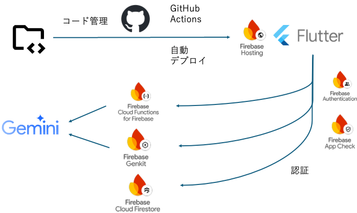

##  TL; DR

  * イベントの幹事は今まで以上に大変
  * 幹事の相談役としてのAI Agent
  * Flutter/Firebase+Geminiを用いた効果的な開発

##  背景

イベントの幹事はとても大変なのは周知の事実だと思います。飲み会の幹事は参加者の意向を聞きつつ、会が成功するように準備を進める必要があります。そこで私たちは幹事の相談役としてのAI Agentを用意し、イベントの構想からレストランの選定までAI Agentがお手伝いします。これにより幹事の負担感を軽減し、参加者も幹事も安心してイベントに臨めることを目指しました。

##  現状課題

不要との声も出てきていますが、大学や会社などの集団内でのコミュニケーションの円滑化にはやはり飲み会などのイベントは重要です。しかし、このようなイベントを開くためには必ず誰かが下準備をする必要があります。そう、幹事です。

もともと幹事は負担が大きかったですが、近年の多様化や個人主義によりイベントはこれまでのように「とりあえずビール」ではうまくいかなくなりました。また、コロナ禍での対面での交流の自粛によりそれぞれのコミュニティ内で培われてきたイベントのやり方が失われてきています。

お酒の趣味嗜好は広くなり、最初にビールを注文しない人は増えてきました。外国人も増加し宗教上食べられないものがある人もいます。ベジタリアンやビーガンのような食生活を選択する人たちも出てきました。様々なアレルギーを持っている方もいます。

実際に私が研究室内でさよなら会の幹事を任された時がそうでした。去年の場合は卒業した先輩が幹事をしてくださった上に、学生のうちうちでやったような形だったのに対し、今年は研究室全体でさよなら会を開く必要がありました。実際、私の研究室では外国人が50%以上だったので、どんな料理がいいのか全然わかりませんでした。また、日程調整が2,3人の人がベジタリアンと言ってきまして、他にもお子さんを連れてきたいという人も現れました。幸いレストランの予約前だったので良かったですが、色々と計画を変更する必要がありました。

このようにイベントの幹事は前例がない中手探りで、複雑な条件下で正確に会の準備を進める必要があります。

##  目的

幹事の人は、最低限の目的などを入力することで後はAI Agentと相談しつつ安心感を持ってイベントの調整を進めることができるようになります。煩雑な繰り返し作業はシステムが吸収します。

参加者は、自分たちの要望を伝えるべきタイミングがはっきりし、かつ要望を伝え忘れることを防ぐことができます。これにより安心感を持ってイベントに参加することができます。

このように幹事の人も参加者の人も負担感を減らしつつ、安心してイベントの準備を進めることができます。

##  ソリューション概要

**ステップ #** | **名称** | 詳細 | **技術要素**  
---|---|---|---  
1 | 幹事が予定の概要を作成 | 幹事が会の目的や候補日程など基本的な事項をAI Agentと相談しながら作成する。 | フォーム入力 ＋ 質問文生成LLM  
2 | 参加者の入力（コア項目のみ） | 参加者が日程や場所、嗜好などを入力する。 | フォーム入力  
3 | 日程・レストラン決定（AIアルゴリズム） | AI Agentが参加者の投票内容に基づき、日程・レストランの候補をリストアップする。 | 日程最適化ロジック ＋ Places API + レコメンド選択LLM  
4 | 幹事がAI Agentの結果から | 幹事がその中から選択する。 | UIダイアログ  
5 | 告知（全員への通知） | 参加者へ集計結果を周知する。 | 通知API（LINE/Slack/Mail）  
6 | 自動予約 | 幹事からの指示のもと、システムから自動的にレストランを予約する。 | OpenTable Developer APIを通して自動予約・通知API  
  
1~4まで実装済み。

##  利用の流れ

イベントを開くことが決まった場合、幹事はCheers Plannerでイベントを作成することができます。この時、幹事はAI Agentと相談してイベント内容をブラッシュアップすることができます。幹事は日程調整などの固定の質問だけではなく、追加でアレルギーなどの質問を追加することができます。

幹事はイベントを作成し終わると、投票用リンクを発行することができます。各参加者は投票用リンクを押下するとwebアプリとしてのCheers Plannerが起動し、ユーザー登録を済ませることで幹事が用意した質問や日程調整などに答えることができます。この時、さらに参加者は個人的な意向を幹事に伝えることもできます。

幹事は参加者からの投票状況を確認することができ、投票が集まりきった段階でAI Agentに日程調整とレストランのレコメンドを受けることができます。この時、AI Agentは幹事と決定したイベント情報や参加者の入力内容を網羅的に加味し、レストランのレビュー情報などをもとにおすすめのレストランを決定します。AI Agentは１番のおすすめのレストランと複数のその他のおすすめのレストランを提示するので、幹事はその中からレストランを選択することができます。

レストランが決定すると参加者に通知され、参加者はレストランの概要を知ることができます。（予定）

最後にレストランは自動予約されます。（予定）

##  システムアーキテクチャ

大まかにフロントエンドをFlutterで、バックエンドをFirebaseを用いて実装しました。

ソースコードはGitHubにて管理し、プルリク時やmainブランチへのマージ時にGitHub Actionsを通してFirebase Hostingに自動デプロイされます。

データはFirebase Cloud Firestoreで管理し、APIなどに関わる処理などはFirebase Cloud Functionsを用いて実装しております。FlutterサイドからGeminiを呼び出す際はVertex AIを間に挟んでいます。これらFirebaseの機能はFirebase AuthenticationやFirebase AppCheckにより認証され、意図せぬアプリからのアクセスを遮断します。

AI Agentは全てGeminiを用いて実装しています。

##  実装の概要

###  開発の効率化

  * Git Flowに乗っ取ったスムーズな開発 
    * GitHub Actionsを用いたプルリク毎のCDでレビュー負荷軽減。
    * 一部OpenAIのCodexにタスクを投げることで作業者数をかさ増し。
  * Flutter/Firebaseのエコシステム 
    * 今回は実装を完全にFlutter/Firebaseに乗っかりました。
    * FlutterによるシンプルなUIの実装
    * Firebaseによるインフラ構築の負担軽減
    * ローカルではFirebase Emulatorを用いた開発。
    * GeminiもFirebaseを通して安全にフロントから呼び出し。

###  AI Agent

  * 幹事のイベント作成時のブラッシュアップ 
    * 幹事が入力したイベント情報をもとにイベント情報をブラッシュアップ
    * 関数呼び出しを用いることで構造的にGeminiのレコメンド内容を反映
    * 3つのトリガー 
      * テキスト入力：幹事がテキストによりイベントの意図やAI Agentへの指示を送ることができる。
      * 反映ボタン：反映ボタンを押下することでレコメンド内容をイベントに反映し、次のレコメンドへシームレスに移ることができる。
      * 取消ボタン：取消ボタンを押下することで別のレコメンドを提示する。
  * レストランの候補のリストアップ 
    * 次のステップにて最適なレストランを選択します。各ステップが完全に独立して動作し、エラー時の再実行や途中結果の確認が可能です。 
      * **STEP1** 場所候補生成：  
Geminiを用いて参加者の投票情報から最適な場所候補を生成。
      * **STEP2** キーワード生成：  
Geminiを用いて参加者の投票情報からレストラン検索用のキーワードを生成。
      * **STEP3** レストラン検索：  
Places APIを用いて場所候補ごとにキーワードを使用して10件ずつレストランを検索。  
各レストランごとにメニュー情報、口コミから良い点悪い点を集約して表示。
      * **STEP4** レストラン選択最適化：  
Geminiを用いて検索したレストランの中から最適なレストランを3件ずつ抽出、また全体を通して最も最適なレストランも抽出。レビュー情報などの店舗情報とレストランの希望を総合的に判断して選定する。

##  動作例

<https://youtu.be/c7_XVSa5G_w>

動画における幹事の負担軽減の内容を説明します。

動画では幹事ははじめ、一切イベント情報を入力せずにAI Agentとの相談を開始しています。そこで、イベントの目的として「新入生を迎え入れる歓迎会を開きたい」と伝えるとAI Agentが自動的にイベント名を提案します。この提案を幹事が受け入れると、AI Agentはさらにこの情報をもとにイベントの長さを長くするよう提案します。このように幹事のざっくりとした情報をもとにAI Agentと相談して具体的なイベントを作成することができ、幹事の認知的負担感や、不安感を取り除くことができます。

レストランのレコメンドでは、各参加者の入力内容をもとに、適切な場所や検索するべきキーワードを抽出し、具体的なレストランを提案することができました。このように参加者が多くとも広く参加者の意向を取り入れることができます。

##  今後の展望・まとめ

今後は自動予約機能まで実装したいと考えています。また幹事の準備のそれぞれのステップをシームレスに繋ぎ、任意のタイミングでAI Agentと相談できるようにしたいと考えています。さらに、今回はAI Agentとの相談を幹事側のみで実装しましたが、参加者側の投票でもAI Agentが活用できると考えています。参加者側の過去の入力内容やプロフィール情報をもとに、参加者の入力内容を補完し、さらに参加者が幹事に伝えているとより満足できる歓迎会になるであろう情報を伝えることもできるようにしたいです。このようなシステムにより、イベントの幹事は参加者をより深く理解できつつ、作業の負担感は軽減され、幹事も参加者も安心でき満足感のあるイベントを開けるようになると信じています。
