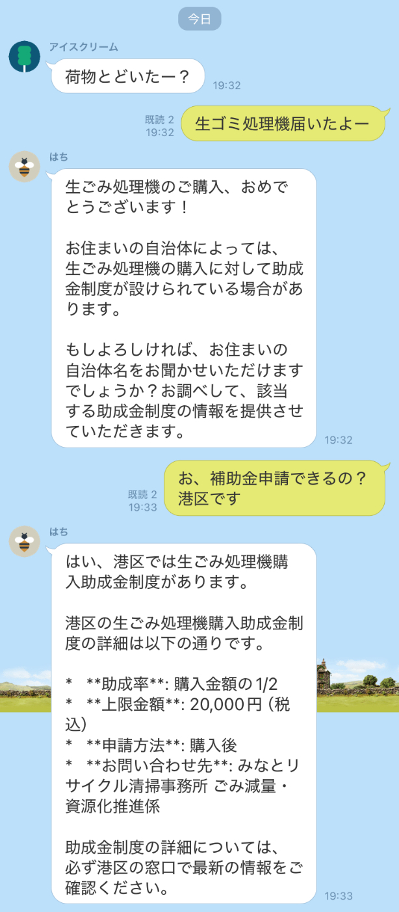
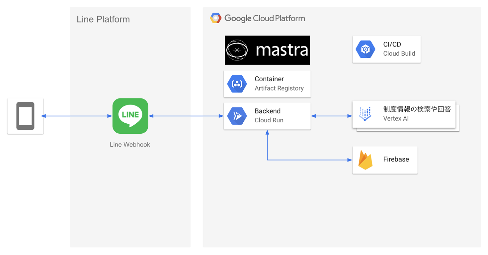
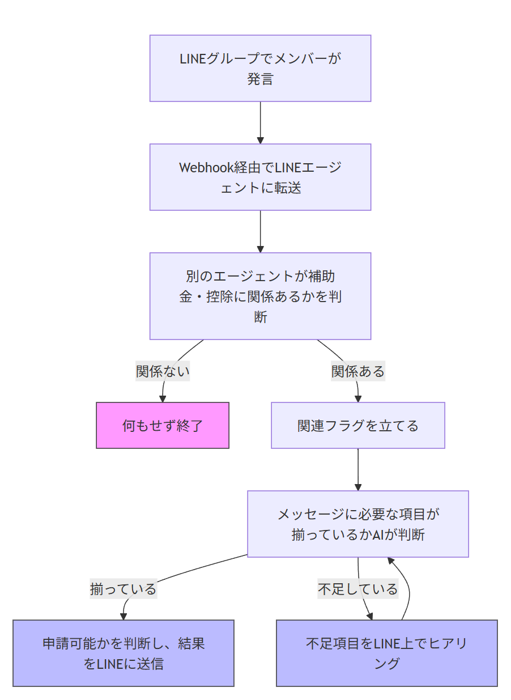
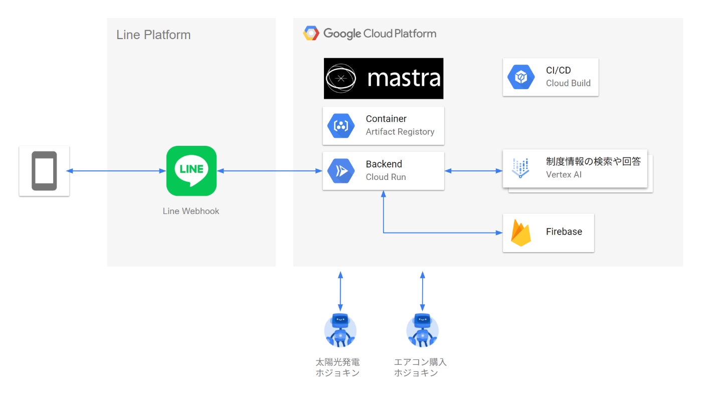
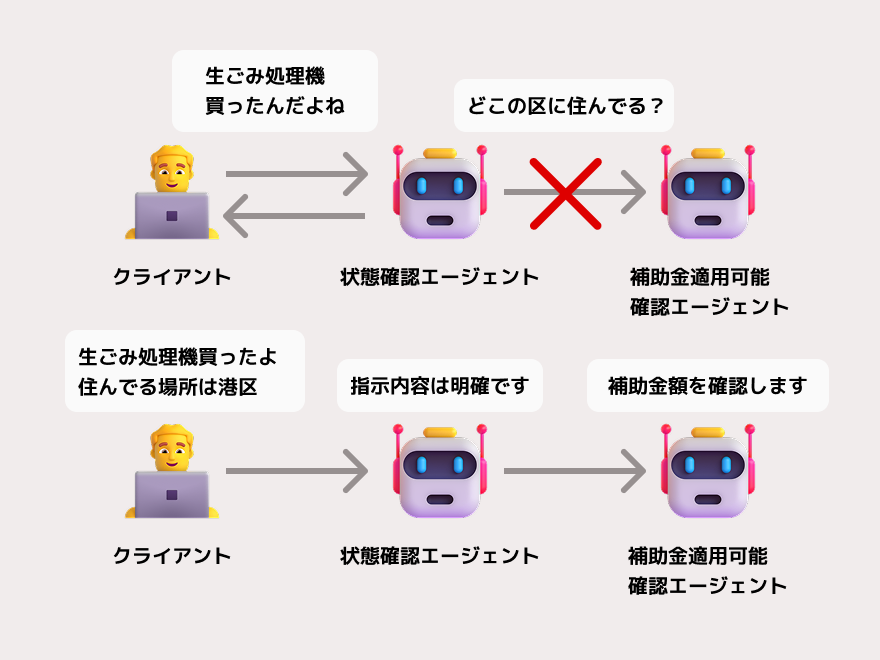

この記事は[AI Agent Hackathon with Google Cloud](https://zenn.dev/hackathons/google-cloud-japan-ai-hackathon-vol2)のために書いた記事です

##  ホジョキンTV エブリデイについて

<https://youtu.be/5ktGplJ0AC4>

「えっ！あの時の買い物、補助金申請できたの！？」  
みなさんはこのような経験をしたことはありますか  
申請できたはずなのに、申請できることを知らなかったためにお金が戻ってくる機会を失ってしまう…  
ホジョキンTV エブリデイは毎日の会話から「この補助金申請できそう！」を通知するLINE Botです

補助金や控除は申請すると私たちの生活の負担が軽減される制度です  
そして補助金や控除があることで助かっている人はとても多いです

しかし、補助金や控除は申請主義という前提があるため、自ら申請を行わないと適用を受けられません  
また、補助金や控除を受けられる状態の方だとしても、制度の存在を知らないと申請するという発想に至ることもありません  
そこでホジョキンTVエブリデイは日々の生活の中で発生した行動に関してLINEで発言した際、「その行動は補助金や控除を申請できそうですよ！」をユーザに伝え、上記の問題を解決します  
ホジョキンは補助金に関係ある話題があるときにのみメッセージを返すため、普段の会話が煩わしくなることはありません  
  
_例 荷物が届いたことには反応せず、補助金が申請できそうな内容にのみ反応_

> プロジェクトが対象とするユーザ像: 本当は補助金を受け取れるのに申請しない方  
>  課題: 支援やサービスを受ける権利があっても、本人が自分で申請しないと受けられない仕組みであり、制度の存在を知らない人や情報弱者が取り残される  
>  特徴: 普段のLINE会話の中にホジョキンを追加するだけで申請可能な状態を検出して通知してくれる！

###  申請主義について

日本の補助金や給付金、控除制度の多くは 「申請主義」 という仕組みを取っています  
支援やサービスを受ける権利があっても、本人が自分で申請しないと受けられない仕組みであり、「自分で条件を調べて、必要書類を揃えて、申請して初めて受け取れる」というルールになっています  
本当に必要な人に限定して支援が行われたり行政コストを抑えられる反面、申請手続きの煩雑さや制度の情報の調べにくさや分かりにくさから、制度の存在を知らない人や情報弱者が取り残される→「本当は受け取れるのに申請しない」人が生まれる面もあります

近年はこの課題を解決するために[お悩みハンドブック](https://compass.graffer.jp/handbook/landing)のような、設問に対して自身の情報をセルフチェックするだけでどのような支援を受けられるかが分かるといった、素晴らしい生活支援サービスも登場しつつあります

お悩みハンドブックよりも設問項目を少なくし、より簡潔に自身に適用可能な支援制度を明らかにする[支援みつもりヤドカリくん](https://shien-yadokari.proj-inclusive.org/)というサービスも登場しました

私たちは支援を受けられる状態になったら即座に「適用可能な状態になった」ことが分かるサービスがあれば、社会福祉制度と制度を利用できる人をより多く繋げられると考えたためホジョキンを制作しました

##  システムアーキテクチャ

  
補助金に関するLINEメッセージにのみ反応し、補助金が申請できる可能性があることを教えてくれるLINE Botは、LINE PlatformとCloud Run上に立ち上げたMastraが実現しています

会話状態は下記のように遷移しています  

LINEグループでの発言が補助金・控除に関係あるかを判断し、関係あるようであれば会話の状態を変更します  
会話状態が変更されたことはFirestoreに保存されるため、一度フラグが立ったあとはフラグが立った状態から会話を継続できます

今回対象とした補助金は生ごみ処理機購入における助成金です  
購入者の居住地区によって助成金額が変わるため、申請において不足している項目があれば聞き返します  
動画の例ではホジョキンはまず生ごみ処理機を購入したことに反応し、適切な補助金額を利用者に教えるために居住地区をヒアリングしています  
適切なヒアリングを実現するにあたって、Rule as Codeの考え方を参考にしました  
[https://scrapbox.io/c4j/OpenFiscaによるRule_as_Codeで誰一人取り残さない社会を一緒に実現しよう](https://scrapbox.io/c4j/OpenFisca%E3%81%AB%E3%82%88%E3%82%8BRule_as_Code%E3%81%A7%E8%AA%B0%E4%B8%80%E4%BA%BA%E5%8F%96%E3%82%8A%E6%AE%8B%E3%81%95%E3%81%AA%E3%81%84%E7%A4%BE%E4%BC%9A%E3%82%92%E4%B8%80%E7%B7%92%E3%81%AB%E5%AE%9F%E7%8F%BE%E3%81%97%E3%82%88%E3%81%86)

##  使用したGoogle Cloudサービス

###  Cloud Run

Mastraのホスティングに使用しています  
サーバレスで実行することが可能なため、使用した分しか料金が発生しません  
筆者がGoogle Cloudの中で一番好きなサービスです  
最近のアップデートでCloud RunのインスタンスとしてL4 GPUが利用可能になりました！

###  Artifact Registory

Mastraのコンテナイメージの管理に使用しています  
手軽に脆弱性スキャンしてくれたりスケーラビリティが高かったりと、SREの観点からも便利なサービスです！

###  Cloud Build

自動デプロイのために使用しました！  
[前回の作品であるワラドール・トーク](https://zenn.dev/hitotori/articles/b7787ad417ad8c)ではGitHub ActionsとTerraformでデプロイを行なっておりましたが、CLoud Buildに置き換えました  
Terraformよりも少ない記述でリソースを定義、デプロイできたので使っていて非常に楽でした！

##  使用したフレームワーク

###  Mastra

AIエージェントの構築に使用しました！  
利用するのは初めてでしたがエージェントとワークフロー、ツールの3種からなる構成のおかげで直感的にエージェントを構築できました  
A2Aプロトコルにデフォルトで対応していることもあり、拡張性の高いシステム構築に向いていると感じています

###  LINE Webhook

LINEメッセージはLINE PlatformからMastraに転送されます  
設定も非常に簡単でコードも書きやすかったです

##  使用させていただいたデータ

今回はハッカソンでのMVP開発ということもあり、東京都の生ごみ処理機購入に係る助成金のデータを使用しました  
今後は国や市区町村の補助金や助成金、控除に係るデータからエージェントを構築したいです

##  拡張性

現在は単一のMastraサーバのホスティングによりホジョキンを展開していますが、将来的にはA2Aプロトコルの利用によって補助事業や控除ごとに申請可能かを判断するエージェントを作成し、必要に応じた連携を行いたいと考えています  
また、LINEだけでなくSlackやDiscordなど様々なWebhook連携も行うことが可能であるため、拡張性はかなり高いと考えています  

また、正確な判断と会話状態のデータ保持の観点から、ユーザから提供される情報と補助金申請が可能かどうかの判断に必要な情報が揃っているかを確認するエージェントを分離したいと考えています  

##  開発を振り返ってみて感じたAIエージェントの可能性

今回の開発を通してメッセージアプリ × Webhook × AIエージェントの組合せは情報を得る活動を大きく変えると感じました  
今までは国や自治体が一次情報を出し、メディアがその情報を分かりやすく伝え、人々はメディアや情報が集まっている場所を見に行くという流れがありましたが、これからは人々が何かしらの行動を起こした時、起こそうとするタイミングで最も有益な情報がAIから瞬時に届けられる未来がやってくる気がします

それは情報を得る活動の新しい選択肢としてこれからどんどん世の中に浸透するのではと考えています  
ホジョキンの制作を通して私だけでなくチームの方々もAIエージェントに大きな可能性を感じたと思います  
AI Agent Hackathonをきっかけに制作し始めたホジョキンですが、社会実装に向けて制作は継続する予定です  
ご興味ある方はご連絡いただければ幸いです！

##  Produced by ホジョキン制作チーム

###  もっちー

ホジョキン・助成金 を欲しがる人です。  
人生初のはっかそんがこのチームでよかったです！  
<https://zenn.dev/chan0mochi>

###  しほ

いつか生ごみ処理機を買いたい人です  
補助金駆動生活をしましょう  
<https://zenn.dev/bubu>

###  uep

使える補助金は隈なく使っていきたい精神でAI触っています  
<https://zenn.dev/uepnats>

###  えり

###  ひととり

バックエンドとPdMを担当。和気藹々としたチームで楽しく制作できました！  
<https://zenn.dev/hitotori>
