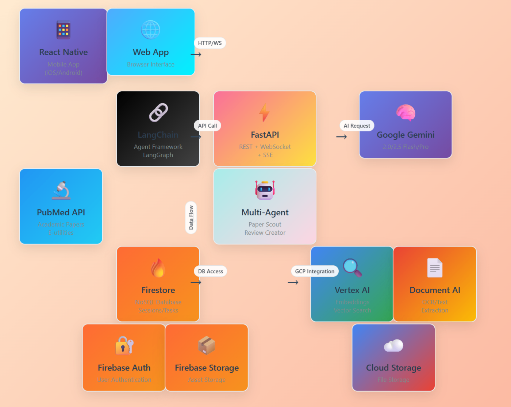

#  医療現場の知のパートナー「MedAgent-Chat」～臨床工学技士からエンジニアが開発した医療AI エージェント～

##  はじめに

私は7年間臨床工学技士として血液浄化、呼吸療法、集中治療、手術室で働く中で、**医療従事者にとって学会発表準備や治療エビデンス調査が極めて負担の大きい作業** であることを実感しました。

現在ソフトウェアエンジニアに転職し、この課題を解決するために開発したのが「**MedAgent-Chat** 」です。Google Cloud の力で医療現場の「知のパートナー」となるAIエージェントシステムを構築しました。

##  対象ユーザー像と課題

###  対象ユーザー

医師、看護師、臨床工学技士、薬剤師、研修医・医学生など、エビデンスに基づく医療を実践する全ての医療従事者

###  解決すべき課題

**1\. 論文検索の非効率性** ：PubMed検索の複雑さ、日本語検索の限界  
**2\. エビデンスレベルの判定困難** ：論文の信頼性評価に専門知識が必要  
**3\. 学会発表準備の重負荷** ：スライド作成や構成設計に膨大な時間  
**4\. 最新情報へのアクセス困難** ：複数DB横断検索、専門用語翻訳の手間

##  ソリューションと特徴

MedAgent-Chatは、これらの課題を**AI技術とGoogle Cloudサービス** を組み合わせて解決します。

###  主要機能

**1\. @medical-research：医療研究支援**

  * PICO分析による臨床疑問の構造化
  * エビデンスレベル自動評価（1a-5段階）
  * 日英医学用語翻訳（「急性心筋梗塞」→「acute myocardial infarction」）

**2\. @paper-scout：論文発見**

  * 多因子関連性評価とPubMed高度検索
  * MeSH用語活用による精密検索

**3\. @review-creation：文献レビュー作成**

  * LangGraph多段階処理による自動生成
  * 引用フォーマット自動対応

**4\. @multi-search：統合データベース検索**

  * PubMed、Google Scholar、arXivの結果統合
  * 重複除去と品質評価指標

**5\. 学会発表準備支援**

  * Google Slides自動生成
  * 発表者ノートと想定Q&A作成

##  システムアーキテクチャ

MedAgent-Chatは**4層アーキテクチャ** で構成：

**クライアント層** ：React Native + Expo（iOS/Android/Web対応）  
**アプリケーション層** ：FastAPI + 専門エージェントディスパッチャー  
**サービス層** ：Google Cloud（Cloud Run、Vertex AI、Firebase）  
**データソース層** ：PubMed、Google Scholar、arXiv

##  Google Cloud活用のポイント

###  Vertex AIの活用

**Gemini 2.0 Flash** ：高速マルチモーダル処理

  * 論文PDFの直接解析
  * 医学画像の解釈
  * リアルタイム翻訳

**Gemini 2.5 Pro** ：高度推論タスク

  * 複雑な臨床疑問の解析
  * エビデンス統合と評価
  * 学会発表構成の論理設計

###  Cloud Runによるスケーラビリティ

  * 利用量に応じた自動スケーリング
  * コールドスタート最適化
  * コスト効率の良い運用

###  Firebaseによるユーザー体験

  * シームレスな認証体験
  * セッション履歴の永続化
  * マルチデバイス同期

##  技術的特徴と工夫

###  技術的特徴

  * **医学用語翻訳** ：「急性心筋梗塞」→「acute myocardial infarction」
  * **エビデンスレベル自動判定** ：1a（メタ分析）～5（専門家意見）
  * **PICO構造化分析** ：Patient/Intervention/Comparison/Outcome
  * **マルチエージェント協調** ：LangGraphによる段階的処理

##  デモ動画について

3分間のデモ動画では以下の機能を実演します：  
<https://www.youtube.com/watch?v=QvJpg5mGKNQ>

  1. **臨床疑問の入力** ：「急性心筋梗塞患者において早期PCIは薬物療法と比較して30日死亡率を改善するか？」
  2. **PICO分析の実行** ：自動的な構造化と検索戦略提案
  3. **論文検索と評価** ：PubMed検索とエビデンスレベル判定
  4. **学会発表スライド生成** ：Google Slidesでの自動プレゼンテーション作成
  5. **文献レビュー作成** ：統合されたエビデンス要約の生成

##  今後の展望

###  今後の展望

  * 音声入力対応、画像解析機能、AI診療支援との連携
  * 多職種連携によるチーム医療支援
  * エビデンスベース医療の促進と医療従事者の働き方改革

##  まとめ

MedAgent-Chatは、臨床現場で働いた経験を活かし、**医療従事者の真のニーズ** に応える AIエージェントシステムです。Google Cloudの強力なAI技術基盤の上に、医療現場特有の課題解決機能を構築しました。

**技術革新の成果** ：

  * Vertex AI による高度な医学文献解析
  * マルチモーダルAIによる包括的情報処理
  * Cloud Runによるスケーラブルな運用

**社会的価値の創造** ：

  * 医療従事者の業務負荷軽減
  * エビデンスベース医療の推進
  * 医療の質と安全性の向上

この取り組みを通じて、テクノロジーが医療現場に真の価値をもたらし、最終的には患者さんのより良い医療につながることを願っています。

医療とITの架け橋として、MedAgent-Chatが多くの医療従事者の「知のパートナー」となり、日本の医療の発展に貢献できれば幸いです。

#aiagentzenn #googlecloud
