<https://www.youtube.com/watch?v=dZ5KXqWLnaY>

#  1\. 背景

##  その場で決まらない無駄な会議

**「で、今日の会議って結局なんだったの？」**

会議後に、そんなモヤモヤを感じたことはありませんか？

会議は本来、情報を共有し、意思決定を行い、アイデアを生み出すための重要な場です。  
しかし現実には、「調査してからじゃないと結論が出せない」「話がまとまらない」…そんな場面に出くわすことも多いのではないでしょうか。

そして結局、持ち帰り案件ばかりが増え、何も決まらずに時間だけが過ぎていく——  
「今日の会議、正直ムダだったな」と感じた経験、きっと一度や二度ではないはずです。

実際、会議に関する意識調査[1]では、**85** %の人が「無駄な会議を経験したことがある」と回答しています。  
つまり、多くの人が同じように“決まらない会議”に悩まされているのです。

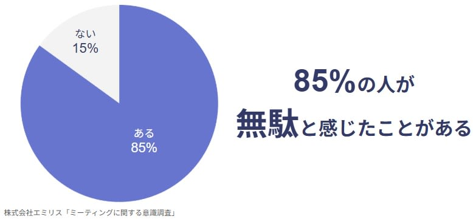

無駄な会議は時間の浪費にとどまりません。  
「その場で決まらなかったこと」はタスクとして積み残され、やがて業務全体の滞りや負担感につながっていきます。  
こうして会議が形骸化していくと、仕事のスピードも質も損なわれてしまうのです。

#  2\. 課題

###  課題① 整理された情報がすぐ出てこない

議論が白熱している最中に「競合他社のシェアは？」「この技術の実装コストは？」といった疑問が生じると、誰かが調べ始めて会議が停止します。  
議論のテンポが崩れ、決めるべきことが決まらない。小さな停滞が蓄積し、大きなロスに変わります。

###  課題② やるべきことが積もっていく

合意が取れずにやるべきことが積もっていく  
即座に対応、意思決定できなかった内容は、「あとでやります」とタスク化されます。  
しかし、他の業務に埋もれて忘れられることも少なくありません。  
“あとで”の積み重ねが、仕事を滞らせ、負担としてのしかかります。

#  3\. ソリューション

##  その場で決めて、"今"を動かす

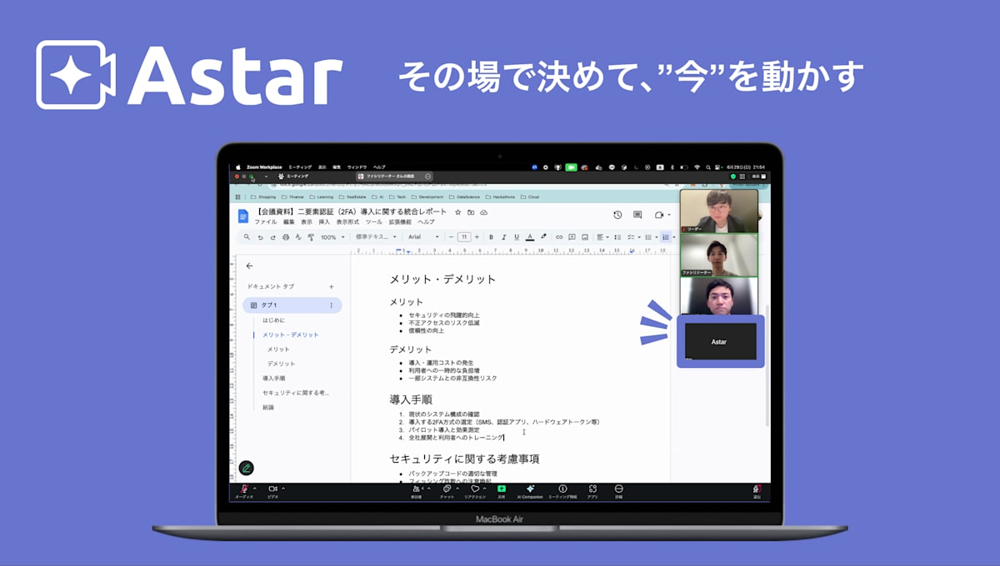

これらの課題を解決するため、会議の「今」を動かし、会議を促進させ、その場での合意形成まで全体的にサポートする会議AIアシスタント「**Astar** 」の開発を行いました。  
Astarは、会議中に**その場でアクションを実行できるオンライン会議アシスタント** です。

##  特徴① 今終わらせる即時アクション

「この件、あとで調べておきます」を、Astarがその場で解決。  
調査・回答・ファイル共有・修正反映などを**リアルタイムに処理** することで、  
会議の中断を最小限にし、意思決定に繋げ、実行をサポートします。

##  特徴② 人のような自然な会話体験

Astarは、ただのチャットボットではありません。  
音声で指示し、音声で返ってくる**人に近い会話体験** を提供。  
テキスト入力の手間なく、スムーズな操作が可能です。

##  特徴③ 好きな会議ツールあなたのデバイスで

**Google Meet / Zoom / Microsoft Teams** など主要なオンライン会議アプリケーションにマルチ対応。  
**iOS / Android / Webアプリ** として提供され、どんなインターフェースにもフィットします。

##  対象ユーザー

AstarはGoogle Meetなどの**オンラインビデオ会議アプリケーションを利用する全ての人** に対して、より生産的な会議体験を提供します。競合情報、市場データの調査が必要なマーケターやシステム設計方針を決めたいエンジニアなど**幅広い職種** で活用できます。

#  4\. Astarの機能

NO. | 機能 | 詳細 | 利用ツール  
---|---|---|---  
1 | 会議自動参加 | 直接会議URL入力もしくはGoogleカレンダー事前登録により対象の会議に自動参加する機能 | ・Cloud Run   
・Meetingbaas  
2 | 音声対話型AI応答 | 会議で発生した指示に対するAI応答 ※仕組みは後述 | ・Live API   
・GKE  
3 | AIウェイクワード駆動 | 会話中の特定音声によってAIが起動をし動作開始する機能 | ・Gemini   
・GKE  
4 | 外部サービス連携 | GoogleカレンダーへのAstar参加登録や、会議中にGoogle Drive内のファイル操作を行う機能 | ・Flutter   
・Gemini   
・GKE  
5 | 自動文字起こし | 会議の会話内容を文字起こししてFirestoreに保存、Flutterで表示する機能 | ・Flutter   
・Firestore   
・Speech-to-Text   
・GKE  
  
#  5\. システム設計

##  アーキテクチャ

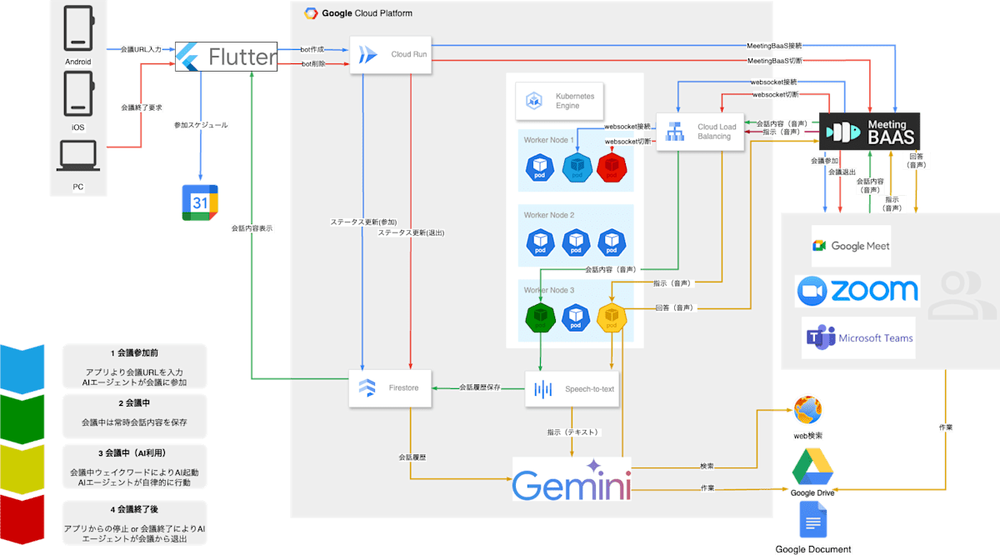

システムアーキテクチャは上記で構成されています。  
その構成において以下のフローで処理が実行されます。

##  処理フロー

###  1\. Astarを使うには

  * Astarは、**Web・iOS・Androidアプリ** を提供しています。
  * アシスタントを会議に参加させたり、アシスタントがリアルタイムに生成する議事録を閲覧するには、アプリの利用が必要です。
  * アプリからは、会議情報の登録、アシスタントの参加設定、議事録の確認といった操作を簡単に行えます。

###  2\. Googleサービスと連携

  * AstarはGoogleカレンダーと連携することで、会議スケジュールを取得できます。
  * 連携後、ユーザーの会議予定がAstarアプリ上に表示され、アシスタントの参加管理が簡単に行えるようになります。

Googleサービスと連携 | Google認可画面  
---|---  
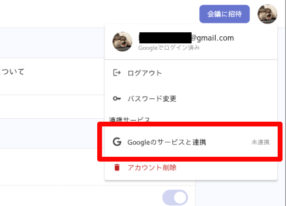 | 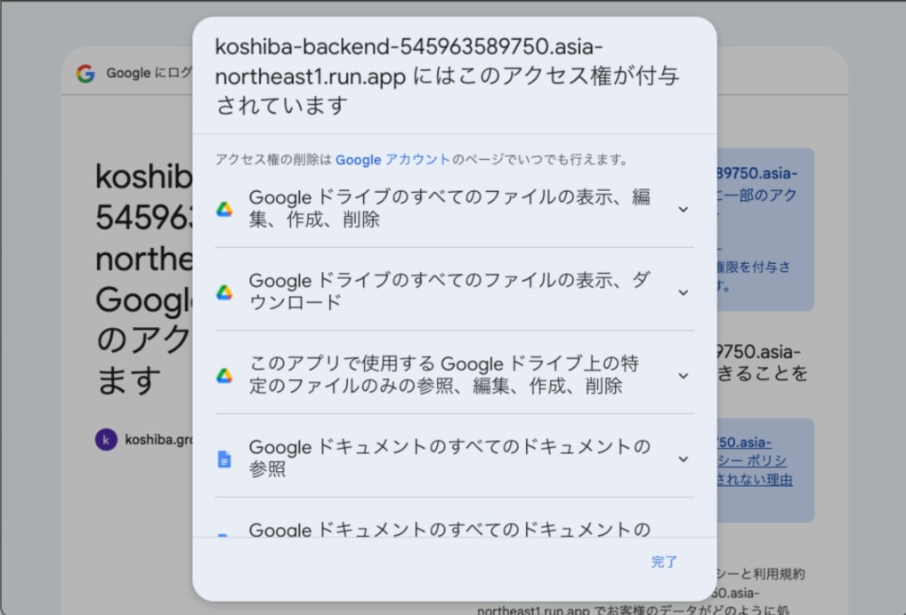  
  
###  3\. アシスタントを会議に招待

アシスタントを会議に参加させる方法は2通りあります。

####  ①「会議に招待」ボタンを使う方法

  * 任意の会議URL（Google Meet、Zoom、Teams）と開始時刻を登録します。
  * アシスタントは指定時刻になると、URLを使って自動参加します。

####  ② Googleカレンダー連携＋トグル操作

  * Googleカレンダーと連携すると、予定一覧が表示されます。
  * 該当の予定に対して**アシスタント参加のトグルをオン** にすることで、アシスタントの参加が登録されます。

①「会議に招待」ボタンを使う方法 | ② Googleカレンダー連携＋トグル操作  
---|---  
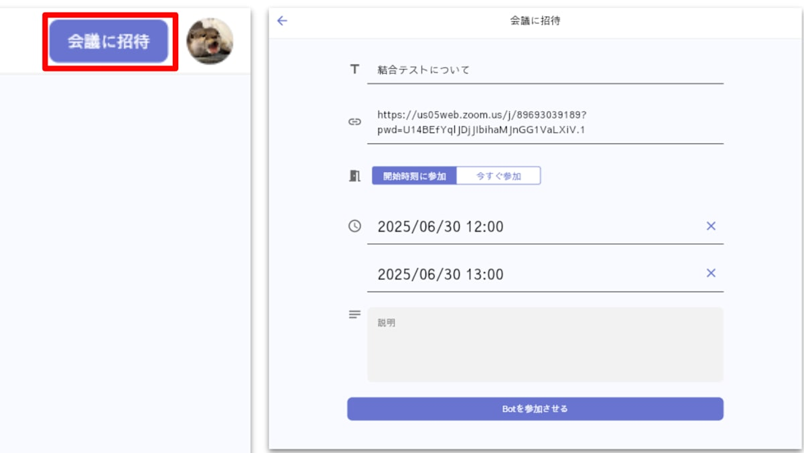 | 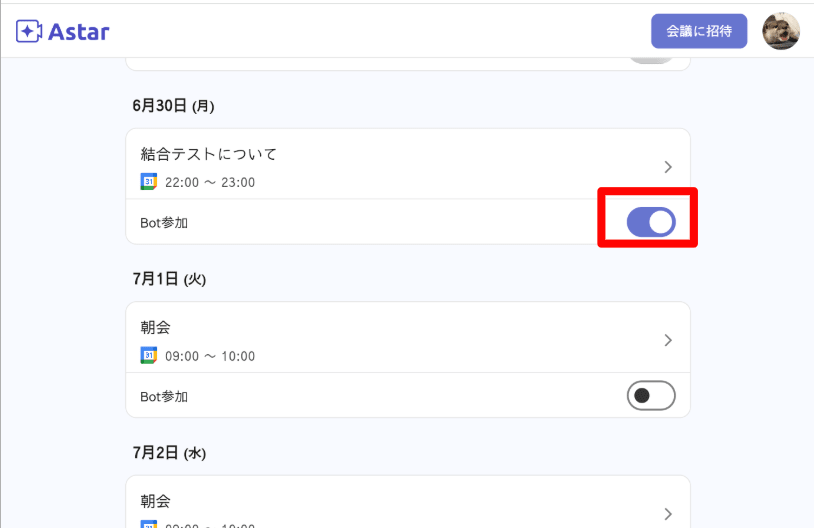  
  
###  4\. アシスタントが会議に自動参加

  * 登録された会議開始時刻になると、アシスタントが自動的に会議に入室します。
  * 接続されたアシスタントは、MeetingBaas上で音声をキャプチャします。
  * 音声データはWebSocketで送信され、GKE上のサーバーが受信します。
  * Cloud Runの接続には**最大1時間の制限** があるため、**長時間の会議に対応するためにGKE** を利用しています。

###  5\. 音声認識・文字起こし

  * アシスタントは会議中の発言をリアルタイムで音声認識し、文字起こしを行います。
  * 文字起こしデータはFirestoreに保存され、Astarアプリにも即時反映されます。
  * 発言者の区別やタイムスタンプの付与も行われ、議事録として活用しやすくなっています。

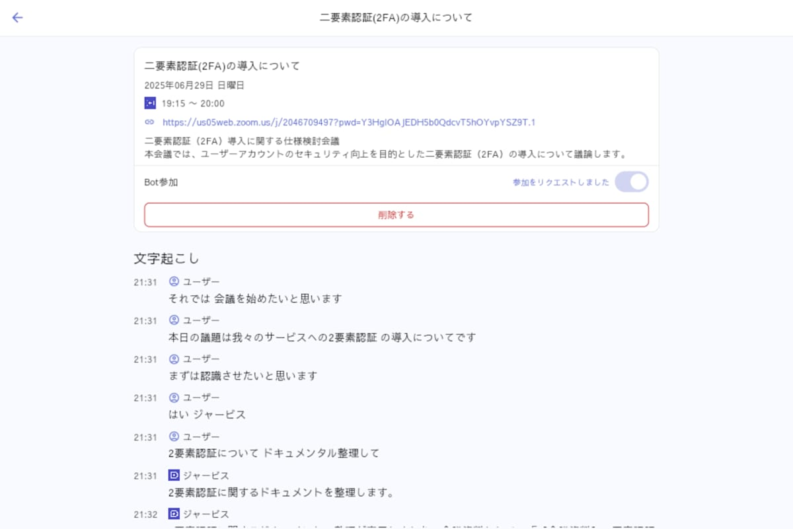

###  6\. ウェイクワードによる音声操作

  * 「**Hey Jarvis** 」のウェイクワードを使って、アシスタントに自然に話しかけることができます。
  * 話の流れを遮らず、必要なタイミングでアシスタントに指示を出せるため、スムーズな対話体験が可能です。

###  7\. アシスタントによる調査

  * 「コストは？」「競合サービスは？」といった質問に対し、**会議内容や社内ドキュメント、Web検索をもとに即座** に回答します。
  * 会議を止めずにその場で意思決定を支援します。

###  8\. アシスタントによるファイル操作

  * 「この文書を修正して」「Driveにアップして」といった指示に対し、アシスタントが**Googleサービスと連携してファイルの編集やアップロード** を実行します。
  * 仕様ドキュメントの修正やテンプレートからの自動生成にも対応しています。

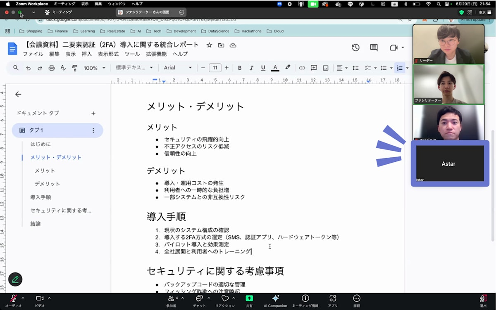

###  9\. 会議終了

  * 会議が終了すると、アシスタントはMeetingBaasとの接続を自動で切断します。
  * Firestoreのステータスも「終了済み」に更新され、アシスタントは会議から退出します。
  * 議事録や要約も整理され、参加者の負担を軽減します。

##  エージェント構成について

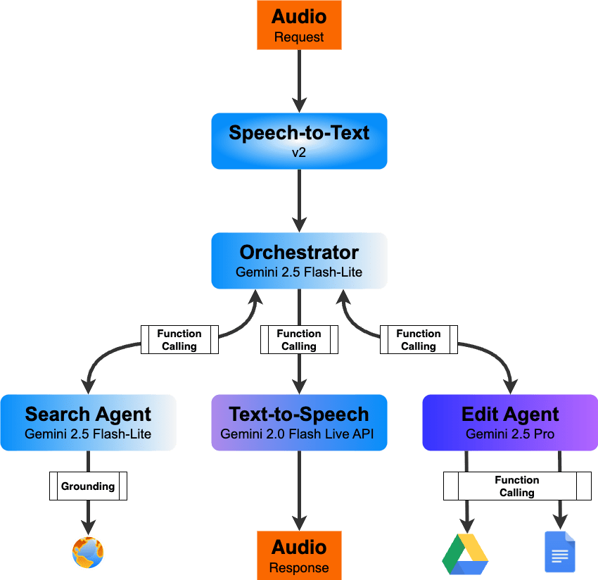

会議における音声AIアシスタントの開発において、最も重視したのは  
**「人間らしい自然な対話体験を維持しつつ高度な情報処理を実行すること」** の実現でした。

この課題を解決するため、私たちはマルチAIエージェント・アーキテクチャを採用しています。  
この構成により、会議中に “その場で” アクションを実行できるオンライン会議AIアシスタントを実現しています。

各AIの役割分担は以下の通りです。

AI | 専門領域 | 担当業務 | 技術的特徴  
---|---|---|---  
🎼 Orchestrator(Gemini 2.5 Flash-Lite) | 指揮・統合 | リクエスト理解、function calling実行 | 瞬時判断  
🔍 Search Agent(Gemini 2.5 Flash-Lite) | 情報収集 | web検索、情報整理 | 高速・低レイテンシ  
📝 Edit Agent(Gemini 2.5 Pro) | 文書作成 | ドキュメント作成・編集、データ分析、複雑な推論処理 | 高精度・高品質  
🎙️ Text-to-Speech(Live API) | 音声合成 | 人間らしい自然な音声生成、リアルタイム応答 | 低遅延・高品質  
  
##  「人間らしい会話」を実現するこだわりポイント

会議中のAI導入を検討する上で、頭を悩ませていたのが**音声合成時の遅延問題** でした。

Google Cloudで提供されているTTS（Text-to-Speech）はバッチ処理向けであるため、数秒のレイテンシーが発生します。  
つまり、TTSを利用すると**オンライン会議が要求するリアルタイム性が確保できない** という課題がありました。

そこで今回は、**Gemini Live API** を活用した音声合成アプローチを採用しています。  
さらに**Live APIをOrchestratorに据えなかった** ことも、自然な会話を維持する上で重要なポイントとなりました。

当初はLive APIをOrchestratorに組み込む構成も検討しましたが、以下のような問題がありました：

  * **指示に対して処理が完了するまで音声合成されない**  
→ すべての処理が完了しないと音声応答が開始されず、長時間の沈黙が発生。

  * **Function Callingが安定して呼び出されない**  
→ Live APIセッション内でのFunction Calling実行が不安定で、複雑な処理が途中で中断されるリスク。

###  Before: Live APIのみの場合
    
    
    ユーザー: 「競合他社の最新動向を調べて、比較表を作成してください」  
    ↓  
    Live API (Orchestrator): 処理開始...(10秒)  
    ※ 沈黙期間中、ユーザーは何が起きているか不明  
    - 競合他社情報の検索実行中  
    - 比較表作成処理中  
    ↓  
    Live API: 「競合他社の比較表を作成しました」  
    ※ すべての処理完了後に一度だけ音声出力
    

###  After: Orchestrator + Live APIの場合
    
    
    ユーザー: 「競合他社の最新動向を調べて、比較表を作成してください」  
    ↓  
    Orchestrator: 「承知いたしました。まず競合他社の情報を収集します」  
    （裏で Search Agent が検索処理）  
    ↓  
    Orchestrator: 「情報収集が完了しました。現在、比較表を作成しています」  
    （裏で Edit Agent がGoogle Docsで比較表を作成）  
    ↓  
    Orchestrator: 「比較表が完成しました。共有リンクをお送りします」
    

* * *

この設計により、参加者は常に「**AIが今なにをしているか** 」を把握できます。  
まさに**人間のアシスタントが作業状況を随時報告してくれる** ような、自然でインタラクティブな会話体験が実現されています。

#  6\. 今後の展望

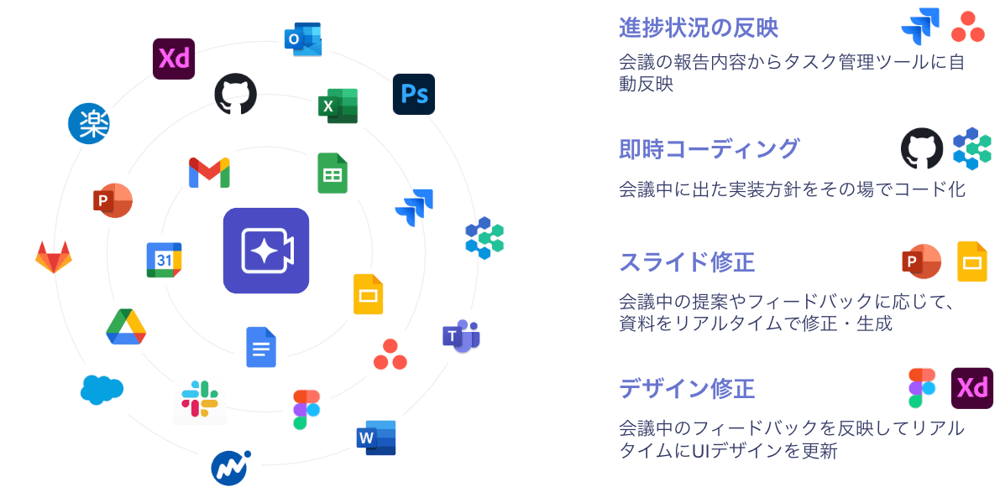

Astarは、単に会議の記録を取るだけのツールではありません。会議の「後」の作業を楽にする議事録サービスとは一線を画し、会議の「真っ最中」にリアルタイムで情報提供や資料の更新を行うことで、**議論の停滞そのものをなくし、合意形成までをサポート** する──いわば会議の賢い「相棒」です。

今後は、Figma・Slides・GitHubなどさまざまな外部サービスと連携し、進捗管理、即時コーディング、スライド修正、デザインフィードバック対応といった、さらに実務に直結した支援機能を拡充していく予定です。これにより、**議論から実装・反映までを会議の中で完結** させることも可能になるでしょう。

会議の時間を、もっと生産的で、もっとワクワクするものに。  
この新しい相棒と共に、あなたの働き方を次のステージへと進めてみませんか？

#  参考資料

[1] [株式会社エミリス](https://emiris.net/)
