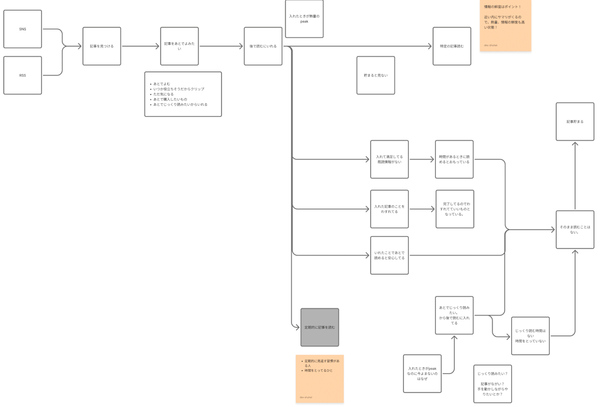
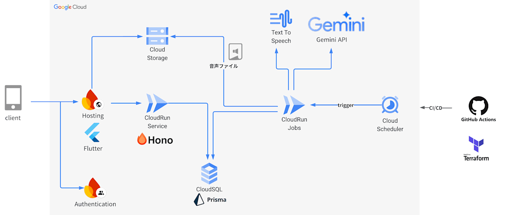
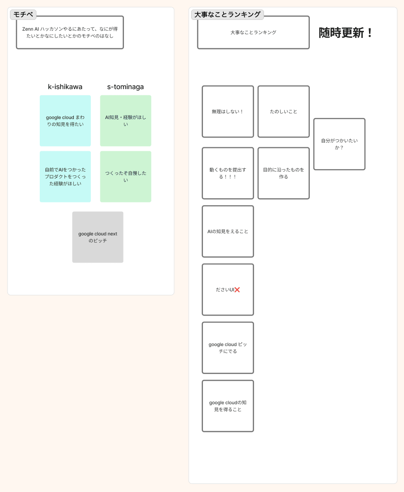

**[第2回 AI Agent Hackathon with Google Cloud 応募作品]**

_この記事は「[第2回 AI Agent Hackathon](https://zenn.dev/hackathons/google-cloud-japan-ai-hackathon-vol2?tab=overview)」への応募作品『Summaryme.ai』について解説したものです。_

#  **1\. 背景：その「後で読む」、本当に読んでいますか？**

毎朝のSNSチェック、Zennや技術ブログの巡回。  
「お、この記事は面白そうだ！」「これは最新のAI情報、キャッチアップしておかないと！」

そう思って、あなたは次々と記事を「後で読む」リストに追加します。しかし、気づけばブラウザのタブは開きっぱなし、後で読むリストは未読だらけ…。週末にまとめて読もうと思っても、情報の多さに圧倒され、どこから手をつけていいか分からず、結局読めずにじまい…。

そんな経験、ありませんか？

私たちは、この現代の情報過多社会における共通の悩み、「**積読（つんどく）** 」を解消するために立ち上がりました。

今回開発した『Summaryme.ai』は、あなたが「後で読む」と決めたその熱量を無駄にしない、新しい形のAI情報収集アシスタントです。

#  2\. プロダクト概要: **Summaryme.aiとは**

**Summaryme.ai** は、あなたが保存したWeb記事をAIが自動で要約し、さらには**Podcast風の音声コンテンツ** として配信するサービスです。

もう、まとまった読書時間を確保する必要はありません。  
通勤中、家事をしながら、ジムでのトレーニング中など、耳のスキマ時間さえあれば、あなたは効率的に最新情報をインプットし続けることができます。

##  デモ

まずはこちらのデモの動画をご覧ください。

<https://www.youtube.com/watch?v=-5dGHZRBLhg>

##  機能紹介

| 機能 | ユーザー体験 | 実現技術  
---|---|---|---  
1 | **読みたい記事を簡単登録** | 気になった記事のURLを共有するだけで、あなたのライブラリに即座に追加できます。 | REST API  
2 | **AIによる記事自動要約** | 登録された記事は、AIが自動で要約してくれるので、長文記事も一瞬で把握できます。 | Gemini API  
3 | **AIパーソナリティによるPodcast風音声配信** | 複数の記事を横断し、AIパーソナリティが対話形式で解説するPodcastを自動生成。朝昼晩に定期配信します。 | Gemini API, Text-to-Speech  
4 | **マルチプラットフォーム対応** | Flutterを採用し、iOS, Android, Webの全てで、同じ体験を提供します。 | Flutter  
5 | **簡単ログイン** | Googleアカウントやメールアドレスで、すぐに利用できます。 | Firebase Authentication  
  
#  3\. 対象ユーザーと課題：なぜ「後で読む」は増え続けるのか？

このプロダクトが解決しようとしている課題を、より深く理解していただくために、私たちの想定するユーザー像と、彼らが直面している具体的な問題についてお話しします。

##  ユーザー像：学習意欲の高いITエンジニア、Aさん

Aさんは、常に最新の技術トレンドを追いかけていたい、学習意欲の高いソフトウェアエンジニアです。X(旧Twitter)やZenn、海外の技術ブログを日々チェックし、気になる記事を見つけると、すぐに「後で読む」サービスに登録します。「よし、これで週末に一気に勉強するぞ！」と意気込みます。

##  Aさんが抱える「積読」の悪循環

しかし、現実は甘くありません。

  1. **登録だけで満足してしまう** ：記事を保存した行為そのもので、少し満足感を得てしまい、読むことを先延ばしにしてしまいます。
  2. **情報の洪水に埋もれる** ：毎日新しい情報が次々と流れてくるため、保存した記事はすぐにリストの下の方へ。存在自体を忘れてしまいます。
  3. **着手ハードルが日に日に上がる** ：リストに未読の記事が10件、20件と溜まっていくと、「全部読まなくては…」というプレッシャーが大きくなり、逆にどこから手をつけていいか分からなくなってしまいます。
  4. **機会損失への焦り** ：せっかく見つけた有益な情報や、キャリアに繋がるかもしれない知識をインプットできないまま時間が過ぎていくことに、Aさんは静かな焦りを感じています。「自分は周りから取り残されているのではないか…」と。

これは、決してAさんだけの問題ではありません。情報をインプットし、成長し続けたいと願う多くの人々が、この「積読の悪循環」に陥っているのです。

#  **4\. ソリューション: AIの力で「読む」ハードルを極限まで下げる**

なぜ、後で読むとしたまま放置してしまうのか。

この問題について追求してそれを解決する施策を検討しました。

なぜ放置してしまうのかの検討

私たちはその根本原因を **「読むことへの着手ハードルの高さ」** にあると考え、それを解決するためにAIエージェントを活用したソリューションを開発しました。

登録したら鮮度の高いうちに「要約テキスト・音声を自動配信」を提供し、いつでもどこでも隙間時間で記事を読む・聞くことができます。

これにより着手ハードルが下がり、情報の洪水に埋もれてしまうことをさけることができます。

最新情報を要点だけ...!キーワードだけでも...!日々効率よくキャッチアップが可能となります。

##  AIエージェント体験の工夫

本プロダクトの心臓部であるAIエージェントには、GoogleのGemini APIを活用しています。特にこだわったのがプロンプトエンジニアリングです。  
プロンプトの改善やプロンプトの管理にVertex AIを活用し質の高いアウトプットを目指しました。

###  1\. 記事の要約機能

単に「要約して」とお願いするのではなく、「要約のエキスパート」という役割を与え、「3つのキーポイント」「適切なサイズの要約」といった具体的な制約を設けることで、誰が読んでも分かりやすい要約を安定して生成できるようにして、簡単に記事の内容を確認できるようにしています。

###  2\. Podcast風音声生成機能：ただの読み上げではなく、理解を促進させたり、興味が湧くような対話を

複数の記事を元にしたPodcast風の音声コンテンツについては、Gemini APIに「トークスクリプトを作成するエキスパート」という役割を与え、2人のキャラクターが対話する台本をゼロから作成させています。

ただ記事を順番に紹介するだけでなく、**記事間の関連性を見つけて議論を発展させる** ように指示し、単なる情報の羅列ではない、付加価値の高いコンテンツを生成するようにしています。  
また、ユーザーに問いかけをしてみたり、考えせることで、理解の確認や興味をわかせることで、より情報のinputを短時間で効率化できるようにしました。

#  5\. システムアーキテクチャ

  * **フロントエンド** はFlutterを採用し、マルチプラットフォーム対応を実現しています。Firebase Hostingから配信されます。
  * **バックエンド** は、Honoを用いてCloud Run上で稼働させています。APIリクエストに応じて、データベースからのデータ取得や、Gemini APIへの問い合わせを行います。
  * **データベース** にはCloud SQL を利用し、PrismaをORMとして採用しました。
  * **非同期処理** （要約テキスト・音声の生成）は、Cloud Schedulerが定期的にCloud Run Jobsをトリガーする構成です。これにより、APIの応答時間に影響を与えることなく、重い処理を実行できます。Cloud Run Serviceは少ないインスタンスを維持しつつ、重い処理をCloud Run Jobsで実行することでコストも最小限になるようにしています。生成された音声ファイルはCloud Storageに保存されます。
  * **インフラ** はTerraformでコード化（IaC）し、GitHub Actionsと連携してCI/CDパイプラインを構築することで、いつでも誰でもGUI操作の数クリックでデプロイする環境を整備しました。

#  6\. 開発ストーリー：僕らが「楽しむ」を最優先した理由

今回ハッカソンは2名のチームで挑戦しました。

2人でこのハッカソンをより良い形で走る抜けるために、最初に時間をとってお互いの気持ち・やりたいことを話すことにしました。

長い期間、2人でこのハッカソンをより良い形で走る抜けるために、私たちは開発を始める前に、まずお互いの価値観をすり合わせるためのワークショップを実施しました。

  1. **「このハッカソンで、何よりも大切にしたいことは何か？」**

このハッカソンで大切にしたいことを何でもお互いに出してそれぞれの優先順を話あって認識を揃えていきました。

これは主に作るもの、作るスコープ、作る優先度を決める際やハッカソンの期間をどのように進めいてくかなどで活用しました。

  1. **「このハッカソンに挑戦する、モチベーションは何か？」**

どんなモチベーション、何をしたいのか、どんな期待をして参加しているのかをお互いに話あってお互いのやりたいことを話し合いました。

これは主に作るもの決める際や使う技術スタックや役割分担など活用しました。

このワークをやっていたことで、その後の何をつくるかや作業分担方法、ハッカソンへの向き合い方、時間の取り方などは特に問題なく進めることができました。

途中やはりモチベーションが上がらない期間、仕事やプライベートの都合で忙しい期間がかさなってしまうことやどうしても開発のモチベーションが上がらない期間もありました。

しかし最初に話しておいた大切なことランキングのとおり、「動くものは提出するぞ！でも無理はしない。」という約束をしていたおかげで、お互いに尊重・刺激しあいながら**たのしく** 最後まで走りぬけられました！

#  チームメンバー

名前 | 役割  
---|---  
こしけ ([X](https://x.com/koshikeeeee), [zenn](https://zenn.dev/kosuke_bella)) | AI, フロントエンド, バックエンド  
tomi ([X](https://x.com/shuheu10), [zenn](https://zenn.dev/hue)) | フロントエンド, バックエンド, インフラ  
  
#  さいごに

Summaryme.aiは、まだまだ改善の余地がありますが、われわれの「自分たちが使いたいか?」という大切にしていることにある通り、自分たちで利用して、日々アップデートをしていこうと話をしています。

Summaryme.aiが単なるツールではなく、学び続けるすべての人々の最高のパートナーになることを目指しています。

このハッカソンは、私たちにとって最高の「楽しむ」場でした!  
最後まで読んでいただき、ありがとうございました。
