##  はじめに

旅の計画を立てるとき、私たちは気づかないうちに「知っている範囲」でベストを探しています。

しかし

> 実は気づかないところに、もっと心地よく、もっと効率的で、もっとワクワクする旅程が眠っている。

その可能性まで掘り起こすのは、情報が複雑に絡み合う今の旅行シーンでは至難の業です。

**そこで私たちは、リアルタイムの混雑・口コミデータを横断的に解析し、曖昧な「こんな旅がしたい」という想いを最適ルートに変える“AI 旅行プランナー” を開発しました。**

この新しいパートナーが、まだ見ぬ最適解を発見し、旅程づくりそのものをワクワクの体験—旅のプロローグへと引き上げます。

##  ユーザー像と課題

###  想定ユーザー

  * **時間に追われるビジネスパーソン**

週末や連休のわずかなスキマを最大限楽しみたいが、プランニングに時間を割けない。

  * **家族・友人旅行の“幹事”**

年齢も趣味もバラバラな同行者の希望をまとめ、全員満足の旅程を組むプレッシャーにさらされる。

  * **体験重視のミレニアル & Z 世代**

“いいね” が集まる映え度と “今ここだけ” の新鮮さを両立したい。

  * **土地勘のないインバウンド旅行者**

言語の壁と複雑な交通網に悩み、行き当たりばったりになりがち。

###  彼らが直面する 4 つの課題

  1. **情報の洪水**

ブログ・SNS・口コミサイト…ソースが多過ぎて比較が困難。

  2. **リアルタイム変動の無視**

混雑・天候・イベント中止など“当日の現実”を反映できないまま確定しがち。

  3. **組合せ爆発**

「移動時間 × 予算 × 体験価値」を同時に最適化する計算は手作業ではほぼ不可能。

  4. **曖昧ニーズの翻訳コスト**

「のんびり」「映え重視」など主観的な希望を具体的スポットに落とし込む作業が重い。

###  AI 旅行プランナー によるソリューション

  * **データ統合**

混雑・天候・口コミを複数 API から収集し、瞬時に横断解析。

  * **意味理解 & スコアリング**

“雰囲気ワード”を AIが解釈し、スポット候補を自動評価。

  * **ルート最適化アルゴリズム**

移動時間とコストを抑え、体験価値を最大化する行程を生成。

  * **インタラクティブ再計算**

チャットで一言修正すれば、その場で旅程全体を再構築。

##  手続型の操作から宣言型の操作へ

従来の旅程づくりは、検索→比較→取捨選択を延々と繰り返す“手続的な操作”の連続でした。**我々が提供するソリューションの特徴は、その手続きを「やりたいことを宣言するだけ」のシンプルな体験に置き換える点** にあります。

  1. **自然言語で希望を入力**

「静かな湖でカヤックがしたい」「夕景が絶景の温泉に入りたい」

具体的な時間や経路を考える必要はありません。

  2. **リアルタイム最適ルートを自動生成**

Google Trendsで“今⼈気が急上昇しているスポット”を察知し、Google Mapsの混雑度・ルート候補・所要時間と、口コミデータを一括で解析。移動効率と体験価値を同時に最適化します。

  3. **簡単な操作で再計算**

気分が変わったらチャットやカード操作で修正。AI が瞬時に全行程を再構築します。

つまり、ユーザーは “ひと言の宣言” さえすれば、裏側で複雑な計算が走り、表側では **破綻のないワクワクする旅程** が立ち上がる——これこそが本アプリの最大の魅力です。

##  ひと言の希望が“理想の旅ルート”になるその機能

###  デモ動画

<https://www.youtube.com/watch?v=Fp6MEAC7leg>

  1. 「旅行先」と「旅行の雰囲気」を入力します。  
今回は、「大阪」で「自然を満喫したい、歴史的な場所を巡りたい、地元の文化を体験したい」とします。  
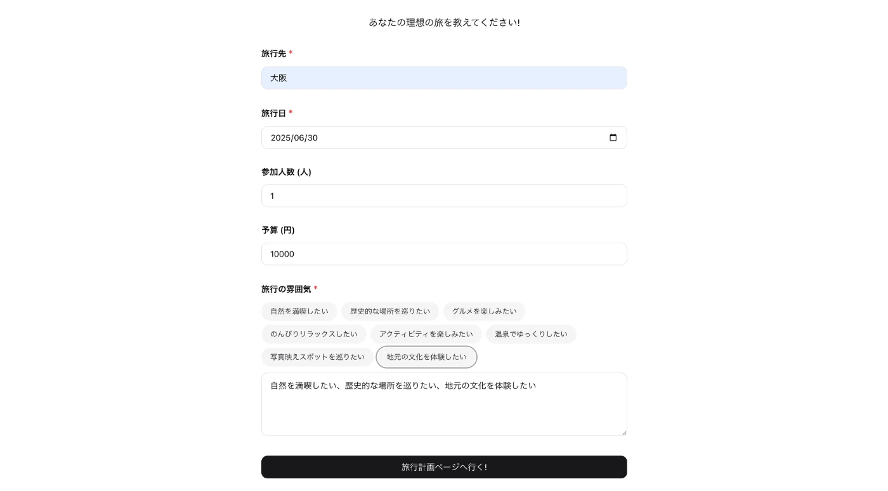

  2. 旅行計画ページに行くと、AIがおすすめのスポットを探して提案してくれます。  
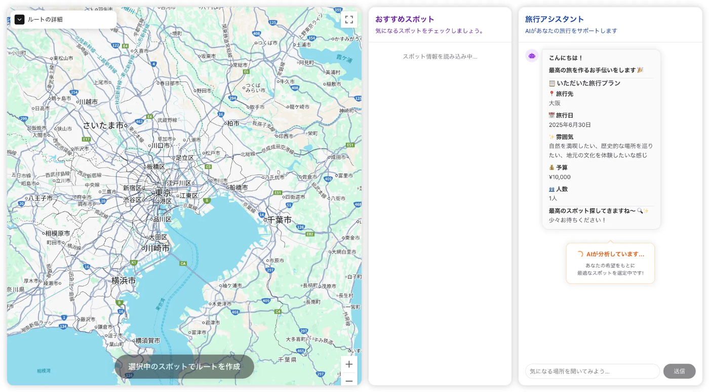

  3. 入力した雰囲気に沿って、お城や資料館、自然公園を提案してくれました。  
気になるスポットは「この場所について教えて」ボタンで聞いてみます。  
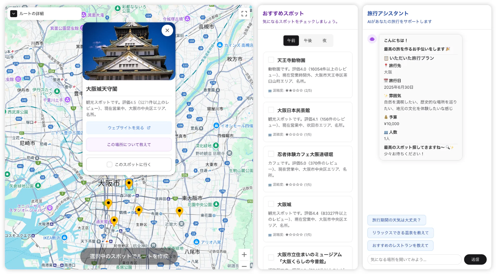

  4. ユーザの希望雰囲気を踏まえて、なぜおすすめなのかを説明してくれました。  
また、口コミに基づいて魅力ポイントを説明してくれるのでとても具体的です。  

  5. 行きたいと思った魅力的なスポットを「この場所に行く」ボタンで選択していきます。  
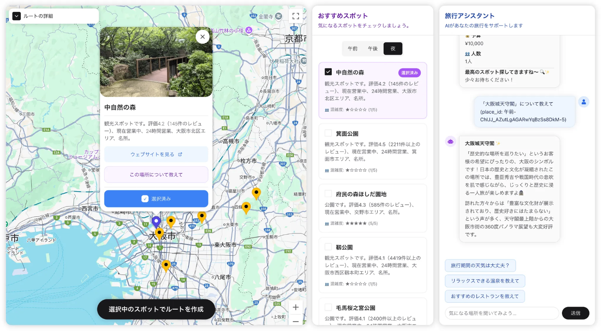

  6. 夜はリラックスできる温泉に行きたいと思ったので、チャットで希望を伝えて提案してもらいました。とても良さそうなので、新たに選択します。  
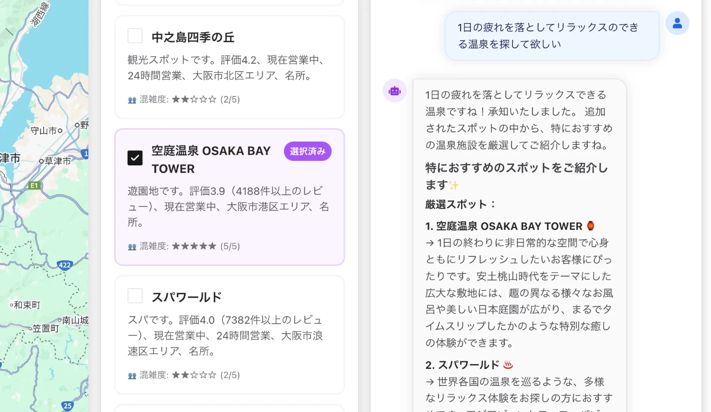

  7. いい感じのスポットを選べたので「ルート作成ボタン」で試しにルートを作成してみます。リアルな旅行計画が作成され、その魅力的な説明をしてくれました。  
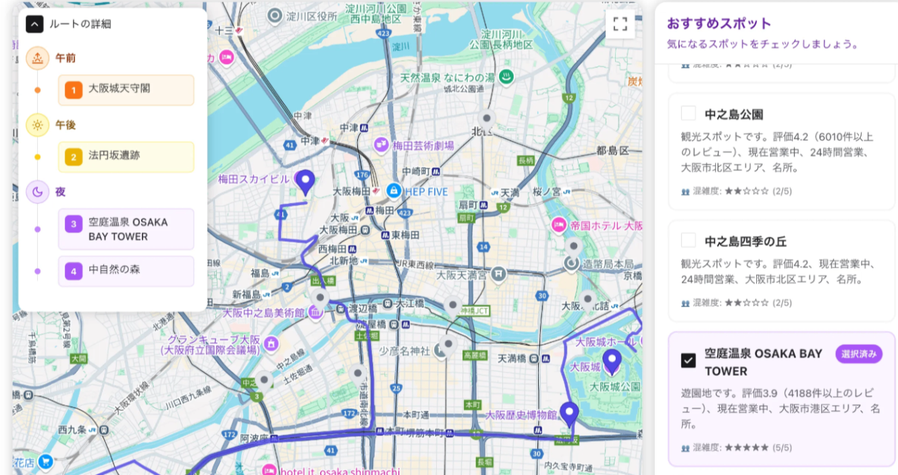  
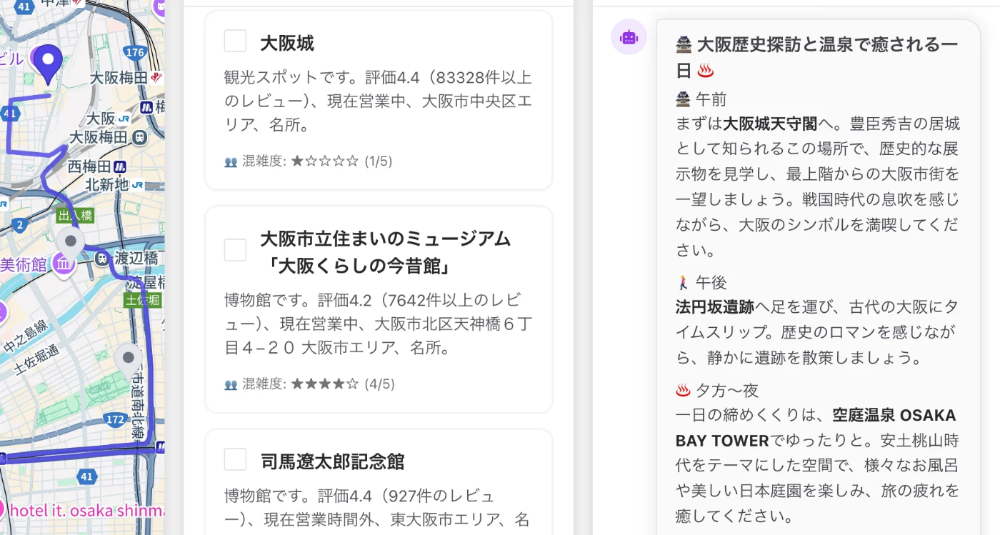

  8. 具体的な条件などを入力することなく、雰囲気で魅力的なスポットの提案とルートの作成ができました。これ以降も、さらに希望を伝えて最高のVibe Planningを続けることができます。

###  競合アプリとの比較 — “Plaru” と何が違うか

旅行ルート自動生成アプリ [**Plaru**](https://www.plaru.co.jp/) は確かに便利ですが、私たちの **AI 旅行プランナー** は下記の点で体験を一段引き上げます。

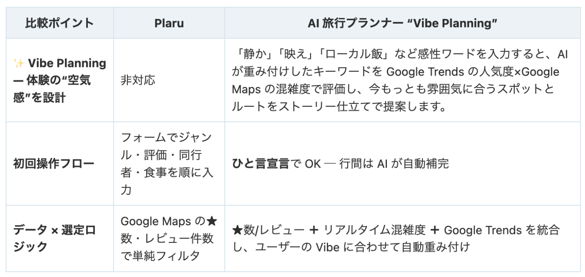

> 我々の提供するソリューションの特徴
> 
>   * **宣言型の体験** ：ひと言で旅程が立ち上がる。
>   * **リアルタイム多軸最適化** ：人気急上昇スポットも混雑回避ルートも即反映。
>   * **Vibe Planning** ：感情・雰囲気まで含めて“ストーリー性のある行程”を提案。
> 

このように **「入力の少なさ × 自動化の深さ × 体験の質」** の三拍子で、Plaruをはじめとする従来型ルート自動生成アプリとは本質的に異なるユーザー体験を提供します。

##  どうやって実現したかの技術的な話

###  AI旅行プランナーの設計思想

本プロダクトは **エージェンティック・ワークフロー（Agentic Workflow）** を軸に設計しています。  
LLM アプリケーションの構築方法は、大きく**ワークフロー型** と**エージェント型** に分けられます。  
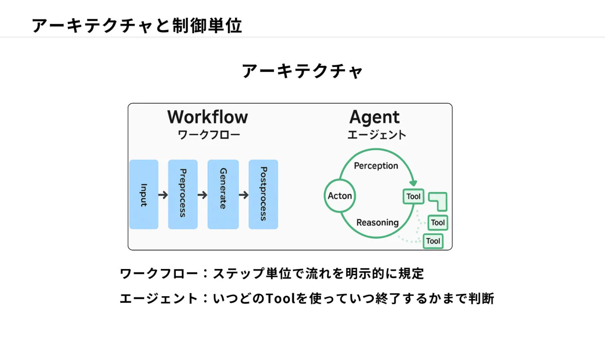

しかし、実際には**両者をハイブリッド** で組み合わせることが一般的です。  
ワークフローが “ガードレール” を敷き、エージェントが “柔軟な意思決定” を担うことで、安全性と拡張性を両立できます。  
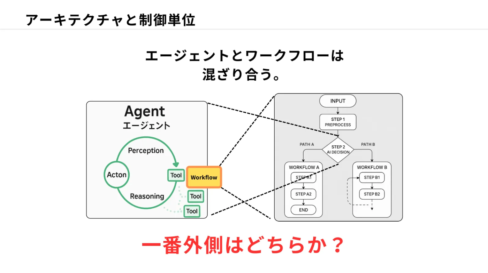

つまり ユーザーが直接触れる最外層をどちらの構造にするか が、体験の質を大きく左右します。  
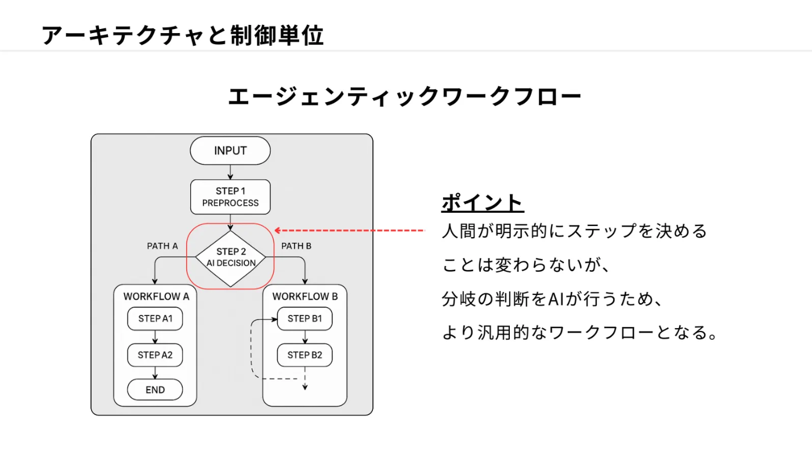

今回の要件は、求める処理（スポット探索・ルート最適化・質問応答など）が複数かつ明確で、しかもそれらをひとつのチャット UIから柔軟に呼び出したかったため、安全に制御しながら拡張もしやすいエージェンティック・ワークフローを採用しました。  
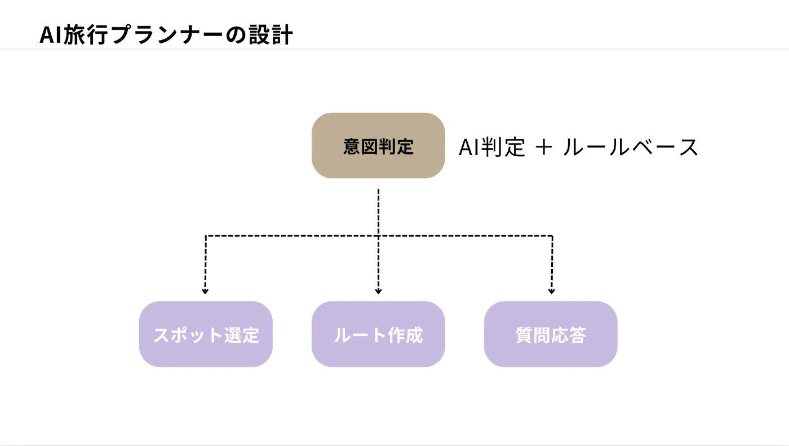

###  ユーザフィードバックの設計

曖昧なリクエストから”理想形”をアウトプットすることは非常に難しいことです。  
それは、アウトプットに無限の選択肢があるからであり、「まず早くアウトプットを出し、ユーザから気軽にFBを受け取り、改善してすぐアウトプットを出す」というHITL(Human In The Loop)を組み込むことがAIアプリケーションの質を高くするのにとても重要です。  
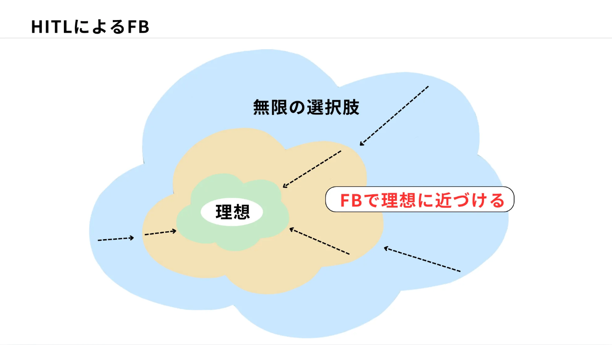

フィードバックの設計は、ユーザー体験を左右する“核”となる部分です。

  * **ステップ固定型** ：順に確定させながら前へ進む
  * **行き来型** ：いつでも前段階へ戻り、修正を加えられる  
どちらが最適かは目的によって異なります。  
本アプリでは、

  1. **スポット選定**
  2. **ルート作成**  
という２フェーズそれぞれにフィードバック窓口を用意し、両フェーズをシームレスに往復できる“行き来型”を採用しました。

> 「やっぱり別のカフェも試したい」→ スポットへ戻って再選定  
>  「このルート、朝をゆったりに変えて」→ ルート側で即再生成

こうした柔軟な動線が、ユーザーの思考プロセスにぴたりと寄り添う体験を実現しています。  
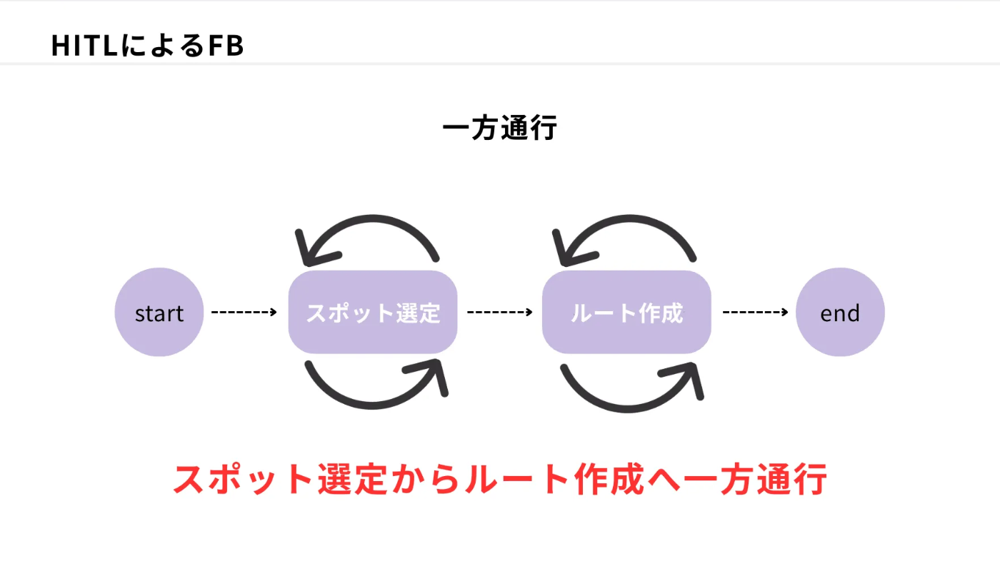  
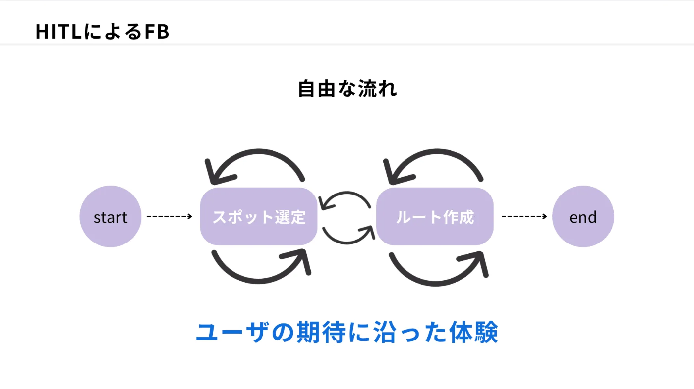

##  スポット検索＆ルート作成ロジック

観光計画を立てる際、一般的に観光名所は午後の時間帯に集中して配置される傾向があります。これは移動の効率や観光地の営業時間を優先的に考慮した一般的なアプローチですが、以下のような副作用を引き起こします。

❗ **従来の方式の課題：**

  * 観光客が同じ時間帯（午後）に主要な観光地へ集中して訪れる
  * 観光地の混雑度が最高潮に達し、不便が生じる
  * 地元住民の日常生活にまで影響を及ぼすオーバーツーリズム問題が発生
  * 観光客自身も混雑のため、十分に観光を楽しめない

💡 **混雑度に基づくスマートルート設計**

この課題を解決するために、私たちは観光ルートを設計する際に各観光地の混雑度を分析し、時間帯を分散させるスマートなロジックを導入しました。

  * 観光地ごとの時間帯別混雑パターンを分析
  * 混雑が少ない時間帯に主要な観光地を配置
  * 混雑が多い時間帯にはカフェやショッピング、休憩スペースなどを組み込むことで、全体のプランのバランスを調整

このような方法は単なるスケジューリングを超え、**観光客の体験を最優先に考えたカスタマイズ型観光計画** を可能にします。

✅ **期待される効果**

  * 観光地の混雑緩和による地域住民との共存の実現
  * 観光客はよりゆとりのある、満足度の高い観光体験を得ることができる
  * 最終的には持続可能な観光エコシステムの構築に寄与

##  1\. おすすめスポットの計算 → 結果までの流れ

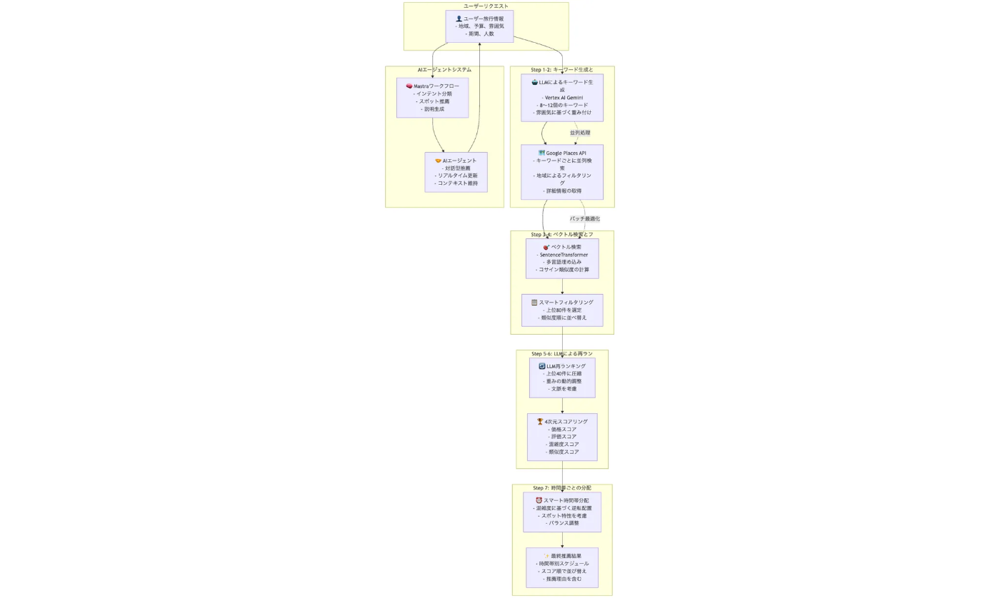  
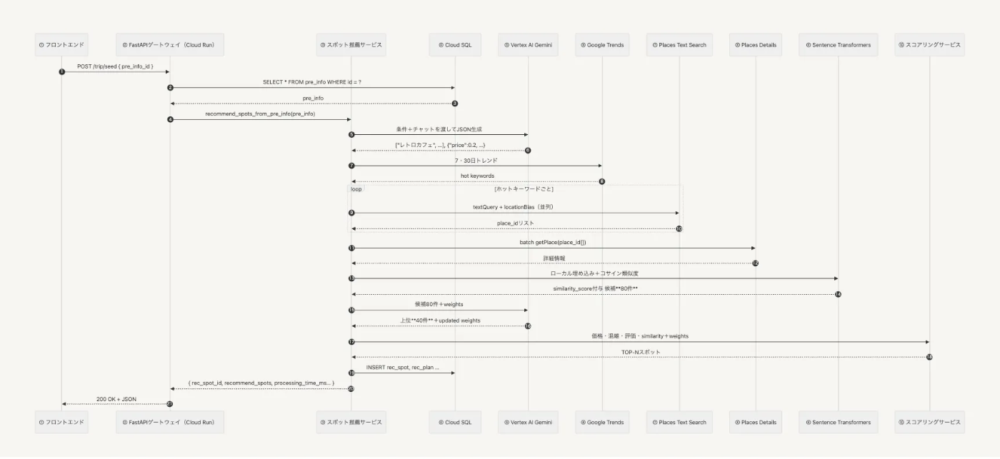

###  キーワード生成＆検索

  1. LLMキーワード生成  
**Google の Vertex AI Gemini を使用して** リクエストを分析します。単に「カフェ」を探すだけではなく：

  * 「静か」というキーワードから → 「混雑していない」、「平和な」、「落ち着いた」場所を優先
  * **バルセロナ + 予算** を考慮して → 「バルセロナの隠れカフェ」、「バルセロナのローカルカフェ」、「バルセロナの静かな庭園」などのような**8～12個の精巧な検索キーワード** を自動生成  
**なぜこれが重要なのか？**  
一般的な検索エンジンは「バルセロナ カフェ」だけで検索しますが、私たちのAIはあなたの**本当の意図** を把握し、より多様で正確なキーワードで検索します。  
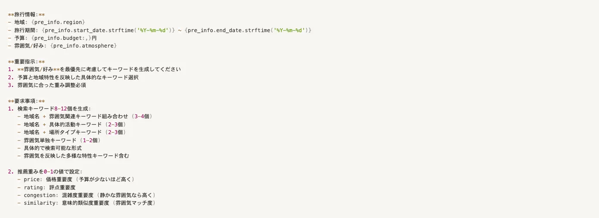

  2. **並列検索による最適化**  
**8つのキーワードを2秒で同時検索**  
最適化をしないシステムであれば
  3. 「バルセロナ 静かなカフェ」検索 → 2秒待機
  4. 「バルセロナ ローカルカフェ」検索 → 2秒待機
  5. 「バルセロナ 隠れたカフェ」検索 → 2秒待機  
合計**16秒** かかります。しかしキーワードごとの同時検索、ページネーション並列処理、バッチ詳細情報収集により**8つのキーワードを同時に検索** します。  
**ページネーション並列処理**  
2-3ページを**同時に** 取得して合計60件ずつ収集, 結果として**キーワードあたり60件 × 8キーワード = 480件** の候補地をわずか2秒で集めることをできるようにしました。

###  ベクトル検索&フィルタリング

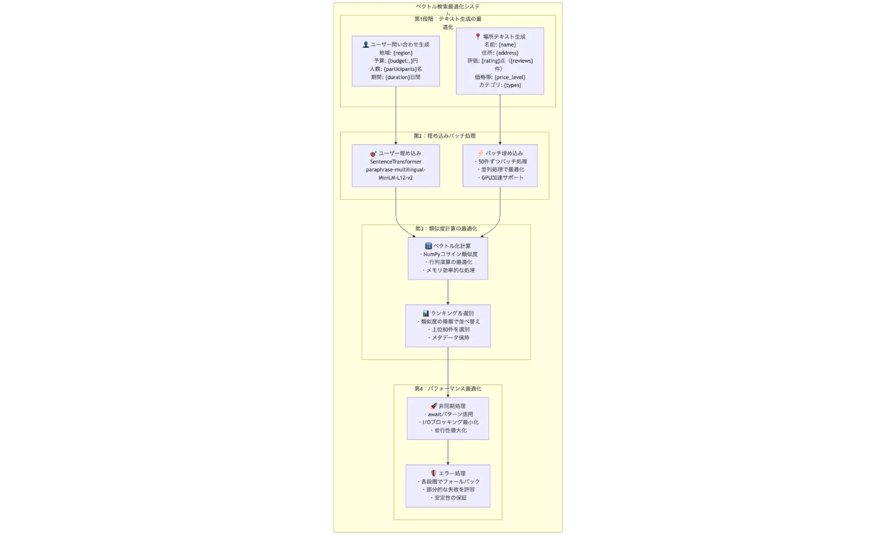

  1. 🔍 テキスト生成の最適化  
**あなたの旅行プロフィールをAIが理解できる言語に翻訳する**  
**👤 ユーザークエリ生成:**  
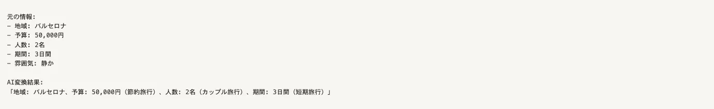

**📍 場所テキスト生成:**  
各カフェもAIが理解できるよう構造化します。  
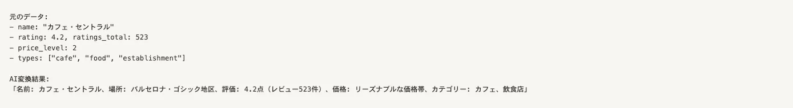

  2. **🧠 埋め込みバッチ処理**  
**SentenceTransformerというAIモデルを使用** `paraphrase-multilingual-MiniLM-L12-v2`  
🎯 ユーザー埋め込み:  
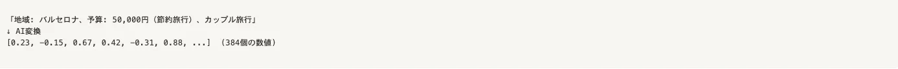  
⚡ バッチ埋め込み:  
50個ずつまとめて同時処理し、速度向上  
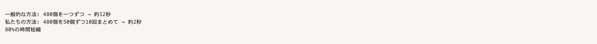

  3. **🔢 類似度計算の最適化**  
**コサイン類似度を使用してベクトル間の類似性を計算**  
**NumPy行列演算** で480個を一度に計算  
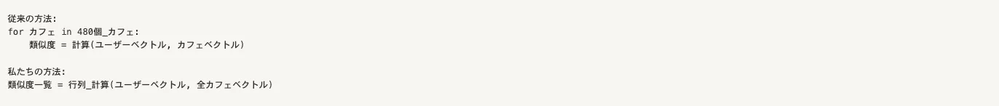  
**類似度スコアの意味:**

  * **0.9-1.0** : 完璧なマッチング
  * **0.8-0.9** : 非常に良いマッチング
  * **0.7-0.8** : 良いマッチング
  * **0.6-0.7** : まずまずのマッチング
  * **0.6 未満** : あまり良くない

  4. **LLM再ランキング &スコアリング&最終検討**  
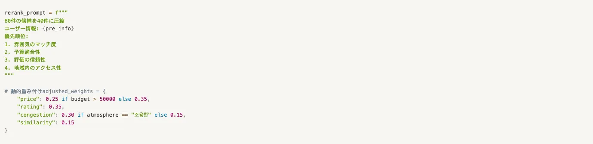

  * LLM再ランキング 80ヶ所 → 最終40ヶ所を厳選
  * 4次元スコアリング  
**価格スコア (25%):**  
**評価スコア (35%):**  
**混雑度スコア (25%):**  
**類似度スコア (15%):**  
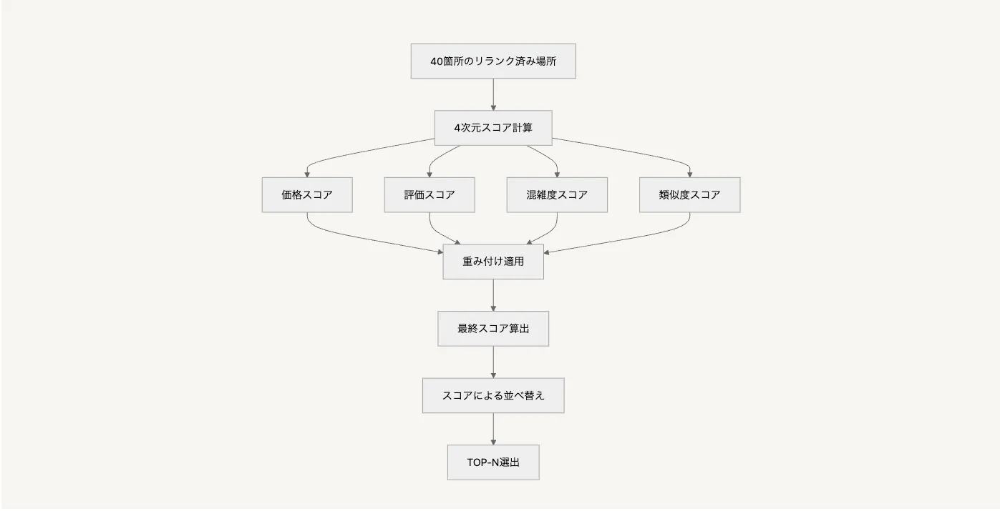  
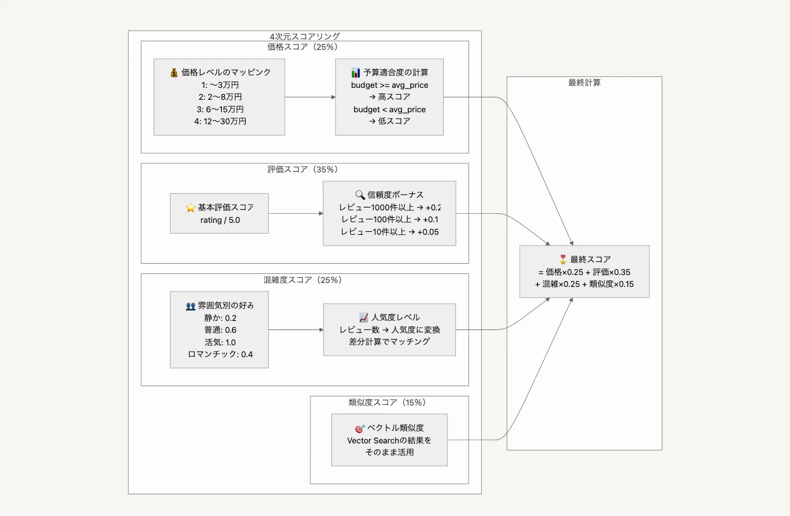
  * 時間帯別の配分ロジック：混雑度を考慮して、他の人とは異なる時間に訪問して、より良い体験を  
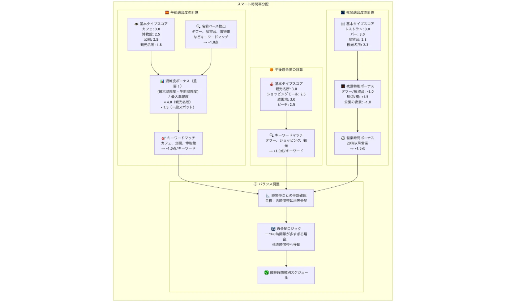

##  2\. 最適ルートの提案

###  ロジックの流れ

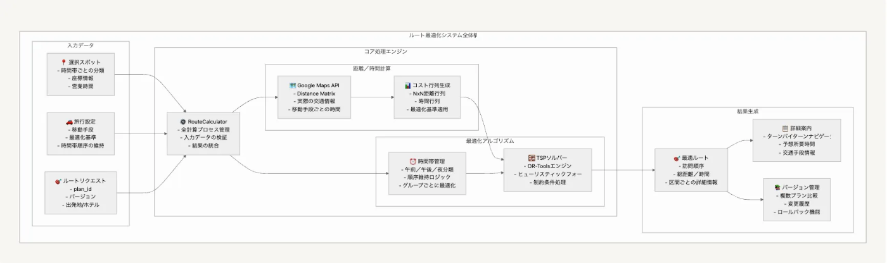

###  TSP solver

**営業時間の制約,交通渋滞, 複雑な地理的配置の考慮**

###  Google Maps API 連動

##  システムアーキテクチャ

###  **使用技術**

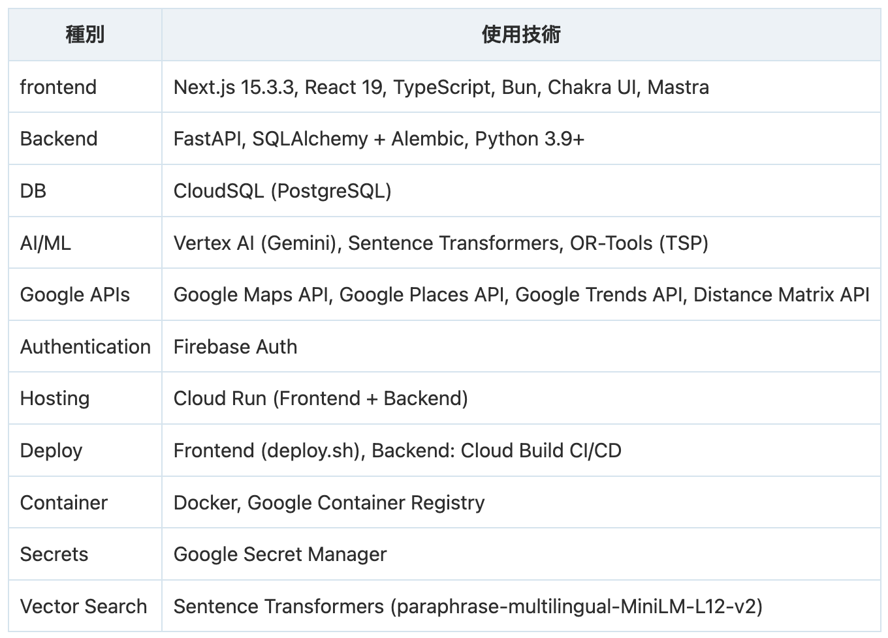

###  API

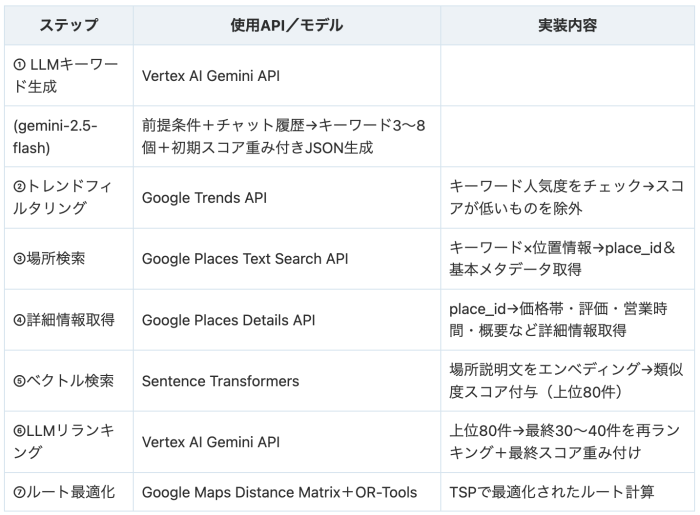
