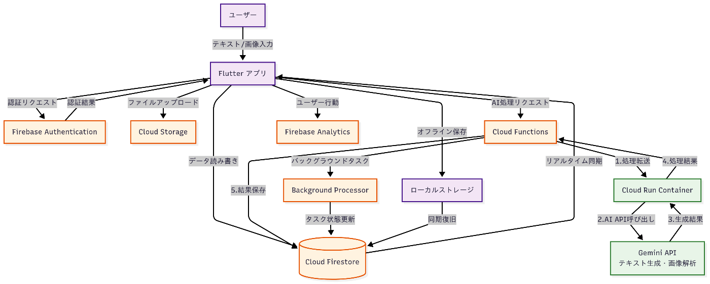

!

この記事は、第2回 AI Agent Hackathonの応募記事です。

##  はじめに

どんな分野であれ勉強というものをしている人は、暗記からは逃げられません。**記憶は勉強の本質です** 。高性能な生成AIが登場して、もはや人間がコツコツ勉強することに必要性を感じなくなっている人も多いかと思います。しかしながら、知識を問う筆記テストによって良い大学に入れたり資格を取得できたりするこの社会の仕組みはそう簡単に変わりそうにありません。それなら、我々の**知識を増やす作業** もAIに手伝ってもらうべきではないでしょうか。

#  暗記パ○が欲しい

単語テストや歴史の勉強などで、誰もが一度は思ったことがあるでしょう。あの秘密道具のように、パンを食べるほどの簡単さで知識が定着すればいいのに、と。そこでAIに作ってもらうことにしました。私の持論として、知識の定着のしやすさはその内容に依存します。実際、自分の趣味に関してならハイペースに勉強できる人がほとんどだと思います。今回開発したのは、**AIによって暗記内容を定着しやすいインプットに変換** するアプリです。その名も、「**暗記Pai** 」(暗記パイ × 暗記 Planner ai）。

##  作ったもの

【暗記Pai ~試験対策AI~】

###  web

<https://mempie-ai.com/>

###  ios

[https://apps.apple.com/jp/app/暗記pai-試験対策ai/id6744670157?platform=iphone](https://apps.apple.com/jp/app/%E6%9A%97%E8%A8%98pai-%E8%A9%A6%E9%A8%93%E5%AF%BE%E7%AD%96ai/id6744670157?platform=iphone)

###  Android

<https://play.google.com/store/apps/details?id=com.ichihos.ankipai>

##  こんな人に使って欲しい

・英語の勉強をしているが集中力がもたず覚えたい英単語が頭を滑っていく  
・ITの資格試験に向けて勉強しているが、同じようなアルファベットの略語が多すぎてうまく覚えられない  
・一夜漬けで単位を取得したいので、とにかく効率よく知識を頭に入れたい  
など。。

このアプリを使えば何でも頭に入るという訳ではないのですが、このアプリを使ってまで覚えようとする意識のもとアプリの機能をなぞっている間にその内容が頭に入っている。そんなアプリです。

##  デモ動画

<https://youtu.be/WdNOw_4aqaE>

##  アプリの流れ

・その時覚えたい内容をテキストや画像で入力する（複数内容OK）  
・AIが内容の数を判定し、適切な数の暗記法を生成する  
・暗記法を確認して頭に入れた後、AIへの説明で定着を確認する  
・暗記カード（フラッシュカード）を作成し演習する

例えば英単語帳の写真をとって一括で覚え方を生成したり、教科書の写真から重要な内容を抽出して覚えたりといった使い方ができます。なかなか覚えられない内容でも、新しい視点から覚えさせてくれます。

###  ユースケース

**資格試験対策**

  * 社会人がTOEIC単語暗記：通勤電車内でスマホから英単語を入力し、日本語との語呂合わせを生成
  * IT関係者が情報処理技術者試験：専門用語の定義を撮影し、覚えやすい例え話を自動生成
  * 司法試験受験生が条文暗記：六法全書の条文を撮影し、事例と紐づけた記憶法を生成

**語学学習**

  * 中国語学習者が漢字暗記：漢字の形と意味を関連付けたイメージ記憶法を生成
  * フランス語学習者が動詞活用：不規則動詞の活用パターンをリズムに乗せた暗記法を生成
  * ドイツ語学習者が格変化：複雑な格変化ルールを物語形式で記憶

**受験勉強での活用**

  * 中学生が歴史の年号暗記：「1192年鎌倉幕府成立」→「いい国作ろう鎌倉幕府」の語呂合わせ
  * 大学受験生が化学式暗記：教科書の化学式を撮影し、覚えやすいイメージ連想法を生成
  * 医学部受験生が解剖学用語：複雑な医学用語をストーリーで関連付けて記憶

#  アーキテクチャ

暗記Paiは以下のクラウドネイティブアーキテクチャを採用しています。

###  技術スタック

**フロントエンド**

  * Flutter：iOS/Android/Webクロスプラットフォーム対応

**バックエンド**

  * Firebase：認証、データベース、サーバーレス機能
  * Cloud Run：AI処理用コンテナ実行環境
  * Vertex AI Gemini API：暗記法生成・OCR画像解析AI

###  データフロー

暗記法生成の処理フローは以下の通りです：

  1. **入力受付** : ユーザーがFlutterアプリ（モバイル/Web）でテキストまたは画像を入力
  2. **前処理** : Firebase Functionsで認証チェックとデータ検証
  3. **AI処理** : Cloud RunコンテナがVertex AI Gemini APIを呼び出し、暗記法生成・OCR処理を実行
  4. **結果保存** : 生成された暗記法をCloud Firestoreに保存
  5. **リアルタイム配信** : Firestoreのリアルタイム同期でアプリに即座に反映

###  設計上の工夫

**パフォーマンス最適化**

  * AI処理をバックグラウンドタスクとして実行
  * 処理状況をリアルタイムで表示
  * Cloud Runの自動スケーリングで高負荷に対応

**オフライン対応**

  * Firestoreのオフライン永続化機能を活用
  * ローカルストレージでの学習データキャッシュ
  * 接続復旧時の差分同期

**セキュリティ**

  * Firebase Security Rulesでデータアクセス制御
  * Cloud Functions経由でのAPIキー保護
  * 認証済みユーザーのみがデータにアクセス可能

このアーキテクチャにより、マルチプラットフォーム対応でスケーラブルかつ高性能な学習支援体験を提供しています。

##  工夫した点

###  UI

ブラウザでのAI利用に不慣れな小中学生でも使えるように、とにかくポップなUIにこだわりました。アプリ名にもしている「暗記パイ」のテーマに沿って親しみやすさを意識しています。

###  暗記法生成のプロンプト

面白く覚えやすい暗記法を生成させるためのプロンプトは何度も試行錯誤を繰り返しました（現在も続けている）。私が受験期に地理や化学などで「無理があるけれど何故か覚えられてしまう覚え方」を編み出すのが上手かった（クラスメイトに広めていた）ので、それを再現できないかと奮闘しています。

###  設計

今回の開発は完全にVibe Codingで行っています。AIが行き詰まった場合のみ手を貸していました。開発をAIに全投げする上で意識したのが全体を見通した設計です。コーディングエージェントはすぐ目先のことに囚われてしまうので、頭の中の設計とずれが起きていないか常に監視していました。

###  ローカライズ

様々な言語に対応していることは生成AIの強みなので、英語と中国語にローカライズしました。言語を選択すると、選択された言語に応じて暗記法の提案が行われます。なるべく多くの人に触れるものをと思いましたが、そこまでユーザー数は増えていないのであまり意味はなかったかもしれません。

###  競合分析との差別化ポイント

既存の暗記アプリの多くは、単語カードの反復学習や間隔反復法に焦点を当てています。しかし、暗記Paiの**真の差別化ポイントは「記憶法そのものの自動生成」**にあります。  
従来のアプリでは「何を覚えるか」は提供しても「どうやって覚えるか」は学習者任せでした。暗記Paiは記憶術の専門家がマンツーマンで指導してくれるような体験をAIで実現しています。

##  まとめ

私は学生で、いまや課題や研究に（論文を読んだりpythonコードを書いたりするのに）生成AIを使わない日はありません。大学の学部受験に来ていた受験生たちを見て、今の高校生はどんな風に勉強するのだろうと考えた結果「暗記Pai」の開発に至りました。初めてのネイティブアプリ開発で、色々な項目が実現していくことが楽しく色々と盛り込んでしまいましたが（クロスプラットフォームやサブスク機能など）現状では暗記法生成のレベルと生成時間の問題で多くのユーザーさんに日常使いしてもらえる可能性は低いだろうなと思います。  
しかし、今後さらに生成AIのモデルが進化すればもっとレベルの高いアプリへ進化できるのではないかなと感じています。なぜなら、塾やオンライン教材の需要を考えても、分かりやすく教えてもらうことのニーズは必ず尽きません。AI塾講師のようなサービスはたくさん出てくると思いますが、このアプリのようにツールライクに使える形式がAIの強みだと思っています。

このアプリを開発するにあたってwindsurfとclaudeには大変お世話になりました。お世話になったどころか、私が開発者を名乗るのは烏滸がましいほどに頑張ってくれました。今回の初めてのバイブコーディングを通じて感じたのは、バイブコーディングでコードが完成していく様子に対する感覚が3Dプリンターを触りはじめた時の感覚に似ているということです。自分の力では作り出すことのできないクオリティの造形が自動で生成されている点、時々様子を見て失敗していたら修正してあげないといけない点、生成できるものに一定の制限がある点、などが類似しています。3Dプリンターも進化を遂げ、今ではエントリーモデルのものでも基本設定さえすればほとんど失敗なくプリントができます。そう思うと、進化スピードの速いデジタル世界のコーディングエージェントが幅広い層に利用されていくのにそう時間はかからないだろうなと感じます。
