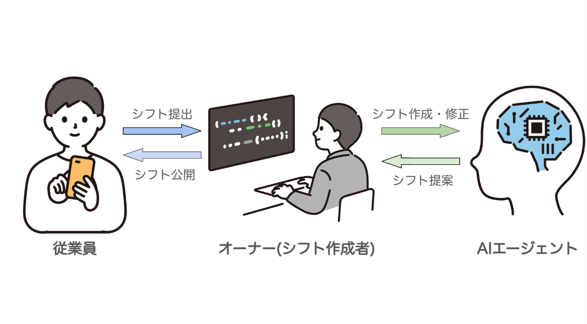
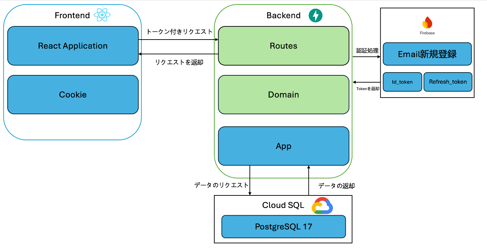
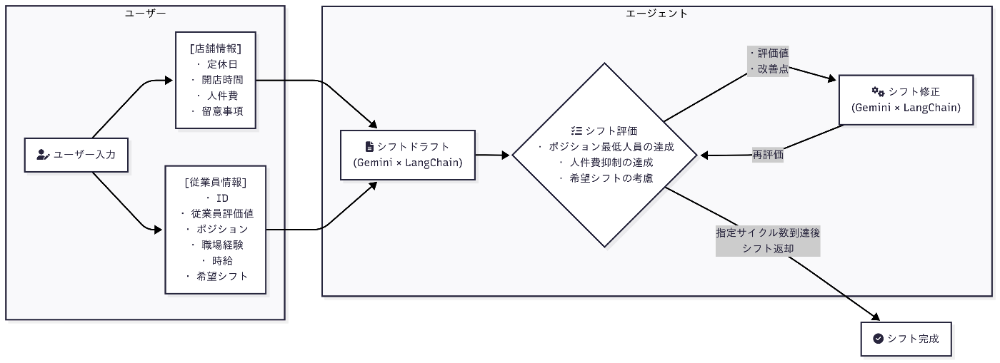

#  シフト作成AIエージェント「Shift Agent」🗓️

「**Shift Agent** 」は、シフト作成・管理に頭を抱える現場のオーナー・店長のために生まれたAIエージェントです。特に飲食店やコンビニ、小売などのサービス業において、スタッフの出勤希望をまとめて調整し、最終的なシフトを作る作業は、極めて手間がかかるものです。多くの現場では、店長や管理者がエクセルや紙の表を使って、「誰がいつ働けるか」「希望が重なっていないか」「最低限の人員が足りているか」「新人とベテランのバランスはどうか」といった複数の要素を一つひとつ目視で確認し、調整しています。また、スタッフとの関係性を壊さないようにしながら公平な配置を行うことも求められるため、単なるスケジュールの問題ではなく、“人間関係のマネジメント”という要素も含んでいるのです。シフトがうまく組めなかった場合は、営業に影響が出るばかりか、スタッフの不満や退職の引き金にもなり得ます。こうした課題をAIの力で根本から解決し、人にしかできない仕事に集中できる環境を提供したいという想いから、「Shift Agent」は開発されました。

##  デモ動画

<https://youtu.be/cev1YHekbpc>

##  「来月のシフトどうしよう…？」から「Shift Agentに任せた！」へ

🧑🏻‍💻 **店長** 「来月のシフト…また出勤希望バラバラやん…」  
🙋🏻‍♀️ **スタッフ** 「あとで出します！」「予定わかんなくて〜」  
🤦🏻 **店長** 「😭（**また徹夜で調整するやつや…** ）」

##  シフト調整は「作業」ではなく、現場の重荷

こんなやり取り、飲食や小売で働いたことがある人なら思い当たるかもしれません。  
シフト調整は単なるルーティンではなく、**人と人との関係性・責任・時間** が絡む、現場にとっての「重たい仕事」です。

##  「Shift Agent」がその負担、引き受けます！💪

「**Shift Agent** 」は、そんな“あるある”をAIがまるごと引き受けるWebアプリです。

✅ Gemini APIと連携して、スタッフの希望をもとにAIが自動でシフト案を作成  
✅ 店舗の営業日・役割・人員数なども考慮して、バランスの取れた配置を提案  
✅ スタッフに完成したシフトも共有可能

##  Shift Agent の特徴

####  「もう、エクセル地獄には戻れない…」

そんな未来を、**Shift Agent** で一緒に始めませんか？😉

##  Shift Agent が解決する課題 🔍

###  1️⃣ シフト作成の「手間と時間」が非常に大きい

シフト作成は多くの現場で「時間も労力もかかる重労働」とされています。  
一度モデルシフトを作ることで時間短縮が可能であるという記事もあります：

> 「時間帯ごとの適正な人員が一目で確認できるため、シフトの作成時間を短縮することができます」  
>  引用元：[モデルシフト導入でラクラク運営！](https://dinii.jp/column_20250403/)

また、希望シフトの取りまとめや人員の過不足調整、突発的な変更対応などで多くの労力がかかることが、勤怠管理導入の背景としても述べられています：

> 「シフトの作成や管理に毎回多くの労力がかかる」  
>  引用元：[勤怠管理コラム：シフト作成の悩み](https://www.rakurakukintai.jp/column/2025/20250630_03.php)

###  2️⃣ 「要望調整」や「人手不足」が深刻な現場の悩みに

パーソルイノベーションの調査では、シフト作成に関する職場の課題として以下のような結果が報告されています：

  * 1位：シフト作成の手間（22％）
  * 2位：要望調整の大変さ（20％）
  * 3位：人手不足（14％）

> 「シフト作成の手間」が最も多く、続いて「要望調整の大変さ」「人手不足」と続く  
>  引用元：[店長ラボ：シフト作成の課題ランキング](https://blog.sync-up.jp/tencho-lab/027)

###  3️⃣ 飲食業界では「64.3％が人手不足」を実感

帝国データバンクの調査によると、飲食店の64.3％が非正社員の人手不足を実感しています：

> 「非正社員が不足している」と回答した飲食業は64.3％  
>  引用元：[ラクシフマガジン：人手不足の実態](https://magazine.rakushifu.jp/top/restaurant_shorthanded)

###  4️⃣ 現場の「調整ストレス」を AI が引き受ける

人員のスキルや希望、時間帯、シフトの公平性を踏まえた調整はこれまで非常に属人的で煩雑でしたが、  
大規模言語モデル（Gemini API）の活用によって、希望の自然言語処理や文脈把握も自動化できるようになりました。

Shift Agent は以下のシンプルな構成で、属人性の高い作業から現場を開放します：

  1. スタッフの希望をフォーム入力
  2. Gemini API でシフト自動生成

##  課題へのソリューション 💡

###  1️⃣ Gemini × LangChain による自然言語でのシフト作成

Shift Agent では、Google の大規模言語モデル **Gemini API** と、プロンプトを柔軟に制御できる **LangChain** を組み合わせることで、  
自然な文章からでも高精度なシフト自動生成が可能となっています。

スタッフの希望や条件を入力フォームで受け取り、Gemini によってスケジュール最適化が自動で行われます。  
ユーザーは複雑なルール設定を覚えることなく、「誰がどこに入れるか」を簡単に把握できます。

✅ 属人的で煩雑だったシフト作成作業を自動化  
✅ 自然言語での調整指示も可能に

###  2️⃣ FastAPI + Cloud SQL による柔軟なデータ管理と保存

バックエンドには Python 製の軽量フレームワーク **FastAPI** を採用し、非同期処理やAPI設計を効率的に実装。  
シフト希望や従業員データはすべて **Cloud SQL** に保存され、リアルタイムでの読み書き・共有が可能です。

✅ データ永続化と即時反映により、現場での運用もスムーズ  
✅ 柔軟なロール設計で、管理者と従業員で機能を分離

###  3️⃣ チャット型の調整依頼機能（開発予定）

将来的には、スタッフがLINEのようなUIで「この日変更できますか？」といったメッセージを入力するだけで、  
Geminiがシフト再調整を提案する **チャット型調整インターフェース** も搭載予定です。

✅ 調整業務もAIに任せて、管理者の「余白」を創出

###  システムアーキテクチャ

Agentフロー  

##  ⚙️ 技術スタックと選定理由

「Shift Agent」は、シフト作成の自動化・効率化を目的に、LLMを中心に据えたバックエンド構成と、直感的なユーザー体験を提供するフロントエンドを設計しました。ここでは、各技術の役割と選定理由を紹介します。

###  AI / LLM関連技術

####  🔹 Gemini 2.0 Flash lite

  * 自然言語ベースでのシフト条件入力に対し、柔軟かつ高精度な応答を返す
  * LLMがシフト表のフォーマットに沿ったテキスト出力を行う
  * 調整指示（例：「BさんがNGならCさんで」）にも動的対応可能

✅ Google Cloud ネイティブで扱いやすく、Cloud Runとの連携もスムーズ

####  🔹 LangChain

  * プロンプトのテンプレート管理
  * Chain構成によるプロセスの分離（例：条件抽出 → スケジュール構成 → 出力整形）
  * Geminiと組み合わせてLLM活用を高効率に制御

✅ Gemini APIと接続しやすく、LLMの制御が格段にしやすくなる

* * *

###  バックエンド構成

####  🧱 DDD（ドメイン駆動設計）によるバックエンド構成

本プロジェクトのバックエンドは、**DDD（ドメイン駆動設計）** をベースに構築されています。  
シフト作成という複雑なビジネスルールを扱う上で、関心の分離・ロジックの再利用・拡張性を重視しました。

####  🔹 FastAPI

  * 軽量・高速なPython製Webフレームワーク
  * Gemini・LangChainとの統合が容易であり、非同期処理にも強い

✅ バックエンドAPIとしての柔軟性とスピードのバランスが良い

####  🔹 Cloud SQL

  * シフトデータ（希望・NG・作成済みスケジュールなど）を保存
  * SQL構造によって柔軟なクエリとスキーマ設計が可能

✅ 複雑なデータ構造や検索性が求められるケースに強く、スケーラビリティにも優れる

####  🔹 Cloud Run

  * FastAPIサーバーをGoogle Cloud上にデプロイ
  * オートスケーリングが効き、コストと性能を両立できる

✅ 本番環境を意識したモダンなクラウド構成に最適

####  🔹 Firebase Admin Python SDK

  * Firebase Authentication によるユーザー認証

✅ Google Cloud との親和性が高く、認証・ストレージ周りを迅速に構築可能

* * *

###  フロントエンド構成

####  🔹 React + TypeScript

  * UIライブラリとしてReactを採用し、状態管理とコンポーネント分離を実現
  * TypeScriptにより、ユーザー入力・LLM応答の型安全性を向上

✅ AIの出力に依存する構成であるため、型によるバグ防止が不可欠

####  🔹 Tailwind CSS

  * UIのスタイリングにTailwindを採用
  * コンポーネント単位で効率的にデザインを適用

✅ シンプルで洗練されたUIを素早く構築可能

##  「Shift Agent」の技術的な特徴

本プロジェクトでは Google Cloud の各種サービス（Gemini API、Cloud Run、Firebase、Cloud SQL）を中心に構成を行い、  
**スモールスタートからスケール対応まで一貫した運用が可能** なアーキテクチャを設計しました。

また、LLM制御には LangChain を活用し、**AI出力の品質と一貫性** を担保しています。

このエージェントは、AIがシフトを自動で「作成」「評価」「修正」するシステムです。従業員の希望と店舗のルール（必要人数、人件費など）を基に、最適なシフト案を自律的に生成します。

  * 搭載技術と処理の流れ  
-コア技術: GoogleのAIモデル Gemini を、LangChainフレームワークを通じて制御しています。

    * 処理の流れ: 
      * 初期案の作成: AIが入力データ（従業員の希望、店舗ルール）を基にシフトのたたき台を作成します。
      * 評価・修正サイクル: 以下の処理を任意の回数繰り返すことでシフトの質を向上させます。 
        * 作成されたシフトの評価: AIが自らのシフト案を「評価」する。
        * 作成されたシフトの修正: 評価フェーズで出力された問題点を「修正」する。
  * シフトの評価方法

    * シフト案は、100点満点からの減点方式で自動評価されます。
    * 主な減点項目:
    * 人員不足: 必要なスタッフがいない時間帯がある場合 (一箇所につき -3点)
    * 人件費超過: 予算をオーバーした場合 (-9点)
    * 希望の未反映: 従業員の希望が通らなかった場合 (-0.2点)
  * シフトの修正方法

    * AIが評価結果のフィードバックを基に、問題点を解決するようにシフト案を自動で修正します。「人員が不足している」と指摘されれば、その時間帯に入れる他の従業員を探して割り当てる、といった調整を自律的に行い、より良いシフトを目指します。

##  📝 まとめ

「Shift Agent」は、AIと人が共に働く新しい現場運営のかたちを提案するプロダクトです。  
従来、店長や管理者に大きな負担となっていたシフト作成業務を、AIの力で効率化・自動化することで、現場全体の働きやすさを高めることを目指しています。

  * ✅ 希望や条件をもとに自動で最適なシフト案を生成
  * ✅ 公平性・人件費・人員バランスなど複雑な制約にも柔軟に対応
  * ✅ 今後はチャット型の再調整にも対応し、運用の手間をさらに軽減予定

人間にしかできない業務に集中できる時間と余白を生み出すこと。  
それが、「Shift Agent」が目指す未来です。

* * *

###  💬 今後の展望

今後は以下のような機能も開発予定です：

  * チャットUIによる対話型シフト修正提案（LINE風）
  * 複数店舗・ロール対応による中規模事業への展開
  * Geminiの長文入力対応による柔軟な自然言語解析の強化

引き続き、現場の声に寄り添いながら、AIとともにシフト業務の未来を共創していきます。

* * *

###  💻 リポジトリ

<https://github.com/jacksen-ng/shift-agent>
